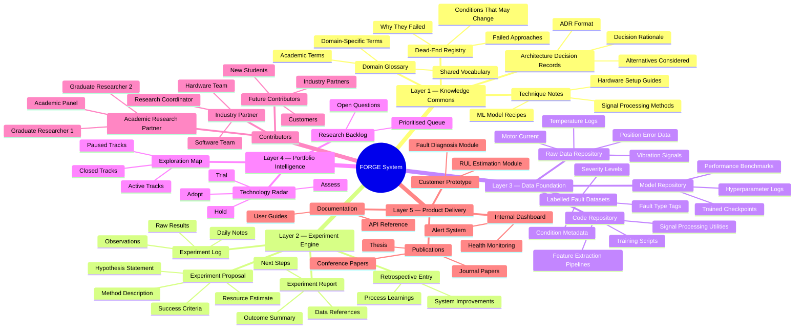

# FORGE: Foundation for Organized Research Groups and Enterprise
### A Knowledge Architecture & Compound Learning System for R&D

> **Document Status:** Foundation Draft — v1.1  
> **Author:** Research Operations  
> **Purpose:** Design blueprint for a self-sustaining, compounding R&D knowledge system  
> **Scope:** University–industry collaboration, internal development team, and future research contributors  

---

## Table of Contents

1. [Purpose of This Document](#1-purpose-of-this-document)
2. [The Core Problem: Why Projects Die but Systems Survive](#2-the-core-problem-why-projects-die-but-systems-survive)
3. [How the Academic World Solved This: A Model Worth Borrowing](#3-how-the-academic-world-solved-this-a-model-worth-borrowing)
4. [Industry Knowledge Mechanisms: A Survey](#4-industry-knowledge-mechanisms-a-survey)
5. [The FORGE Architecture: System Overview](#5-the-forge-architecture-system-overview)
6. [System Mindmap](#6-system-mindmap)
7. [Knowledge Layer Design](#7-knowledge-layer-design)
8. [Tooling & Infrastructure Recommendations](#8-tooling--infrastructure-recommendations)
9. [Standard Operating Procedures (SOPs)](#9-standard-operating-procedures-sops)
10. [Process: How to Build FORGE from Zero](#10-process-how-to-build-forge-from-zero)
11. [Future Architecture Modules (Planned)](#11-future-architecture-modules-planned)
12. [Naming Rationale & Glossary](#12-naming-rationale--glossary)

---

## 1. Purpose of This Document

This document captures the **architecture for a compound, self-sustaining research and development knowledge system** designed for university–industry R&D collaboration.

The immediate trigger is a collaboration between an industry partner and an academic research partner, involving master's research students supervised by an academic panel. But the ambition goes further: to build a system that outlives any single student, project, or technology choice — one that **accumulates knowledge, tolerates failure, enables parallel exploration, and continuously produces useful outputs**.

### This document addresses:
- Why a *system* is needed, not just a project plan
- How academic and industrial worlds have solved this problem before
- What knowledge mechanisms exist and which are appropriate here
- A concrete architecture and tooling recommendation
- Standard Operating Procedures (SOPs) for students and internal staff
- A step-by-step process to build FORGE from its current state (zero)

### What this document does NOT address (covered in future modules):
- Portfolio Architecture (replacing the single linear plan)
- Collaboration Protocol (formalising university–industry working interfaces)
- Failure Integration Loop (structured retrospectives and dead-end documentation)

---

## 2. The Core Problem: Why Projects Die but Systems Survive

### The Fragility of Project-Based R&D

A conventional project plan — even a well-designed one — is structurally fragile in several ways:

| Fragility Type | Manifestation in This Project |
|---|---|
| **Single-path dependency** | If data collection fails, everything downstream is blocked |
| **Person dependency** | Knowledge lives in one student's head; they graduate and leave |
| **Temporal dependency** | Learnings at month 3 are forgotten or undocumented by month 12 |
| **Goal fixation** | The team optimises toward the stated deliverable, ignoring adjacent discoveries |
| **Non-transferability** | Another team, student, or company cannot build on work without re-doing it |

### What a System Does Differently

A **research operating system** treats knowledge as the primary output, and products (models, dashboards, prototypes) as *byproducts* of accumulated knowledge. This distinction is profound:

- Knowledge compounds — each experiment builds on prior ones
- Knowledge is resilient — it doesn't depend on one person or one approach
- Knowledge is transferable — it can be handed to new students, partners, or internal hires
- Knowledge creates competitive moats — replicating a product is easy; replicating a body of structured, experiential, and documented R&D learning is very hard

> **Key insight:** Your competitors may reverse-engineer your predictive maintenance product. They cannot reverse-engineer five years of structured failure documentation, experimental dead-ends, and domain-specific signal processing knowledge. The system IS the competitive advantage.

---

## 3. How the Academic World Solved This: A Model Worth Borrowing

The academic research ecosystem is, at its core, a decentralised, self-sustaining knowledge compound machine. It has solved many of the problems you face. Understanding its mechanisms — and where they fall short for industry — is the starting point.

### 3.1 Academic Knowledge Mechanisms

#### Peer-Reviewed Publications (Journals & Conferences)
The primary output unit. A paper captures:
- **Hypothesis** — what was being tested
- **Method** — how it was tested (reproducible by others)
- **Results** — what was found (positive and negative)
- **Discussion** — what it means, limitations, and what remains open
- **References** — linking to prior work, preventing duplication
- **Future work** — explicitly signalling unexplored directions

**What works for industry:** The *structure* is excellent. Hypothesis → method → result → interpretation → reference is exactly what an experiment log should look like.  
**What doesn't work for industry:** Peer review timelines (12–18 months) are too slow. The incentive to publish only positive results creates a *publication bias* — failures are under-documented.

#### Citation & Reference Network
Every paper cites prior work. This creates a **navigable graph of knowledge** — you can trace an idea backward to its origin and forward to its descendants. Tools like Google Scholar, Semantic Scholar, and Connected Papers visualise this graph.

**Industry equivalent:** Git commit history, linked issue trackers, and cross-referenced experiment logs serve the same function if designed correctly.

#### Preprints (arXiv, SSRN, ESSOAr)
Fast, non-peer-reviewed publication. A paper is uploaded before review to stake a claim and share findings quickly. The research community reads and builds on preprints while review proceeds in parallel.

**Industry equivalent:** Internal technical notes or "lab reports" — short, fast, unpolished, but documented. These are FORGE's primary unit of knowledge capture.

#### Literature Review / Systematic Review
A paper dedicated to mapping the existing landscape — what has been tried, what has worked, what remains open. This is what PhD students produce in their first year.

**Industry equivalent:** The Technology Radar (see Section 4.4) and the Exploration Map in FORGE.

#### Research Data Repositories
Platforms like Zenodo, Figshare, or institutional repositories allow datasets and code to be published alongside papers, with DOIs for citation.

**Industry equivalent:** A structured, versioned data repository — labelled fault datasets from your experimental setup. This is one of the most valuable long-term assets you can build.

### 3.2 What Academic Practice Is Missing (That Industry Needs)

| Academic Gap | Industry Need |
|---|---|
| Failure results rarely published | Explicit dead-end documentation |
| Long review cycles | Fast internal circulation of findings |
| Abstract "future work" sections | Concrete backlog of next experiments |
| No product deliverable expectation | Prototypes and customer-facing outputs |
| No SOP for contributors | Defined contribution protocols |

FORGE borrows the *structure* of academic publishing while solving these gaps.

---

## 4. Industry Knowledge Mechanisms: A Survey

### 4.1 Application Notes

**What they are:** Short, practical, problem-focused technical documents published by technology companies (e.g., National Instruments, Keysight, Texas Instruments, PCB Piezotronics). They answer: "Here is a specific problem; here is how to solve it with our tools."

**Structure:**
- Problem statement (1–2 paragraphs)
- Technical background (equations, diagrams)
- Step-by-step solution / configuration
- Results / validation data
- References and further reading

**Published by:** Keysight, NI (National Instruments), Texas Instruments, MathWorks, PCB Piezotronics (vibration sensing — directly relevant to your CTCOnline accelerometers).

**Relevance to FORGE:** Application Notes are a model for your **Technique Notes** — short, reusable documents describing how to perform a specific task (e.g., "How to extract FFT features from CTCOnline accelerometer data for fault classification"). These become reusable reference material for every future student or hire.

### 4.2 White Papers

**What they are:** Authoritative, longer-form documents that argue a position, survey a technology landscape, or propose a methodology. Less "how-to," more "why this approach is the right one."

**Examples:**
- National Instruments: *Predictive Maintenance Using Machine Learning* — surveys ML approaches for industrial condition monitoring
- SKF (bearing manufacturer): White papers on bearing fault signatures in vibration data
- MathWorks: *Developing Algorithms for Predictive Maintenance* — describes a complete workflow

**Relevance to FORGE:** White papers are a model for your **Architecture Documents** — longer-form position documents that justify a technical direction (e.g., "Why we chose 1D-CNN over statistical SPC for fault classification"). They are written once a direction has been validated and serve as the rationale record.

### 4.3 Technical Reports (TR)

**What they are:** Internal or semi-public documents detailing a completed investigation. Less formal than a paper, more detailed than a note. Widely used at research institutions (MIT TR, NASA TR, NIST TR) and large companies.

**Key feature:** Technical Reports are numbered and versioned, creating a searchable catalogue. NASA's Technical Reports Server (NTRS) contains over a million reports going back to the 1950s — a model of knowledge permanence.

**Relevance to FORGE:** The **Experiment Report** (see SOP section) is FORGE's equivalent of a Technical Report. Numbered, structured, archived, and cross-referenced.

### 4.4 Technology Radar

**Invented by:** ThoughtWorks. Published publicly every six months at radar.thoughtworks.com.  
**What it is:** A visual map of technologies, techniques, tools, and platforms organised into four rings:

| Ring | Meaning |
|---|---|
| **Adopt** | We use this in production. Recommended. |
| **Trial** | We're experimenting. Promising but not proven. |
| **Assess** | Worth investigating. No hands-on experience yet. |
| **Hold** | We tried this. Pause or stop using. |

**Why it matters:** The Radar makes the *current state of exploration* visible to everyone. It answers: "Have we looked at Wavelet Transforms? What did we find?" without requiring a meeting or a person to remember.

**Relevance to FORGE:** A **FORGE Technology Radar** covers ML techniques (FFT, Wavelet, k-NN, CNN, Autoencoder), tools (ACS controller integration, Python libraries, data platforms), and methods (DoE approaches, simulation techniques). Updated quarterly.

### 4.5 Engineering Notebooks & Lab Journals

**Historical context:** The engineering notebook is legally and scientifically the foundational unit of R&D documentation. It is dated, signed, and witnessed. Edison's notebooks, Fleming's notes on penicillin, and Faraday's diaries are famous examples.

**Modern digital equivalents:**
- **Electronic Lab Notebooks (ELN):** Benchling (life sciences), LabArchives, RSpace — designed for regulated R&D
- **Structured Wikis:** Confluence, Notion — flexible but require discipline
- **Git-based notebooks:** Jupyter Notebooks committed to Git — code, data, and narrative together

**Key property:** An engineering notebook is a **contemporaneous record** — it documents what was thought and done *at the time*, not reconstructed afterward. This is critical for IP protection and for honest failure documentation.

### 4.6 NASA's Lessons Learned Information System (LLIS)

**What it is:** A database of lessons learned from NASA missions — both successes and failures. Publicly searchable at llis.nasa.gov. Engineers are required to document lessons from every project, and new project managers must search the database before starting.

**Key features:**
- Structured format (situation, recommendation, program/project)
- Searchable by topic, discipline, and program
- Lessons are linked to their source incident or project
- Mandatory contribution and mandatory consultation

**This is the closest real-world analogue to what you are building.** The Challenger and Columbia disasters both had documented precursor lessons that were not consulted. The LLIS exists because the cost of not learning is catastrophic.

**Relevance to FORGE:** The **Dead-End Registry** and **Lessons Learned Log** are FORGE's LLIS equivalents.

### 4.7 Toyota's A3 Problem-Solving Reports

**What it is:** A structured one-page (A3 paper size) document that captures a problem, its analysis, proposed countermeasures, and the implementation plan. Used across all levels of the Toyota Production System.

**Structure:**
1. Background / Problem Statement
2. Current Condition (data, observations)
3. Goal / Target
4. Root Cause Analysis
5. Countermeasures
6. Implementation Plan
7. Follow-up / Confirmation of Effect

**Why it works:** Forces rigorous thinking into a constrained format. Prevents "slide deck thinking" where complexity is hidden behind bullets. Every A3 is stored and searchable.

**Relevance to FORGE:** The **Experiment Proposal** template (see SOP) borrows A3's discipline of stating hypothesis, current state, target, and method before any work begins.

### 4.8 Design History Files (DHF) — Medical Device Industry

**What it is:** A regulatory requirement (FDA 21 CFR Part 820) that manufacturers of medical devices maintain a complete record of the design process — every decision, every test, every change, with rationale.

**Why it matters here:** Even outside regulated industries, the DHF philosophy — that you must be able to reconstruct *why* a design is the way it is — is exactly what FORGE needs. When your customer asks why a fault threshold was set at 0.5 microns, or why you chose a CNN over a k-NN, the answer must exist in the system.

### 4.9 Open Source Project Documentation Models

**Examples:** PyTorch (Meta), Kubernetes (CNCF), Hugging Face — all maintain exemplary documentation systems that have enabled enormous external contribution.

**Key patterns applicable to FORGE:**
- **Contributing guides** — explicit SOPs for how to contribute (exactly what you need for student onboarding)
- **Issue trackers** — public backlog of open problems (your experiment backlog)
- **RFC (Request for Comments)** — before a major change is made, a structured proposal is circulated for feedback (your Experiment Proposal process)
- **Changelogs** — every version documents what changed and why
- **Discussions / Forums** — async conversation that is archived and searchable

---

## 5. The FORGE Architecture: System Overview

FORGE is structured as five interlocking layers that follow the **academic research process flow**. The numbering reflects how research naturally progresses: from understanding existing knowledge, through experimentation and data collection, to synthesis and delivery.

```
┌─────────────────────────────────────────────────────────────────┐
│  LAYER 5: PRODUCT & DELIVERY                                    │
│  Publications, customer software, hardware tools, prototypes    │
├─────────────────────────────────────────────────────────────────┤
│  LAYER 4: PORTFOLIO INTELLIGENCE                                │
│  Technology Radar, Exploration Map, strategic research backlog  │
├─────────────────────────────────────────────────────────────────┤
│  LAYER 3: DATA FOUNDATION                                       │
│  Raw data, labelled datasets, model checkpoints, code           │
├─────────────────────────────────────────────────────────────────┤
│  LAYER 2: EXPERIMENT ENGINE                                     │
│  Proposals → Execution → Reports → Retrospectives              │
├─────────────────────────────────────────────────────────────────┤
│  LAYER 1: KNOWLEDGE COMMONS                                     │
│  Technique Notes, Architecture Docs, Dead-End Registry          │
└─────────────────────────────────────────────────────────────────┘
```

> **Why this order?** In academic R&D, every research journey begins with **understanding what is already known** (Layer 1). This knowledge informs **experiment design** (Layer 2), which produces **data** (Layer 3). Data is synthesised into **strategic portfolio insights** (Layer 4), which ultimately guides the creation of **products, publications, and deliverables** (Layer 5). The layer numbering mirrors this natural research progression.

### Layer 1: Knowledge Commons
The *documented understanding* — the starting point for all research. Before any experiment begins, a researcher must first understand what is already known, what has been tried, and what vocabulary the domain uses. Written by humans, for humans. Includes:
- **Technique Notes** (how to do specific tasks)
- **Architecture Decision Records** (why a design choice was made)
- **Dead-End Registry** (what was tried and why it didn't work)
- **Domain Glossary** (shared vocabulary across academic and industry contributors)

### Layer 2: Experiment Engine
The operational heartbeat. Informed by the Knowledge Commons (Layer 1), every research activity is expressed as:
1. An **Experiment Proposal** (before work begins — hypothesis, design, success criteria)
2. An **Experiment Log** (during work — observations, deviations, raw results)
3. An **Experiment Report** (after work, win or lose — outcomes and interpretation)
4. A **Retrospective Entry** (what the team learned about the *process*, not just the outcome)

### Layer 3: Data Foundation
The physical assets produced by experiments. Every sensor reading, every labelled fault event, every trained model weight, every signal processing script. This layer is managed in **Git + versioned data storage (DVC)** and follows FAIR data principles.

### Layer 4: Portfolio Intelligence
The strategic view that synthesises insights from data and experiments. Which tracks are active? Which techniques are in Trial vs. Adopt vs. Hold? What is the current confidence in key predictions? This layer tells you where to invest next and connects research to strategy.

### Layer 5: Product & Delivery
The outputs that reach external audiences. Publications, customer-facing software, hardware prototypes, and documented APIs. Everything below this layer is internal infrastructure that makes Layer 5 better, faster, and more defensible over time.

---

## 6. System Mindmap



---

## 7. Knowledge Layer Design

### 7.1 Technique Notes

**Purpose:** A reusable, searchable reference for *how to do a specific thing* in this domain. Written after a method has been successfully applied at least once. The goal is that a new student or hire can execute the technique without asking anyone.

**Naming convention:** `TN-[number]-[short-title].md`  
Example: `TN-001-FFT-Feature-Extraction-Vibration.md`

**Template:**

```markdown
# TN-[number]: [Title]
**Status:** Draft | Review | Stable | Deprecated  
**Author:** [Name]  
**Date:** [YYYY-MM-DD]  
**Related Experiments:** [EXP-XXX, EXP-XXX]  
**Tags:** [vibration, FFT, feature-extraction]

## Purpose
One paragraph describing what this technique does and when to use it.

## Background
Relevant theory. Equations if needed. Key references (cite papers or other TNs).

## Prerequisites
- Hardware/software requirements
- Data format requirements
- Prior knowledge assumed

## Step-by-Step Procedure
1. Step one
2. Step two
...

## Worked Example
Code snippet or walkthrough with real data from FORGE datasets.

## Validation
How to verify the technique worked correctly. What do correct outputs look like?

## Limitations & Known Issues
- When does this technique fail?
- What conditions was it NOT tested under?

## See Also
- Related TNs
- Related Experiment Reports
- External references
```

### 7.2 Architecture Decision Records (ADR)

**Purpose:** Document *why* a significant technical or design choice was made, what alternatives were considered, and what the consequences are. Prevents "why did we build it this way?" from becoming unanswerable.

**Origin:** Widely used in software engineering (Michael Nygard's ADR format). Adopted here for both software and research methodology decisions.

**Naming convention:** `ADR-[number]-[short-title].md`  
Example: `ADR-003-CNN-over-SVM-for-fault-classification.md`

**Template:**

```markdown
# ADR-[number]: [Decision Title]
**Status:** Proposed | Accepted | Deprecated | Superseded by ADR-XXX  
**Date:** [YYYY-MM-DD]  
**Deciders:** [Names / Roles]  
**Related Experiments:** [EXP-XXX]

## Context
What is the situation that requires a decision? What constraints exist?

## Decision
What was decided?

## Alternatives Considered
| Option | Pros | Cons | Why Rejected |
|--------|------|------|--------------|
| Option A | ... | ... | ... |
| Option B (chosen) | ... | ... | N/A |
| Option C | ... | ... | ... |

## Consequences
- What becomes easier because of this decision?
- What becomes harder?
- What assumptions does this decision depend on?

## Review Trigger
Under what conditions should this decision be revisited?
(e.g., "If classification accuracy on transferability test drops below 70%")
```

### 7.3 Dead-End Registry

**Purpose:** The most neglected and most valuable knowledge type. Documents approaches that were tried and failed — with enough detail that future contributors do not repeat them unknowingly.

> **Critical philosophy:** A dead end is not a failure. It is a *confirmed negative result*. In science, knowing what does not work has the same epistemic value as knowing what does.

**Naming convention:** `DE-[number]-[short-title].md`  
Example: `DE-007-KNN-poor-transferability-across-setups.md`

**Template:**

```markdown
# DE-[number]: [What Was Tried]
**Date Closed:** [YYYY-MM-DD]  
**Closed By:** [Name]  
**Related Experiments:** [EXP-XXX]  
**Confidence Level:** Low | Medium | High  
(How certain are we this is a dead end vs. a setup-specific issue?)

## What Was Tried
Describe the approach, model, technique, or hypothesis.

## Why We Tried It
What led us to believe this might work?

## What Happened
What did the data / results show? Include key metrics.

## Why It Failed (Root Cause)
Best current explanation for the failure. Mark as [CONFIRMED] or [HYPOTHESIS].

## Conditions That Might Change This
Under what different conditions might this approach succeed?
(e.g., "Might work if dataset size exceeds 10,000 labelled samples")

## What We Learned
Positive knowledge extracted from the failure.

## Related Open Questions
What questions does this failure raise that remain unanswered?
```

### 7.4 Experiment Proposal & Report

**Purpose:** Every discrete research activity — from a 2-hour signal processing test to a 3-month model training campaign — is documented before it starts and after it ends. This is the operational core of FORGE.

**Naming convention:**  
Proposal: `EXP-[number]-PROPOSAL-[short-title].md`  
Report: `EXP-[number]-REPORT-[short-title].md`

**Proposal Template (written BEFORE work begins):**

```markdown
# EXP-[number] Proposal: [Title]
**Proposed By:** [Name]  
**Date Proposed:** [YYYY-MM-DD]  
**Assigned To:** [Name]  
**Estimated Duration:** [X weeks]  
**Track:** [Data Collection | ML Diagnosis | RUL Estimation | Platform]  
**Status:** Proposed | Approved | In Progress | Complete | Cancelled

## Hypothesis
State clearly: "We believe that [X] will [produce Y outcome] because [Z reason]."

## Background
Why is this experiment needed now? What prior work (TNs, ADRs, papers) does it build on?

## Method
How will the experiment be conducted? Be specific enough that someone else could run it.
- Setup / equipment
- Variables (independent, dependent, controlled)
- Data to be collected
- Tools to be used

## Success Criteria
What specific, measurable result would confirm the hypothesis?
What specific result would refute it?

## Failure Criteria & Exit Conditions
At what point do we stop and declare this a dead end?

## Resources Required
- Lab access: [dates / hours]
- Compute: [GPU time estimate]
- Data: [existing datasets or new collection needed]
- Supervisor review: [milestone checkpoints]

## Risk & Mitigation
| Risk | Likelihood | Impact | Mitigation |
|------|------------|--------|------------|
| ... | ... | ... | ... |
```

**Report Template (written AFTER work is complete):**

```markdown
# EXP-[number] Report: [Title]
**Completed By:** [Name]  
**Date Completed:** [YYYY-MM-DD]  
**Outcome:** ✅ Hypothesis Confirmed | ❌ Hypothesis Refuted | ⚠️ Inconclusive

## Summary (3–5 sentences max)
What was tested. What was found. What it means.

## Results
Include key metrics, charts, confusion matrices — whatever is relevant.
Link to: raw data location, code used, model checkpoints.

## Interpretation
What do these results mean in the context of FORGE's goals?

## Deviations from Proposal
What changed from the original plan and why?

## Outputs Produced
- [ ] Data added to repository at: [path]
- [ ] Code committed at: [repo/path]
- [ ] Model checkpoint saved at: [path]
- [ ] Technique Note created: TN-XXX
- [ ] Dead-End entry created: DE-XXX (if applicable)
- [ ] ADR created: ADR-XXX (if applicable)

## Recommended Next Experiments
List 2–3 follow-on experiments this result suggests, with brief rationale.

## Open Questions
What questions remain unanswered?
```

---

## 8. Tooling & Infrastructure Recommendations

### 8.1 Evaluation Framework

Before choosing tools, evaluate against these criteria:

| Criterion | Why It Matters |
|---|---|
| **Version control** | Every document and dataset has a history |
| **Plain text / Markdown** | Human and LLM readable; no vendor lock-in |
| **Cross-reference support** | Link between documents, experiments, data |
| **Search** | Find anything without knowing where it is |
| **Contributor access** | University students and internal staff can both use it |
| **LLM compatibility** | Markdown + Git = natively queryable by LLMs |
| **Longevity** | Will this system still work in 10 years? |

### 8.2 Recommended Stack

#### Primary: Git Repository (GitHub / GitLab)

The backbone of FORGE. Everything lives here — documents, code, datasets (or links to datasets), and the full history of every change.

**Why Git for knowledge, not just code:**
- Every document has full version history ("who wrote what, when, and why")
- Pull Requests create a lightweight review process for knowledge contributions
- Issues become your Experiment Backlog and open question tracker
- GitHub Discussions become your async forum
- GitHub Actions can automate quality checks (e.g., flag experiments with no Proposal document)
- **LLM-ready by default** — a Git repo of Markdown files can be indexed and queried by any LLM tool (Claude Projects, Cursor, NotebookLM, etc.)

**Repository structure:**
```
FORGE/
├── README.md                   # System orientation document
├── CONTRIBUTING.md             # SOP for contributors (students & staff)
├── knowledge-commons/
│   ├── technique-notes/        # TN-XXX files
│   ├── decision-records/       # ADR-XXX files
│   ├── dead-end-registry/      # DE-XXX files
│   └── domain-glossary.md
├── experiments/
│   ├── active/                 # EXP-XXX-PROPOSAL files for in-progress work
│   ├── complete/               # EXP-XXX-REPORT files
│   └── backlog/                # Proposed but not yet approved
├── data/
│   ├── README.md               # Data catalogue (actual data in external store)
│   ├── datasets/               # Metadata, labels, and data cards
│   └── models/                 # Model cards and checkpoint references
├── technology-radar/
│   ├── radar.md                # Current state of technology assessment
│   └── history/                # Past radar snapshots
├── platform/                   # Internal software team's code
│   ├── data-ingestion/
│   ├── feature-extraction/
│   └── dashboard/
└── reports/                    # Formal summary reports for management / university
```

#### Data Storage: DVC (Data Version Control)

Git does not handle large files (sensor data, model weights) well. **DVC** extends Git to version large datasets and models, storing them in a separate backend (S3, Google Drive, NAS) while keeping lightweight pointers in Git.

- `data/` folder in Git contains DVC pointer files, not raw data
- `dvc pull` fetches the actual data
- Every dataset version is tied to a Git commit — reproducibility guaranteed
- Free, open source, integrates with GitHub

#### Reference Management: Zotero

Shared Zotero group library for all academic papers, white papers, and external references relevant to FORGE. 

- Free, open source
- Browser plugin for one-click capture
- Export citations in any format
- Syncs across team members
- Papers can be annotated and tagged
- **PDFs are stored centrally** — no more "I have a paper but I can't find it"

Every Technique Note and Experiment Report cites from this Zotero library.

#### LLM Integration: Claude Projects / NotebookLM

With FORGE stored as Markdown in Git:
- The entire knowledge commons can be uploaded to a **Claude Project** as context — enabling natural language queries across all documents
- **NotebookLM** (Google) can ingest the repo and create an AI research assistant that knows FORGE's full history
- Future: a FORGE-specific RAG (Retrieval Augmented Generation) system can be built on top of the Markdown corpus

This is a key advantage of Markdown over PDF or Word — plain text is natively machine-readable.

#### Communication & Async: Slack or Teams with Structured Channels

```
#forge-experiments        — new proposals posted here for comment
#forge-results            — experiment outcomes, brief summary
#forge-data               — data collection updates
#forge-ml                 — ML model discussions
#forge-weekly             — weekly status updates
#forge-random             — informal discussion
```

Key rule: **any decision made in a meeting or chat must be captured in a document within 48 hours**. Conversations are ephemeral; documents are permanent.

### 8.3 What NOT to Use

| Tool | Why to Avoid |
|---|---|
| **Google Docs / Word alone** | No version control, poor cross-referencing, not LLM-native |
| **Notion alone** | Vendor lock-in, export quality is poor, not Git-compatible |
| **SharePoint folders** | No structure enforcement, becomes a digital dump |
| **Email as documentation** | Not searchable, not structured, not transferable |
| **Verbal agreements** | No record; dies with the person |

---

## 9. Standard Operating Procedures (SOPs)

### SOP-001: Onboarding a New Contributor (Student or Staff)

**Trigger:** A new student or internal team member joins FORGE.  
**Owner:** Research Coordinator (or project lead until role is filled)

**Steps:**

1. **Day 1 — Orientation**
   - [ ] Provide access to GitHub repository
   - [ ] Provide access to Zotero group library
   - [ ] Provide access to DVC data storage
   - [ ] Walk through repository structure (30-minute session)
   - [ ] Assign reading: `README.md`, `CONTRIBUTING.md`, `domain-glossary.md`
   - [ ] Assign reading: 3 completed Experiment Reports most relevant to their track

2. **Week 1 — Shadowing**
   - [ ] Attend one active experiment review session
   - [ ] Read 5 papers from Zotero library (assigned by supervisor)
   - [ ] Review the Technology Radar current state
   - [ ] Identify one existing Technique Note and verify they can reproduce it

3. **Week 2 — First Contribution**
   - [ ] Write first Experiment Proposal (even if small)
   - [ ] Get proposal reviewed via GitHub Pull Request
   - [ ] Execute experiment
   - [ ] Write Experiment Report

4. **Ongoing**
   - [ ] All work documented in FORGE before presenting results in any meeting
   - [ ] Monthly contribution of at least one document (TN, ADR, DE, or Experiment Report)

---

### SOP-002: Running an Experiment

**Trigger:** An experiment has been approved (Proposal reviewed and merged).  
**Owner:** Assigned researcher

**Steps:**

1. **Pre-work**
   - [ ] Proposal document exists in `experiments/active/` and is approved
   - [ ] Required data is accessible (DVC pull confirmed)
   - [ ] Required hardware/lab access is confirmed

2. **During execution**
   - [ ] Maintain a running Experiment Log (can be informal daily notes in the experiment folder)
   - [ ] If method deviates from proposal, document the change and reason immediately
   - [ ] If results suggest the experiment should stop early (failure confirmed or success exceeded), flag to supervisor before stopping

3. **On completion**
   - [ ] Write Experiment Report within 5 working days of completion
   - [ ] Move proposal from `experiments/active/` to `experiments/complete/`
   - [ ] Commit all data with DVC and push
   - [ ] Commit all code and push
   - [ ] Update Technology Radar if a technique was newly assessed
   - [ ] Create DE entry if a dead end was reached
   - [ ] Create TN if a reusable technique was established
   - [ ] Post 3-sentence summary in `#forge-results` Slack channel

---

### SOP-003: Updating the Technology Radar

**Trigger:** Quarterly (every 3 months), or after any experiment that produces a clear verdict on a technique.  
**Owner:** Research Coordinator + track leads

**Steps:**

1. Call a 60-minute Radar Review session
2. Review all Experiment Reports completed since the last Radar update
3. For each technique assessed:
   - Has it moved from Assess → Trial? (Promising early results)
   - Has it moved from Trial → Adopt? (Validated, use as default)
   - Should it move to Hold? (Failed or better alternative found)
4. Update `technology-radar/radar.md`
5. Archive the previous state in `technology-radar/history/`
6. Announce changes in `#forge-weekly`

---

### SOP-004: Documenting a Dead End

**Trigger:** An experiment report confirms a hypothesis is refuted, or a line of inquiry is abandoned.  
**Owner:** Assigned researcher, reviewed by supervisor

**Critical rule:** A dead end entry is **mandatory** before any approach is officially abandoned. No approach may be declared "we already tried that" without a DE entry to prove it.

**Steps:**

1. Write DE entry using the template (Section 7.3)
2. Submit via Pull Request with the Experiment Report attached
3. Supervisor reviews and confirms the root cause analysis is reasonable
4. DE is merged and becomes searchable in the registry
5. If the dead end was significant, present a 5-minute summary at the next monthly review

---

### SOP-005: Monthly Review Meeting

**Frequency:** Monthly, 90 minutes  
**Attendees:** Research lead, internal team leads, university supervisor contact  
**Note:** University students present their own track updates (this replaces ad-hoc progress chasing)

**Agenda structure:**

| Time | Item |
|---|---|
| 0–10 min | New experiments proposed this month (quick review of Proposals) |
| 10–40 min | Experiment Reports from this month (one per active researcher, 5–10 min each) |
| 40–55 min | Dead ends and lessons learned |
| 55–70 min | Technology Radar status (any updates?) |
| 70–80 min | Research backlog prioritisation (what gets approved next?) |
| 80–90 min | System health (is FORGE working? What needs to improve?) |

**Output:** A brief meeting record committed to `reports/monthly/YYYY-MM-[month].md` within 48 hours.

---

### SOP-006: Knowledge Retrieval (Finding What You Need)

**For new contributors — before starting any experiment:**

1. Search the Experiment Reports for prior work on this topic
2. Search the Dead-End Registry — has this been tried?
3. Search Technique Notes — is there already a method for this?
4. Search Zotero — what does the academic literature say?
5. Check the Technology Radar — what is the current assessment of the approach you're considering?

**If you cannot find what you need after these steps:** Create a brief entry in `experiments/backlog/` as an open question. This ensures it's tracked and visible.

---

## 10. Process: How to Build FORGE from Zero

### Phase 0: Minimum Viable Foundation (Weeks 1–4, Before Students Start)

This phase must be complete before any university students begin work. If FORGE infrastructure does not exist, the students' knowledge will evaporate the moment they graduate.

- [ ] Create GitHub repository with the folder structure defined in Section 8.2
- [ ] Write `README.md` (what FORGE is, how it's organised)
- [ ] Write `CONTRIBUTING.md` (SOP-001 and SOP-002 in condensed form)
- [ ] Write `domain-glossary.md` (define: Position Error, gantry, PE threshold, ACS controller, KS Test, T Test, and all domain-specific terms)
- [ ] Set up Zotero group library and populate with 20–30 key papers (vibration-based fault detection, ML for predictive maintenance, FFT and wavelet methods)
- [ ] Set up DVC with an accessible backend (even a shared Google Drive or NAS)
- [ ] Document the existing POC results as the first Experiment Report (`EXP-001-REPORT-POC-Friction-Obstruction.md`)
- [ ] Write the first Technology Radar entry reflecting what is currently known
- [ ] Create the initial Research Backlog from the project brief (each phase of the original plan becomes one or more Experiment Proposals)

**Time investment:** ~3–5 days of focused work by the research lead. This is not overhead — this is the foundation that makes everything else compound.

### Phase 1: First Research Cycle (Months 1–6)

Student 1 and Student 2 begin. Both are onboarded per SOP-001.

- Each student has an assigned track and a set of approved Experiment Proposals to start with
- Monthly Review meetings follow SOP-005
- Technology Radar reviewed at Month 3
- Research Coordinator (even if that is you part-time) ensures documentation is being produced — this is monitored at each Monthly Review

**End-of-phase checkpoint:** Are there at least 6 Experiment Reports, 3 Technique Notes, and 1 Dead-End Registry entry? If not, the system is not being used and needs attention.

### Phase 2: System Stabilisation (Months 6–12)

- Begin formalising reusable components (validated signal processing pipelines, labelled fault datasets with data cards)
- Internal software team begins parallel track using FORGE outputs as inputs
- First external sharing: present selected Technique Notes and Experiment Reports to the University panel as evidence of rigorous methodology
- Evaluate tool stack — is Markdown + Git working? Adjust if needed

### Phase 3: Scaling (Month 12+)

- Onboard next cohort of students using FORGE as their foundation (not from scratch)
- Contribution from internal team is the primary source of growth
- FORGE begins informing product decisions — Architecture Decision Records link directly to product design choices
- Evaluate academic publication opportunities from completed work

---

## 11. Future Architecture Modules (Planned)

These modules will be developed as separate documents once this Knowledge Architecture foundation is in place.

### Module 2: Portfolio Architecture
> Replacing the single linear plan with a multi-track, parallel research portfolio

Will cover:
- How to design tracks that are independent but complementary
- How to balance exploitation (building on what works) vs. exploration (testing new directions)
- How to allocate student and internal team effort across tracks
- Decision criteria for pausing or closing a track
- How the Portfolio connects to the Technology Radar

### Module 3: Collaboration Protocol
> Formalising the university–industry partner working interface

Will cover:
- Defining the contribution interface (what format does university work arrive in?)
- IP and data sharing agreements (what data can students take? What belongs to the industry partner?)
- Publication protocol (how to handle academic publication of jointly-produced work)
- Escalation paths (what happens when a student is stuck, or a supervisor disagrees with the industry partner's direction?)
- How to maintain alignment without micromanagement

### Module 4: Failure Integration Loop
> Making failure a first-class citizen of the system

Will cover:
- Structured retrospective process (distinguishing experiment failure from process failure)
- Root cause analysis methods appropriate for research (5 Whys, Fishbone, Pre-mortem)
- How to run a blameless post-mortem
- Decision framework for when to persist vs. pivot vs. abandon
- How the Dead-End Registry feeds back into Experiment Proposal quality over time

---

## 12. Naming Rationale & Glossary

### Why "FORGE"?

**FORGE** — *Foundation for Organized Research Groups and Enterprise*

The name captures the core philosophy:
- **Foundation** — this is infrastructure, not a project
- **Organised** — structure is what makes knowledge compound rather than scatter
- **Research Groups** — the system enables collaborative groups to contribute and compound knowledge
- **Enterprise** — built for real business outcomes, not just academic exercises

Alternative names considered:

| Name | Meaning | Why Not Chosen |
|---|---|---|
| **PRISM** | Perpetual Research & Innovation System for Manufacturing | Excellent, but positions as manufacturing-specific; FORGE is more general |
| **ATLAS** | Adaptive Technology & Learning Architecture System | Good, but suggests a single reference document rather than a living system |
| **KODA** | Knowledge-Oriented Development Architecture | Too abstract |
| **COMPASS** | Compound Architecture for Precision Maintenance Systems | Too domain-specific |

> **Recommendation:** Use FORGE internally. If the system is ever shared publicly or with customers as a methodology, PRISM is a strong alternative.

### Core Glossary

| Term | Definition |
|---|---|
| **Experiment Proposal** | A structured document written before any experiment begins, defining the hypothesis, method, and success criteria |
| **Experiment Report** | A structured document written after an experiment, recording results and interpretation |
| **Technique Note (TN)** | A reusable reference document describing how to perform a specific method or procedure |
| **Architecture Decision Record (ADR)** | A document recording why a significant design or technical choice was made |
| **Dead-End Registry (DE)** | A catalogue of approaches that were tried and confirmed not to work, with root cause analysis |
| **Technology Radar** | A living map of techniques and tools organised by adoption status (Adopt / Trial / Assess / Hold) |
| **Research Track** | An independent line of investigation (e.g., "Data Collection", "ML Diagnosis", "RUL Estimation") |
| **Knowledge Commons** | The shared body of written knowledge: TNs, ADRs, DEs, and the domain glossary |
| **Research Coordinator** | The role responsible for maintaining FORGE system health (documentation quality, monthly reviews, onboarding) |
| **Compounding knowledge** | The property of a knowledge system where each new piece of work builds on and amplifies prior work, rather than starting from scratch |
| **DVC** | Data Version Control — tool for versioning large datasets and model files alongside Git |
| **PE** | Position Error — the primary performance metric for the gantry system (target: < 0.5 microns) |
| **KS Test** | Key Signature Test — structured experiment to identify fault signatures under normal and fault conditions |
| **T Test** | Transferability Test — validation that fault signatures generalise across different physical setups |

---

*FORGE is a living system. This document itself is subject to revision. Every significant change should be made via Pull Request with a brief rationale, so the history of the system's own design is preserved.*

---

**Document version:** 1.1  
**Next review:** After Module 2 (Portfolio Architecture) is drafted  
**Maintained by:** Research Lead  
**Repository location:** `FORGE/00_system_design/02_knowledge_architecture.md`
