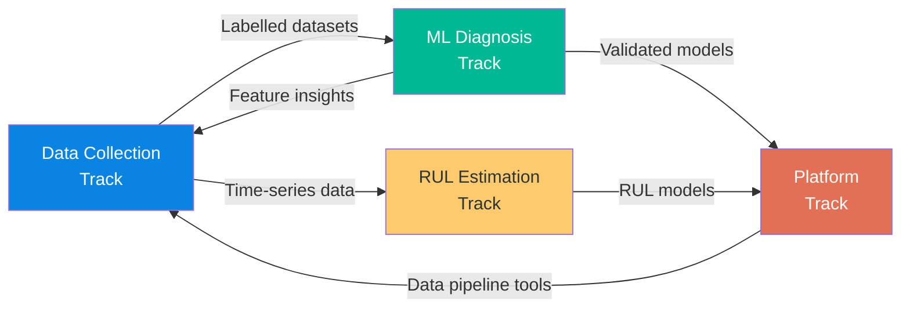
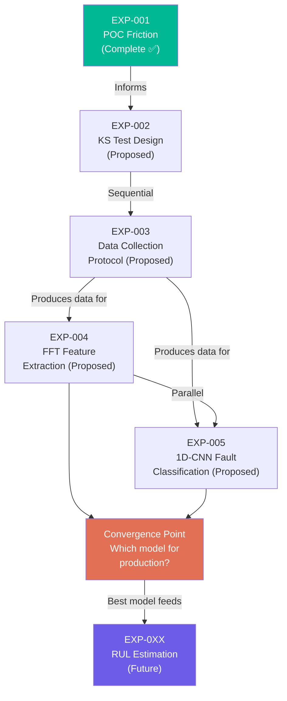
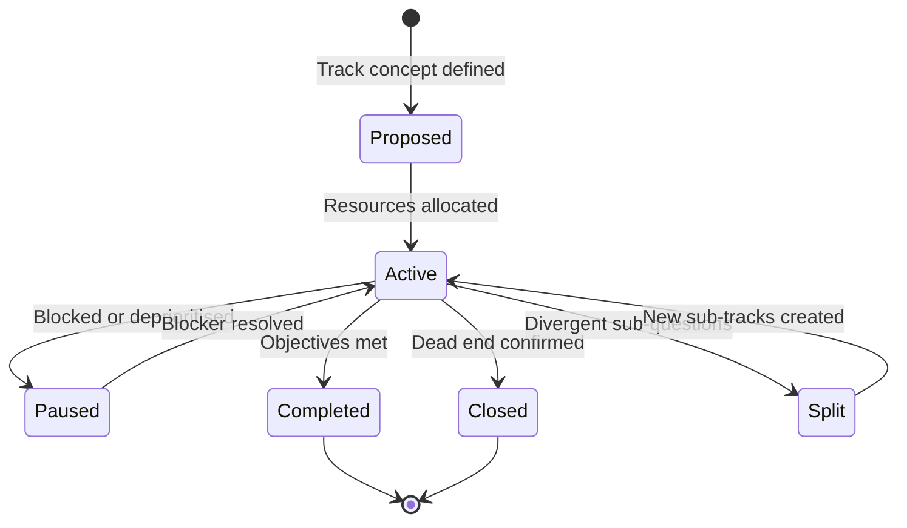

# Module 2: Portfolio Architecture — Multi-Track Research Management

> **Document Status:** Foundation Draft — v1.0  
> **Author:** PBA Research Operations  
> **Date:** 2026-05-12  
> **Purpose:** Replace the single linear research plan with a multi-track, parallel research portfolio managed through stage-gates, scoring, and KPIs  
> **Prerequisite:** Module 1 (Knowledge Architecture) ✅ Complete

---

## Table of Contents

1. [Why Portfolio Architecture?](#1-why-portfolio-architecture)
2. [Research Track Design](#2-research-track-design)
3. [Stage-Gate Decision Model](#3-stage-gate-decision-model)
4. [Go/No-Go Scoring Rubric](#4-gono-go-scoring-rubric)
5. [Experiment Dependency Graph](#5-experiment-dependency-graph)
6. [Portfolio KPIs](#6-portfolio-kpis)
7. [Exploration vs. Exploitation](#7-exploration-vs-exploitation)
8. [Track Lifecycle](#8-track-lifecycle)

---

## 1. Why Portfolio Architecture?

A single-track research plan assumes that success comes from executing one sequence of steps correctly. In reality, R&D requires **parallel exploration** — multiple independent lines of inquiry that may converge, diverge, or terminate independently.

Portfolio Architecture provides:

- **Resilience** — If one track hits a dead end, others continue
- **Speed** — Parallel work compresses the overall timeline
- **Discovery** — Adjacent tracks create unexpected connections
- **Resource efficiency** — Effort shifts dynamically to the most promising tracks

### Connection to FORGE Layers

Portfolio Architecture lives in **Layer 4 (Portfolio Intelligence)**. It synthesises information from all experiments (Layer 3), knowledge commons (Layer 2), and data assets (Layer 1) into strategic decisions about where to invest next.

---

## 2. Research Track Design

A **research track** is an independent, coherent line of investigation with its own hypothesis, experiments, and expected outputs. Tracks are complementary but not dependent — the failure of one track does not block another.

### Current Research Tracks

| Track | Focus | Primary Owner | Key Experiments | Status |
|-------|-------|---------------|-----------------|--------|
| **Data Collection** | Sensor setup, fault simulation, signal acquisition, protocol design | Student 1 | EXP-001, EXP-002, EXP-003 | Active |
| **ML Diagnosis** | Fault classification using signal features and ML models | Student 2 | EXP-004, EXP-005 | Proposed |
| **RUL Estimation** | Remaining Useful Life prediction (Type III effects-based) | TBD | Not yet proposed | Future |
| **Platform** | Internal software — data pipeline, feature extraction, dashboard | PBA Software Team | Ongoing | Active |

### Track Design Principles

1. **Independence** — Each track must be able to produce value even if other tracks fail
2. **Complementarity** — Tracks should feed each other (e.g., Data Collection produces datasets for ML Diagnosis)
3. **Minimum viable scope** — The smallest independent unit of investigation that can produce an Experiment Report
4. **Clear ownership** — One person (or pair) owns each track; they propose experiments and write reports
5. **Defined outputs** — Each track has explicit deliverables (datasets, models, technique notes, papers)

### Track Interaction Model



---

## 3. Stage-Gate Decision Model

Every experiment passes through five decision gates. Gates are lightweight — they prevent wasted effort without creating bureaucratic overhead.

```mermaid
flowchart LR
    G0["Gate 0\nDiscovery"]
    G1["Gate 1\nScoping"]
    G2["Gate 2\nGo/No-Go"]
    G3["Gate 3\nMid-Review"]
    G4["Gate 4\nCompletion"]

    G0 -->|"Is this aligned\nwith research\nquestions?"| G1
    G1 -->|"Is it feasible\nin 2-4 weeks?"| G2
    G2 -->|"Does it pass\nscoring rubric?"| G3
    G3 -->|"On track for\nmilestones?"| G4
    G4 -->|"Did we learn\nwhat we expected?"| DONE["Archive"]

    style G0 fill:#0984e3,color:#fff
    style G1 fill:#00b894,color:#fff
    style G2 fill:#fdcb6e,color:#2d3436
    style G3 fill:#e17055,color:#fff
    style G4 fill:#6c5ce7,color:#fff
```



| Gate | Question | Decision Maker | Artefact Required | Outcome |
|------|----------|----------------|-------------------|---------|
| **Gate 0: Discovery** | Is this problem aligned with FORGE's research questions? | Any contributor | Backlog entry | Proceed to scoping / reject |
| **Gate 1: Scoping** | Is this technically feasible within 2–4 weeks? | Track owner + supervisor | Draft EXP Proposal | Proceed to scoring / re-scope / reject |
| **Gate 2: Go/No-Go** | Does this pass the weighted scoring rubric? | Supervisor + industry partner | Full EXP Proposal + score | Approve / defer / reject |
| **Gate 3: Mid-Review** | Is execution on track? Any deviations? | Track owner + supervisor | Experiment Log update | Continue / pivot / abandon |
| **Gate 4: Completion** | Did we learn what we expected? What comes next? | All stakeholders | EXP Report + outputs | Archive + follow-on proposals |

---

## 4. Go/No-Go Scoring Rubric

At Gate 2, every proposed experiment is scored using a weighted rubric. This ensures objective prioritisation.

### Scoring Criteria

| Criterion | Weight | Scale | Description |
|-----------|--------|-------|-------------|
| **Strategic Alignment** | 30% | 0–10 | How directly does this advance FORGE's research questions? |
| **Technical Feasibility** | 25% | 0–10 | Can this be done with current tools, data, and skills? |
| **Resource Efficiency** | 25% | 0–10 | Is the effort proportionate to the expected learning? |
| **Expected Impact** | 20% | 0–10 | How much will this advance the overall portfolio? |

### Calculation

```
Score = (Alignment × 0.30) + (Feasibility × 0.25) + (Efficiency × 0.25) + (Impact × 0.20)
Maximum: 10.0
```

### Decision Thresholds

| Score | Decision |
|-------|----------|
| **≥ 7.0** | ✅ Approve — proceed immediately |
| **5.0 – 6.9** | ⚠️ Conditional — approve with modifications or defer |
| **< 5.0** | ❌ Reject — document reasoning, may revisit later |

### Scoring Template

Include in every Experiment Proposal at Gate 2:

```markdown
## Go/No-Go Score (Gate 2)

| Criterion | Score (0-10) | Rationale |
|-----------|-------------|-----------|
| Strategic Alignment (30%) | [X] | [Why this score] |
| Technical Feasibility (25%) | [X] | [Why this score] |
| Resource Efficiency (25%) | [X] | [Why this score] |
| Expected Impact (20%) | [X] | [Why this score] |
| **Weighted Total** | **[X.X]** | |

**Decision:** ✅ Approved / ⚠️ Conditional / ❌ Rejected  
**Decided by:** [Names]  
**Date:** [YYYY-MM-DD]
```

---

## 5. Experiment Dependency Graph

Experiments have relationships: sequential (one must complete before another starts), parallel (independent), and convergent (multiple feed into a decision).



### Dependency Types

| Type | Symbol | Meaning | Example |
|------|--------|---------|---------|
| **Sequential** | → | B cannot start until A completes | EXP-002 → EXP-003 |
| **Parallel** | ∥ | A and B are independent | EXP-004 ∥ EXP-005 |
| **Convergent** | ⊕ | Multiple experiments feed one decision | EXP-004 + EXP-005 → model selection |
| **Informational** | ⟶ | A provides context but B is not blocked | EXP-001 ⟶ EXP-002 |

---

## 6. Portfolio KPIs

Tracked quarterly in the Monthly Review (SOP-005) and reported in `reports/monthly/`.

| KPI | Definition | Target | Frequency |
|-----|-----------|--------|-----------|
| **Experiment Completion Rate** | Completed / Planned experiments | ≥ 60% | Quarterly |
| **Time-to-Insight** | Average weeks from EXP Proposal to EXP Report | ≤ 4 weeks | Quarterly |
| **Technique Transition Rate** | Techniques moving Assess → Trial → Adopt | ≥ 1 per quarter | Quarterly |
| **Dead-End Discovery Rate** | DE entries / total completed experiments | 15–30% (healthy range) | Quarterly |
| **Resource Utilisation** | Active researcher-weeks / available researcher-weeks | 70–85% | Monthly |
| **Knowledge Output Rate** | TN + ADR + DE documents produced | ≥ 2 per month | Monthly |
| **Cross-Reference Density** | Avg. internal links per document | ≥ 3 | Quarterly |

### Quarterly Portfolio Review Template

```markdown
## Q[N] [YYYY] Portfolio Review

**Period:** [Start date] — [End date]  
**Attendees:** [Names]

### Metrics
| KPI | Target | Actual | Trend |
|-----|--------|--------|-------|
| Experiment Completion Rate | ≥ 60% | [X]% | ↑/↓/→ |
| Time-to-Insight | ≤ 4 weeks | [X] weeks | ↑/↓/→ |
| Technique Transition Rate | ≥ 1 | [X] | ↑/↓/→ |
| Dead-End Discovery Rate | 15-30% | [X]% | ↑/↓/→ |

### Track Status
| Track | Active Experiments | Completed | Dead Ends | Health |
|-------|-------------------|-----------|-----------|--------|
| Data Collection | [N] | [N] | [N] | 🟢/🟡/🔴 |
| ML Diagnosis | [N] | [N] | [N] | 🟢/🟡/🔴 |

### Decisions Made
- [List key decisions from this quarter]

### Next Quarter Focus
- [Priority experiments and tracks]
```

---

## 7. Exploration vs. Exploitation

A healthy portfolio balances **exploitation** (building on what works) with **exploration** (testing new approaches). Too much exploitation leads to local optima; too much exploration leads to no delivered output.

### Recommended Allocation

| Mode | Effort % | Activities | FORGE Artefacts |
|------|----------|------------|-----------------|
| **Exploitation** | 60–70% | Extending validated techniques, collecting more data, improving models | EXP Reports, TN updates |
| **Exploration** | 30–40% | Testing new algorithms, alternative sensors, novel feature extraction | EXP Proposals (high-risk), DE entries |

### Signals to Rebalance

| Signal | Action |
|--------|--------|
| Dead-end rate > 40% | Too much exploration — shift to exploitation |
| Dead-end rate < 10% | Too little exploration — team is playing it safe |
| No technique transitions for 2 quarters | Stagnation — increase exploration budget |
| Time-to-insight > 6 weeks average | Experiments too large — break into smaller units |

---

## 8. Track Lifecycle

Tracks are not permanent. They can be paused, closed, split, or merged based on evidence.

### Track States



### Decision Criteria

| Decision | Trigger | Required Evidence | Decider |
|----------|---------|-------------------|---------|
| **Pause** | Resource conflict, equipment unavailable | Documented reason in monthly report | Track owner + supervisor |
| **Close** | Fundamental dead end confirmed | DE entry with High confidence | Supervisor + industry partner |
| **Split** | Track reveals two distinct sub-questions | Two viable EXP Proposals | Track owner + supervisor |
| **Merge** | Two tracks converge on same approach | ADR documenting merge rationale | All track owners |
| **Complete** | All research questions answered | Final EXP Report + Radar update | Supervisor + industry partner |

---

## Cross-References

| Related Document | Relationship |
|------------------|-------------|
| [08_research_lifecycle.md](./08_research_lifecycle.md) | Stage-gates in the lifecycle reference this module |
| [07_indusy_standard.md](./07_indusy_standard.md) | Hybrid Agile + Stage-Gate methodology source |
| [SOP-005-monthly-review.md](../sops/SOP-005-monthly-review.md) | Quarterly portfolio KPIs reported here |
| [technology-radar/radar.md](../technology-radar/radar.md) | Radar updates driven by portfolio decisions |

---

*This document defines how FORGE manages multiple parallel research tracks. It is a living document — update it as portfolio management practices mature through use.*
