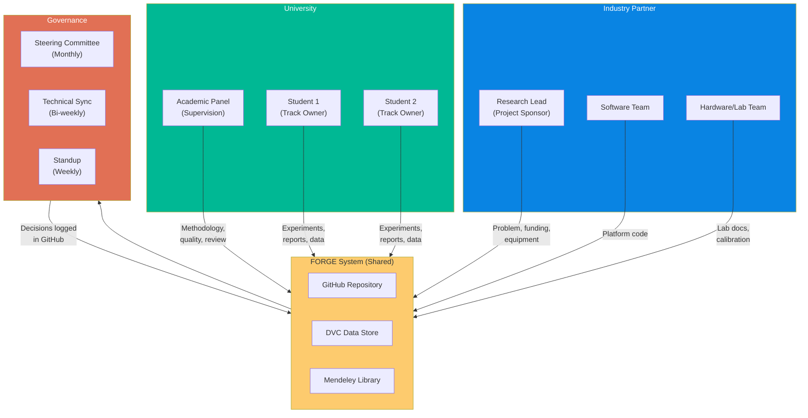
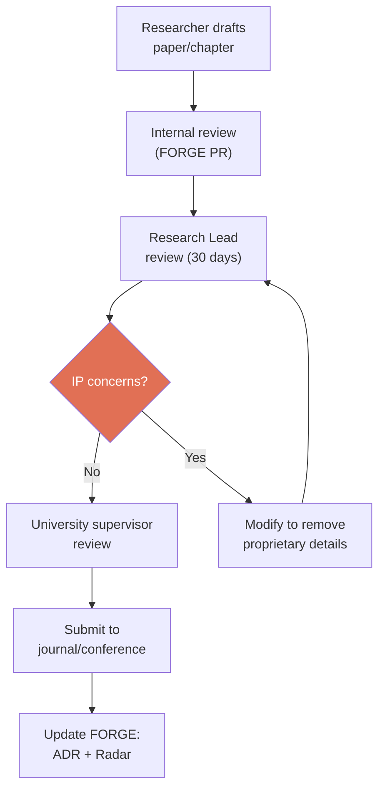

# Module 3: Collaboration Protocol — University–Industry Partnership Framework

> **Document Status:** Foundation Draft — v1.0  
> **Author:** Research Operations  
> **Date:** 2026-05-12  
> **Purpose:** Formalise the working interface between the industry partner and university collaborators for remote R&D team management  
> **Prerequisite:** Module 1 (Knowledge Architecture) ✅ Complete

---

## Table of Contents

1. [Collaboration Model](#1-collaboration-model)
2. [Stakeholder Roles & RACI Matrix](#2-stakeholder-roles--raci-matrix)
3. [Contribution Interface](#3-contribution-interface)
4. [Remote Collaboration Framework](#4-remote-collaboration-framework)
5. [IP Ownership Framework](#5-ip-ownership-framework)
6. [Publication Protocol](#6-publication-protocol)
7. [Escalation Paths](#7-escalation-paths)
8. [Student Lifecycle Management](#8-student-lifecycle-management)
9. [Alignment Without Micromanagement](#9-alignment-without-micromanagement)

---

## 1. Collaboration Model

FORGE manages a **distributed university-industry R&D collaboration** where the industry partner provides funding, problem definition, equipment access, and industry context, while the university provides research talent, academic supervision, and publication pathways.

### Design Principles

1. **Project-agnostic** — This protocol can be instantiated for any university partnership
2. **Remote-first** — All processes are designed for distributed teams across timezones
3. **Async by default** — Synchronous meetings are reserved for decisions and reviews; status updates and knowledge sharing happen asynchronously
4. **Transparent by design** — All decisions, progress, and blockers are visible to all stakeholders via the FORGE repository
5. **Academic freedom preserved** — Students choose their research methodology within FORGE's framework; the industry partner provides direction, not micro-management

### Collaboration Structure

---

## 2. Stakeholder Roles & RACI Matrix

### Role Definitions

| Role | Organisation | Responsibilities |
|------|-------------|------------------|
| **Research Lead** | Industry Partner | Project sponsor, problem definition, funding, industry context, FORGE system owner, progress monitoring |
| **Academic Panel** | University | Methodology guidance, thesis oversight, academic quality assurance, publication review |
| **Student Researcher** | University | Experiment execution, data collection, analysis, report writing, FORGE documentation |
| **Software Team** | Industry Partner | Platform development (Layer 5), data pipeline tools, CI/CD |
| **Hardware/Lab Team** | Industry Partner | Equipment setup, sensor calibration, lab access coordination |

### RACI Matrix

| Activity | Research Lead | Academic Panel | Student | Software Team |
|----------|:------------:|:--------------:|:-------:|:------------:|
| Problem definition | **A** | C | I | I |
| Research methodology | C | **A** | **R** | I |
| Experiment proposal | C | **A** | **R** | I |
| Experiment execution | I | C | **R/A** | I |
| Data collection | C | I | **R/A** | C |
| Data analysis & ML | I | C | **R/A** | C |
| Experiment report | I | **A** | **R** | I |
| Thesis writing | I | **A** | **R** | — |
| Publication submission | **A** | **R** | **R** | I |
| IP classification | **A** | C | I | I |
| Platform development | **A** | — | I | **R** |
| FORGE system updates | **R/A** | I | C | C |

> **R** = Responsible, **A** = Accountable, **C** = Consulted, **I** = Informed

---

## 3. Contribution Interface

### How University Work Enters FORGE

All university contributions follow the same process as internal contributions:

1. **Same templates** — Students use the same EXP Proposal, EXP Report, TN, ADR, and DE templates as internal staff
2. **Same review process** — All contributions submitted via GitHub Pull Request and reviewed before merge
3. **Same documentation standards** — "Document first, present second" applies to all contributors
4. **Mandatory onboarding** — Every new student completes the SOP-001 onboarding process (adapted for remote)

### Contribution Types by Role

| Contributor | Expected Outputs | Frequency |
|-------------|------------------|-----------|
| **Student (Track Owner)** | EXP Proposals, EXP Reports, TN/DE/ADR, data + code commits | Weekly commits, monthly EXP Report minimum |
| **Academic Panel** | PR reviews, methodology feedback, thesis chapter reviews | Bi-weekly review cycle |
| **Research Lead** | Portfolio decisions, Gate reviews, Radar updates, monthly reports | Weekly oversight, monthly formal review |
| **Software Team** | Platform code, CI/CD pipelines, tool integrations | Sprint-based delivery |

---

## 4. Remote Collaboration Framework

### Meeting Cadence

| Meeting | Frequency | Duration | Attendees | Purpose | Notes Location |
|---------|-----------|----------|-----------|---------|----------------|
| **Standup** | Weekly (Mon) | 30 min | Students + Research Lead | Progress, blockers, week plan | Async in GitHub Discussion (if timezone conflict) |
| **Technical Sync** | Bi-weekly (Tue) | 60 min | All researchers + supervisors | Deep technical review, methodology | `reports/monthly/` meeting notes |
| **Steering Committee** | Monthly (Last Fri) | 90–120 min | All stakeholders | Portfolio review, gate decisions, KPIs | `reports/monthly/YYYY-MM.md` |
| **Radar Review** | Quarterly | 60 min | Research Lead + track owners | Technology Radar update | `technology-radar/radar.md` |

### Async Communication Protocol

| Channel | Use For | Response SLA | Tool |
|---------|---------|-------------|------|
| **GitHub Pull Requests** | All document and code reviews | 48 hours | GitHub |
| **GitHub Discussions** | Decisions, open questions, async standups | 24 hours | GitHub |
| **GitHub Issues** | Bug reports, feature requests, experiment backlog | 72 hours | GitHub |
| **Slack/Teams Channel** | Quick questions, informal discussion | Same day | Slack or Teams |
| **Email** | Formal communications, university admin | 48 hours | Email |

### Decision Logging

Every decision made in any meeting or async discussion must be captured:

1. **Where:** GitHub Discussions (tagged `decision`)
2. **Format:** One-line decision + rationale + who decided + date
3. **Archive:** Significant decisions also captured in monthly report and/or ADR
4. **Rule:** If it's not in writing, it didn't happen

### Timezone Management

- All meeting times shared in UTC with local time conversions
- Async communication is the default; synchronous meetings are the exception
- Meeting recordings available for anyone who cannot attend live
- GitHub Discussions serve as the "async standup" for timezone-separated team members

---

## 5. IP Ownership Framework

### Work Product Ownership Matrix

| Work Product | Owner | Publication Rights | Access Control | Notes |
|-------------|-------|-------------------|----------------|-------|
| **Raw experimental data** | Industry Partner | University: thesis use (with industry partner approval); industry partner: product use | Private repo, DVC access controlled, local server backup | Published on Zenodo only for peer-reviewed publications ||
| **Processed/feature data** | Industry Partner | Same as raw | Same as raw | Derived from industry partner-owned raw data |
| **Source code (analysis)** | Industry Partner | Methodology publishable; implementation proprietary | Private repo | Student retains fork for thesis appendix |
| **Trained ML models** | Industry Partner | Architecture publishable; weights proprietary | Industry partner internal only | Student can describe architecture in thesis |
| **Technique Notes** | Industry Partner | Freely publishable (after review) | Public (after review) | Core knowledge contribution |
| **Dead-End entries** | Industry Partner | Freely publishable (after review) | Public (after review) | Learning is always shared |
| **Thesis document** | University/Student | Student decides (subject to industry partner review per project agreement) | Public after submission | Industry partner review window per project agreement |
| **Journal papers** | Joint authorship | Joint authorship required | Public after acceptance | See Publication Protocol below |
| **FORGE system design** | Industry Partner | Open-source (industry partner decides timing) | Currently private | System architecture is industry partner's IP |

### IP Protection Rules

1. **ELN-first rule:** Every new idea must be recorded in the FORGE repository with a timestamp **before** it is discussed with any external party
2. **Review-before-release:** No data, code, or documentation may be shared outside the FORGE team without Research Lead approval
3. **30-day review window:** The industry partner has 30 days to review any material before university submission for publication
4. **NDA requirement:** All collaborators must sign an NDA before receiving repository access

---

## 6. Publication Protocol

### Publication Workflow

### Authorship Rules

1. **All contributors who meet ICMJE criteria** are listed as authors
2. **First author:** The researcher who did the primary work
3. **Last author:** The academic supervisor (academic convention)
4. **Corresponding author:** Agreed case-by-case (typically student for thesis-derived papers)
5. **Acknowledgements:** Industry partner funding and support acknowledged in all publications
6. **Author order disputes:** Resolved by Steering Committee

### Embargo & Pre-publication

> **Note:** Embargo periods and publication review timelines are defined in the project agreement between the industry partner and the university. The terms below are defaults; the signed agreement takes precedence.

- **Zenodo dataset publication:** Only when required for peer-reviewed publication, and only after industry partner IP review and clearance. All other data stays on local industry partner infrastructure.
- **Conference presentations:** Slides reviewed by Research Lead 1 week before presentation
- **Preprints (arXiv):** Permitted after industry partner review, before peer review

---

## 7. Escalation Paths

### When to Escalate

| Situation | First Action | Escalate To | Timeline |
|-----------|-------------|-------------|----------|
| Student stuck for > 1 week | Discuss with track peer or Research Lead | Academic supervisor | Within 5 days |
| Methodology disagreement | Document both positions in GitHub Discussion | Steering Committee | Next scheduled meeting |
| Equipment/lab access blocked | Email Research Lead + Hardware Team | Industry partner management | Within 48 hours |
| IP concern identified | Flag in GitHub Discussion (private) | Research Lead immediately | Same day |
| Data quality issue | Document in EXP Report, flag in standup | Track owner + supervisor | Within 1 week |
| Scope creep / timeline risk | Update EXP Proposal with new scope | Steering Committee | Next scheduled meeting |
| Interpersonal conflict | Private discussion with Research Lead | Academic Panel lead | Within 1 week |

### Escalation Principle

> **Escalation is not failure.** It is a signal that the system is working — problems are being surfaced, not hidden. The goal is always to unblock the researcher as quickly as possible.

---

## 8. Student Lifecycle Management

### Phase 1: Pre-arrival (2 weeks before start)

- [ ] Sign NDA and collaboration agreement
- [ ] Receive GitHub repository invitation
- [ ] Receive DVC remote access credentials
- [ ] Receive Mendeley group library invitation
- [ ] Read: README.md, CONTRIBUTING.md, domain-glossary.md
- [ ] Read: Collaboration Protocol (this document)

### Phase 2: Onboarding (Weeks 1–2)

Per [SOP-001-onboarding.md](../sops/SOP-001-onboarding.md), plus:

- [ ] 1-hour IP awareness briefing with Research Lead
- [ ] Walk through publication review process
- [ ] Understand escalation paths
- [ ] Meet all team members (virtual introductions)
- [ ] Attend first Steering Committee meeting as observer

### Phase 3: Active Research (Months 1–10)

- Regular contributions per the Monthly Review cycle
- Minimum one EXP Report per month
- Active participation in all scheduled meetings
- Regular pushes to Git and DVC

### Phase 4: Thesis Writing (Months 8–12, overlapping with Phase 3)

- [ ] Thesis outline reviewed by supervisor and Research Lead
- [ ] Each chapter submitted for review as completed
- [ ] Industry partner 30-day review triggered before university submission
- [ ] Final IP clearance obtained

### Phase 5: Handover (Final month)

- [ ] All data committed to DVC and pushed
- [ ] All code committed to Git with documentation
- [ ] All experiment reports written and reviewed
- [ ] Knowledge transfer session (60 min) with Research Lead
- [ ] Technique Notes written for any undocumented methods
- [ ] Dead-End entries written for any undocumented failures
- [ ] Final handover report documenting: what was done, what remains, what was learned
- [ ] Repository access downgraded to read-only

> **Critical:** The handover checklist is mandatory, not optional. A student who graduates without completing handover leaves a knowledge gap that may take months to fill.

---

## 9. Alignment Without Micromanagement

### Strategic Direction Guardrails

The industry partner sets the **what** (research questions, problem domain, success criteria) and **constraints** (timeline, equipment, IP boundaries). Students and supervisors choose the **how** (methodology, algorithms, experimental approach).

| Industry Partner Controls | University Controls |
|-------------|-------------------|
| Research questions and priorities | Research methodology |
| Equipment and lab access | Experiment design details |
| IP classification decisions | Algorithm and tool selection |
| Publication review timing | Thesis structure and content |
| Portfolio-level resource allocation | Day-to-day work scheduling |
| FORGE system design and SOPs | Academic writing style |

### Autonomy Indicators

A healthy collaboration shows these patterns:

| Healthy Signal | Unhealthy Signal |
|---------------|-----------------|
| Students propose experiments independently | Students only execute assigned tasks |
| Dead-end entries are written without prompting | Failures are hidden or under-reported |
| Students challenge methodology suggestions | Students accept all suggestions without question |
| Experiment reports contain unexpected findings | Reports only confirm expected outcomes |
| Students contribute to FORGE system improvements | Students view FORGE as overhead |

### Intervention Triggers

The Research Lead should intervene only when:

1. **Silence** — No commits, no reports, no standup updates for > 2 weeks
2. **Drift** — Work has diverged significantly from research questions without an ADR explaining why
3. **Risk** — IP is at risk, equipment is being misused, or safety concerns arise
4. **Stagnation** — Same experiment running > 6 weeks with no intermediate results reported

---

## Cross-References

| Related Document | Relationship |
|------------------|-------------|
| [SOP-001-onboarding.md](../sops/SOP-001-onboarding.md) | Student onboarding checklist |
| [SOP-008-collaboration-communication.md](../sops/SOP-008-collaboration-communication.md) | Operational communication procedures |
| [SOP-005-monthly-review.md](../sops/SOP-005-monthly-review.md) | Monthly review meeting format |
| [03_portfolio_architecture.md](./03_portfolio_architecture.md) | Portfolio-level decisions feed collaboration governance |
| [06_reference_reading.md](./06_reference_reading.md) | PM.UIC and N4S academic references |

---

*This document defines how the industry partner collaborates with university partners within FORGE. It is a living document — update it as collaboration patterns evolve through practice.*
