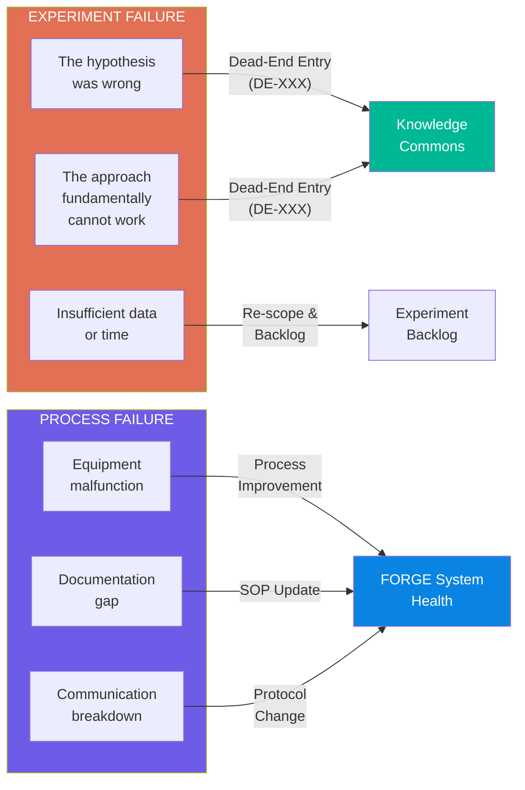
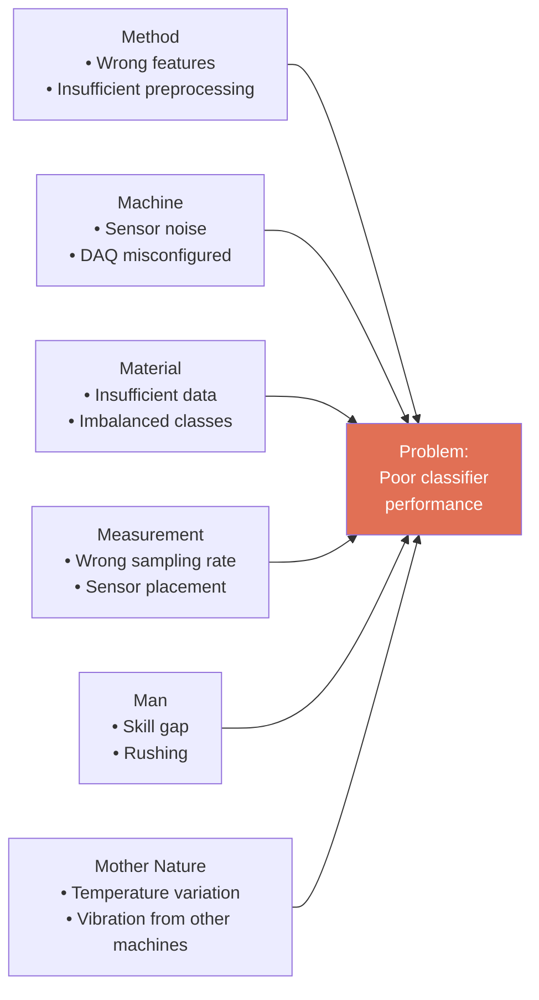
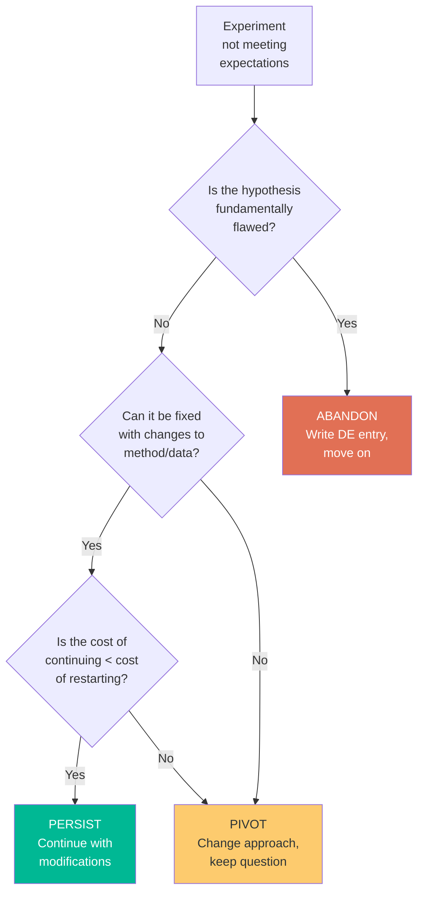
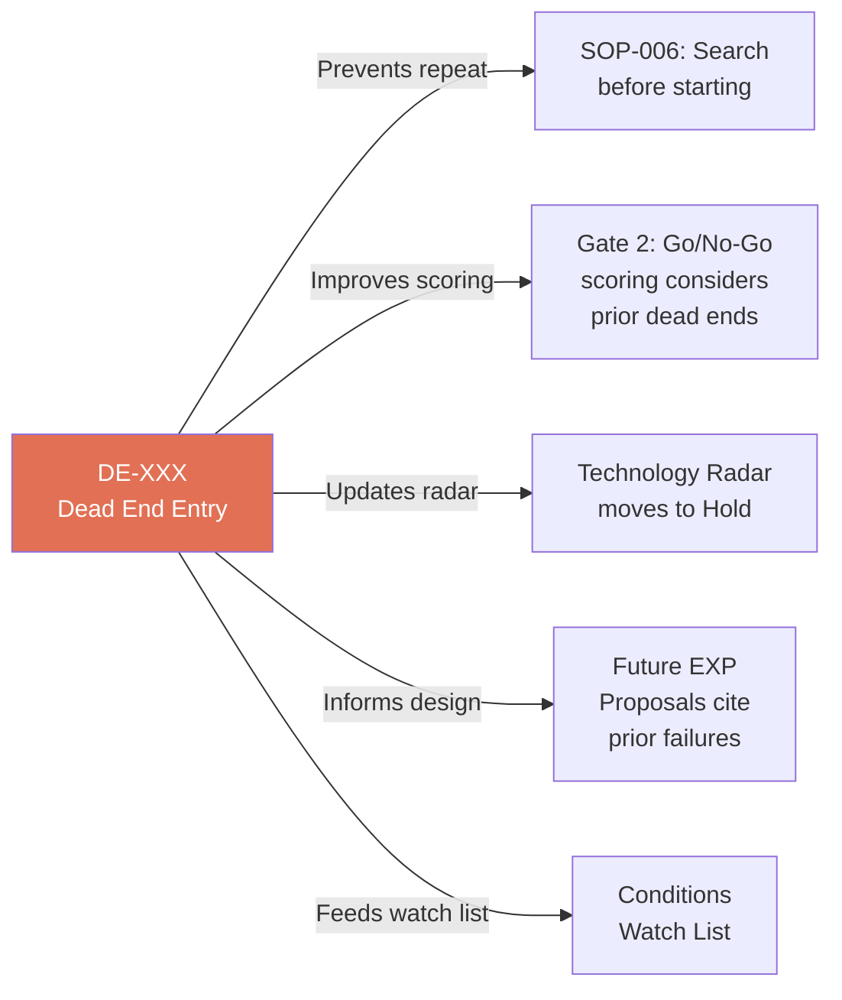

# Module 4: Failure Integration Loop — Structured Learning from Dead Ends

> **Document Status:** Foundation Draft — v1.0  
> **Author:** Research Operations  
> **Date:** 2026-05-12  
> **Purpose:** Make failure a first-class citizen of the FORGE system through structured retrospectives, root cause analysis, and decision frameworks  
> **Prerequisite:** Module 1 (Knowledge Architecture) ✅ Complete

---

## Table of Contents

1. [Philosophy: Why Failure is Valuable](#1-philosophy-why-failure-is-valuable)
2. [The Failure Spectrum](#2-the-failure-spectrum)
3. [Structured Retrospective Format](#3-structured-retrospective-format)
4. [Root Cause Analysis Methods](#4-root-cause-analysis-methods)
5. [Blameless Post-Mortem Protocol](#5-blameless-post-mortem-protocol)
6. [Persist vs. Pivot vs. Abandon Framework](#6-persist-vs-pivot-vs-abandon-framework)
7. [Dead-End Registry Integration](#7-dead-end-registry-integration)
8. [Failure Celebration & Team Health](#8-failure-celebration--team-health)
9. [Conditions Watch List](#9-conditions-watch-list)

---

## 1. Philosophy: Why Failure is Valuable

> **A dead end is not a failure. It is a confirmed negative result with the same epistemic value as a positive one.**

In research, knowing what does *not* work is as valuable as knowing what does. The most expensive failure is the one that is repeated because it was never documented. NASA's Lessons Learned Information System exists because the Challenger and Columbia disasters both had documented precursor lessons that were not consulted.

FORGE treats failure documentation as **mandatory, not optional** (see SOP-004). This module defines *how* to extract maximum learning from failures.

### The Cost of Undocumented Failure

| Scenario | Cost |
|----------|------|
| Student tries approach that was already tried and abandoned | 2–4 weeks wasted |
| Team member leaves, taking knowledge of what didn't work | Future team repeats the same dead ends |
| Failure is blamed on a person rather than the approach | Team hides future failures, system loses its most valuable input |
| Dead end is recorded but without root cause analysis | Next attempt makes the same mistake in a different form |

---

## 2. The Failure Spectrum

Not all failures are the same. FORGE distinguishes between two fundamentally different types:



### Failure Classification

| Type | Sub-type | Description | Action | FORGE Artefact |
|------|----------|-------------|--------|----------------|
| **Experiment Failure** | Hypothesis refuted | The approach was tested correctly and does not work | Dead-End Entry + Radar update | DE-XXX |
| **Experiment Failure** | Fundamental limitation | The approach cannot work due to physics, math, or data constraints | Dead-End Entry (High confidence) | DE-XXX |
| **Experiment Failure** | Insufficient resources | Approach might work but needs more data, time, or compute | Re-scope and return to backlog | Updated EXP Proposal |
| **Process Failure** | Equipment/tooling | Hardware broke, software crashed, DAQ misconfigured | Equipment fix + SOP update | SOP amendment |
| **Process Failure** | Documentation gap | Information was needed but not documented | Create missing TN/ADR | TN-XXX or ADR-XXX |
| **Process Failure** | Communication | Decision was made but not shared; expectations misaligned | Protocol update | SOP-008 amendment |

---

## 3. Structured Retrospective Format

Every completed experiment (success or failure) includes a retrospective. For failures, the retrospective is more detailed.

### Quick Retrospective (5 minutes, every experiment)

Added to every Experiment Report:

```markdown
## Retrospective

### What went well?
- [List positives — even from failed experiments]

### What didn't go well?
- [List problems — be specific and factual]

### What would we do differently?
- [List concrete changes for next time]

### What did we learn that we didn't expect?
- [Unexpected insights — often the most valuable output]
```

### Deep Retrospective (30 minutes, for significant failures or milestones)

Run as a team meeting, documented in `reports/monthly/`:

| Time | Activity |
|------|----------|
| 0–5 min | Facilitator sets the frame: "We are here to learn, not to blame" |
| 5–10 min | Timeline: What happened, in chronological order? |
| 10–20 min | Root Cause Analysis: Why did it happen? (use methods below) |
| 20–25 min | Lessons: What did we learn? What would we do differently? |
| 25–30 min | Actions: What specific changes will we make? Who owns each? |

---

## 4. Root Cause Analysis Methods

### 4.1 Five Whys

Ask "Why?" five times to drill from symptom to root cause. Stop when you reach a cause you can act on.

**Example:**

| Level | Question | Answer |
|-------|----------|--------|
| Why 1 | Why did the SVM classifier achieve only 45% accuracy? | Feature set was not discriminative for wear levels 2–3 |
| Why 2 | Why was the feature set not discriminative? | Time-domain features (RMS, peak) don't capture the frequency-domain differences |
| Why 3 | Why were only time-domain features used? | The feature extraction script was copied from a bearing fault tutorial |
| Why 4 | Why was a bearing tutorial used for a gantry problem? | No FORGE technique note existed for gantry-specific feature extraction |
| Why 5 | Why didn't a technique note exist? | This was the first feature extraction experiment |

**Root cause:** Missing domain-specific TN  
**Action:** Create TN for gantry feature extraction (frequency-domain emphasis)

### 4.2 Fishbone / Ishikawa Diagram

Categorise potential causes across six dimensions:



### 4.3 Pre-mortem Analysis (for Proposals)

Before starting an experiment, ask: *"Imagine this experiment failed. What went wrong?"*

Add to every Experiment Proposal:

```markdown
## Pre-mortem

If this experiment fails, the most likely causes are:
1. [Cause 1] — Mitigation: [action]
2. [Cause 2] — Mitigation: [action]
3. [Cause 3] — Mitigation: [action]
```

---

## 5. Blameless Post-Mortem Protocol

### Ground Rules

1. **Focus on the system, not the person** — "The process allowed X to happen" not "Person Y made a mistake"
2. **Assume good intent** — Everyone was trying to do the right thing with the information they had
3. **Celebrate the documentation** — The person who writes the best DE entry gets more recognition than the person who succeeds by luck
4. **No punishment for reporting failures** — If failures are punished, they will be hidden
5. **Facts first, opinions second** — Start with data and timeline before interpretation

### Post-Mortem Template

```markdown
# Post-Mortem: [EXP-XXX] [Title]

**Date:** [YYYY-MM-DD]  
**Facilitator:** [Name]  
**Attendees:** [Names]

## Timeline
| Date | Event |
|------|-------|
| [date] | [what happened] |

## Root Cause Analysis
[Method used: 5 Whys / Fishbone / other]
[Analysis results]

## Root Cause (Final)
[One-sentence root cause statement]

## Contributing Factors
- [Factor 1]
- [Factor 2]

## Lessons Learned
1. [Lesson — actionable]
2. [Lesson — actionable]

## Action Items
- [ ] [Owner]: [Action] — due [date]
- [ ] [Owner]: [Action] — due [date]

## Artefacts Created
- [ ] DE-XXX: [Dead-End Entry]
- [ ] TN-XXX: [Technique Note, if applicable]
- [ ] ADR-XXX: [Decision Record, if applicable]
```

---

## 6. Persist vs. Pivot vs. Abandon Framework

When an experiment isn't working, there are three options. This framework provides quantitative triggers to decide.



### Decision Triggers

| Decision | Trigger Conditions | Required Evidence |
|----------|-------------------|-------------------|
| **Persist** | Problem is in execution, not approach; fix is clear and < 1 week effort | Experiment Log showing specific failure point |
| **Pivot** | Hypothesis is sound but method is wrong; alternative method identified | Alternative EXP Proposal drafted |
| **Abandon** | Hypothesis refuted by data; no reasonable modification will work | Statistical evidence + expert review |

### Quantitative Thresholds

| Metric | Persist | Pivot | Abandon |
|--------|---------|-------|---------|
| Time spent vs. estimate | < 150% | 150–250% | > 250% |
| Key metric vs. target | > 70% of target | 40–70% of target | < 40% of target |
| Root cause identified | Yes, fixable | Yes, requires different approach | Yes, fundamental |
| Expert confidence | "Can be fixed" | "Need to try something else" | "This cannot work" |

---

## 7. Dead-End Registry Integration

### How Dead Ends Feed Forward

Dead-End entries are not just archives — they actively improve the system:



### Mandatory Citation Rule

Every Experiment Proposal must search the Dead-End Registry (SOP-006) and cite any relevant prior failures:

```markdown
## Prior Dead Ends Reviewed
- [x] Searched `knowledge-commons/dead-end-registry/`
- DE-003: [Title] — Relevant because [reason]. Conditions have changed because [explanation].
- No relevant dead ends found: [confirm search terms used]
```

---

## 8. Failure Celebration & Team Health

### Recognising Valuable Dead Ends

Dead ends that save future teams significant effort deserve recognition:

| Recognition | Trigger | Format |
|-------------|---------|--------|
| **"Best DE of the Month"** | Monthly Review (SOP-005) | Shout-out in meeting notes |
| **DE citation count** | When a DE is cited by 3+ future proposals | Note in the DE entry |
| **Pre-mortem accuracy** | Pre-mortem correctly predicted a failure mode | Note in the post-mortem |

### Team Health Indicators

| Healthy Signal | Unhealthy Signal |
|---------------|-----------------|
| DE entries are written promptly and thoroughly | Failures are mentioned verbally but never documented |
| Team freely discusses what went wrong | Team avoids discussing failures |
| DE entries include "Conditions That Might Change" | DE entries are final verdicts with no forward-looking section |
| New team members search DEs before proposing experiments | New team members propose experiments that repeat known dead ends |
| Dead-end rate is 15–30% | Dead-end rate is 0% (team is avoiding risk) or > 50% (team is not scoping well) |

### Preventing Dead-End Fatigue

When too many experiments fail consecutively, morale can drop. Mitigation:

1. **Alternate experiment types** — Schedule one "safe" exploitation experiment between exploratory ones
2. **Celebrate the learning** — Each DE entry should answer: "What do we now know that we didn't before?"
3. **Track the compound effect** — Show how many future weeks of wasted effort each DE prevents
4. **Quick wins** — Keep some small, achievable experiments in the backlog as morale boosters

---

## 9. Conditions Watch List

Some dead ends become viable when conditions change. The Watch List tracks these.

### Watch List Template

```markdown
# Conditions Watch List

| DE Entry | Condition That Would Revive | Current Status | Last Checked |
|----------|---------------------------|----------------|-------------|
| DE-003 | Dataset size exceeds 10,000 labelled samples | Current: 500 samples | 2026-Q2 |
| DE-005 | GPU compute available for training | Currently CPU-only | 2026-Q2 |
| DE-007 | New sensor type provides better SNR | No change | 2026-Q2 |
```

### Review Cadence

- **Quarterly:** During Radar Review (SOP-003), scan the Watch List
- **On trigger:** When a condition changes (new data collected, new tool acquired), check the Watch List
- **On revival:** If a dead end becomes viable, create a new EXP Proposal citing the original DE entry

---

## Cross-References

| Related Document | Relationship |
|------------------|-------------|
| [SOP-004-dead-end-documentation.md](../sops/SOP-004-dead-end-documentation.md) | Operational procedure for creating DE entries |
| [SOP-006-knowledge-retrieval.md](../sops/SOP-006-knowledge-retrieval.md) | Mandatory DE search before new experiments |
| [03_portfolio_architecture.md](./03_portfolio_architecture.md) | Dead-end rate as portfolio KPI |
| [06_reference_reading.md](./06_reference_reading.md) | NASA LLIS reference |
| [knowledge-commons/dead-end-registry/](../knowledge-commons/dead-end-registry/) | Actual DE entries |

---

*This document defines how FORGE extracts maximum value from failures. It is a living document — update it as retrospective practices mature through use.*
