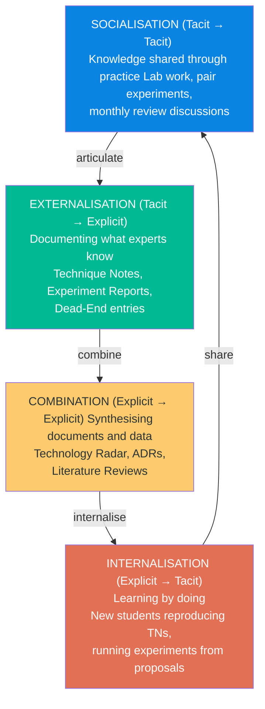
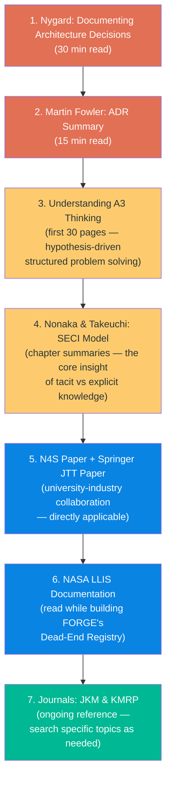

# FORGE: Reference Reading & Literature Map

> **Document Status:** Living Reference  
> **Purpose:** Structured guide to the publications, frameworks, and industry practices that FORGE draws from  
> **How to Use:** Start with the [Suggested Reading Order](#suggested-reading-order) at the bottom, or jump to the section relevant to what you're building

---

## Table of Contents

1. [Foundational Theory — The "Why" Behind FORGE](#1-foundational-theory--the-why-behind-forge)
2. [Architecture Decision Records (ADRs)](#2-architecture-decision-records-adrs)
3. [Technology Radar](#3-technology-radar)
4. [Toyota's A3 Methodology](#4-toyotas-a3-methodology)
5. [NASA Lessons Learned Information System](#5-nasa-lessons-learned-information-system)
6. [Knowledge Management in R&D — Academic Journals](#6-knowledge-management-in-rd--academic-journals)
7. [University-Industry Collaboration Research](#7-university-industry-collaboration-research)
8. [Video Resources](#8-video-resources)
9. [Suggested Reading Order](#9-suggested-reading-order)

---

## 1. Foundational Theory — The "Why" Behind FORGE

### Nonaka & Takeuchi: The SECI Model

The most important theoretical foundation is **Nonaka and Takeuchi's SECI Model**, published in their 1995 book:

> **Nonaka, I. & Takeuchi, H. (1995).** *The Knowledge-Creating Company: How Japanese Companies Create the Dynamics of Innovation.* Oxford University Press.

The model considers knowledge creation as a dynamic process in which continuous dialogue between tacit and explicit knowledge generates new knowledge and amplifies it across different levels — individual, organizational, and inter-organizational. This is exactly the spiral FORGE is trying to engineer.

#### The SECI Cycle

#### How FORGE Maps to the SECI Model

| SECI Phase | FORGE Mechanism | What Happens |
|------------|----------------|--------------|
| **Socialisation** | Monthly Reviews (SOP-005), Lab sessions, Pair experiments | Tacit knowledge passes between experienced and new researchers through shared practice |
| **Externalisation** | Technique Notes, Experiment Reports, Dead-End Registry | Tacit knowledge (intuitions, failure instincts, domain feel) is captured in structured documents |
| **Combination** | Technology Radar, ADRs, Literature integration via Zotero | Multiple explicit knowledge sources are synthesised into strategic views |
| **Internalisation** | Onboarding (SOP-001), Reproducing TNs, Running backlog experiments | New contributors absorb explicit knowledge and convert it back to personal tacit understanding |

#### Why This Matters for PBA Specifically

Western firms tend to focus too much on explicit knowledge — documents and databases — while ignoring the tacit knowledge that lives in the heads of experienced researchers. The risk with the student collaboration is exactly this: **when the students leave, their tacit knowledge (intuitions, failure instincts, domain feel) leaves with them** unless FORGE captures it before graduation.

FORGE's Technique Notes and Experiment Reports are specifically designed to engineer the **Externalisation** phase — converting what students learn by doing into permanent, searchable, reusable written knowledge.

---

## 2. Architecture Decision Records (ADRs)

### Primary Source

> **Nygard, M. (2011).** "Documenting Architecture Decisions." *Cognitect Blog.*  
> 🔗 [cognitect.com/blog/2011/11/15/documenting-architecture-decisions](https://www.cognitect.com/blog/2011/11/15/documenting-architecture-decisions)

Short, practical, and still the most-cited reference on ADRs. An architecture decision record is a short text file describing a set of forces and a single decision in response to those forces. The decision is the central piece, so specific forces may appear in multiple ADRs.

Michael Nygard coined the term in 2011 with an ADR-formatted article. While he did not originate the idea of a decision log, he made the case for a lightweight document with a focus on the decision itself, inspired by Philippe Kruchten's earlier work on decision registers.

### Secondary Sources

> **Fowler, M.** "Architecture Decision Record." *Martin Fowler's Bliki.*  
> 🔗 [martinfowler.com/bliki/ArchitectureDecisionRecord.html](https://martinfowler.com/bliki/ArchitectureDecisionRecord.html)

Excellent secondary read — Fowler expands on Nygard and adds more recent developments.

> **ADR Community Hub**  
> 🔗 [adr.github.io](https://adr.github.io)

Aggregates templates, tools, and comparisons. A comparison of seven ADR templates can be found in:

> **Zimmermann, O. et al. (2015).** "Architectural Decision Guidance Across Projects — Problem Space Modeling, Decision Backlog Management and Cloud Computing Knowledge." *WICSA 2015 Conference Paper.*

### Relevance to FORGE

FORGE's `ADR-XXX` template (at `knowledge-commons/decision-records/_TEMPLATE_adr.md`) is directly adapted from Nygard's format. ADRs answer: *"Why is the system built the way it is?"* — critical when a customer asks why a fault threshold was set at 0.5 microns, or why CNN was chosen over SVM.

---

## 3. Technology Radar

### Origin Story

> **ThoughtWorks.** "Birth of the Technology Radar."  
> 🔗 [thoughtworks.com/insights/blog/birth-technology-radar](https://www.thoughtworks.com/insights/blog/birth-technology-radar)

Written by the person who developed the first radar white paper prototype after the November 2009 internal meeting.

### Practical Guide

> **Ford, N. (2015).** "Build Your Own Technology Radar." *Medium.*

The practical guide for organisations wanting to create their own version rather than just read ThoughtWorks'. The producers should be a representative group of senior technologists, with output that might be a 10-page white paper or a presentation — what you produce depends on your audience, but technologists should drive the process.

### Live Reference

> **ThoughtWorks Technology Radar**  
> 🔗 [radar.thoughtworks.com](https://radar.thoughtworks.com)

Published twice yearly as a snapshot of tools, techniques, platforms, languages, and frameworks. Read a few volumes to understand how assessments change over time. Directly relevant: search for entries on "predictive maintenance," "MLOps," and "electronic lab notebooks."

### Relevance to FORGE

FORGE's Technology Radar (at `technology-radar/radar.md`) uses the same four-ring model (Adopt / Trial / Assess / Hold). Movement criteria are defined in SOP-003 — every ring transition must be backed by at least one Experiment Report.

---

## 4. Toyota's A3 Methodology

### Definitive Source

> **Sobek II, D.K. & Smalley, A. (2008).** *Understanding A3 Thinking: A Critical Component of Toyota's PDCA Management System.* Productivity Press.  
> 🏆 Winner of a 2009 Shingo Research Prize.

The A3 report's power derives not from the report itself but from the culture and mindset required to implement it — Toyota views A3s as just one piece of a PDCA-based management philosophy.

Critically for FORGE: the A3 report has proven to be a key tool in Toyota's work **within its engineering and R&D organisations specifically** — not just manufacturing.

> **Essential reading:** The first 30 pages. The rest are worked examples (valuable but not essential for understanding the method).

### Relevance to FORGE

FORGE's Experiment Proposal template borrows A3's discipline of stating hypothesis, current state, target, and method **before any work begins**. The structured one-page constraint forces rigorous thinking and prevents "slide deck thinking" where complexity is hidden behind bullet points.

---

## 5. NASA Lessons Learned Information System

### Primary Sources

> **NASA.** "Lessons Learned." *NASA Academy of Program/Project & Engineering Leadership (APPEL).*  
> 🔗 [appel.nasa.gov/lessons-learned](https://appel.nasa.gov/lessons-learned)

> **NASA.** "NASA Lessons Learned Process." *Process document.*  
> 🔗 Available as PDF from [thecampbellinstitute.org](https://www.thecampbellinstitute.org)

NASA's process has three phases:
1. **Record** — documenting lessons in the LLIS database or local repositories
2. **Disseminate** — sharing via publications, webinars, and communities of practice
3. **Apply** — integrating lessons into NASA practice

The LLIS organises content into structured lessons, each tagged with metadata enhancing searchability. Lessons include background context, descriptions of what occurred, contributing factors, recommendations, and preventive measures — submitted by personnel with direct experience and reviewed before being made available agency-wide.

### Critical Counterpoint

> **NASA Office of Inspector General (2012).** "NASA's Lessons Learned Process." *Report No. IG-12-012.*

This audit found that **8 of 10 NASA centres had not fully complied with lessons-learned policy requirements**, and 6 of 10 did not cross-reference lessons to their management or engineering standards, limiting effectiveness.

This tells you something important: **having the system isn't enough — you need the SOPs and culture to enforce it.** That's why SOP-004 in FORGE makes dead-end documentation mandatory, not optional.

### Academic Research on Failure Learning

> **Sillito, J. & Pope, J. (2024).** "Learning From Lessons Learned: Preliminary Findings From a Study of Learning From Failure." *arXiv preprint.* Brigham Young University.

Good empirical study of what makes postmortem practices actually stick in engineering organisations.

### Relevance to FORGE

FORGE's Dead-End Registry and Lessons Learned processes (SOP-004) are directly inspired by NASA's LLIS. The NASA audit's findings are the reason FORGE makes DE documentation mandatory — voluntary systems fail.

---

## 6. Knowledge Management in R&D — Academic Journals

### Top Journals to Follow and Search

| Journal | Publisher | Focus | Search For |
|---------|-----------|-------|------------|
| **Journal of Knowledge Management** | Emerald | Leading KM academic journal — cutting-edge research with real-world applications | "R&D knowledge management," "lessons learned systems," "organisational learning failure" |
| **Knowledge Management Research & Practice** | Taylor & Francis | More practice-oriented than JKM, better for applied frameworks | "knowledge management implementation," "engineering knowledge" |
| **Research Policy** | Elsevier | Innovation management, university-industry collaboration | "open innovation," "knowledge transfer," "industry-academia" |

### Key Paper

> **Henz, P. (2024).** "Knowledge management implementation: A systematic literature review." *Knowledge and Process Management.*

Examined 174 articles from 108 journals to identify what actually works in KM implementation. A useful shortcut to the field's consensus findings.

---

## 7. University-Industry Collaboration Research

Three papers directly relevant to the PBA–University of Moratuwa structure:

### N4S Programme Study

> **"Energising collaborative industry-academia learning."** *Published in PMC (open access).*

Studies the Finnish N4S programme, a large-scale industry-academia R&D collaboration. Concludes that **transparently shared, ambitious outcome goals with continuous integrative collection of results** are keys to effective industry-academia collaboration — and that N4S largely avoided the common conflict between firms seeking immediate applied solutions and academics aiming at generalizable knowledge.

> **Key insight:** This is exactly the tension you need to design around in Module 3 (Collaboration Protocol).

### Project Management in UICs

> **"Project management practices in major university-industry R&D collaboration programs."** *Journal of Technology Transfer* (Springer, 2022).

Empirical study recommending **hybrid agile-traditional approaches** for university-industry collaborations. Directly applicable to structuring student deliverables within FORGE's experiment-based workflow.

### Digital Transformation Study

> **"University-industry collaboration as a driver of digital transformation."** *ScienceDirect, 2023.*

Covers structural enablers of effective collaboration. Notable finding: one academic in the study worked inside the industry partner's office for six months and found that **sitting in the middle of the office and hearing all the conversations allowed rapid learning of how the business actually works.**

> **Practical implication:** Give students regular lab access and exposure to real PBA engineering conversations, not just formal project meetings. The informal socialisation (Nonaka's first SECI phase) is where the deepest knowledge transfer happens.

---

## 8. Video Resources

| Resource | Platform | Why Watch It | FORGE Relevance |
|----------|----------|-------------|-----------------|
| **"Architecture Decision Records in Action"** — Keeling & Runde (IBM) | YouTube | Best practical ADR walkthrough with real-world adoption numbers | ADR template design |
| **"ADRs and Architecture Stories"** — Mark Richards | YouTube | Multi-part series starting from Nygard's template | ADR process understanding |
| **ThoughtWorks Technology Radar Podcast** | thoughtworks.com | Audio walkthroughs of each radar edition | Technology Radar SOP |
| **"Build Your Own Radar" tutorial** | ThoughtWorks YouTube | How to run a radar review session internally | SOP-003 preparation |
| **MIT OpenCourseWare: Managing Innovative Teams** | ocw.mit.edu | Covers R&D management, innovation portfolios | Module 2 (Portfolio Architecture) |
| **Stanford HCI Group lectures on research documentation** | YouTube | Academic research methodology applied to practice | Experiment Engine design |
| **Lean Enterprise Institute: A3 Thinking Webinars** | lean.org | Free webinars directly based on the Sobek/Smalley book | Experiment Proposal template |

---

## 9. Suggested Reading Order

If you were to approach this as a structured self-study, the most efficient path:

| Priority | Source | Time | What You Get |
|----------|--------|------|-------------|
| 🔴 Start here | Nygard ADR post + Fowler follow-up | 45 min | Immediate practical tools for decision documentation |
| 🔴 Then | Sobek & Smalley, first 30 pages | 2 hours | The discipline of hypothesis-driven structured problem solving |
| 🟡 Then | Nonaka & Takeuchi chapter summaries | 2 hours | Core insight: the SECI spiral is what FORGE is engineering |
| 🟡 Then | N4S + JTT collaboration papers | 3 hours | How to design the university-industry interface |
| 🔵 Alongside building | NASA LLIS documentation | 1 hour | Practical model for dead-end and lessons-learned systems |
| 🟢 Ongoing | Journal of Knowledge Management | As needed | Search specific topics when designing new FORGE components |

---

## Cross-References to FORGE Documents

| Reference | Most Relevant FORGE Document |
|-----------|------------------------------|
| Nygard ADR post | `knowledge-commons/decision-records/_TEMPLATE_adr.md` |
| Sobek & Smalley A3 | `experiments/_TEMPLATE_experiment_proposal.md` |
| Nonaka SECI Model | `00_system_design/02_knowledge_architecture.md` |
| NASA LLIS | `knowledge-commons/dead-end-registry/_TEMPLATE_dead_end.md`, `sops/SOP-004-dead-end-documentation.md` |
| ThoughtWorks Radar | `technology-radar/radar.md`, `sops/SOP-003-technology-radar.md` |
| N4S / JTT papers | `00_system_design/04_collaboration_protocol.md` |

---

*This reference list is a living document. Add new sources as they are discovered. Every academic paper referenced here should also be added to the shared Zotero library for team-wide access.*
