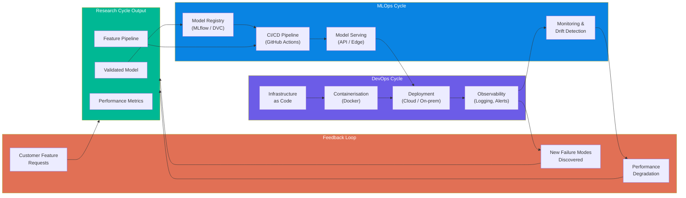
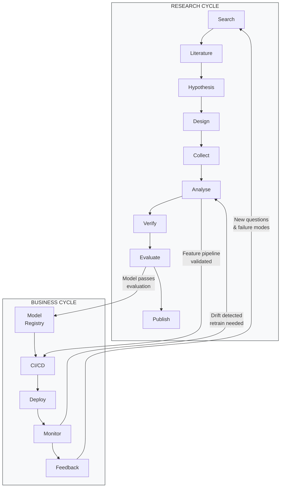
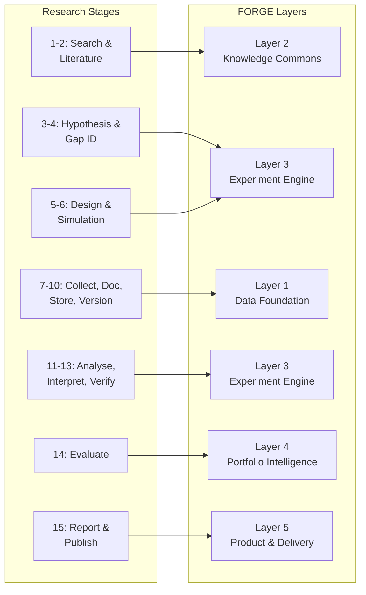

# Module 5: Research Lifecycle — The Dual-Cycle Engine

> **Document Status:** Foundation Draft — v1.0  
> **Author:** PBA Research Operations  
> **Date:** 2026-05-12  
> **Purpose:** Formalise the research and production lifecycles, define how they integrate, and map them to FORGE layers, ISO 13374, and industry standards  
> **Prerequisite:** Module 1 (Knowledge Architecture) ✅ Complete

---

## Table of Contents

1. [Why a Lifecycle Model?](#1-why-a-lifecycle-model)
2. [The Research Cycle — 15 Stages](#2-the-research-cycle--15-stages)
3. [The Business Cycle — DevOps & MLOps](#3-the-business-cycle--devops--mlops)
4. [Dual-Cycle Integration](#4-dual-cycle-integration)
5. [FORGE Layer Mapping](#5-forge-layer-mapping)
6. [ISO 13374 Stage Mapping](#6-iso-13374-stage-mapping)
7. [Stage-Gate Overlay](#7-stage-gate-overlay)
8. [Sprint Mapping](#8-sprint-mapping)
9. [Entry & Exit Criteria](#9-entry--exit-criteria)

---

## 1. Why a Lifecycle Model?

FORGE's Knowledge Architecture (Module 1) defines *what* the system stores and *how* it stores it. This document defines *the process that generates knowledge* — the research lifecycle that transforms questions into validated insights, and the business lifecycle that transforms insights into deployed products.

The key design requirement: **the lifecycle must be project-agnostic.** It was originally conceived in the context of predictive maintenance for precision gantry systems, but the process applies equally to any R&D initiative — vibration analysis, computer vision, process optimisation, or any future collaboration.

### Origin

This lifecycle model originated from early observations about open-science research methodology (see [historical notes](#appendix-original-notes)). The raw idea identified two critical gaps:

1. **No formal lifecycle** — FORGE had an experiment engine (Layer 3) but no overarching process connecting search, hypothesis, data, analysis, and publication into a coherent flow.
2. **No business integration** — Research outputs need a pathway into production. DevOps and MLOps cycles must integrate with the research cycle, not run separately.

---

## 2. The Research Cycle — 15 Stages

The research cycle follows the open-science methodology, adapted for industry-university R&D collaboration.

```mermaid
flowchart TD
    S1["1. Search & Discovery\nIdentify gaps, problems,\nopportunities"]
    S2["2. Literature Review\nSystematic survey of\nexisting knowledge"]
    S3["3. Hypothesis Formation\nSolution hypothesisation,\nresearch questions"]
    S4["4. Gap Identification\nWhat is missing in\ncurrent knowledge?"]
    S5["5. Study Design\nExperimental design,\ntest matrices"]
    S6["6. Simulation\nModelling, feasibility\nvalidation"]
    S7["7. Setup & Preparation\nAcquire materials,\nconfigure equipment"]
    S8["8. Data Collection\nExecute experiments,\nacquire signals"]
    S9["9. Data Documentation\nELN entries, metadata,\nanomaly logging"]
    S10["10. Data Storage &\nVersion Control\nDVC, backup, FAIR"]
    S11["11. Data Analysis\nFeature extraction,\nmodel training"]
    S12["12. Interpretation\nStatistical significance,\ndomain meaning"]
    S13["13. Verification &\nValidation\nReproducibility,\ncross-validation"]
    S14["14. Evaluation\nProduction readiness,\nperformance criteria"]
    S15["15. Report & Publish\nThesis, papers,\ndataset release"]

    S1 --> S2 --> S3 --> S4 --> S5 --> S6
    S6 --> S7 --> S8 --> S9 --> S10
    S10 --> S11 --> S12 --> S13 --> S14 --> S15

    S15 -.->|"Future work\n& improvements"| S1

    style S1 fill:#0984e3,color:#fff
    style S2 fill:#0984e3,color:#fff
    style S3 fill:#00b894,color:#fff
    style S4 fill:#00b894,color:#fff
    style S5 fill:#fdcb6e,color:#2d3436
    style S6 fill:#fdcb6e,color:#2d3436
    style S7 fill:#e17055,color:#fff
    style S8 fill:#e17055,color:#fff
    style S9 fill:#e17055,color:#fff
    style S10 fill:#6c5ce7,color:#fff
    style S11 fill:#6c5ce7,color:#fff
    style S12 fill:#6c5ce7,color:#fff
    style S13 fill:#d63031,color:#fff
    style S14 fill:#d63031,color:#fff
    style S15 fill:#2d3436,color:#fff
```

### Stage Descriptions

| # | Stage | Description | Primary Output | FORGE Layer |
|---|-------|-------------|----------------|-------------|
| 1 | **Search & Discovery** | Identify gaps, problems, and opportunities through domain observation, customer feedback, and literature scanning | Problem statement, opportunity brief | L2 (Knowledge Commons) |
| 2 | **Literature Review** | Systematic survey of existing knowledge using Mendeley, IEEE Xplore, Scopus, Google Scholar | Annotated bibliography, gap analysis, literature review matrix | L2 (Knowledge Commons) |
| 3 | **Hypothesis Formation** | Define precise research questions, hypotheses, and expected outcomes | Experiment Proposal (EXP-XXX-PROPOSAL), OSF pre-registration | L3 (Experiment Engine) |
| 4 | **Gap Identification** | Formalise what is missing in current knowledge; justify the research direction | Gap analysis document, feasibility assessment | L3 (Experiment Engine) |
| 5 | **Study Design** | Design experimental methodology — test matrices, variables, controls, protocols | Test Protocol, sensor placement diagrams, test matrix | L3 (Experiment Engine) |
| 6 | **Simulation** | Validate feasibility through modelling before physical experiments | Simulation results, feasibility report | L3 (Experiment Engine) |
| 7 | **Setup & Preparation** | Acquire materials, configure equipment, calibrate sensors, prepare DAQ | Equipment checklist, calibration records, ELN entry | L1 (Data Foundation) |
| 8 | **Data Collection** | Execute experiments under controlled conditions; real-time anomaly logging | Raw HDF5 datasets (DVC-tracked), ELN session logs | L1 (Data Foundation) |
| 9 | **Data Documentation** | Create metadata, document anomalies, write session notes contemporaneously | metadata.json (FAIR-compliant), session notes | L1 (Data Foundation) |
| 10 | **Data Storage & VC** | Version data with DVC, ensure 3-2-1 backup rule, tag dataset releases | DVC commits, tagged data versions | L1 (Data Foundation) |
| 11 | **Data Analysis** | Feature extraction (FFT, RMS, kurtosis, wavelets), model training, evaluation | Feature matrices, trained models, MLflow runs | L3 (Experiment Engine) |
| 12 | **Interpretation** | Assess statistical significance, domain meaning, and practical implications | Experiment Report (EXP-XXX-REPORT) | L3 (Experiment Engine) |
| 13 | **Verification & Validation** | Reproducibility check (`dvc repro`), cross-validation, independent test set | V&V report, reproducibility confirmation | L3 (Experiment Engine) |
| 14 | **Evaluation** | Assess production readiness against success criteria; go/no-go decision | Go/No-Go decision record (ADR), Technology Radar update | L4 (Portfolio Intelligence) |
| 15 | **Report & Publish** | Write thesis chapters, journal papers; publish datasets on Zenodo with DOI | Thesis, papers, Zenodo datasets, code releases | L5 (Product & Delivery) |

> **Iteration is expected.** Stages 5–13 often cycle multiple times before Stage 14 produces a pass. Each iteration should generate a new Experiment Report and, if applicable, Dead-End entries. The feedback loop from Stage 15 back to Stage 1 is what makes FORGE a *compound learning system* rather than a linear project.

---

## 3. The Business Cycle — DevOps & MLOps

The research cycle produces validated knowledge and models. The business cycle deploys them into production. In the context of predictive maintenance, this means turning validated ML models into customer-facing diagnostic tools.

### MLOps Stages

| Stage | Description | Tools |
|-------|-------------|-------|
| **Model Registry** | Version and catalogue trained models with metadata | MLflow / DVC / W&B |
| **CI/CD Pipeline** | Automated testing, validation, and deployment of models | GitHub Actions |
| **Model Serving** | Deploy models as APIs or edge inference engines | FastAPI / ONNX Runtime |
| **Monitoring** | Track model performance in production, detect data drift | Custom dashboard / Prometheus |

### DevOps Stages

| Stage | Description | Tools |
|-------|-------------|-------|
| **Infrastructure as Code** | Reproducible environment definitions | Docker, docker-compose |
| **Containerisation** | Package applications with all dependencies | Docker |
| **Deployment** | Push to production (cloud or on-premise at customer site) | GitHub Actions, SSH |
| **Observability** | Logging, alerting, and performance monitoring | Grafana, custom logging |

---

## 4. Dual-Cycle Integration

The research and business cycles are not sequential — they run in parallel with defined handoff points.

### Integration Points

| Handoff | From | To | Trigger | FORGE Artefact |
|---------|------|----|---------|----------------|
| **Model Promotion** | Research Stage 14 (Evaluation) | MLOps (Model Registry) | Model passes go/no-go criteria | ADR documenting promotion decision |
| **Pipeline Transfer** | Research Stage 11 (Analysis) | MLOps (CI/CD) | Feature pipeline validated and tested | TN documenting the pipeline |
| **Drift Retrain** | Business (Monitoring) | Research Stage 11 (Analysis) | Model performance degrades below threshold | New EXP Proposal for retraining |
| **New Discovery** | Business (Feedback) | Research Stage 1 (Search) | New failure modes or customer requests | New backlog entry in `experiments/backlog/` |

---

## 5. FORGE Layer Mapping

Each research stage maps to a specific FORGE layer, creating a direct relationship between *what you're doing* and *where it lives in the system*.

---

## 6. ISO 13374 Stage Mapping

The research lifecycle stages map to the ISO 13374-1 condition monitoring data processing chain. This alignment ensures FORGE experiments are traceable to international standards.

| Research Stage | ISO 13374 Layer | ISO Layer Name | Description |
|----------------|-----------------|----------------|-------------|
| 7–8: Setup & Data Collection | Layer 1 | Data Acquisition | Raw signal capture from sensors and motion controllers |
| 9–10: Documentation & Storage | Layer 1–2 | Data Acquisition → Data Manipulation | Metadata creation, preprocessing |
| 11: Data Analysis (preprocessing) | Layer 2 | Data Manipulation | Filtering, resampling, segmentation |
| 11: Data Analysis (features) | Layer 3 | State Detection | Feature extraction (FFT, RMS, kurtosis) |
| 12: Interpretation | Layer 4 | Health Assessment | Classification of wear levels |
| 13–14: Verification & Evaluation | Layer 5 | Prognostics Assessment | RUL estimation, model validation |
| 14: Evaluation (advisory) | Layer 6 | Advisory Generation | Maintenance recommendations |

> See [09_ISO13374_mapping.md](./09_ISO13374_mapping.md) for the complete mapping with feature tables and tool references.

---

## 7. Stage-Gate Overlay

Stage gates are formal review points where both university supervisors and industry partners assess progress before the next phase begins. This follows the hybrid Agile + Stage-Gate methodology recommended in the [Industry Standards Reference](./07_indusy_standard.md).

```mermaid
flowchart LR
    SG0["GATE 0\nProject Setup"]
    SG1["GATE 1\nLiterature Complete"]
    SG2["GATE 2\nDesign Approved"]
    SG3["GATE 3\nData Collection\nComplete"]
    SG4["GATE 4\nAnalysis Complete"]
    SG5["GATE 5\nThesis / Publication\nSubmitted"]

    SG0 -->|"Stages 1-2\nSprints 1-3"| SG1
    SG1 -->|"Stages 3-6\nSprints 4-6"| SG2
    SG2 -->|"Stages 7-10\nSprints 7-12"| SG3
    SG3 -->|"Stages 11-14\nSprints 13-18"| SG4
    SG4 -->|"Stage 15\nSprints 19-24"| SG5

    style SG0 fill:#e17055,color:#fff
    style SG1 fill:#fdcb6e,color:#2d3436
    style SG2 fill:#00b894,color:#fff
    style SG3 fill:#0984e3,color:#fff
    style SG4 fill:#6c5ce7,color:#fff
    style SG5 fill:#2d3436,color:#fff
```

### Gate Review Checklist

| Gate | Review By | Key Deliverables | Go/No-Go Criteria |
|------|-----------|------------------|--------------------|
| **Gate 0** | Supervisor | DMP, GitHub repo, DVC configured, ORCID registered | All infrastructure operational |
| **Gate 1** | Supervisor + Industry | Literature chapter draft, gap analysis, Mendeley library | ≥30 papers reviewed, gaps clearly stated |
| **Gate 2** | Supervisor + Industry | Test protocol, sensor placement, simulation results | Feasibility confirmed, test matrix approved |
| **Gate 3** | Supervisor | All datasets collected, DVC-tracked, metadata complete | All wear states represented, FAIR compliance verified |
| **Gate 4** | Supervisor + Industry | Model evaluation report, reproducibility confirmed | Accuracy meets threshold, `dvc repro` passes |
| **Gate 5** | University | Thesis submitted, paper submitted, data published | All IP cleared, Zenodo DOI minted |

---

## 8. Sprint Mapping

Research stages map to sprint types. Each sprint is 2 weeks. An 18–24 month project contains approximately 36–48 sprints.

| Sprint Type | Duration | Research Stages | Content |
|-------------|----------|-----------------|---------|
| **Literature Sprint** | 2 weeks | Stages 1–2 | Literature search, review, annotation |
| **Design Sprint** | 2 weeks | Stages 3–6 | Hypothesis, design, simulation |
| **Experiment Sprint** | 2 weeks | Stages 7–8 | Equipment setup, data collection |
| **Analysis Sprint** | 2 weeks | Stages 9–13 | Documentation, analysis, interpretation |
| **Review Sprint** | 1 week | Stage 14 | Evaluation, radar update, gate review |
| **Writing Sprint** | 2 weeks | Stage 15 | Report, thesis chapter, paper draft |

> **Sprint reviews** happen at the end of every sprint. **Gate reviews** happen at defined milestones (see above). See [SOP-009](../sops/SOP-009-research-lifecycle.md) for operational procedures.

---

## 9. Entry & Exit Criteria

Every stage has explicit criteria for entering and leaving it. This prevents "work drift" where a researcher moves to analysis before data collection is complete.

| Stage | Entry Criteria | Exit Criteria |
|-------|----------------|---------------|
| 1. Search & Discovery | Project initiation approved | Problem statement documented |
| 2. Literature Review | Problem statement exists | ≥30 papers reviewed, gap analysis written |
| 3. Hypothesis | Gap analysis complete | EXP Proposal written and submitted for review |
| 4. Gap Identification | Literature review complete | Gap analysis approved by supervisor |
| 5. Study Design | Hypothesis approved | Test protocol written and reviewed |
| 6. Simulation | Test protocol exists | Feasibility confirmed or design revised |
| 7. Setup | Design approved (Gate 2) | Equipment calibrated, ELN entry created |
| 8. Data Collection | Setup complete, ELN entry exists | All datasets collected per test matrix |
| 9. Documentation | Data collection session complete | metadata.json written, anomalies logged |
| 10. Storage & VC | Documentation complete | `dvc add` + `dvc push` confirmed, backup verified |
| 11. Analysis | Data versioned and accessible | Features extracted, models trained, MLflow logged |
| 12. Interpretation | Analysis complete | EXP Report written with statistical interpretation |
| 13. Verification | Interpretation documented | `dvc repro` produces identical results |
| 14. Evaluation | Verification passed | Go/No-Go decision recorded (ADR), Radar updated |
| 15. Report & Publish | Evaluation passed (Gate 4) | Thesis/paper submitted, dataset published with DOI |

---

## Appendix: Original Notes

> The following are the original raw notes that motivated this document. They are preserved here for historical record per FORGE's principle of documenting the journey.

The process needed to be isolated from this specific project of predictive maintenance in future. So I can use different groups of people.

In open-source functions they are discussing about following steps:

1. Search and discovery: identify gaps/problems
2. Literature review
3. Develop idea: Solution hypothesisation
4. Gap identification
5. Design Study: Test design
6. Simulation
7. Acquire material, Setup preparation
8. Collect data
9. Data documentation
10. Data store
11. Data version control
12. Analyse data
13. Getting output from the data
14. Interpret findings
15. Verification
16. Evaluate output for production
17. Write report
18. Publish
19. Look for improvements and future work

The above part is for research study. However from the business perspective there is another cycle also. In the business perspective there are other cycles like DevOps, MLOps to integrate with the research cycle.

---

## Cross-References

| Related Document | Relationship |
|------------------|-------------|
| [02_knowledge_architecture.md](./02_knowledge_architecture.md) | FORGE layer definitions used in stage mapping |
| [07_indusy_standard.md](./07_indusy_standard.md) | ISO standards, tool recommendations, compliance checklists |
| [09_ISO13374_mapping.md](./09_ISO13374_mapping.md) | Detailed ISO 13374 layer mapping |
| [03_portfolio_architecture.md](./03_portfolio_architecture.md) | Stage-gate decision model and scoring |
| [SOP-002-running-experiment.md](../sops/SOP-002-running-experiment.md) | Operational procedure for experiment execution |
| [SOP-009-research-lifecycle.md](../sops/SOP-009-research-lifecycle.md) | Operational procedure for navigating the lifecycle |

---

*This is a living document. Update it as the lifecycle model evolves through practical use. Every significant change should be made via Pull Request with a brief rationale.*
