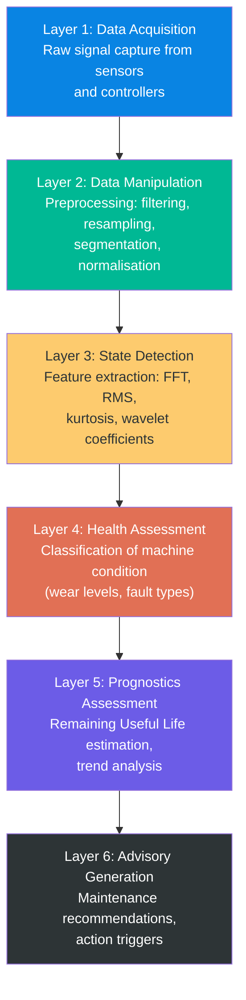

# ISO 13374 Standards Mapping — FORGE Alignment

> **Document Status:** Foundation Draft — v1.0  
> **Date:** 2026-05-12  
> **Purpose:** Map FORGE's five-layer architecture and research lifecycle to the ISO 13374-1 condition monitoring data processing chain  
> **Authority:** ISO 13374-1:2003, ISO 13374-2:2007

---

## 1. Overview

ISO 13374 defines a six-layer data processing chain for condition monitoring and diagnostics of machines. This document maps FORGE's architecture to this standard, ensuring that every experiment, dataset, and technique note is traceable to an internationally recognised framework.

This mapping is **advisory, not mandatory**. It provides a reference model for experiment design and helps researchers position their work within the broader condition monitoring standards landscape.

---

## 2. ISO 13374 Data Processing Chain



---

## 3. FORGE Layer ↔ ISO 13374 Mapping

| FORGE Layer | FORGE Content | ISO 13374 Layer(s) | Coverage Status |
|-------------|---------------|---------------------|-----------------|
| **Layer 1: Data Foundation** | Raw sensor data, HDF5 files, DVC-tracked datasets | Layer 1 (Data Acquisition) | ✅ Covered |
| **Layer 2: Knowledge Commons** | Technique Notes for signal processing methods | Layer 2 (Data Manipulation) | ✅ Covered |
| **Layer 3: Experiment Engine** | Feature extraction experiments, ML classification | Layer 3 (State Detection) + Layer 4 (Health Assessment) | ✅ Covered |
| **Layer 4: Portfolio Intelligence** | Technology Radar assessing RUL techniques | Layer 5 (Prognostics Assessment) | ⚠️ Partially covered (backlog only) |
| **Layer 5: Product & Delivery** | Customer-facing maintenance advisory tools | Layer 6 (Advisory Generation) | ⚠️ Future (no experiments yet) |

### Gap Analysis

| ISO Layer | Gap | Action Required |
|-----------|-----|-----------------|
| Layer 5: Prognostics | No RUL experiments executed yet | EXP-005+ (proposed in backlog as "Effects-based RUL") |
| Layer 6: Advisory | No maintenance recommendation system | Future module after validated RUL model exists |

---

## 4. Research Lifecycle ↔ ISO 13374 Mapping

| Research Lifecycle Stage | ISO 13374 Layer | What Happens |
|--------------------------|-----------------|--------------|
| 7–8: Setup & Data Collection | Layer 1 | Raw signals captured from gantry sensors |
| 9–10: Documentation & Storage | Layer 1→2 | Metadata written, data preprocessed and versioned |
| 11: Analysis (preprocessing) | Layer 2 | Filtering, resampling, segmentation applied |
| 11: Analysis (features) | Layer 3 | FFT, RMS, kurtosis, wavelets extracted |
| 12: Interpretation | Layer 4 | Wear state classification, fault type identification |
| 13–14: Verification & Evaluation | Layer 5 | RUL prediction validated, production readiness assessed |
| 14: Evaluation (advisory) | Layer 6 | Maintenance recommendations generated |

---

## 5. Condition Monitoring Feature Reference

Standard signal features used in condition monitoring, mapped to ISO 13374 layers, with implementation tools.

### Time-Domain Features (ISO Layer 2–3)

| Feature | Formula/Method | ISO Layer | Python Tool | Use Case |
|---------|---------------|-----------|-------------|----------|
| **RMS** | √(1/N · Σxᵢ²) | Layer 2 | `numpy.sqrt(numpy.mean(x**2))` | Overall vibration level |
| **Peak-to-Peak** | max(x) - min(x) | Layer 2 | `numpy.ptp(x)` | Signal amplitude range |
| **Crest Factor** | peak / RMS | Layer 2 | Custom | Early bearing fault detection |
| **Kurtosis** | Normalised 4th moment | Layer 3 | `scipy.stats.kurtosis(x)` | Impulsive fault detection |
| **Skewness** | Normalised 3rd moment | Layer 3 | `scipy.stats.skew(x)` | Asymmetric fault patterns |

### Frequency-Domain Features (ISO Layer 2–3)

| Feature | Method | ISO Layer | Python Tool | Use Case |
|---------|--------|-----------|-------------|----------|
| **FFT Spectrum** | Fast Fourier Transform | Layer 2 | `numpy.fft.fft(x)` | Frequency content analysis |
| **Power Spectral Density** | Welch's method | Layer 2 | `scipy.signal.welch(x)` | Energy distribution across frequencies |
| **Spectral Centroid** | Weighted mean frequency | Layer 3 | `librosa.feature.spectral_centroid` | Dominant frequency shift |
| **Spectral Entropy** | Shannon entropy of PSD | Layer 3 | Custom | Signal complexity/randomness |

### Time-Frequency Features (ISO Layer 2–3)

| Feature | Method | ISO Layer | Python Tool | Use Case |
|---------|--------|-----------|-------------|----------|
| **STFT** | Short-Time Fourier Transform | Layer 2 | `scipy.signal.stft(x)` | Time-varying frequency content |
| **Wavelet Coefficients** | Continuous/Discrete WT | Layer 2 | `pywt.wavedec(x)` | Multi-resolution analysis |
| **Envelope Analysis** | Hilbert transform | Layer 3 | `scipy.signal.hilbert(x)` | Bearing fault harmonics |
| **MFCC** | Mel-Frequency Cepstral Coefficients | Layer 3 | `librosa.feature.mfcc` | Spectral shape features |

### Classification & Prognostic Features (ISO Layer 4–5)

| Feature/Method | ISO Layer | Python Tool | Use Case |
|----------------|-----------|-------------|----------|
| **SVM Classifier** | Layer 4 | `sklearn.svm.SVC` | Wear state classification |
| **Random Forest** | Layer 4 | `sklearn.ensemble.RandomForestClassifier` | Multi-class fault detection |
| **1D-CNN** | Layer 4 | `torch.nn.Conv1d` | Raw signal fault classification |
| **Autoencoder** | Layer 4 | `torch.nn.Module` | Anomaly detection (deviation from baseline) |
| **LSTM / Transformer** | Layer 5 | `torch.nn.LSTM` | RUL time-series prediction |
| **Degradation Trend Analysis** | Layer 5 | `scipy.optimize.curve_fit` | Health indicator trend fitting |

---

## 6. Experiment Template — ISO 13374 Section

Add the following optional section to every Experiment Proposal:

```markdown
## ISO 13374 Compliance (Optional)

**Target Layer(s):** [1-6, select all that apply]

| ISO Layer | Input | Output | Tool/Method |
|-----------|-------|--------|-------------|
| Layer [N] | [describe input data] | [describe output] | [tool used] |

**Standards Referenced:**
- [ ] ISO 13374-1:2003 (Data processing chain)
- [ ] ISO 17359:2018 (Parameter selection)
- [ ] ISO 13379-1:2012 (Data interpretation)
- [ ] ISO 10816/20816 (Vibration evaluation)
```

---

## 7. Compliance Mapping to Other Standards

| Standard | Relevance to FORGE | Where Addressed |
|----------|---------------------|-----------------|
| **ISO 13374-1:2003** | Data processing chain | This document |
| **ISO 17359:2018** | Parameter selection for monitoring | Experiment Proposals (signal justification) |
| **ISO 13379-1:2012** | Data interpretation techniques | Technique Notes (feature extraction methods) |
| **ISO 10816/20816** | Vibration severity thresholds | Data analysis (threshold benchmarking) |
| **ISO 55000:2014** | Asset management context | Vision document (business justification) |
| **IEC 61800-series** | Drive system standards | Hardware setup documentation |
| **FAIR Principles** | Data governance | SOP-007, metadata templates |
| **ISO 9001:2015** | Quality management | Document control via Git, review via PR |

---

## Cross-References

| Related Document | Relationship |
|------------------|-------------|
| [08_research_lifecycle.md](./08_research_lifecycle.md) | Research stages mapped to ISO layers |
| [07_indusy_standard.md](./07_indusy_standard.md) | Full standard descriptions and compliance checklists |
| [TN-001-ISO-Feature-Extraction.md](../knowledge-commons/technique-notes/TN-001-ISO-Feature-Extraction.md) | Practical technique note for ISO-aligned feature extraction |
| [SOP-007-FAIR-data-compliance.md](../sops/SOP-007-FAIR-data-compliance.md) | FAIR data compliance procedures |

---

*This is a reference document. Update it when new ISO layers are covered by FORGE experiments or when new standards become relevant.*
