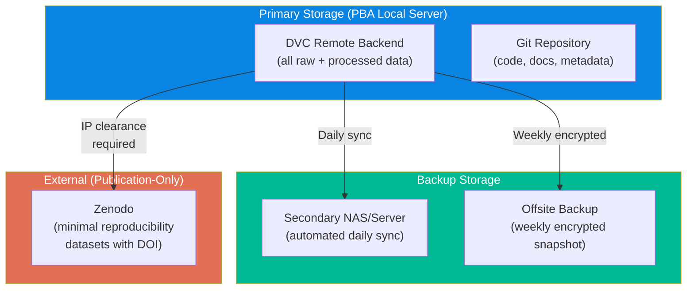
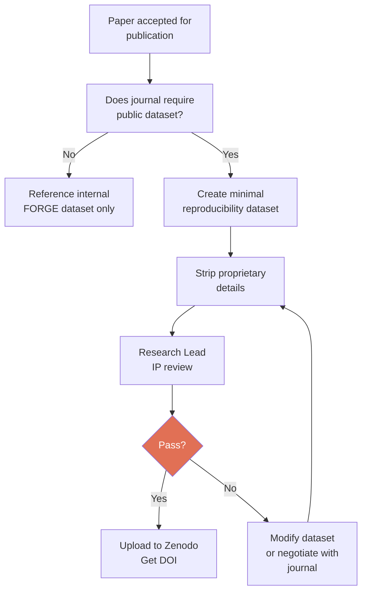
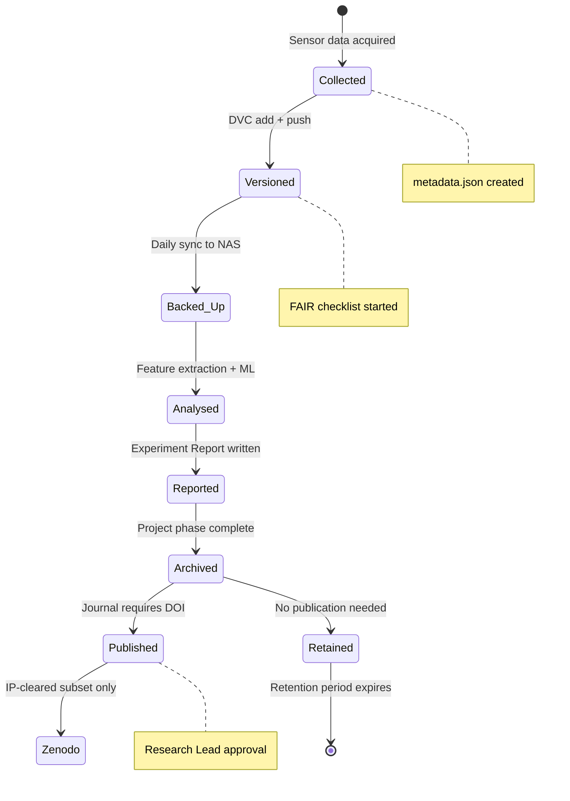

# Module 6: Data Governance & IP Protection

> **Document Status:** Foundation Draft — v1.0  
> **Author:** PBA Research Operations  
> **Date:** 2026-05-12  
> **Purpose:** Define data storage, access control, IP protection, and backup policies for all FORGE research data  
> **Context:** All research data is PBA property. Data is stored locally on PBA infrastructure. External publication of datasets requires explicit IP clearance.

---

## Table of Contents

1. [Core Principle](#1-core-principle)
2. [Data Classification](#2-data-classification)
3. [Storage Architecture](#3-storage-architecture)
4. [Access Control](#4-access-control)
5. [Backup & Disaster Recovery](#5-backup--disaster-recovery)
6. [Data Sharing Rules](#6-data-sharing-rules)
7. [External Publication Policy](#7-external-publication-policy)
8. [Data Lifecycle](#8-data-lifecycle)
9. [Compliance Checklist](#9-compliance-checklist)

---

## 1. Core Principle

> **All research data generated under FORGE is the intellectual property of PBA.** Data is stored on PBA-controlled infrastructure and is not shared externally without explicit approval from the Research Lead.

This principle exists because:
- PBA funds the research, equipment, and infrastructure
- Data contains proprietary information about PBA precision gantry systems
- Competitors could gain commercial advantage from raw experimental data
- IP protection is essential for future commercialisation of predictive maintenance products

---

## 2. Data Classification

| Classification | Description | Examples | Access Level |
|---------------|-------------|----------|-------------|
| **PBA Confidential** | Proprietary data that provides competitive advantage | Raw sensor data, trained model weights, customer machine configurations | PBA team only |
| **PBA Internal** | Data shared within the FORGE project team (including university partners under NDA) | Processed feature matrices, experiment results, analysis code | FORGE team (NDA required) |
| **Public — Approved** | Data cleared for external publication | Minimal datasets for paper reproducibility, methodology descriptions | Public (after IP clearance) |

### Classification Rules

1. **Default classification is PBA Internal** — all data starts here
2. **Upgrade to Confidential** when data contains: customer-specific configurations, proprietary fault thresholds, model weights with commercial value
3. **Downgrade to Public** only after: Research Lead review + IP clearance + stripping of proprietary details

---

## 3. Storage Architecture



### Infrastructure Requirements

| Component | Specification | Purpose |
|-----------|--------------|---------|
| **Primary Server** | Linux server with RAID storage, accessible via SSH/SFTP | DVC remote backend, primary data store |
| **Secondary NAS** | Network-attached storage on separate physical hardware | Automated daily backup |
| **Offsite Backup** | Encrypted external drive or cloud storage (PBA-controlled) | Disaster recovery |
| **GitHub** | Private repository (PBA organisation) | Code, documentation, DVC pointer files |

### DVC Remote Configuration

```bash
# Primary remote (PBA local server)
dvc remote add -d pba-primary ssh://[server-ip]/data/forge-dvc
dvc remote modify pba-primary user [username]

# Backup remote (secondary NAS)
dvc remote add pba-backup ssh://[nas-ip]/backup/forge-dvc

# Push to both remotes
dvc push
dvc push -r pba-backup
```

---

## 4. Access Control

### Access Levels

| Role | Git Repo | DVC Primary | DVC Backup | Zenodo |
|------|----------|-------------|------------|--------|
| **Research Lead (PBA)** | Admin | Full access | Full access | Admin |
| **PBA Software Team** | Write | Full access | Read | — |
| **University Student** | Write (PR-based) | Read + Write (assigned datasets) | No access | No access |
| **Academic Supervisor** | Read | Read (via student) | No access | No access |
| **External Reviewer** | No access | No access | No access | Public only |

### Access Management Rules

1. **Student access is time-bounded** — credentials expire at project end date
2. **Students cannot delete data** — DVC remote permissions are write-append only
3. **Post-graduation:** Student access downgraded to read-only, then revoked after 30 days
4. **NDA required** before any repository access is granted
5. **Access audit** — Review all active credentials quarterly

### Credential Management

| Credential | Storage | Rotation |
|-----------|---------|----------|
| GitHub SSH keys | User's machine | On role change or annual |
| DVC remote SSH keys | User's machine | On role change or annual |
| Server admin credentials | PBA IT (password manager) | Quarterly |
| Zenodo API token | Research Lead only | Annual |

---

## 5. Backup & Disaster Recovery

### 3-2-1 Backup Rule

> **3 copies** of all data, on **2 different media types**, with **1 copy offsite**.

| Copy | Location | Medium | Frequency | Verification |
|------|----------|--------|-----------|-------------|
| **Copy 1 (Primary)** | PBA local server | RAID array | Real-time | DVC integrity checks |
| **Copy 2 (On-site backup)** | Secondary NAS | Separate hardware | Daily (automated) | Weekly spot-check |
| **Copy 3 (Off-site)** | Encrypted external or cloud | Different physical location | Weekly | Monthly restore test |

### Backup Automation

```bash
# Daily sync script (cron job on primary server)
#!/bin/bash
rsync -avz --delete /data/forge-dvc/ [nas-ip]:/backup/forge-dvc/
echo "$(date): Backup completed" >> /var/log/forge-backup.log

# Weekly offsite snapshot
tar -czf forge-$(date +%Y%m%d).tar.gz /data/forge-dvc/
gpg --encrypt --recipient [pba-admin] forge-$(date +%Y%m%d).tar.gz
# Transfer encrypted archive to offsite location
```

### Disaster Recovery Plan

| Scenario | Recovery From | RTO (Recovery Time) | RPO (Recovery Point) |
|----------|--------------|---------------------|---------------------|
| Primary server failure | Secondary NAS | 4 hours | < 24 hours (daily sync) |
| Both on-site failures | Offsite backup | 24 hours | < 7 days (weekly snapshot) |
| Accidental deletion | DVC version history / NAS | 1 hour | < 24 hours |
| Repository corruption | Git remote + DVC cache | 2 hours | Last push |

---

## 6. Data Sharing Rules

### What Can Be Shared (Under NDA)

| Data Type | Shareable With University? | Conditions |
|-----------|---------------------------|------------|
| Raw sensor data | ✅ Yes (via DVC access) | Under NDA, time-bounded access |
| Processed features | ✅ Yes | Under NDA |
| Analysis code | ✅ Yes (via Git) | Under NDA, PBA retains ownership |
| Trained model weights | ❌ No | PBA Confidential — architecture only |
| Model architecture descriptions | ✅ Yes | For thesis and publications |
| Technique Notes | ✅ Yes | After internal review |
| Dead-End entries | ✅ Yes | After internal review |

### What Cannot Be Shared

- Customer machine configurations or serial numbers
- Production deployment parameters or thresholds
- Model weights trained on production data
- PBA internal business strategy or roadmaps
- Raw data from customer sites (if applicable in future)

---

## 7. External Publication Policy

### When Data Goes to Zenodo

Zenodo is used **only** when a peer-reviewed publication requires a publicly accessible dataset for reproducibility. The process:



### Minimum Viable Dataset Principle

When Zenodo publication is required:
- Upload the **smallest dataset** that enables reproducibility
- Remove all unnecessary channels, metadata, and context
- Aggregate or downsample where possible without losing scientific validity
- Never upload full raw datasets — only processed subsets

---

## 8. Data Lifecycle



### Retention Policy

| Data Type | Retention Period | After Retention |
|-----------|-----------------|-----------------|
| Raw sensor data | Project lifetime + 5 years | Archive to cold storage |
| Processed/feature data | Project lifetime + 3 years | Archive or delete |
| Trained models | Project lifetime + 2 years | Archive weights; keep architecture docs |
| Experiment Reports | Permanent | Part of knowledge commons |
| Dead-End entries | Permanent | Part of knowledge commons |

---

## 9. Compliance Checklist

### For Every New Dataset

- [ ] Classification assigned (Confidential / Internal / Public-Approved)
- [ ] `metadata.json` created (per [METADATA_TEMPLATE](../data/METADATA_TEMPLATE.md))
- [ ] DVC add + push to primary remote
- [ ] Backup sync confirmed (check NAS)
- [ ] Access permissions verified (who can access this dataset?)
- [ ] FAIR checklist completed in Experiment Report

### Quarterly Audit

- [ ] Review all active access credentials
- [ ] Verify backup integrity (restore test on random dataset)
- [ ] Check that no data has been shared externally without approval
- [ ] Review Zenodo publications (are they minimal and IP-safe?)
- [ ] Update access for any personnel changes (new/departing team members)

### On Student Departure

- [ ] All student data commits verified and pushed
- [ ] Student DVC credentials revoked
- [ ] Student GitHub access downgraded to read-only (then revoked after 30 days)
- [ ] Knowledge transfer session completed
- [ ] No copies of PBA Confidential data remain on student machines

---

## Cross-References

| Related Document | Relationship |
|------------------|-------------|
| [04_collaboration_protocol.md](./04_collaboration_protocol.md) | IP ownership framework and NDA requirements |
| [SOP-007-FAIR-data-compliance.md](../sops/SOP-007-FAIR-data-compliance.md) | FAIR metadata and data storage procedures |
| [data/METADATA_TEMPLATE.md](../data/METADATA_TEMPLATE.md) | Metadata template for all datasets |
| [SOP-001-onboarding.md](../sops/SOP-001-onboarding.md) | IP awareness briefing during onboarding |

---

*This document defines PBA's data governance and IP protection policies for all FORGE research. Review annually or when data handling requirements change.*
