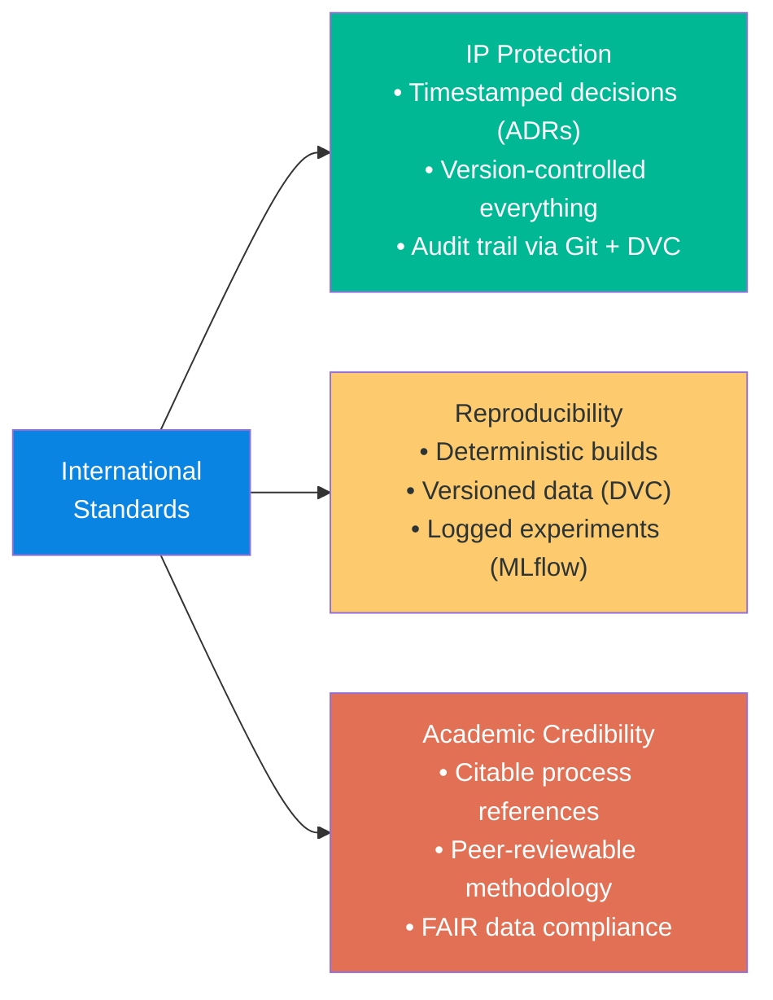
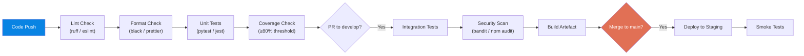
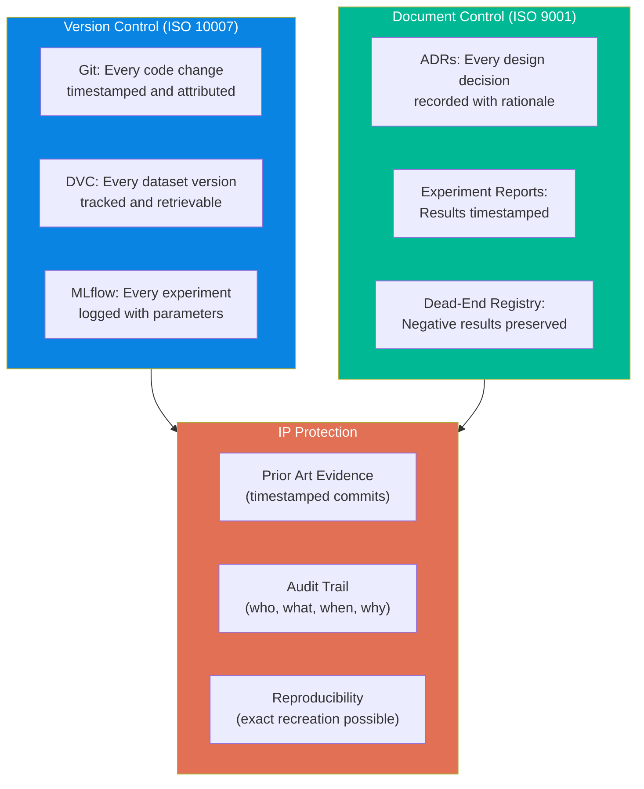
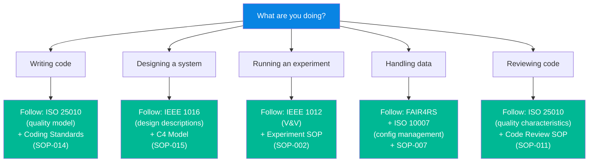

# Software Engineering Standards for Academic Research & Development

> **Document Status:** Foundation Draft — v1.0  
> **Author:** Research Operations  
> **Date:** 2026-05-17  
> **Audience:** Fresh graduate students and new contributors who need to understand, apply, and cite software engineering standards in an R&D context  
> **Purpose:** Provide a comprehensive, presentation-quality reference mapping international standards to FORGE processes, with practical guidance for every stage of the software lifecycle

---

## Table of Contents

1. [Purpose & Philosophy](#1-purpose--philosophy)
2. [Standards Landscape — Complete Reference](#2-standards-landscape--complete-reference)
3. [Standards Traceability Matrix](#3-standards-traceability-matrix)
4. [Git Workflow Standards](#4-git-workflow-standards)
5. [Code Review & Quality Model](#5-code-review--quality-model)
6. [CI/CD & Automation Standards](#6-cicd--automation-standards)
7. [IP Protection & Standards Compliance](#7-ip-protection--standards-compliance)
8. [Process Maturity Self-Assessment](#8-process-maturity-self-assessment)
9. [Quick Reference Cards](#9-quick-reference-cards)

---

## 1. Purpose & Philosophy

### 1.1 Why Standards Matter in R&D Software

Software in research is often treated as disposable — "just scripts" that produce results for a paper and are then abandoned. This approach fails when:

- A student graduates and nobody can reproduce their results
- A model moves from research to production and the code is unmaintainable
- An IP dispute arises and there is no audit trail of decisions
- A reviewer questions the validity of results and the data pipeline is undocumented

**Standards are not bureaucracy — they are insurance.** They protect the research, the researchers, and the organisation's investment.

### 1.2 Following a Standard vs. Citing a Standard

There is a critical difference:

| | Following a Standard | Citing a Standard |
|---|---|---|
| **What it means** | Your process demonstrably implements the standard's requirements | You reference the standard in your documentation |
| **Value** | Provides actual protection and quality assurance | Provides academic credibility and traceability |
| **Example** | Your CI/CD pipeline enforces code review before merge (following IEEE 730) | Your SOP document states "aligned with IEEE 730" |
| **FORGE approach** | Do both — implement the practice AND cite the standard it derives from |

### 1.3 How Standards Protect IP, Ensure Reproducibility, and Add Academic Credibility



---

## 2. Standards Landscape — Complete Reference

### 2.1 Software Lifecycle Standards

#### ISO/IEC/IEEE 12207:2017 — Software Lifecycle Processes

- **What it is:** The international standard defining all processes involved in software development, from concept through retirement. Organises activities into agreement, organisational, technical management, and technical processes.
- **Why it matters:** Provides a comprehensive framework for managing the full lifecycle of research software — not just coding, but requirements, design, testing, and maintenance.
- **How FORGE implements it:** The FORGE research lifecycle ([08_research_lifecycle.md](./08_research_lifecycle.md)) maps its 15 stages to ISO 12207 process categories. SOPs 001–009 implement specific lifecycle processes.

#### ISO/IEC/IEEE 15288:2023 — System Lifecycle Processes

- **What it is:** The system-level equivalent of ISO 12207, covering the full lifecycle of systems (not just software). Includes hardware, data, people, and processes.
- **Why it matters:** FORGE's predictive maintenance system includes sensors, data pipelines, ML models, and deployment infrastructure — it is a *system*, not just software.
- **How FORGE implements it:** The five-layer architecture ([02_knowledge_architecture.md](./02_knowledge_architecture.md)) maps FORGE's system components across layers, from knowledge gathering to product delivery.

### 2.2 Software Quality Standards

#### ISO/IEC 25010:2023 — Software Quality Model (SQuaRE)

- **What it is:** Defines eight quality characteristics for software products: functional suitability, performance efficiency, compatibility, usability, reliability, security, maintainability, and portability.
- **Why it matters:** Provides a shared vocabulary for quality. When a code review says "this is not maintainable," ISO 25010 defines exactly what maintainability means: modularity, reusability, analysability, modifiability, and testability.
- **How FORGE implements it:** Code review checklists (SOP-011) map review criteria to ISO 25010 quality characteristics. The Definition of Done includes quality gates derived from these characteristics.

#### IEEE 730-2014 — Software Quality Assurance

- **What it is:** Defines processes for planning and performing software quality assurance activities, including reviews, audits, testing, and process monitoring.
- **Why it matters:** Establishes the principle that quality must be *planned and built in*, not tested in after the fact.
- **How FORGE implements it:** CI/CD pipelines (SOP-010) implement automated quality gates — no code merges without passing linting, tests, and review. Monthly reviews (SOP-005) serve as quality audits.

### 2.3 Requirements & Design Standards

#### ISO/IEC/IEEE 29148:2018 — Requirements Engineering

- **What it is:** Defines processes for eliciting, analysing, specifying, and validating requirements.
- **Why it matters:** In research, "requirements" are often vague research questions. This standard provides discipline for translating research goals into testable experiment proposals.
- **How FORGE implements it:** Experiment Proposals serve as requirements documents — each must state a hypothesis, success criteria, and acceptance criteria before execution begins.

#### IEEE 1016:2009 — Software Design Descriptions

- **What it is:** Defines the content and organisation of software design descriptions, including viewpoints, views, and design elements.
- **Why it matters:** Ensures that design decisions are captured in a structured, reviewable format rather than existing only in someone's head.
- **How FORGE implements it:** Architecture Decision Records (ADRs) in `knowledge-commons/decision-records/` capture design decisions. Architecture documentation follows the C4 model (SOP-015).

### 2.4 Verification & Validation Standards

#### IEEE 1012:2016 — Software Verification & Validation

- **What it is:** Defines processes for determining whether software products of a given activity conform to requirements and whether the software satisfies its intended use.
- **Why it matters:** Establishes the distinction between verification ("did we build it right?") and validation ("did we build the right thing?"). Both are critical in ML systems where a model can be technically correct but practically useless.
- **How FORGE implements it:** Experiment Reports serve as validation documents. CI/CD pipelines perform verification. The Go/No-Go scoring rubric ([03_portfolio_architecture.md](./03_portfolio_architecture.md)) provides validation criteria.

### 2.5 Information Security Standards

#### ISO/IEC 27001:2022 — Information Security (Annex A 8.25: Secure SDLC)

- **What it is:** The international standard for information security management systems. Annex A, control 8.25 specifically addresses secure software development.
- **Why it matters:** FORGE handles proprietary sensor data, trained ML models, and IP-sensitive research. Security is not optional.
- **How FORGE implements it:** Data classification (Confidential/Internal/Public) in [10_data_governance.md](./10_data_governance.md). Access control matrices for Git and DVC. NDA requirements before repository access. Secrets management policies in coding standards (SOP-014).

### 2.6 Configuration Management Standards

#### ISO 10007:2017 — Configuration Management

- **What it is:** Provides guidance on configuration management within an organisation, covering identification, control, status accounting, and audit.
- **Why it matters:** In a research environment with multiple experiments running in parallel, configuration management prevents the "works on my machine" problem and ensures every result is traceable to a specific configuration.
- **How FORGE implements it:** Git for code versioning, DVC for data versioning, MLflow for experiment configuration logging. Every experiment logs its exact configuration (data version, code version, hyperparameters).

#### Conventional Commits 1.0.0

- **What it is:** A specification for adding human and machine-readable meaning to commit messages, using structured prefixes like `feat:`, `fix:`, `docs:`.
- **Why it matters:** Enables automated changelog generation, semantic versioning, and makes Git history searchable and meaningful.
- **How FORGE implements it:** All commits follow Conventional Commits format (SOP-012). CI pipelines reject non-compliant commit messages.

#### Semantic Versioning 2.0.0 (SemVer)

- **What it is:** A versioning scheme (MAJOR.MINOR.PATCH) that communicates the nature of changes to downstream consumers.
- **Why it matters:** When research code becomes a production module used by other systems, version numbers must communicate whether changes are breaking, additive, or corrective.
- **How FORGE implements it:** All production releases follow SemVer. Breaking changes trigger MAJOR version bumps. Conventional Commits `feat:` triggers MINOR, `fix:` triggers PATCH.

### 2.7 Process Maturity

#### CMMI V3.0 — Capability Maturity Model Integration

- **What it is:** A process improvement framework that defines five maturity levels (Initial → Managed → Defined → Quantitatively Managed → Optimising).
- **Why it matters:** Provides a roadmap for systematically improving development practices from ad-hoc to disciplined.
- **How FORGE implements it:** See [Section 8](#8-process-maturity-self-assessment) for the current maturity assessment and improvement roadmap.

### 2.8 Academic Research Software Standards

#### FAIR4RS Principles — FAIR for Research Software

- **What it is:** Extension of the FAIR (Findable, Accessible, Interoperable, Reusable) data principles specifically to research software. Endorsed by the Research Data Alliance.
- **Why it matters:** Ensures that research software is treated as a first-class scholarly output, not a disposable artefact.
- **How FORGE implements it:** Git repositories are the primary "findable" mechanism. CONTRIBUTING.md ensures accessibility. Standard languages and formats ensure interoperability. Licensing and documentation ensure reusability.

#### JOSS (Journal of Open Source Software) Guidelines

- **What it is:** Publication guidelines for research software papers, emphasising documentation, testing, community guidelines, and functionality.
- **Why it matters:** If FORGE produces software tools worthy of publication, JOSS guidelines define the minimum bar for quality.
- **How FORGE implements it:** Repository structure includes README, CONTRIBUTING.md, tests, and documentation — all JOSS requirements.

#### CFF (Citation File Format) — Software Citation Standard

- **What it is:** A standardised file format (`CITATION.cff`) for providing citation metadata for software.
- **Why it matters:** Makes it easy for others to correctly cite your software in academic publications.
- **How FORGE implements it:** `CITATION.cff` files should be included in any FORGE repository intended for external release.

---

## 3. Standards Traceability Matrix

This matrix maps every FORGE SOP and process to the international standards it implements or aligns with.

### 3.1 SOP-to-Standard Mapping

| FORGE Process | Primary Standard | Clause/Section | Implementation Mechanism |
|---|---|---|---|
| **SOP-001: Onboarding** | ISO 12207:2017 | §6.3.6 Human resource management | Structured onboarding checklist with reading list, tool access, and mentoring |
| **SOP-002: Running Experiments** | ISO 12207:2017 | §6.4.8 Measurement | Experiment proposals with hypothesis, metrics, success criteria |
| **SOP-003: Technology Radar** | ISO 12207:2017 | §6.4.9 Quality assurance | Quarterly technology assessment with evidence-based ring transitions |
| **SOP-004: Dead-End Documentation** | IEEE 730-2014 | §5.2 Process assurance | Mandatory failure documentation with root cause analysis |
| **SOP-005: Monthly Review** | ISO 12207:2017 | §6.4.10 Decision management | Structured review with KPIs, portfolio assessment, and documented decisions |
| **SOP-006: Knowledge Retrieval** | ISO 10007:2017 | §5.4 Configuration status accounting | Mandatory search of prior work before new experiments |
| **SOP-007: FAIR Data Compliance** | FAIR4RS, ISO 10007 | FAIR Principles, §5.2 Configuration identification | Metadata templates, DOI assignment, data versioning |
| **SOP-008: Collaboration Communication** | ISO 12207:2017 | §6.1.2 Stakeholder requirements definition | Defined communication channels, SLAs, decision logging |
| **SOP-009: Research Lifecycle** | ISO 13374-1:2003 | All layers | 15-stage lifecycle mapped to ISO 13374 data processing chain |
| **SOP-010: Software Development** | ISO 12207:2017 | §6.4.5 Implementation | Development workflow, branching strategy, Definition of Done |
| **SOP-011: Code Review** | ISO 25010:2023 | All quality characteristics | Review checklists mapped to quality model |
| **SOP-012: Git Workflow** | ISO 10007:2017 | §5 Configuration management | Branch strategy, Conventional Commits, Semantic Versioning |
| **SOP-013: ML Model Development** | ISO 12207:2017 | §6.4.5 Implementation, §6.4.7 Transition | MLOps lifecycle: data → experiment → production |
| **SOP-014: Coding Standards** | ISO 25010:2023 | §4.2 Maintainability | Language-specific conventions, forbidden practices, secrets management |
| **SOP-015: Architecture Design** | IEEE 1016:2009 | All viewpoints | C4 model, design review process, ADR workflow |

### 3.2 Quality Characteristic Mapping

| ISO 25010 Characteristic | Sub-characteristic | FORGE Implementation |
|---|---|---|
| **Functional Suitability** | Functional correctness | Unit tests, acceptance criteria in experiment proposals |
| **Performance Efficiency** | Time behaviour | Inference latency requirements (≤200ms per prediction) |
| **Compatibility** | Interoperability | Standard data formats (HDF5, Parquet, CSV), Dublin Core metadata |
| **Usability** | Operability | Onboarding SOP, domain glossary, CONTRIBUTING.md |
| **Reliability** | Fault tolerance | Dead-end registry, pre-mortem analysis, 3-2-1 backup rule |
| **Security** | Confidentiality | Data classification, access control matrices, NDA requirements |
| **Maintainability** | Modularity | Function limits (50 lines), file limits (500 lines), single responsibility |
| **Maintainability** | Testability | Test coverage requirements (80%), test-driven experiment design |
| **Portability** | Adaptability | Docker containerisation, environment-variable configuration |

---

## 4. Git Workflow Standards

### 4.1 Conventional Commits Specification

All commits in FORGE repositories must follow the [Conventional Commits 1.0.0](https://www.conventionalcommits.org/) specification.

**Format:**
```
<type>(<scope>): <description>

[optional body]

[optional footer(s)]
```

**Commit Types:**

| Type | When to Use | Version Bump |
|---|---|---|
| `feat` | A new feature or capability | Minor (1.x.0) |
| `fix` | A bug fix | Patch (1.0.x) |
| `docs` | Documentation changes only | None |
| `test` | Adding or updating tests | None |
| `refactor` | Code restructuring without behaviour change | None |
| `perf` | Performance improvement | Patch |
| `ci` | CI/CD pipeline changes | None |
| `chore` | Build process, dependency updates, tooling | None |
| `research` | Experimental work on `research/*` branches only | None |

**Standards Basis:** ISO 10007:2017 (Configuration Management) requires configuration identification and change tracking. Conventional Commits implements this at the atomic commit level.

### 4.2 Semantic Versioning

All production releases follow [Semantic Versioning 2.0.0](https://semver.org/):

```
MAJOR.MINOR.PATCH

MAJOR: Breaking changes (API changes, incompatible data format changes)
MINOR: New features (backward-compatible additions)
PATCH: Bug fixes (backward-compatible corrections)
```

### 4.3 Branch Strategy

```
main          ← Production-ready code only. Protected branch.
│
develop       ← Integration branch. Features merge here first.
│
├── feature/[ticket-id]-[description]
├── fix/[ticket-id]-[description]
├── research/[researcher]-[topic]
└── hotfix/[ticket-id]-[description]
```

**Standards Basis:** ISO 10007:2017 §5.3 (Configuration control) requires that changes are evaluated, approved, and tracked before implementation. Branch protection rules implement configuration control.

---

## 5. Code Review & Quality Model

### 5.1 ISO 25010 Quality Characteristics Mapped to Review Checklists

Every code review evaluates the code against ISO 25010 quality characteristics:

| Quality Characteristic | Review Question | Priority |
|---|---|---|
| **Functional Correctness** | Does the code do what the requirements describe? | 🔴 Tier 1 — Blocks merge |
| **Security** | Are there hardcoded credentials, unsanitised inputs, or data leaks? | 🔴 Tier 1 — Blocks merge |
| **Testability** | Are there tests for the new behaviour? Do they test logic, not just invocation? | 🔴 Tier 1 — Blocks merge |
| **Analysability** | Can a new developer understand this code without asking the author? | 🟡 Tier 2 — Blocks for PRs >50 lines |
| **Modifiability** | Are functions small (≤50 lines), parameters few (≤4), responsibilities single? | 🟡 Tier 2 — Blocks for PRs >50 lines |
| **Reusability** | Is duplicated logic extracted? Are modules independent? | 🟢 Tier 3 — Check for architecture PRs |

### 5.2 Clean Code Principles as Maintainability Implementation

Robert C. Martin's Clean Code principles directly implement ISO 25010's maintainability characteristic:

| Clean Code Principle | ISO 25010 Sub-characteristic | FORGE Rule |
|---|---|---|
| Meaningful names | Analysability | Variable names express intent; no abbreviations requiring domain knowledge |
| Small functions | Modularity | Functions ≤50 lines; ≤4 parameters |
| Single responsibility | Modularity | One function does one thing; one class has one reason to change |
| DRY (Don't Repeat Yourself) | Reusability | Duplicated logic extracted into shared functions |
| YAGNI (You Aren't Gonna Need It) | Modifiability | Build what is required, nothing more |
| Comments explain "why" | Analysability | Code explains "what"; comments explain "why" |

### 5.3 Conventional Comments for Async Collaboration

All code review comments use the [Conventional Comments](https://conventionalcomments.org/) format. This removes ambiguity in async remote reviews:

| Label | Meaning | Blocks Merge? |
|---|---|---|
| `praise:` | Something done well | No |
| `nit:` | Tiny style preference | No |
| `suggestion:` | Improvement, optional | No |
| `issue:` | Correctness or design problem | **Yes** |
| `question:` | Reviewer needs clarification | **Yes** |
| `thought:` | Future idea, no action now | No |
| `blocked:` | PR cannot proceed | **Yes** |

---

## 6. CI/CD & Automation Standards

### 6.1 Automated Quality Gates as IEEE 730 SQA Implementation

IEEE 730 requires that quality assurance activities be planned and executed systematically. FORGE implements this through automated CI/CD pipelines:



### 6.2 Testing Pyramid Standards Basis

| Test Type | Purpose | Standard Basis | Minimum Requirement |
|---|---|---|---|
| **Unit Tests** | Test individual functions/classes | IEEE 1012:2016 (V&V) | 80% line coverage |
| **Integration Tests** | Test module interactions | IEEE 1012:2016 (V&V) | Key integration paths |
| **System/E2E Tests** | Test full user workflows | IEEE 1012:2016 (V&V) | Happy path + 2 edge cases |
| **ML-Specific Tests** | Determinism, shape, regression | FAIR4RS (Reproducibility) | Mandatory for all ML code |

### 6.3 Security Scanning as ISO 27001 Annex A 8.25 Implementation

Automated security scanning in CI/CD pipelines implements ISO 27001's requirement for secure development practices:

- **Static Analysis Security Testing (SAST):** `bandit` (Python), `eslint-plugin-security` (JavaScript)
- **Dependency Vulnerability Scanning:** `pip-audit` (Python), `npm audit` (Node.js)
- **Secrets Detection:** `gitleaks` or `detect-secrets` in pre-commit hooks
- **Container Scanning:** `trivy` for Docker image vulnerabilities

---

## 7. IP Protection & Standards Compliance

### 7.1 How Following Standards Protects Intellectual Property



### 7.2 Version Control as Configuration Management (ISO 10007)

Every FORGE artefact is version-controlled:

| Artefact Type | Version Control Tool | ISO 10007 Requirement Met |
|---|---|---|
| Source code | Git | Configuration identification & control |
| Datasets | DVC (Data Version Control) | Configuration identification & status accounting |
| Experiments | MLflow | Configuration status accounting |
| Decisions | ADRs in Git | Configuration control (change management) |
| Documents | Git (Markdown) | Configuration identification & audit |

### 7.3 Pre-registration as IP Timestamp Mechanism

FORGE's "document first, present second" principle (from [02_knowledge_architecture.md](./02_knowledge_architecture.md)) serves as a pre-registration mechanism:

1. **Experiment Proposal** committed to Git before execution → timestamped hypothesis
2. **Experiment Report** committed after execution → timestamped results
3. **Dead-End Entry** committed when approach fails → timestamped negative result

Each Git commit provides a cryptographic hash and timestamp that serves as evidence of prior art.

---

## 8. Process Maturity Self-Assessment

### 8.1 Current CMMI Level Assessment

| CMMI Practice Area | Current Level | Evidence | Target |
|---|---|---|---|
| **Requirements Management** | Level 2 (Managed) | Experiment proposals define requirements per project | Level 3 |
| **Configuration Management** | Level 2 (Managed) | Git + DVC + MLflow in use | Level 3 |
| **Quality Assurance** | Level 2 (Managed) | Code review required; CI/CD being established | Level 3 |
| **Measurement & Analysis** | Level 1 (Initial) | Portfolio KPIs defined but not yet measured systematically | Level 2 |
| **Process Definition** | Level 2 (Managed) | SOPs documented and in use | Level 3 |
| **Training** | Level 1 (Initial) | Onboarding SOP exists; no formal training programme | Level 2 |

### 8.2 Roadmap to Level 3 (Defined)

Level 3 means that processes are not just documented per project, but standardised across the organisation:

| Milestone | Description | Target Date |
|---|---|---|
| **M1:** Complete SOP suite | All SOPs 001–015 documented and in active use | Current |
| **M2:** Automated enforcement | CI/CD enforces commit conventions, test coverage, and review requirements | Q3 2026 |
| **M3:** Metrics collection | Portfolio KPIs measured automatically from GitHub and MLflow data | Q4 2026 |
| **M4:** Process training | All new contributors complete a structured training programme | Q1 2027 |
| **M5:** Cross-project standardisation | Processes are identical across all FORGE projects | Q2 2027 |

---

## 9. Quick Reference Cards

### 9.1 "Which Standard Applies to What I'm Doing Right Now?" Decision Tree



### 9.2 One-Page Standard Summaries

| Standard | One-Line Summary | When You Need It |
|---|---|---|
| **ISO 12207** | How to manage the full software lifecycle | Project planning, SOP design |
| **ISO 25010** | Eight quality characteristics for software | Code review, quality assessment |
| **IEEE 730** | How to plan and execute quality assurance | CI/CD design, quality gates |
| **IEEE 1012** | How to verify and validate software | Testing strategy, experiment evaluation |
| **IEEE 1016** | How to document software design | Architecture documentation |
| **ISO 27001** | How to manage information security | Data governance, access control |
| **ISO 10007** | How to manage configuration | Version control, change management |
| **FAIR4RS** | How to make research software findable, accessible, interoperable, reusable | Data and software publishing |
| **Conventional Commits** | How to write meaningful commit messages | Every Git commit |
| **SemVer** | How to version releases meaningfully | Every release |
| **CMMI** | How to assess and improve process maturity | Annual self-assessment |

---

## Cross-References

| Related Document | Relationship |
|---|---|
| [02_knowledge_architecture.md](./02_knowledge_architecture.md) | Five-layer architecture implementing ISO 12207 lifecycle |
| [08_research_lifecycle.md](./08_research_lifecycle.md) | 15-stage lifecycle mapped to standards |
| [09_ISO13374_mapping.md](./09_ISO13374_mapping.md) | ISO 13374 condition monitoring standard mapping |
| [10_data_governance.md](./10_data_governance.md) | ISO 27001 and FAIR data implementation |
| [SOP-010-software-development.md](../sops/SOP-010-software-development.md) | Software development lifecycle SOP |
| [SOP-011-code-review.md](../sops/SOP-011-code-review.md) | Code review process SOP |
| [SOP-012-git-workflow.md](../sops/SOP-012-git-workflow.md) | Git and GitHub workflow SOP |
| [SOP-013-ml-model-development.md](../sops/SOP-013-ml-model-development.md) | ML lifecycle SOP |
| [SOP-014-coding-standards.md](../sops/SOP-014-coding-standards.md) | Language-specific coding conventions |
| [SOP-015-architecture-design.md](../sops/SOP-015-architecture-design.md) | Architecture documentation SOP |

---

*This document is a living reference. Update it when new standards are adopted, when FORGE processes change, or when the maturity assessment is revised. Every standard cited here should be accessible to team members via the shared reference library.*
