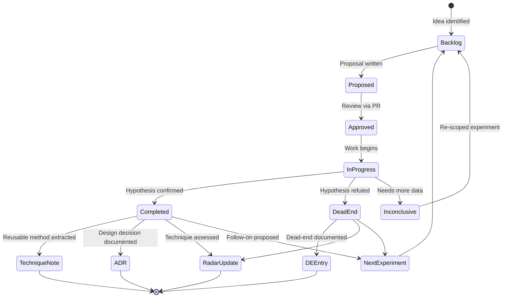
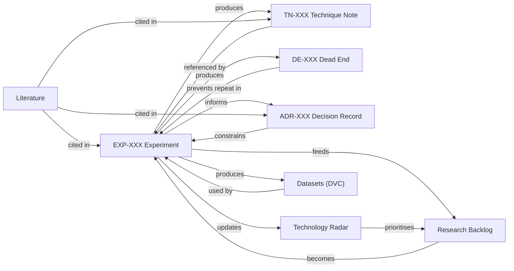

# Contributing to FORGE

> **FORGE** — Foundation for Organized Research Groups and Enterprise

This guide covers how to contribute to a FORGE-managed R&D project. Whether you are a university student, an internal team member, or a future collaborator, follow these procedures to ensure your work compounds into the shared knowledge base.

> **Full system design:** See [FORGE_Master_Design.md](./FORGE_Master_Design.md) for the complete architecture, standards, and governance framework.

---

## Onboarding (SOP-001)

> **Full SOP:** See [sops/SOP-001-onboarding.md](./sops/SOP-001-onboarding.md) for the complete checklist.
> **All SOPs:** The `sops/` folder contains standalone versions of all Standard Operating Procedures (SOP-001 through SOP-015).

### Day 1 — Orientation

- [ ] Obtain access to the GitHub repository
- [ ] Obtain access to the Mendeley group library (for academic references)
- [ ] Obtain access to the DVC data storage (for datasets and model checkpoints)
- [ ] Walk through the repository structure (30-minute session with the Research Coordinator)
- [ ] Read: `README.md`, this `CONTRIBUTING.md`, and `knowledge-commons/domain-glossary.md`
- [ ] Read: [FORGE_Master_Design.md](./FORGE_Master_Design.md) — at minimum §1 (Vision) and §3 (Architecture)
- [ ] Read: 3 completed Experiment Reports most relevant to your assigned track

### Week 1 — Shadowing

- [ ] Attend one active experiment review session
- [ ] Read 5 papers from the Mendeley library (assigned by supervisor)
- [ ] Review the Technology Radar current state (`technology-radar/radar.md`)
- [ ] Identify one existing Technique Note and verify you can reproduce it

### Week 2 — First Contribution

- [ ] Write your first Experiment Proposal (even if small) using the template in `experiments/`
- [ ] Get it reviewed via GitHub Pull Request
- [ ] Execute the experiment
- [ ] Write the Experiment Report

### Ongoing Expectations

- All work must be documented in FORGE **before** presenting results in any meeting
- Monthly contribution of at least one document (Technique Note, ADR, Dead-End entry, or Experiment Report)
- Any decision made in a meeting or chat must be captured in a document within 48 hours

---

## Running an Experiment (SOP-002)

### Before You Start

- [ ] Your Experiment Proposal exists in `experiments/active/` and is approved
- [ ] Required data is accessible (`dvc pull` confirmed, if applicable)
- [ ] Required hardware or lab access is confirmed

### During Execution

- [ ] Maintain a running Experiment Log (informal daily notes in the experiment folder)
- [ ] If your method deviates from the proposal, document the change and reason immediately
- [ ] If results suggest the experiment should stop early (failure confirmed or success exceeded), flag to your supervisor before stopping

### On Completion

- [ ] Write the Experiment Report within **5 working days** of completion
- [ ] Move your proposal from `experiments/active/` to `experiments/complete/`
- [ ] Commit all data with DVC and push
- [ ] Commit all code and push
- [ ] Complete FAIR compliance checklist in the report ([SOP-007](./sops/SOP-007-FAIR-data-compliance.md))
- [ ] Tag ISO 13374 layer(s) if applicable (see [FORGE_Master_Design.md §9.4](./FORGE_Master_Design.md))
- [ ] Update the Technology Radar if a technique was newly assessed
- [ ] Create a Dead-End entry (`DE-XXX`) if a dead end was reached
- [ ] Create a Technique Note (`TN-XXX`) if a reusable technique was established
- [ ] Post a 3-sentence summary in the team communication channel

---

## How an Experiment Flows Through FORGE



---

## How Document Types Connect

Every experiment produces documents that reference and feed into each other. This interconnection is what makes FORGE compound knowledge rather than scatter it.



---

## Document Types at a Glance

| Type | Code | When to Create | Template Location |
|---|---|---|---|
| Technique Note | `TN-XXX` | After a method has been successfully applied at least once | `knowledge-commons/technique-notes/_TEMPLATE_technique_note.md` |
| Architecture Decision Record | `ADR-XXX` | When a significant design or technical choice is made | `knowledge-commons/decision-records/_TEMPLATE_adr.md` |
| Dead-End Entry | `DE-XXX` | When an approach is tried and confirmed not to work | `knowledge-commons/dead-end-registry/_TEMPLATE_dead_end.md` |
| Experiment Proposal | `EXP-XXX-PROPOSAL` | Before any experiment begins | `experiments/_TEMPLATE_experiment_proposal.md` |
| Experiment Report | `EXP-XXX-REPORT` | After any experiment ends (win or lose) | `experiments/_TEMPLATE_experiment_report.md` |

---

## Git Workflow

> For full details, see [FORGE_Master_Design.md §10.4](./FORGE_Master_Design.md) — Git Workflow Standards.

1. Create a branch: `git checkout -b feat/short-description` or `git checkout -b exp/EXP-XXX-short-title`
2. Make small, focused commits following **Conventional Commits** format:
   ```
   feat(signal): add RMS feature extraction pipeline
   fix(data): correct sampling rate in metadata.json
   docs(TN-003): add wavelet decomposition technique note
   research(exp-004): initial FFT feature exploration
   ```
3. Push and open a Pull Request against the `develop` branch
4. Request at least one reviewer
5. Merge after approval (squash merge for feature branches, merge commit for releases)

---

## Key Rules

1. **Document first, present second** — No work is "done" until it is in the repository.
2. **Dead ends are mandatory** — No approach may be declared "we already tried that" without a `DE-XXX` entry to prove it.
3. **Templates are not optional** — Use the provided templates. They exist to ensure consistency and completeness.
4. **Conversations are ephemeral; documents are permanent** — Any decision from a meeting or chat must be captured in a document within 48 hours.
5. **FAIR compliance is expected** — All data must have metadata and be DVC-tracked ([SOP-007](./sops/SOP-007-FAIR-data-compliance.md)).
6. **IP awareness** — Understand the Collaboration Protocol ([FORGE_Master_Design.md §7](./FORGE_Master_Design.md)) before sharing any work externally.

---

## Compliance Checklists

Quick-reference checklists are available in [FORGE_Master_Design.md Appendix A](./FORGE_Master_Design.md):

| Checklist | When to Use |
|-----------|-------------|
| A.1 Project Setup | Before any university students begin work |
| A.2 Per-Experiment | Every experiment session |
| A.3 Weekly | Every week during active research |
| A.4 Pre-Publication | Before submitting any paper or report |

---

## Standard Operating Procedures (SOPs)

| SOP | Purpose |
|-----|---------|
| [SOP-001: Literature Management](./sops/SOP-001-literature-management.md) | Guidelines for managing literature |
| [SOP-002: Experiment Execution](./sops/SOP-002-experiment-execution.md) | Guidelines for running experiments |
| [SOP-003: Documentation](./sops/SOP-003-documentation.md) | Guidelines for documentation |
| [SOP-004: Code Review](./sops/SOP-004-code-review.md) | ISO 25010-aligned code review checklists |
| [SOP-005: Dead-End Management](./sops/SOP-005-dead-end-management.md) | Guidelines for managing dead ends |
| [SOP-006: Knowledge Architecture](./sops/SOP-006-knowledge-architecture.md) | Guidelines for managing knowledge |
| [SOP-007: FAIR Data Compliance](./sops/SOP-007-FAIR-data-compliance.md) | Data governance and metadata standards |
| [SOP-008: Collaboration Communication](./sops/SOP-008-collaboration-communication.md) | Meeting cadence, async protocols, escalation |
| [SOP-009: Research Lifecycle](./sops/SOP-009-research-lifecycle.md) | Navigating the 15-stage research lifecycle |
| [SOP-010: Software Development](./sops/SOP-010-software-development.md) | Development workflow and Definition of Done |
| [SOP-011: Code Review](./sops/SOP-011-code-review.md) | ISO 25010-aligned code review checklists |
| [SOP-012: Git Workflow](./sops/SOP-012-git-workflow.md) | Conventional Commits, SemVer, branch strategy |
