# FORGE: Master System Design
# Foundation for Organized Research Groups and Enterprise

## Part I — Philosophy & Foundation

### 1. Vision & Motivation

> **Founding Author:** Malith Jayawardhana (MJ)
> **Date:** 2026-05-04
> **Purpose:** Captures the original thinking behind why the organisation needs a research management system, not just a project plan.

#### 1.1 Context

FORGE exists to manage a **distributed university-industry R&D collaboration** focused on predictive maintenance for precision machinery. The collaboration structure is:

- **Industry partner** provides: problem statement, funding, experimental facilities (gantry systems, sensors, DAQ), and business context.
- **University partner** provides: two master's students (12-month projects each), academic mentoring panels, and publication pathways.
- **Research Lead** (industry side): conceived the initiative, secured funding, guides teams periodically, monitors progress, and coordinates between university and organisation.

Each student is assigned a mentoring panel by the university. After receiving initial guidance, the students conduct independent literature reviews and select research paths toward the organisation's goals.

#### 1.2 The Original Plan (and Its Shortcomings)

The initial, straightforward plan was linear:

1. Give students access to the experimental setup.
2. Develop a data collection method; run tests to identify failure types.
3. Identify classifiable failure types from collected data; build ML models.
4. Predict Remaining Useful Life (RUL).
5. Deliver a working prototype.
6. Begin working with customers.

**This plan has three critical shortcomings:**

| # | Shortcoming | Impact |
|---|-------------|--------|
| 1 | **Single point of failure** | The plan is vulnerable at every stage — one person, one dataset, or one algorithm failing can halt the entire programme. |
| 2 | **No room for change** | There is no mechanism to adopt new ideas or pivot when circumstances change mid-project. |
| 3 | **Failure is not accounted for** | The plan assumes linear success. There is no provision for what happens when an approach does not work. |

These shortcomings are well-documented anti-patterns in R&D management. Cooper's stage-gate model [1] explicitly addresses the "go/kill" decision points that a linear plan lacks. Edmondson's research on psychological safety [2] shows that teams which cannot openly discuss failure produce lower-quality outcomes.

#### 1.3 Why a System, Not a Project

Instead of following the original linear plan, the Research Lead developed an alternative approach built around a **system** rather than a single path:

1. We need to explore **alternative approaches** to managing the project.
2. The approach must **not rely on a single champion person**, a single idea, or a single process.
3. It must **allow for failure** and the adoption of new ideas.
4. It should achieve the business goal — developing customer-facing predictive maintenance software and hardware tools — but as a **byproduct** of the system, not as its sole purpose.
5. It should **keep generating new ideas and new products** — producing more useful outcomes than a single customer-facing tool.
6. It must **learn from failures**, document the full development journey, and track both the paths explored and those yet to be explored.
7. The system should **work by itself** rather than working toward a single fixed goal.

> **Core insight:** If the organisation builds only a product, competitors can reverse-engineer it. If the organisation builds a *system that produces products*, competitors cannot easily replicate the accumulated knowledge, processes, and institutional memory that generated those products.

This philosophy aligns with Nonaka and Takeuchi's theory of organisational knowledge creation [3], which argues that sustained competitive advantage comes from a firm's ability to continuously create, transfer, and institutionalise knowledge — not from any single product or patent.

#### 1.4 Design Goals — 10 Benefits

FORGE is designed to deliver the following ten benefits:

| # | Design Goal | Description |
|---|-------------|-------------|
| 1 | **Reduce single points of failure** | Ensure that the failure of one person, one system, or one direction does not determine the project's success. |
| 2 | **Increase flexibility** | Allow the system to adapt to change — new research questions, new team members, new technologies. |
| 3 | **Increase development speed** | Establish a continuous process rather than a stop-start cycle. |
| 4 | **Increase product quality** | Accumulated knowledge leads to better outputs over time. |
| 5 | **Increase innovativeness** | Parallel exploration across research tracks encourages novel solutions. |
| 6 | **Increase sustainability** | The system persists beyond any individual contributor. When a student graduates, the knowledge remains. |
| 7 | **Learn from both failures and successes** | Document successful paths and their learnings alongside failed paths and their outcomes. This prevents repeating failures and allows building on proven knowledge. |
| 8 | **Create a competitive moat** | A system that produces products is harder to replicate than any single product. |
| 9 | **Enable faster adaptation** | Adopt and change technologies and ideas over time without restarting from scratch. |
| 10 | **Accept contributions from multiple sources** | Universities, research teams, internal teams, and even customers can all feed into the system. |

#### 1.5 What FORGE Answers

To make this vision real, three questions must be answered:

1. **What does it take to develop such a system?** → See [§3 Knowledge Architecture](#3-knowledge-architecture).
2. **What are the key considerations?** → See [§9 Standards Alignment](#9-standards-alignment) and [§7 Collaboration Protocol](#7-collaboration-protocol).
3. **How do we start?** → See [§14 Building FORGE from Zero](#14-building-forge-from-zero).

---

**Section 1 Citations:**

> [1] Cooper, R.G. (2008). "Perspective: The Stage-Gate® Idea-to-Launch Process — Update, What's New, and NexGen Systems." *Journal of Product Innovation Management*, 25(3), pp. 213–232. DOI: [10.1111/j.1540-5885.2008.00296.x](https://doi.org/10.1111/j.1540-5885.2008.00296.x). — *Defines the stage-gate decision model with explicit go/kill decision points; the basis for FORGE's stage-gate system in §4.*
>
> [2] Edmondson, A.C. (1999). "Psychological Safety and Learning Behavior in Work Teams." *Administrative Science Quarterly*, 44(2), pp. 350–383. DOI: [10.2307/2666999](https://doi.org/10.2307/2666999). — *Establishes that teams with high psychological safety report errors more freely and learn faster; the theoretical basis for FORGE's blameless failure culture in §6.*
>
> [3] Nonaka, I. & Takeuchi, H. (1995). *The Knowledge-Creating Company: How Japanese Companies Create the Dynamics of Innovation.* New York: Oxford University Press. ISBN: 978-0-19-509269-1, pp. 56–94 (Ch. 3: "Theory of Organizational Knowledge Creation"). — *The SECI model (Socialisation, Externalisation, Combination, Internalisation) that underpins FORGE's knowledge commons design; see §2.1 for full treatment.*

### 2. Theoretical Foundations & References

> **Purpose:** Structured guide to the publications, frameworks, and industry practices that FORGE draws from.
> **How to use:** Start with the [Suggested Reading Order](#28-suggested-reading-order) at the bottom, or jump to the section relevant to what you're building.

#### 2.1 Nonaka & Takeuchi — SECI Knowledge Spiral

The most important theoretical foundation is the **SECI Model** [3], which views knowledge creation as a dynamic spiral between tacit and explicit knowledge across four phases. This is exactly the spiral FORGE is trying to engineer.

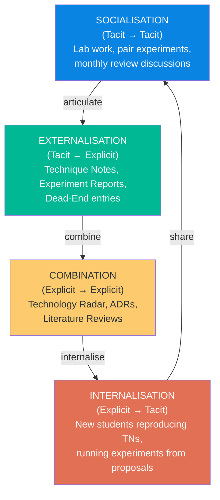

**How FORGE Maps to the SECI Model:**

| SECI Phase | FORGE Mechanism | What Happens |
|------------|----------------|--------------|
| **Socialisation** | Monthly Reviews (SOP-005), Lab sessions, Pair experiments | Tacit knowledge passes between experienced and new researchers through shared practice |
| **Externalisation** | Technique Notes, Experiment Reports, Dead-End Registry | Tacit knowledge (intuitions, failure instincts, domain feel) is captured in structured documents |
| **Combination** | Technology Radar, ADRs, Literature integration via Zotero | Multiple explicit knowledge sources are synthesised into strategic views |
| **Internalisation** | Onboarding (SOP-001), Reproducing TNs, Running backlog experiments | New contributors absorb explicit knowledge and convert it back to personal tacit understanding |

**Why this matters for university-industry partnerships:** Western firms tend to focus too much on explicit knowledge — documents and databases — while ignoring tacit knowledge that lives in researchers' heads. The risk with student collaboration is precisely this: **when students leave, their tacit knowledge (intuitions, failure instincts, domain feel) leaves with them** unless FORGE captures it before graduation. FORGE's Technique Notes and Experiment Reports are specifically designed to engineer the Externalisation phase.

#### 2.2 Architecture Decision Records (Nygard)

**Primary source:** Nygard's original 2011 post [5] coined the ADR term and made the case for a lightweight document with a focus on the decision itself, inspired by Philippe Kruchten's earlier work on decision registers.

**Secondary sources:**

- Fowler, M. "Architecture Decision Record." *Martin Fowler's Bliki.* Available at: [martinfowler.com/bliki/ArchitectureDecisionRecord.html](https://martinfowler.com/bliki/ArchitectureDecisionRecord.html). — *Expands on Nygard with more recent developments.*
- ADR Community Hub: [adr.github.io](https://adr.github.io). — *Aggregates templates, tools, and comparisons.*
- Zimmermann, O. *et al.* (2015). "Architectural Decision Guidance Across Projects — Problem Space Modeling, Decision Backlog Management and Cloud Computing Knowledge." *WICSA 2015*. DOI: [10.1109/WICSA.2015.29](https://doi.org/10.1109/WICSA.2015.29). — *Comparison of seven ADR templates; useful for understanding template design trade-offs.*

**FORGE relevance:** FORGE's `ADR-XXX` template is directly adapted from Nygard's format. ADRs answer: *"Why is the system built the way it is?"* — critical when a customer asks why a fault threshold was set at 0.5 microns, or why CNN was chosen over SVM.

#### 2.3 Technology Radar (ThoughtWorks)

**Origin:** Developed internally at ThoughtWorks after a November 2009 meeting. Published publicly twice yearly at [radar.thoughtworks.com](https://radar.thoughtworks.com). Technologies are categorised into four rings: **Adopt**, **Trial**, **Assess**, and **Hold**.

**Practical guide:** Ford, N. (2015). "Build Your Own Technology Radar." *Medium.* — *Step-by-step guide for organisations creating their own radar. The producers should be a representative group of senior technologists.*

**FORGE relevance:** FORGE's Technology Radar (at `technology-radar/radar.md`) uses the same four-ring model. Movement criteria are defined in SOP-003 — every ring transition must be backed by at least one Experiment Report.

#### 2.4 Toyota A3 Problem Solving

**Definitive source:** Sobek & Smalley (2008) [6]. Winner of a 2009 Shingo Research Prize. The A3 report's power derives not from the report itself but from the culture and mindset required to implement it — Toyota views A3s as just one piece of a PDCA-based management philosophy.

> **Essential reading:** The first 30 pages. The rest are worked examples (valuable but not essential for understanding the method).

**Critically for FORGE:** The A3 report has proven to be a key tool in Toyota's work **within its engineering and R&D organisations specifically** — not just manufacturing. The structured one-page constraint forces rigorous thinking and prevents "slide deck thinking" where complexity is hidden behind bullet points.

#### 2.5 NASA Lessons Learned Information System

**Primary sources:**

- NASA Academy of Program/Project & Engineering Leadership (APPEL). "Lessons Learned." Available at: [appel.nasa.gov/lessons-learned](https://appel.nasa.gov/lessons-learned).
- NASA. "NASA Lessons Learned Process." Process document NPR 7120.6. Available at: [nodis3.gsfc.nasa.gov](https://nodis3.gsfc.nasa.gov/displayCA.cfm?Internal_ID=N_PR_7120_0006_&page_name=AppendixA).

NASA's process has three phases: (1) **Record** — documenting lessons in the LLIS database, (2) **Disseminate** — sharing via publications and communities of practice, (3) **Apply** — integrating lessons into NASA practice.

**Critical counterpoint:** NASA Office of Inspector General (2012). "NASA's Lessons Learned Process." Report No. IG-12-012. — *Found that 8 of 10 NASA centres had not fully complied with lessons-learned policy requirements, and 6 of 10 did not cross-reference lessons to their standards. This tells you something important: having the system isn't enough — you need the SOPs and culture to enforce it.* That's why SOP-004 in FORGE makes dead-end documentation **mandatory**, not optional.

**Empirical research:** Sillito, J. & Pope, M. (2024). "Learning From Lessons Learned: Preliminary Findings From a Study of Learning From Failure." *IEEE/ACM CHASE 2024*. arXiv: [2402.09538](https://arxiv.org/abs/2402.09538). — *Empirical study of what makes postmortem practices actually stick in engineering organisations.*

#### 2.6 University-Industry Collaboration Research

Three papers directly relevant to the FORGE partnership structure:

**N4S Programme Study:**

> Kettunen, P., Järvinen, J., Mikkonen, T. & Männistö, T. (2022). "Energising collaborative industry-academia learning: A present case and future visions." *European Journal of Futures Research*, 10(1), pp. 1–16. DOI: [10.1186/s40309-022-00196-5](https://doi.org/10.1186/s40309-022-00196-5). — *Studies the Finnish N4S programme and concludes that transparently shared, ambitious outcome goals with continuous integrative collection of results are keys to effective industry-academia collaboration.*

**Project Management in UICs:**

> Fernandes, G. & O'Sullivan, D. (2022). "Project management practices in major university-industry R&D collaboration programs — a case study." *The Journal of Technology Transfer*, 48(1), pp. 313–345. DOI: [10.1007/s10961-021-09915-9](https://doi.org/10.1007/s10961-021-09915-9). — *Recommends hybrid agile-traditional approaches for UICs; presents 29 "transversal" (must-have) and 30 "contingent" (optional) PM practices. The PM.UIC framework directly applicable to FORGE.*

**Digital Transformation Study:**

> Evans, N., Miklošík, A. & Du, J.T. (2023). "University-industry collaboration as a driver of digital transformation: Types, benefits and enablers." *Heliyon*, 9(11), e21017. DOI: [10.1016/j.heliyon.2023.e21017](https://doi.org/10.1016/j.heliyon.2023.e21017). — *Notable finding: an academic embedded in an industry partner's office found that sitting in the middle of conversations enabled rapid learning of how the business actually works. Practical implication: give students regular lab access and exposure to real engineering conversations, not just formal project meetings.*

#### 2.7 Knowledge Management Literature

**Top journals to follow and search:**

| Journal | Publisher | Focus | Search Terms |
|---------|-----------|-------|--------------|
| **Journal of Knowledge Management** | Emerald | Leading KM academic journal — cutting-edge research with real-world applications | "R&D knowledge management," "lessons learned systems," "organisational learning failure" |
| **Knowledge Management Research & Practice** | Taylor & Francis | More practice-oriented than JKM, better for applied frameworks | "knowledge management implementation," "engineering knowledge" |
| **Research Policy** | Elsevier | Innovation management, university-industry collaboration | "open innovation," "knowledge transfer," "industry-academia" |

**Key paper:**

> Henz, J.L. & Oliveira, M. (2024). "Knowledge management implementation: A systematic literature review." *Knowledge and Process Management*, 31(1), e1780. DOI: [10.1002/kpm.1780](https://doi.org/10.1002/kpm.1780). — *Examined 174 articles from 108 journals to identify what actually works in KM implementation. A useful shortcut to the field's consensus findings.*

#### 2.8 Suggested Reading Order

If you approach this as a structured self-study, the most efficient path:

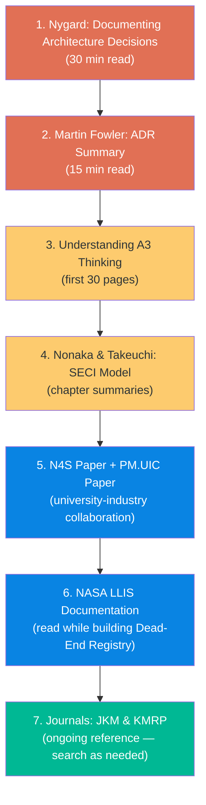

| Priority | Source | Time | What You Get |
|----------|--------|------|-------------|
| 🔴 Start here | Nygard ADR post + Fowler follow-up | 45 min | Immediate practical tools for decision documentation |
| 🔴 Then | Sobek & Smalley, first 30 pages | 2 hours | The discipline of hypothesis-driven structured problem solving |
| 🟡 Then | Nonaka & Takeuchi chapter summaries | 2 hours | Core insight: the SECI spiral is what FORGE is engineering |
| 🟡 Then | N4S + PM.UIC collaboration papers | 3 hours | How to design the university-industry interface |
| 🔵 Alongside building | NASA LLIS documentation | 1 hour | Practical model for dead-end and lessons-learned systems |
| 🟢 Ongoing | Journal of Knowledge Management | As needed | Search specific topics when designing new FORGE components |

##### Video Resources

| Resource | Platform | Why Watch It | FORGE Relevance |
|----------|----------|-------------|-----------------|
| "Architecture Decision Records in Action" — Keeling & Runde (IBM) | YouTube | Best practical ADR walkthrough with real-world adoption numbers | ADR template design |
| "ADRs and Architecture Stories" — Mark Richards | YouTube | Multi-part series starting from Nygard's template | ADR process understanding |
| ThoughtWorks Technology Radar Podcast | thoughtworks.com | Audio walkthroughs of each radar edition | Technology Radar SOP |
| "Build Your Own Radar" tutorial | ThoughtWorks YouTube | How to run a radar review session internally | SOP-003 preparation |
| MIT OpenCourseWare: Managing Innovative Teams | ocw.mit.edu | Covers R&D management, innovation portfolios | Portfolio Architecture |
| Stanford HCI Group lectures on research documentation | YouTube | Academic research methodology applied to practice | Experiment Engine design |
| Lean Enterprise Institute: A3 Thinking Webinars | lean.org | Free webinars directly based on the Sobek/Smalley book | Experiment Proposal template |

##### Cross-References to FORGE Documents

| Reference | Most Relevant FORGE Component |
|-----------|-------------------------------|
| Nygard ADR post | §3.2.2 Architecture Decision Records |
| Sobek & Smalley A3 | §3.2.4 Experiment Proposals |
| Nonaka SECI Model | §3.1 Five-Layer Architecture (knowledge flow) |
| NASA LLIS | §3.2.3 Dead-End Registry, §6 Failure Integration |
| ThoughtWorks Radar | §4.2 Research Tracks (Technology Radar) |
| N4S / PM.UIC papers | §7 Collaboration Protocol |
| ISO 13374 | §9.3 Condition Monitoring Standards |
| FAIR Principles | §5.5 Execute Phase (FAIR metadata) |

---

## Part II — Architecture

### 3. Knowledge Architecture

FORGE is structured as five interlocking layers that follow the **academic research process flow**. The numbering reflects how research naturally progresses: from understanding existing knowledge, through experimentation and data collection, to synthesis and delivery.

#### 3.1 Five-Layer Architecture

```
┌─────────────────────────────────────────────────────────────────┐
│  LAYER 5: PRODUCT & DELIVERY                                    │
│  Publications, customer software, hardware tools, prototypes    │
├─────────────────────────────────────────────────────────────────┤
│  LAYER 4: PORTFOLIO INTELLIGENCE                                │
│  Technology Radar, Exploration Map, strategic research backlog  │
├─────────────────────────────────────────────────────────────────┤
│  LAYER 3: DATA FOUNDATION                                       │
│  Raw data, labelled datasets, model checkpoints, code           │
├─────────────────────────────────────────────────────────────────┤
│  LAYER 2: EXPERIMENT ENGINE                                     │
│  Proposals → Execution → Reports → Retrospectives              │
├─────────────────────────────────────────────────────────────────┤
│  LAYER 1: KNOWLEDGE COMMONS                                     │
│  Technique Notes, Architecture Docs, Dead-End Registry          │
└─────────────────────────────────────────────────────────────────┘
```

> **Why this order?** In academic R&D, every research journey begins with **understanding what is already known** (Layer 1). This knowledge informs **experiment design** (Layer 2), which produces **data** (Layer 3). Data is synthesised into **strategic portfolio insights** (Layer 4), which ultimately guides the creation of **products, publications, and deliverables** (Layer 5).

**Layer 1 — Knowledge Commons:** The *documented understanding* — the starting point for all research. Before any experiment begins, a researcher must first understand what is already known, what has been tried, and what vocabulary the domain uses. Includes Technique Notes, Architecture Decision Records, Dead-End Registry, and Domain Glossary.

**Layer 2 — Experiment Engine:** The operational heartbeat. Every research activity is expressed as: (1) an Experiment Proposal (before work begins), (2) an Experiment Log (during work), (3) an Experiment Report (after work, win or lose), (4) a Retrospective Entry (what the team learned about the *process*).

**Layer 3 — Data Foundation:** The physical assets produced by experiments. Every sensor reading, every labelled fault event, every trained model weight, every signal processing script. Managed in **Git + DVC** and follows FAIR data principles [4].

**Layer 4 — Portfolio Intelligence:** The strategic view. Which tracks are active? Which techniques are in Trial vs. Adopt vs. Hold? What is the current confidence in key predictions? This layer tells you where to invest next.

**Layer 5 — Product & Delivery:** The outputs that reach external audiences. Publications, customer-facing software, hardware prototypes, and documented APIs. Everything below this layer is internal infrastructure that makes Layer 5 better, faster, and more defensible over time.

##### System Mindmap

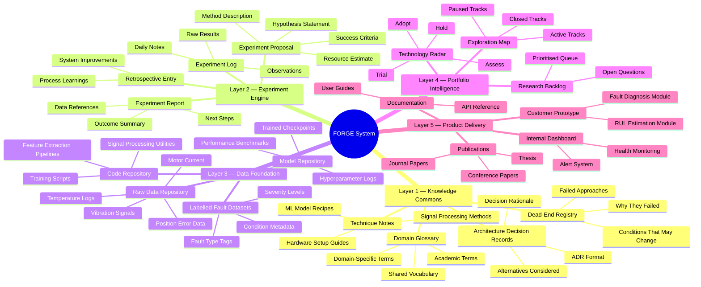

#### 3.2 Knowledge Documents

##### 3.2.1 Technique Notes (TN-XXX)

**Purpose:** A reusable, searchable reference for *how to do a specific thing* in this domain. Written after a method has been successfully applied at least once. The goal is that a new student or hire can execute the technique without asking anyone.

**Naming convention:** `TN-[number]-[short-title].md`
Example: `TN-001-FFT-Feature-Extraction-Vibration.md`

**Template:**

```markdown
# TN-[number]: [Title]
**Status:** Draft | Review | Stable | Deprecated
**Author:** [Name]
**Date:** [YYYY-MM-DD]
**Related Experiments:** [EXP-XXX, EXP-XXX]
**Tags:** [vibration, FFT, feature-extraction]

## Purpose
One paragraph describing what this technique does and when to use it.

## Background
Relevant theory. Equations if needed. Key references (cite papers or other TNs).

## Prerequisites
- Hardware/software requirements
- Data format requirements
- Prior knowledge assumed

## Step-by-Step Procedure
1. Step one
2. Step two
...

## Worked Example
Code snippet or walkthrough with real data from FORGE datasets.

## Validation
How to verify the technique worked correctly. What do correct outputs look like?

## Limitations & Known Issues
- When does this technique fail?
- What conditions was it NOT tested under?

## See Also
- Related TNs
- Related Experiment Reports
- External references
```

##### 3.2.2 Architecture Decision Records (ADR-XXX)

**Purpose:** Document *why* a significant technical or design choice was made, what alternatives were considered, and what the consequences are. Prevents "why did we build it this way?" from becoming unanswerable. Based on Michael Nygard's ADR format [5].

**Naming convention:** `ADR-[number]-[short-title].md`
Example: `ADR-003-CNN-over-SVM-for-fault-classification.md`

**Template:**

```markdown
# ADR-[number]: [Decision Title]
**Status:** Proposed | Accepted | Deprecated | Superseded by ADR-XXX
**Date:** [YYYY-MM-DD]
**Deciders:** [Names / Roles]
**Related Experiments:** [EXP-XXX]

## Context
What is the situation that requires a decision? What constraints exist?

## Decision
What was decided?

## Alternatives Considered
| Option | Pros | Cons | Why Rejected |
|--------|------|------|--------------|
| Option A | ... | ... | ... |
| Option B (chosen) | ... | ... | N/A |
| Option C | ... | ... | ... |

## Consequences
- What becomes easier because of this decision?
- What becomes harder?
- What assumptions does this decision depend on?

## Review Trigger
Under what conditions should this decision be revisited?
(e.g., "If classification accuracy on transferability test drops below 70%")
```

##### 3.2.3 Dead-End Registry (DE-XXX)

**Purpose:** The most neglected and most valuable knowledge type. Documents approaches that were tried and failed — with enough detail that future contributors do not repeat them unknowingly.

> **Critical philosophy:** A dead end is not a failure. It is a *confirmed negative result*. In science, knowing what does not work has the same epistemic value as knowing what does.

**Naming convention:** `DE-[number]-[short-title].md`
Example: `DE-007-KNN-poor-transferability-across-setups.md`

**Template:**

```markdown
# DE-[number]: [What Was Tried]
**Date Closed:** [YYYY-MM-DD]
**Closed By:** [Name]
**Related Experiments:** [EXP-XXX]
**Confidence Level:** Low | Medium | High
(How certain are we this is a dead end vs. a setup-specific issue?)

## What Was Tried
Describe the approach, model, technique, or hypothesis.

## Why We Tried It
What led us to believe this might work?

## What Happened
What did the data / results show? Include key metrics.

## Why It Failed (Root Cause)
Best current explanation for the failure. Mark as [CONFIRMED] or [HYPOTHESIS].

## Conditions That Might Change This
Under what different conditions might this approach succeed?
(e.g., "Might work if dataset size exceeds 10,000 labelled samples")

## What We Learned
Positive knowledge extracted from the failure.

## Related Open Questions
What questions does this failure raise that remain unanswered?
```

##### 3.2.4 Experiment Proposals (EXP-XXX-PROPOSAL)

**Purpose:** Every discrete research activity — from a 2-hour signal processing test to a 3-month model training campaign — is documented **before** it starts. Inspired by Toyota's A3 problem-solving reports [6] and the Open Science Framework pre-registration model [7].

**Naming convention:** `EXP-[number]-PROPOSAL-[short-title].md`

**Template:**

```markdown
# EXP-[number] Proposal: [Title]
**Proposed By:** [Name]
**Date Proposed:** [YYYY-MM-DD]
**Assigned To:** [Name]
**Estimated Duration:** [X weeks]
**Track:** [Data Collection | ML Diagnosis | RUL Estimation | Platform]
**Status:** Proposed | Approved | In Progress | Complete | Cancelled

## Hypothesis
State clearly: "We believe that [X] will [produce Y outcome] because [Z reason]."

## Background
Why is this experiment needed now? What prior work (TNs, ADRs, papers) does it build on?

## Method
How will the experiment be conducted? Be specific enough that someone else could run it.
- Setup / equipment
- Variables (independent, dependent, controlled)
- Data to be collected
- Tools to be used

## Success Criteria
What specific, measurable result would confirm the hypothesis?
What specific result would refute it?

## Failure Criteria & Exit Conditions
At what point do we stop and declare this a dead end?

## Resources Required
- Lab access: [dates / hours]
- Compute: [GPU time estimate]
- Data: [existing datasets or new collection needed]
- Supervisor review: [milestone checkpoints]

## Risk & Mitigation
| Risk | Likelihood | Impact | Mitigation |
|------|------------|--------|------------|
| ... | ... | ... | ... |
```

##### 3.2.5 Experiment Reports (EXP-XXX-REPORT)

**Naming convention:** `EXP-[number]-REPORT-[short-title].md`

**Template:**

```markdown
# EXP-[number] Report: [Title]
**Completed By:** [Name]
**Date Completed:** [YYYY-MM-DD]
**Outcome:** ✅ Hypothesis Confirmed | ❌ Hypothesis Refuted | ⚠️ Inconclusive

## Summary (3–5 sentences max)
What was tested. What was found. What it means.

## Results
Include key metrics, charts, confusion matrices — whatever is relevant.
Link to: raw data location, code used, model checkpoints.

## Interpretation
What do these results mean in the context of FORGE's goals?

## Deviations from Proposal
What changed from the original plan and why?

## Outputs Produced
- [ ] Data added to repository at: [path]
- [ ] Code committed at: [repo/path]
- [ ] Model checkpoint saved at: [path]
- [ ] Technique Note created: TN-XXX
- [ ] Dead-End entry created: DE-XXX (if applicable)
- [ ] ADR created: ADR-XXX (if applicable)

## Recommended Next Experiments
List 2–3 follow-on experiments this result suggests, with brief rationale.

## Open Questions
What questions remain unanswered?
```

#### 3.3 Repository Structure

```
FORGE/
├── README.md                   # System orientation document
├── CONTRIBUTING.md             # SOP for contributors (students & staff)
├── FORGE_Master_Design.md      # This document
├── knowledge-commons/
│   ├── technique-notes/        # TN-XXX files
│   ├── decision-records/       # ADR-XXX files
│   ├── dead-end-registry/      # DE-XXX files
│   └── domain-glossary.md
├── experiments/
│   ├── active/                 # EXP-XXX-PROPOSAL files for in-progress work
│   ├── complete/               # EXP-XXX-REPORT files
│   └── backlog/                # Proposed but not yet approved
├── data/
│   ├── README.md               # Data catalogue (actual data in external store)
│   ├── datasets/               # Metadata, labels, and data cards
│   └── models/                 # Model cards and checkpoint references
├── technology-radar/
│   ├── radar.md                # Current state of technology assessment
│   └── history/                # Past radar snapshots
├── platform/                   # Internal software team's code
│   ├── data-ingestion/
│   ├── feature-extraction/
│   └── dashboard/
└── reports/                    # Formal summary reports for management / university
```

**Key principle:** Everything lives in Git. Large files (sensor data, model weights) are managed through DVC pointer files in the `data/` directory. Git does not handle large files well — DVC extends Git to version them, storing actual data in a separate backend (S3, Google Drive, NAS) while keeping lightweight pointers in the repository.

#### 3.4 Naming Rationale

**FORGE** — *Foundation for Organized Research Groups and Enterprise*

| Element | Purpose |
|---------|---------|
| **Foundation** | This is infrastructure, not a project |
| **Organised** | Structure is what makes knowledge compound rather than scatter |
| **Research Groups** | The system enables collaborative groups to contribute and compound knowledge |
| **Enterprise** | Built for real business outcomes, not just academic exercises |

**Alternative names considered:**

| Name | Meaning | Why Not Chosen |
|---|---|---|
| **PRISM** | Perpetual Research & Innovation System for Manufacturing | Excellent, but positions as manufacturing-specific; FORGE is more general |
| **ATLAS** | Adaptive Technology & Learning Architecture System | Suggests a single reference document rather than a living system |
| **KODA** | Knowledge-Oriented Development Architecture | Too abstract |
| **COMPASS** | Compound Architecture for Precision Maintenance Systems | Too domain-specific |

> **Recommendation:** Use FORGE internally. If the system is ever shared publicly or with customers as a methodology, PRISM is a strong alternative.

##### Core Glossary

| Term | Definition |
|---|---|
| **Experiment Proposal** | Structured document written before any experiment begins, defining hypothesis, method, and success criteria |
| **Experiment Report** | Structured document written after an experiment, recording results and interpretation |
| **Technique Note (TN)** | Reusable reference document describing how to perform a specific method or procedure |
| **Architecture Decision Record (ADR)** | Document recording why a significant design or technical choice was made |
| **Dead-End Registry (DE)** | Catalogue of approaches tried and confirmed not to work, with root cause analysis |
| **Technology Radar** | Living map of techniques and tools organised by adoption status (Adopt / Trial / Assess / Hold) |
| **Research Track** | An independent line of investigation (e.g., "Data Collection", "ML Diagnosis", "RUL Estimation") |
| **Knowledge Commons** | The shared body of written knowledge: TNs, ADRs, DEs, and domain glossary |
| **Research Coordinator** | The role responsible for maintaining FORGE system health |
| **Compounding knowledge** | Property where each new piece of work builds on and amplifies prior work, rather than starting from scratch |
| **DVC** | Data Version Control — tool for versioning large datasets and model files alongside Git |
| **PE** | Position Error — primary performance metric for the gantry system (target: < 0.5 microns) |
| **KS Test** | Key Signature Test — structured experiment to identify fault signatures under normal and fault conditions |
| **T Test** | Transferability Test — validation that fault signatures generalise across different physical setups |

---

**Section 3 Citations:**

> [4] Wilkinson, M.D. *et al.* (2016). "The FAIR Guiding Principles for scientific data management and stewardship." *Scientific Data*, 3, 160018. DOI: [10.1038/sdata.2016.18](https://doi.org/10.1038/sdata.2016.18). — *Defines Findable, Accessible, Interoperable, Reusable principles that govern FORGE's Data Foundation (Layer 3).*
>
> [5] Nygard, M. (2011). "Documenting Architecture Decisions." *Cognitect Blog*. Available at: [https://cognitect.com/blog/2011/11/15/documenting-architecture-decisions](https://cognitect.com/blog/2011/11/15/documenting-architecture-decisions). — *The original ADR format adopted by FORGE for architecture decision records.*
>
> [6] Sobek, D.K. & Smalley, A. (2008). *Understanding A3 Thinking: A Critical Component of Toyota's PDCA Management System.* Boca Raton: CRC Press. ISBN: 978-1-56327-394-4, pp. 17–45 (Ch. 2: "A3 Reports"). — *The A3 problem-solving format that inspired FORGE's Experiment Proposal template.*
>
> [7] Nosek, B.A. *et al.* (2018). "The preregistration revolution." *Proceedings of the National Academy of Sciences*, 115(11), pp. 2600–2606. DOI: [10.1073/pnas.1708274114](https://doi.org/10.1073/pnas.1708274114). — *Establishes the value of pre-registration in reducing bias; underpins FORGE's requirement to write Experiment Proposals before work begins.*

---

### 4. Portfolio Architecture

#### 4.1 Why Portfolio, Not Project

A single-track research plan assumes that success comes from executing one sequence of steps correctly. In reality, R&D requires **parallel exploration** — multiple independent lines of inquiry that may converge, diverge, or terminate independently.

Portfolio Architecture provides:

- **Resilience** — If one track hits a dead end, others continue
- **Speed** — Parallel work compresses the overall timeline
- **Discovery** — Adjacent tracks create unexpected connections
- **Resource efficiency** — Effort shifts dynamically to the most promising tracks

Portfolio Architecture lives in **Layer 4 (Portfolio Intelligence)**. It synthesises information from all experiments (Layer 2), knowledge commons (Layer 1), and data assets (Layer 3) into strategic decisions about where to invest next.

#### 4.2 Research Tracks

A **research track** is an independent, coherent line of investigation with its own hypothesis, experiments, and expected outputs. Tracks are complementary but not dependent — the failure of one track does not block another.

##### Current Research Tracks

| Track | Focus | Primary Owner | Key Experiments | Status |
|-------|-------|---------------|-----------------|--------|
| **Data Collection** | Sensor setup, fault simulation, signal acquisition, protocol design | Student 1 | EXP-001, EXP-002, EXP-003 | Active |
| **ML Diagnosis** | Fault classification using signal features and ML models | Student 2 | EXP-004, EXP-005 | Proposed |
| **RUL Estimation** | Remaining Useful Life prediction (Type III effects-based) | TBD | Not yet proposed | Future |
| **Platform** | Internal software — data pipeline, feature extraction, dashboard | Industry Partner Software Team | Ongoing | Active |

##### Track Design Principles

1. **Independence** — Each track must be able to produce value even if other tracks fail
2. **Complementarity** — Tracks should feed each other (e.g., Data Collection produces datasets for ML Diagnosis)
3. **Minimum viable scope** — The smallest independent unit of investigation that can produce an Experiment Report
4. **Clear ownership** — One person (or pair) owns each track; they propose experiments and write reports
5. **Defined outputs** — Each track has explicit deliverables (datasets, models, technique notes, papers)

##### Track Interaction Model

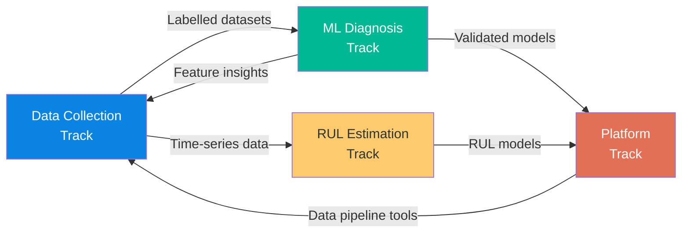

#### 4.3 Stage-Gate Decision Model

Every experiment passes through five decision gates. Gates are lightweight — they prevent wasted effort without creating bureaucratic overhead. This model is adapted from Cooper's Stage-Gate® system [1].

```mermaid
flowchart LR
    G0["Gate 0\nDiscovery"]
    G1["Gate 1\nScoping"]
    G2["Gate 2\nGo/No-Go"]
    G3["Gate 3\nMid-Review"]
    G4["Gate 4\nCompletion"]

    G0 -->|"Is this aligned\nwith research\nquestions?"| G1
    G1 -->|"Is it feasible\nin 2-4 weeks?"| G2
    G2 -->|"Does it pass\nscoring rubric?"| G3
    G3 -->|"On track for\nmilestones?"| G4
    G4 -->|"Did we learn\nwhat we expected?"| DONE["Archive"]

    style G0 fill:#0984e3,color:#fff
    style G1 fill:#00b894,color:#fff
    style G2 fill:#fdcb6e,color:#2d3436
    style G3 fill:#e17055,color:#fff
    style G4 fill:#6c5ce7,color:#fff
```

| Gate | Question | Decision Maker | Artefact Required | Outcome |
|------|----------|----------------|-------------------|---------|
| **Gate 0: Discovery** | Is this problem aligned with FORGE's research questions? | Any contributor | Backlog entry | Proceed to scoping / reject |
| **Gate 1: Scoping** | Is this technically feasible within 2–4 weeks? | Track owner + supervisor | Draft EXP Proposal | Proceed to scoring / re-scope / reject |
| **Gate 2: Go/No-Go** | Does this pass the weighted scoring rubric? | Supervisor + industry partner | Full EXP Proposal + score | Approve / defer / reject |
| **Gate 3: Mid-Review** | Is execution on track? Any deviations? | Track owner + supervisor | Experiment Log update | Continue / pivot / abandon |
| **Gate 4: Completion** | Did we learn what we expected? What comes next? | All stakeholders | EXP Report + outputs | Archive + follow-on proposals |

#### 4.4 Go/No-Go Scoring Rubric

At Gate 2, every proposed experiment is scored using a weighted rubric to ensure objective prioritisation.

| Criterion | Weight | Scale | Description |
|-----------|--------|-------|-------------|
| **Strategic Alignment** | 30% | 0–10 | How directly does this advance FORGE's research questions? |
| **Technical Feasibility** | 25% | 0–10 | Can this be done with current tools, data, and skills? |
| **Resource Efficiency** | 25% | 0–10 | Is the effort proportionate to the expected learning? |
| **Expected Impact** | 20% | 0–10 | How much will this advance the overall portfolio? |

**Calculation:**

```
Score = (Alignment × 0.30) + (Feasibility × 0.25) + (Efficiency × 0.25) + (Impact × 0.20)
Maximum: 10.0
```

| Score | Decision |
|-------|----------|
| **≥ 7.0** | ✅ Approve — proceed immediately |
| **5.0 – 6.9** | ⚠️ Conditional — approve with modifications or defer |
| **< 5.0** | ❌ Reject — document reasoning, may revisit later |

#### 4.5 Exploration vs. Exploitation Balance

A healthy portfolio balances **exploitation** (building on what works) with **exploration** (testing new approaches). Too much exploitation leads to local optima; too much exploration leads to no delivered output. This follows March's foundational analysis of organisational learning [8].

| Mode | Effort % | Activities | FORGE Artefacts |
|------|----------|------------|-----------------|
| **Exploitation** | 60–70% | Extending validated techniques, collecting more data, improving models | EXP Reports, TN updates |
| **Exploration** | 30–40% | Testing new algorithms, alternative sensors, novel feature extraction | EXP Proposals (high-risk), DE entries |

**Signals to Rebalance:**

| Signal | Action |
|--------|--------|
| Dead-end rate > 40% | Too much exploration — shift to exploitation |
| Dead-end rate < 10% | Too little exploration — team is playing it safe |
| No technique transitions for 2 quarters | Stagnation — increase exploration budget |
| Time-to-insight > 6 weeks average | Experiments too large — break into smaller units |

#### 4.6 Portfolio KPIs

Tracked quarterly in the Monthly Review (SOP-005) and reported in `reports/monthly/`.

| KPI | Definition | Target | Frequency |
|-----|-----------|--------|-----------|
| **Experiment Completion Rate** | Completed / Planned experiments | ≥ 60% | Quarterly |
| **Time-to-Insight** | Average weeks from EXP Proposal to EXP Report | ≤ 4 weeks | Quarterly |
| **Technique Transition Rate** | Techniques moving Assess → Trial → Adopt | ≥ 1 per quarter | Quarterly |
| **Dead-End Discovery Rate** | DE entries / total completed experiments | 15–30% (healthy range) | Quarterly |
| **Resource Utilisation** | Active researcher-weeks / available researcher-weeks | 70–85% | Monthly |
| **Knowledge Output Rate** | TN + ADR + DE documents produced | ≥ 2 per month | Monthly |
| **Cross-Reference Density** | Avg. internal links per document | ≥ 3 | Quarterly |

#### 4.7 Track Lifecycle

Tracks are not permanent. They can be paused, closed, split, or merged based on evidence.

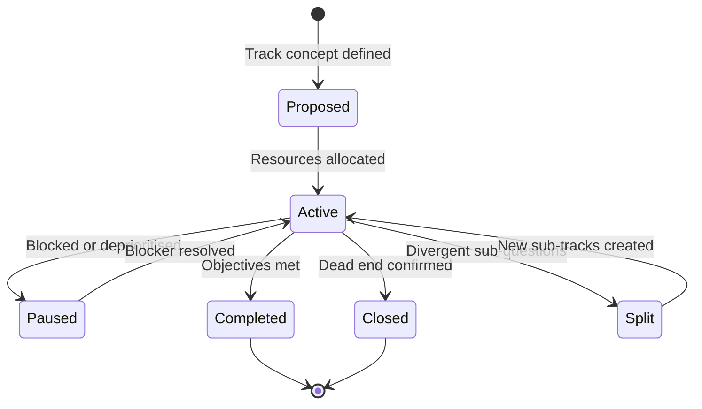

| Decision | Trigger | Required Evidence | Decider |
|----------|---------|-------------------|---------|
| **Pause** | Resource conflict, equipment unavailable | Documented reason in monthly report | Track owner + supervisor |
| **Close** | Fundamental dead end confirmed | DE entry with High confidence | Supervisor + industry partner |
| **Split** | Track reveals two distinct sub-questions | Two viable EXP Proposals | Track owner + supervisor |
| **Merge** | Two tracks converge on same approach | ADR documenting merge rationale | All track owners |
| **Complete** | All research questions answered | Final EXP Report + Radar update | Supervisor + industry partner |

##### Experiment Dependency Graph

Experiments have relationships: sequential (one must complete before another starts), parallel (independent), and convergent (multiple feed into a decision).

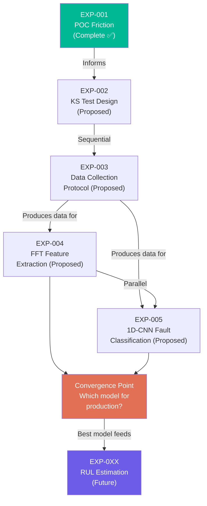

| Dependency Type | Symbol | Meaning | Example |
|------|--------|---------|---------| 
| **Sequential** | → | B cannot start until A completes | EXP-002 → EXP-003 |
| **Parallel** | ∥ | A and B are independent | EXP-004 ∥ EXP-005 |
| **Convergent** | ⊕ | Multiple experiments feed one decision | EXP-004 + EXP-005 → model selection |
| **Informational** | ⟶ | A provides context but B is not blocked | EXP-001 ⟶ EXP-002 |

---

**Section 4 Citations:**

> [8] March, J.G. (1991). "Exploration and Exploitation in Organizational Learning." *Organization Science*, 2(1), pp. 71–87. DOI: [10.1287/orsc.2.1.71](https://doi.org/10.1287/orsc.2.1.71). — *The foundational paper on the explore/exploit trade-off in organisational learning; the theoretical basis for FORGE's 60–70 / 30–40 portfolio allocation.*

---

## Part III — Process

### 5. Research Lifecycle — 15 Stages

The research lifecycle defines *the process that generates knowledge* — it transforms questions into validated insights. FORGE's Knowledge Architecture (§3) defines *what* the system stores; this section defines *how knowledge is produced*.

> **Design requirement:** The lifecycle is **project-agnostic.** It was conceived in the context of predictive maintenance for precision gantry systems, but the process applies equally to any R&D initiative.

#### 5.1 Overview & Lifecycle Diagram

```mermaid
flowchart TD
    S1["1. Search & Discovery\nIdentify gaps, problems,\nopportunities"]
    S2["2. Literature Review\nSystematic survey of\nexisting knowledge"]
    S3["3. Hypothesis Formation\nSolution hypothesisation,\nresearch questions"]
    S4["4. Gap Identification\nWhat is missing in\ncurrent knowledge?"]
    S5["5. Study Design\nExperimental design,\ntest matrices"]
    S6["6. Simulation\nModelling, feasibility\nvalidation"]
    S7["7. Setup & Preparation\nAcquire materials,\nconfigure equipment"]
    S8["8. Data Collection\nExecute experiments,\nacquire signals"]
    S9["9. Data Documentation\nELN entries, metadata,\nanomaly logging"]
    S10["10. Data Storage &\nVersion Control\nDVC, backup, FAIR"]
    S11["11. Data Analysis\nFeature extraction,\nmodel training"]
    S12["12. Interpretation\nStatistical significance,\ndomain meaning"]
    S13["13. Verification &\nValidation\nReproducibility,\ncross-validation"]
    S14["14. Evaluation\nProduction readiness,\nperformance criteria"]
    S15["15. Report & Publish\nThesis, papers,\ndataset release"]

    S1 --> S2 --> S3 --> S4 --> S5 --> S6
    S6 --> S7 --> S8 --> S9 --> S10
    S10 --> S11 --> S12 --> S13 --> S14 --> S15

    S15 -.->|"Future work\n& improvements"| S1

    style S1 fill:#0984e3,color:#fff
    style S2 fill:#0984e3,color:#fff
    style S3 fill:#00b894,color:#fff
    style S4 fill:#00b894,color:#fff
    style S5 fill:#fdcb6e,color:#2d3436
    style S6 fill:#fdcb6e,color:#2d3436
    style S7 fill:#e17055,color:#fff
    style S8 fill:#e17055,color:#fff
    style S9 fill:#e17055,color:#fff
    style S10 fill:#6c5ce7,color:#fff
    style S11 fill:#6c5ce7,color:#fff
    style S12 fill:#6c5ce7,color:#fff
    style S13 fill:#d63031,color:#fff
    style S14 fill:#d63031,color:#fff
    style S15 fill:#2d3436,color:#fff
```

**Stage Summary Table:**

| # | Stage | Description | Primary Output | FORGE Layer |
|---|-------|-------------|----------------|-------------|
| 1 | **Search & Discovery** | Identify gaps, problems, and opportunities | Problem statement, opportunity brief | L1 (Knowledge Commons) |
| 2 | **Literature Review** | Systematic survey of existing knowledge | Annotated bibliography, gap analysis | L1 (Knowledge Commons) |
| 3 | **Hypothesis Formation** | Define research questions and hypotheses | EXP Proposal, OSF pre-registration | L2 (Experiment Engine) |
| 4 | **Gap Identification** | Formalise what is missing in current knowledge | Gap analysis document, feasibility assessment | L2 (Experiment Engine) |
| 5 | **Study Design** | Design experimental methodology — test matrices, variables, controls | Test Protocol, sensor placement diagrams | L2 (Experiment Engine) |
| 6 | **Simulation** | Validate feasibility through modelling | Simulation results, feasibility report | L2 (Experiment Engine) |
| 7 | **Setup & Preparation** | Configure equipment, calibrate sensors, prepare DAQ | Equipment checklist, calibration records | L3 (Data Foundation) |
| 8 | **Data Collection** | Execute experiments under controlled conditions | Raw HDF5 datasets (DVC-tracked) | L3 (Data Foundation) |
| 9 | **Data Documentation** | Create metadata, document anomalies contemporaneously | metadata.json (FAIR-compliant), session notes | L3 (Data Foundation) |
| 10 | **Data Storage & VC** | Version data with DVC, ensure 3-2-1 backup rule | DVC commits, tagged data versions | L3 (Data Foundation) |
| 11 | **Data Analysis** | Feature extraction, model training, evaluation | Feature matrices, trained models, MLflow runs | L2 (Experiment Engine) |
| 12 | **Interpretation** | Assess statistical significance and domain meaning | Experiment Report (EXP-XXX-REPORT) | L2 (Experiment Engine) |
| 13 | **Verification & Validation** | Reproducibility check, cross-validation | V&V report, reproducibility confirmation | L2 (Experiment Engine) |
| 14 | **Evaluation** | Assess production readiness; go/no-go decision | ADR, Technology Radar update | L4 (Portfolio Intelligence) |
| 15 | **Report & Publish** | Write thesis/papers; publish datasets with DOI | Thesis, papers, Zenodo datasets | L5 (Product & Delivery) |

> **Iteration is expected.** Stages 5–13 often cycle multiple times before Stage 14 produces a pass. Each iteration should generate a new Experiment Report and, if applicable, Dead-End entries. The feedback loop from Stage 15 back to Stage 1 is what makes FORGE a *compound learning system* rather than a linear project.

---

#### 5.2 Discover Phase (Stages 1–2)

**Stage 1 — Search & Discovery:** Identify gaps, problems, and opportunities through domain observation, customer feedback, and literature scanning.

**Stage 2 — Literature Review:** Systematic survey of existing knowledge using structured search and citation analysis.

**Recommended Tools:**

| Tool | Purpose | Notes |
|------|---------|-------|
| **Zotero** | Primary reference manager | Browser plugin for 1-click import from IEEE Xplore, Scopus, Google Scholar. Shared group library. |
| **Connected Papers** | Visual citation graph | connectedpapers.com — finds related papers you might otherwise miss |
| **Notion/Confluence** | Literature Review Matrix | Table with: Author, Year, Topic, Dataset, Method, Key Finding, Limitation/Gap, Relevance |

**Key Databases:** IEEE Xplore, Scopus / Web of Science, Google Scholar, ScienceDirect (Mechanical Systems and Signal Processing).

**Search Terms:**
```
"gantry system" + "predictive maintenance"
"electromechanical" + "condition monitoring" + "wear"
"motion control signals" + "fault detection"
"motor current signature analysis" + "wear"
"vibration analysis" + "bearing degradation"
"remaining useful life" + "linear axis"
```

---

#### 5.3 Hypothesise Phase (Stages 3–4)

**Stage 3 — Hypothesis Formation:** Define precise research questions, hypotheses, and expected outcomes. Document them **before** any experiments begin.

**Stage 4 — Gap Identification:** Formalise what is missing in current knowledge; justify the research direction.

**Recommended Tools:**

| Tool | Purpose | Notes |
|------|---------|-------|
| **OSF (Open Science Framework)** | Pre-registration | Creates timestamped IP record. Protects against HARKing (Hypothesising After Results are Known). [7] |
| **eLabFTW** | Electronic Lab Notebook | Timestamped, tamper-evident entries for all ideas and decisions |
| **draw.io** | Architecture diagrams | System overview: gantry → sensors → DAQ → processing pipeline |
| **Miro** | Brainstorming | Digital whiteboard for distributed teams |

> ⚠️ **IP Protection Rule:** Every new idea must be recorded in the ELN with a timestamp **before** it is discussed with external partners. The ELN entry is your legal record of conception date.

---

#### 5.4 Design Phase (Stages 5–6)

**Stage 5 — Study Design:** Design experimental methodology — test matrices, variables, controls, protocols.

**Stage 6 — Simulation:** Validate feasibility through modelling before physical experiments.

**Recommended Tools:**

| Tool | Purpose | Notes |
|------|---------|-------|
| **MATLAB / Simulink** | System modelling | Version `.m` and `.slx` files with Git |
| **Overleaf (LaTeX)** | Formal Test Protocol | Use IEEE or university template |
| **eLabFTW** | Equipment configuration records | Sensor placements, DAQ settings, sampling rates |

**Test Matrix Template:**

| Run ID | Date | Gantry ID | Wear Level | Speed (mm/s) | Load (N) | Duration (s) | Operator | Notes |
|--------|------|-----------|------------|--------------|----------|--------------|----------|-------|
| T001 | YYYY-MM-DD | G01 | W0 (new) | 100 | 0 | 120 | Name | Baseline |
| T002 | YYYY-MM-DD | G01 | W0 | 200 | 0 | 120 | Name | Speed sweep |

---

#### 5.5 Execute Phase (Stages 7–10)

**Stage 7 — Setup & Preparation:** Acquire materials, configure equipment, calibrate sensors, prepare DAQ.

**Stage 8 — Data Collection:** Execute experiments under controlled conditions; real-time anomaly logging.

**Stage 9 — Data Documentation:** Create metadata, document anomalies, write session notes contemporaneously.

**Stage 10 — Data Storage & Version Control:** Version data with DVC, ensure 3-2-1 backup rule, tag dataset releases.

**Recommended Tools:**

| Tool | Purpose | Notes |
|------|---------|-------|
| **HDF5 (.h5)** | Primary data format | Hierarchical, compressed, supports embedded metadata. Use `h5py` (Python). |
| **DVC** | Data version control | `dvc add data/raw/` + `dvc push` immediately after collection. Every dataset version tied to a Git commit. |
| **eLabFTW** | Session logging | One ELN entry per collection session |

> **Critical Rule:** Raw data files are **never modified** after collection. All processing creates new files in `data/processed/`. This is enforced by DVC tracking of the `data/raw/` directory.

##### HDF5 Structure Reference

```
experiment_001.h5
├── metadata/
│   ├── test_date: "2025-06-01"
│   ├── gantry_id: "G01"
│   ├── wear_level: "W3"
│   ├── sampling_rate: 10000
│   └── operator: "Name"
├── signals/
│   ├── position/        # Encoder position (μm)
│   ├── velocity/        # Commanded velocity (mm/s)
│   ├── motor_current/   # Drive current (A)
│   ├── vibration/       # Accelerometer (g)
│   └── temperature/     # Thermocouple (°C)
└── annotations/
    ├── anomalies: []
    └── session_notes: "..."
```

##### File Naming Convention

```
{gantry_id}_{wear_level}_{speed}_{date}_{run_id}.h5

Examples:
G01_W0_100mms_20250601_T001.h5
G01_W3_200mms_20250615_T042.h5
```

##### FAIR Metadata Schema (Dublin Core)

```json
{
  "dc:title": "Gantry G01 vibration data — wear level W3",
  "dc:creator": "Researcher Name",
  "dc:date": "2025-06-15",
  "dc:description": "Accelerometer and encoder signals during 120s test run at 200mm/s",
  "dc:subject": ["vibration", "wear", "gantry", "predictive maintenance"],
  "dc:format": "application/x-hdf5",
  "dc:identifier": "doi:10.5281/zenodo.XXXXXXX",
  "dc:rights": "CC-BY-4.0",
  "forge:experiment_id": "EXP-003",
  "forge:wear_level": "W3",
  "forge:sampling_rate_hz": 10000,
  "forge:gantry_id": "G01",
  "forge:dvc_version": "v1.2.0"
}
```

##### Backup Rule: 3-2-1

- **3** copies of all data
- **2** different storage media (e.g., NAS + cloud)
- **1** off-site copy

---

#### 5.6 Analyse Phase (Stages 11–13)

**Stage 11 — Data Analysis:** Feature extraction (FFT, RMS, kurtosis, wavelets), model training, and evaluation.

**Stage 12 — Interpretation:** Assess statistical significance, domain meaning, and practical implications.

**Stage 13 — Verification & Validation:** Reproducibility check (`dvc repro`), cross-validation, independent test set.

**Recommended Tools:**

| Tool | Purpose | Notes |
|------|---------|-------|
| **Python** | Primary language | NumPy, SciPy, scikit-learn, PyTorch |
| **MLflow** | Experiment tracking | Log parameters, metrics, and model artefacts |
| **DVC Pipelines** | Reproducible workflows | Define pipeline stages in `dvc.yaml` |
| **Jupyter Notebooks** | Interactive analysis | Version-controlled with outputs stripped |

##### DVC Pipeline Definition

```yaml
# dvc.yaml
stages:
  preprocess:
    cmd: python src/preprocess.py
    deps:
      - data/raw/
      - src/preprocess.py
    outs:
      - data/processed/

  extract_features:
    cmd: python src/features.py
    deps:
      - data/processed/
      - src/features.py
    outs:
      - data/features/

  train:
    cmd: python src/train.py
    deps:
      - data/features/
      - src/train.py
    outs:
      - models/
    metrics:
      - metrics.json:
          cache: false

  evaluate:
    cmd: python src/evaluate.py
    deps:
      - models/
      - data/features/test/
      - src/evaluate.py
    metrics:
      - evaluation.json:
          cache: false
```

##### Notebook Organisation

```
notebooks/
├── 01_eda_raw_signals.ipynb          # Exploratory data analysis
├── 02_preprocessing_validation.ipynb  # Verify preprocessing pipeline
├── 03_feature_extraction.ipynb        # Feature engineering exploration
├── 04_model_comparison.ipynb          # Compare model architectures
├── 05_final_evaluation.ipynb          # Final results and figures for thesis
└── utils/                             # Shared notebook utilities
```

---

#### 5.7 Decide Phase (Stage 14)

**Stage 14 — Evaluation:** Assess production readiness against success criteria. This is the formal go/no-go decision point.

**Outputs:**
- Go/No-Go decision recorded as an ADR
- Technology Radar updated (technique moves between Assess / Trial / Adopt / Hold)
- If rejected: Dead-End Registry entry (DE-XXX) with root cause analysis

**Decision criteria reference:** See §4.4 Go/No-Go Scoring Rubric.

---

#### 5.8 Deliver Phase (Stage 15)

**Stage 15 — Report & Publish:** Write thesis chapters, journal papers; publish datasets on Zenodo with DOI; release code.

**Recommended Tools:**

| Tool | Purpose | Notes |
|------|---------|-------|
| **Overleaf** | Collaborative LaTeX | IEEE/university templates; shared with supervisor |
| **Zenodo** | Dataset publication | Mint DOIs for all published datasets |
| **ORCID** | Researcher identification | Register before first publication |
| **GitHub Releases** | Code publication | Tag release versions, generate DOI via Zenodo-GitHub integration |

**Target Journals & Conferences:**

| Venue | Type | Focus | Impact Factor |
|-------|------|-------|---------------|
| *Mechanical Systems and Signal Processing* | Journal | Signal processing for condition monitoring | ~8.0 |
| *IEEE Transactions on Industrial Informatics* | Journal | Industrial ML, IoT, PdM | ~12.0 |
| *Reliability Engineering & System Safety* | Journal | RUL, reliability analysis | ~8.0 |
| *PHM Society Conference* | Conference | Prognostics and Health Management | — |
| *IEEE IECON* | Conference | Industrial Electronics | — |

**IP Clearance Checklist (before any external publication):**

- [ ] All data cleared for public release by industry partner
- [ ] No proprietary equipment configurations disclosed
- [ ] Patent search conducted for novel methods
- [ ] Industry partner co-authorship agreed
- [ ] University IP office notified (if required by agreement)
- [ ] OSF pre-registration link included in manuscript

---

#### 5.9 The Business Cycle (DevOps & MLOps)

The research cycle produces validated knowledge and models. The business cycle deploys them into production.

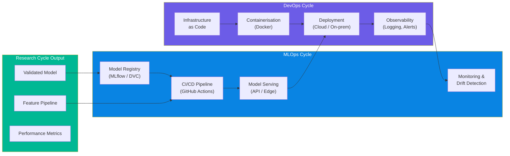

| Cycle | Stage | Description | Tools |
|-------|-------|-------------|-------|
| **MLOps** | Model Registry | Version and catalogue trained models | MLflow / DVC / W&B |
| **MLOps** | CI/CD Pipeline | Automated testing, validation, deployment | GitHub Actions |
| **MLOps** | Model Serving | Deploy as APIs or edge inference | FastAPI / ONNX Runtime |
| **MLOps** | Monitoring | Track production performance, detect drift | Custom dashboard / Prometheus |
| **DevOps** | Infrastructure as Code | Reproducible environments | Docker, docker-compose |
| **DevOps** | Containerisation | Package applications with dependencies | Docker |
| **DevOps** | Deployment | Push to production | GitHub Actions, SSH |
| **DevOps** | Observability | Logging, alerting, monitoring | Grafana, custom logging |

---

#### 5.10 Dual-Cycle Integration Points

The research and business cycles run in parallel with defined handoff points:

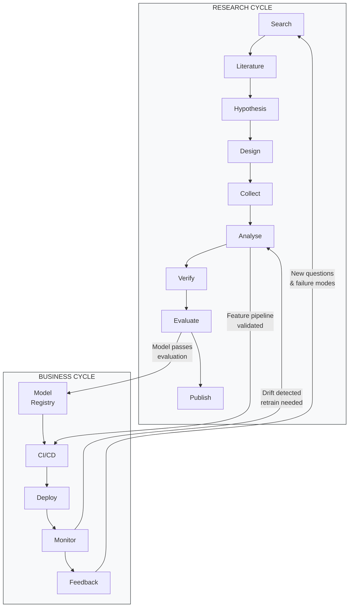

| Handoff | From | To | Trigger | FORGE Artefact |
|---------|------|----|---------|----------------|
| **Model Promotion** | Research Stage 14 | MLOps (Model Registry) | Model passes go/no-go criteria | ADR documenting promotion decision |
| **Pipeline Transfer** | Research Stage 11 | MLOps (CI/CD) | Feature pipeline validated and tested | TN documenting the pipeline |
| **Drift Retrain** | Business (Monitoring) | Research Stage 11 | Model performance degrades below threshold | New EXP Proposal for retraining |
| **New Discovery** | Business (Feedback) | Research Stage 1 | New failure modes or customer requests | New backlog entry |

---

#### 5.11 Sprint Mapping

Research stages map to sprint types. Each sprint is 2 weeks. An 18–24 month project contains approximately 36–48 sprints.

| Sprint Type | Duration | Research Stages | Content |
|-------------|----------|-----------------|---------|
| **Literature Sprint** | 2 weeks | Stages 1–2 | Literature search, review, annotation |
| **Design Sprint** | 2 weeks | Stages 3–6 | Hypothesis, design, simulation |
| **Experiment Sprint** | 2 weeks | Stages 7–8 | Equipment setup, data collection |
| **Analysis Sprint** | 2 weeks | Stages 9–13 | Documentation, analysis, interpretation |
| **Review Sprint** | 1 week | Stage 14 | Evaluation, radar update, gate review |
| **Writing Sprint** | 2 weeks | Stage 15 | Report, thesis chapter, paper draft |

**Stage-Gate Overlay:**

```mermaid
flowchart LR
    SG0["GATE 0\nProject Setup"]
    SG1["GATE 1\nLiterature Complete"]
    SG2["GATE 2\nDesign Approved"]
    SG3["GATE 3\nData Collection\nComplete"]
    SG4["GATE 4\nAnalysis Complete"]
    SG5["GATE 5\nThesis / Publication\nSubmitted"]

    SG0 -->|"Stages 1-2\nSprints 1-3"| SG1
    SG1 -->|"Stages 3-6\nSprints 4-6"| SG2
    SG2 -->|"Stages 7-10\nSprints 7-12"| SG3
    SG3 -->|"Stages 11-14\nSprints 13-18"| SG4
    SG4 -->|"Stage 15\nSprints 19-24"| SG5

    style SG0 fill:#e17055,color:#fff
    style SG1 fill:#fdcb6e,color:#2d3436
    style SG2 fill:#00b894,color:#fff
    style SG3 fill:#0984e3,color:#fff
    style SG4 fill:#6c5ce7,color:#fff
    style SG5 fill:#2d3436,color:#fff
```

**Gate Review Checklist:**

| Gate | Review By | Key Deliverables | Go/No-Go Criteria |
|------|-----------|------------------|--------------------| 
| **Gate 0** | Supervisor | DMP, GitHub repo, DVC configured, ORCID registered | All infrastructure operational |
| **Gate 1** | Supervisor + Industry | Literature chapter draft, gap analysis, Zotero library | ≥30 papers reviewed, gaps clearly stated |
| **Gate 2** | Supervisor + Industry | Test protocol, sensor placement, simulation results | Feasibility confirmed, test matrix approved |
| **Gate 3** | Supervisor | All datasets collected, DVC-tracked, metadata complete | All wear states represented, FAIR compliance verified |
| **Gate 4** | Supervisor + Industry | Model evaluation report, reproducibility confirmed | Accuracy meets threshold, `dvc repro` passes |
| **Gate 5** | University | Thesis submitted, paper submitted, data published | All IP cleared, Zenodo DOI minted |

---

#### 5.12 Entry & Exit Criteria

Every stage has explicit criteria for entering and leaving it. This prevents "work drift" where a researcher moves to analysis before data collection is complete.

| Stage | Entry Criteria | Exit Criteria |
|-------|----------------|---------------|
| 1. Search & Discovery | Project initiation approved | Problem statement documented |
| 2. Literature Review | Problem statement exists | ≥30 papers reviewed, gap analysis written |
| 3. Hypothesis | Gap analysis complete | EXP Proposal written and submitted |
| 4. Gap Identification | Literature review complete | Gap analysis approved by supervisor |
| 5. Study Design | Hypothesis approved | Test protocol written and reviewed |
| 6. Simulation | Test protocol exists | Feasibility confirmed or design revised |
| 7. Setup | Design approved (Gate 2) | Equipment calibrated, ELN entry created |
| 8. Data Collection | Setup complete, ELN entry exists | All datasets collected per test matrix |
| 9. Documentation | Data collection session complete | metadata.json written, anomalies logged |
| 10. Storage & VC | Documentation complete | `dvc add` + `dvc push` confirmed, backup verified |
| 11. Analysis | Data versioned and accessible | Features extracted, models trained, MLflow logged |
| 12. Interpretation | Analysis complete | EXP Report written with statistical interpretation |
| 13. Verification | Interpretation documented | `dvc repro` produces identical results |
| 14. Evaluation | Verification passed | Go/No-Go decision recorded (ADR), Radar updated |
| 15. Report & Publish | Evaluation passed (Gate 4) | Thesis/paper submitted, dataset published with DOI |

---

#### 5.13 ISO 13374 Alignment

The research lifecycle stages map to the ISO 13374-1 condition monitoring data processing chain [9]. This alignment ensures FORGE experiments are traceable to international standards.

##### ISO 13374 Data Processing Chain

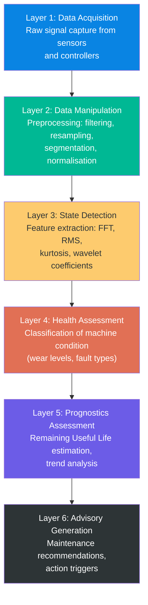

##### Research Lifecycle ↔ ISO 13374 Mapping

| Research Stage | ISO 13374 Layer | What Happens |
|----------------|-----------------|--------------|
| 7–8: Setup & Data Collection | ISO Layer 1 | Raw signals captured from gantry sensors |
| 9–10: Documentation & Storage | ISO Layer 1→2 | Metadata written, data preprocessed and versioned |
| 11: Analysis (preprocessing) | ISO Layer 2 | Filtering, resampling, segmentation applied |
| 11: Analysis (features) | ISO Layer 3 | FFT, RMS, kurtosis, wavelets extracted |
| 12: Interpretation | ISO Layer 4 | Wear state classification, fault type identification |
| 13–14: Verification & Evaluation | ISO Layer 5 | RUL prediction validated, production readiness assessed |
| 14: Evaluation (advisory) | ISO Layer 6 | Maintenance recommendations generated |

##### FORGE Layer ↔ ISO 13374 Mapping

| FORGE Layer | ISO 13374 Layer(s) | Coverage Status |
|-------------|---------------------|-----------------|
| **L1: Knowledge Commons** | ISO Layer 2 (Data Manipulation) | ✅ Covered |
| **L2: Experiment Engine** | ISO Layer 3 (State Detection) + Layer 4 (Health Assessment) | ✅ Covered |
| **L3: Data Foundation** | ISO Layer 1 (Data Acquisition) | ✅ Covered |
| **L4: Portfolio Intelligence** | ISO Layer 5 (Prognostics Assessment) | ⚠️ Partially covered |
| **L5: Product & Delivery** | ISO Layer 6 (Advisory Generation) | ⚠️ Future |

##### Condition Monitoring Feature Reference

**Time-Domain Features (ISO Layer 2–3):**

| Feature | Formula/Method | Python Tool | Use Case |
|---------|---------------|-------------|----------|
| **RMS** | √(1/N · Σxᵢ²) | `numpy.sqrt(numpy.mean(x**2))` | Overall vibration level |
| **Peak-to-Peak** | max(x) - min(x) | `numpy.ptp(x)` | Signal amplitude range |
| **Crest Factor** | peak / RMS | Custom | Early bearing fault detection |
| **Kurtosis** | Normalised 4th moment | `scipy.stats.kurtosis(x)` | Impulsive fault detection |
| **Skewness** | Normalised 3rd moment | `scipy.stats.skew(x)` | Asymmetric fault patterns |

**Frequency-Domain Features (ISO Layer 2–3):**

| Feature | Method | Python Tool | Use Case |
|---------|--------|-------------|----------|
| **FFT Spectrum** | Fast Fourier Transform | `numpy.fft.fft(x)` | Frequency content analysis |
| **Power Spectral Density** | Welch's method | `scipy.signal.welch(x)` | Energy distribution across frequencies |
| **Spectral Centroid** | Weighted mean frequency | `librosa.feature.spectral_centroid` | Dominant frequency shift |
| **Spectral Entropy** | Shannon entropy of PSD | Custom | Signal complexity/randomness |

**Time-Frequency Features (ISO Layer 2–3):**

| Feature | Method | Python Tool | Use Case |
|---------|--------|-------------|----------|
| **STFT** | Short-Time Fourier Transform | `scipy.signal.stft(x)` | Time-varying frequency content |
| **Wavelet Coefficients** | Continuous/Discrete WT | `pywt.wavedec(x)` | Multi-resolution analysis |
| **Envelope Analysis** | Hilbert transform | `scipy.signal.hilbert(x)` | Bearing fault harmonics |
| **MFCC** | Mel-Frequency Cepstral Coefficients | `librosa.feature.mfcc` | Spectral shape features |

**Classification & Prognostic Methods (ISO Layer 4–5):**

| Method | ISO Layer | Python Tool | Use Case |
|--------|-----------|-------------|----------|
| **SVM Classifier** | Layer 4 | `sklearn.svm.SVC` | Wear state classification |
| **Random Forest** | Layer 4 | `sklearn.ensemble.RandomForestClassifier` | Multi-class fault detection |
| **1D-CNN** | Layer 4 | `torch.nn.Conv1d` | Raw signal fault classification |
| **Autoencoder** | Layer 4 | `torch.nn.Module` | Anomaly detection |
| **LSTM / Transformer** | Layer 5 | `torch.nn.LSTM` | RUL time-series prediction |
| **Degradation Trend** | Layer 5 | `scipy.optimize.curve_fit` | Health indicator trend fitting |

---

**Section 5 Citations:**

> [9] ISO 13374-1:2003. *Condition monitoring and diagnostics of machines — Data processing, communication and presentation — Part 1: General guidelines.* International Organization for Standardization. — *Defines the 6-layer data processing chain that FORGE's research lifecycle maps to. See also ISO 13374-2:2007 for processing details.*
>
> [10] ISO 17359:2018. *Condition monitoring and diagnostics of machines — General guidelines.* International Organization for Standardization. — *Guides selection of monitoring parameters; referenced when justifying signal choices in Experiment Proposals.*
>
> [11] ISO 13379-1:2012. *Condition monitoring and diagnostics of machines — Data interpretation and diagnostics techniques — Part 1: General guidelines.* International Organization for Standardization. — *Informs feature engineering methodology and fault classification approaches.*

### 6. Failure Integration

> **A dead end is not a failure. It is a confirmed negative result with the same epistemic value as a positive one.**

In research, knowing what does *not* work is as valuable as knowing what does. The most expensive failure is the one that is repeated because it was never documented. NASA's Lessons Learned Information System exists because both the Challenger and Columbia disasters had documented precursor lessons that were never consulted (see §2.5).

FORGE treats failure documentation as **mandatory, not optional** (SOP-004). This section defines *how* to extract maximum learning from failures.

#### 6.1 The Failure-First Philosophy

| Scenario | Cost |
|----------|------|
| Student tries approach that was already tried and abandoned | 2–4 weeks wasted |
| Team member leaves, taking knowledge of what didn't work | Future team repeats the same dead ends |
| Failure is blamed on a person rather than the approach | Team hides future failures; system loses its most valuable input |
| Dead end is recorded but without root cause analysis | Next attempt makes the same mistake in a different form |

Cannon & Edmondson [12] identify three barriers to organisational learning from failure: (1) difficulty identifying failure, (2) difficulty analysing failure, and (3) difficulty with deliberate experimentation. FORGE's structured processes directly address all three.

#### 6.2 Failure Spectrum (Experiment vs. Process)

Not all failures are the same. FORGE distinguishes between two fundamentally different types:

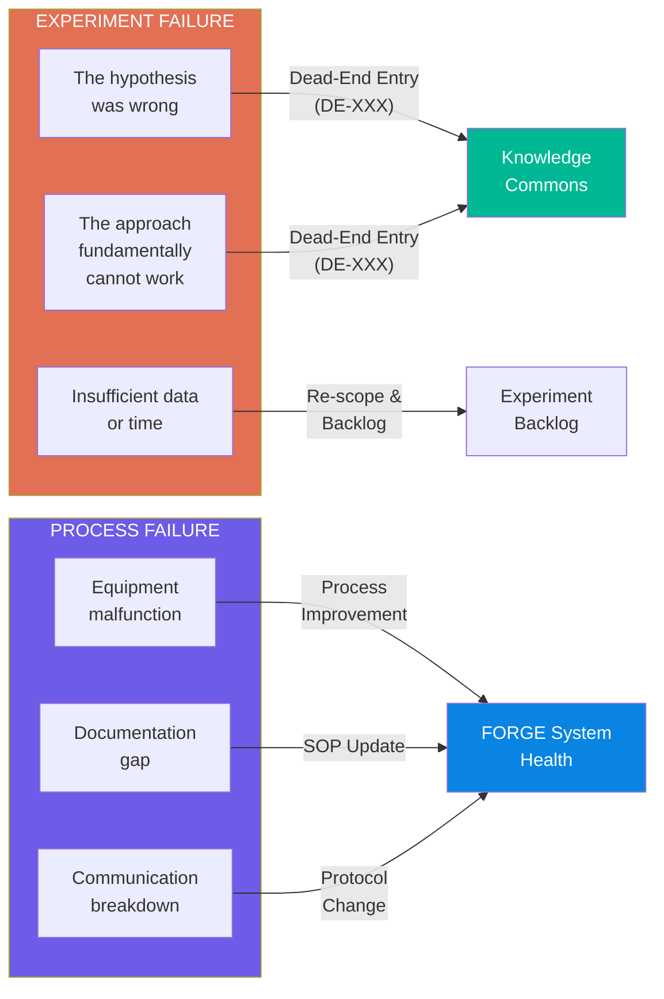

**Failure Classification:**

| Type | Sub-type | Description | Action | FORGE Artefact |
|------|----------|-------------|--------|----------------|
| **Experiment Failure** | Hypothesis refuted | Approach tested correctly; does not work | Dead-End Entry + Radar update | DE-XXX |
| **Experiment Failure** | Fundamental limitation | Cannot work due to physics, math, or data constraints | Dead-End Entry (high confidence) | DE-XXX |
| **Experiment Failure** | Insufficient resources | Might work but needs more data, time, or compute | Re-scope and return to backlog | Updated EXP Proposal |
| **Process Failure** | Equipment/tooling | Hardware broke, software crashed, DAQ misconfigured | Equipment fix + SOP update | SOP amendment |
| **Process Failure** | Documentation gap | Information was needed but not documented | Create missing TN/ADR | TN-XXX or ADR-XXX |
| **Process Failure** | Communication | Decision was made but not shared | Protocol update | SOP-008 amendment |

#### 6.3 Root Cause Analysis Methods

##### 6.3.1 Five Whys

Ask "Why?" five times to drill from symptom to root cause. Stop when you reach a cause you can act on.

**Example:**

| Level | Question | Answer |
|-------|----------|--------|
| Why 1 | Why did the SVM classifier achieve only 45% accuracy? | Feature set was not discriminative for wear levels 2–3 |
| Why 2 | Why was the feature set not discriminative? | Time-domain features (RMS, peak) don't capture frequency-domain differences |
| Why 3 | Why were only time-domain features used? | Feature extraction script was copied from a bearing fault tutorial |
| Why 4 | Why was a bearing tutorial used for a gantry problem? | No FORGE technique note existed for gantry-specific feature extraction |
| Why 5 | Why didn't a technique note exist? | This was the first feature extraction experiment |

**Root cause:** Missing domain-specific TN
**Action:** Create TN for gantry feature extraction (frequency-domain emphasis)

##### 6.3.2 Fishbone / Ishikawa Diagram

Categorise potential causes across six dimensions:

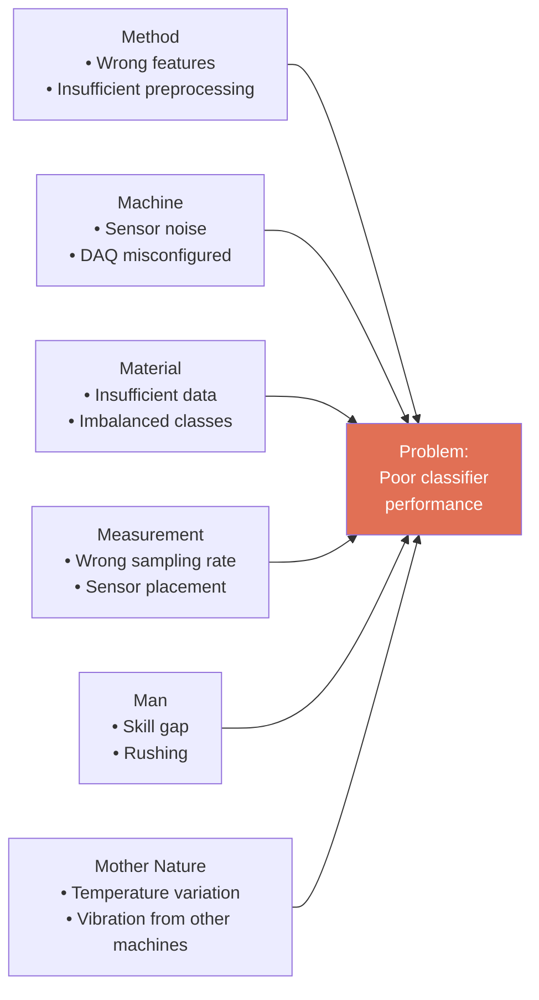

##### 6.3.3 Pre-mortem Analysis (for Proposals)

Before starting an experiment, ask: *"Imagine this experiment failed. What went wrong?"*

Add to every Experiment Proposal:

```markdown
## Pre-mortem

If this experiment fails, the most likely causes are:
1. [Cause 1] — Mitigation: [action]
2. [Cause 2] — Mitigation: [action]
3. [Cause 3] — Mitigation: [action]
```

#### 6.4 Persist / Pivot / Abandon Framework

When an experiment isn't working, there are three options. This framework provides quantitative triggers to decide.

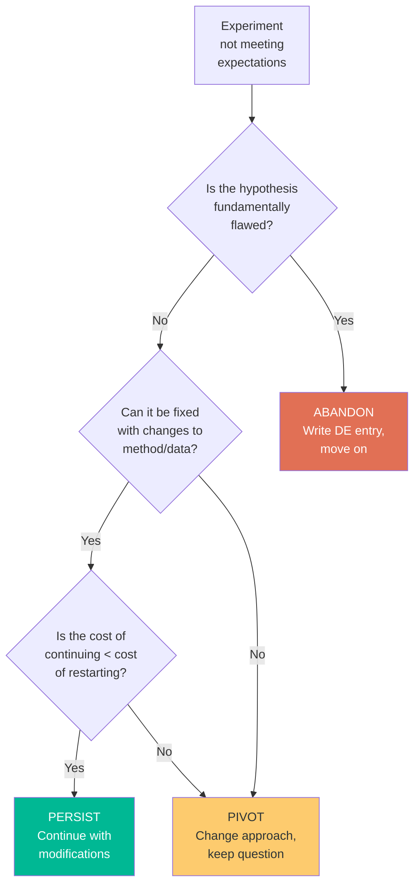

**Decision Triggers:**

| Decision | Trigger Conditions | Required Evidence |
|----------|-------------------|-------------------|
| **Persist** | Problem is in execution, not approach; fix is clear and < 1 week effort | Experiment Log showing specific failure point |
| **Pivot** | Hypothesis is sound but method is wrong; alternative method identified | Alternative EXP Proposal drafted |
| **Abandon** | Hypothesis refuted by data; no reasonable modification will work | Statistical evidence + expert review |

**Quantitative Thresholds:**

| Metric | Persist | Pivot | Abandon |
|--------|---------|-------|---------|
| Time spent vs. estimate | < 150% | 150–250% | > 250% |
| Key metric vs. target | > 70% of target | 40–70% of target | < 40% of target |
| Root cause identified | Yes, fixable | Yes, requires different approach | Yes, fundamental |
| Expert confidence | "Can be fixed" | "Need to try something else" | "This cannot work" |

#### 6.5 Dead-End Registry Feed-Forward

Dead-End entries are not just archives — they actively improve the system:

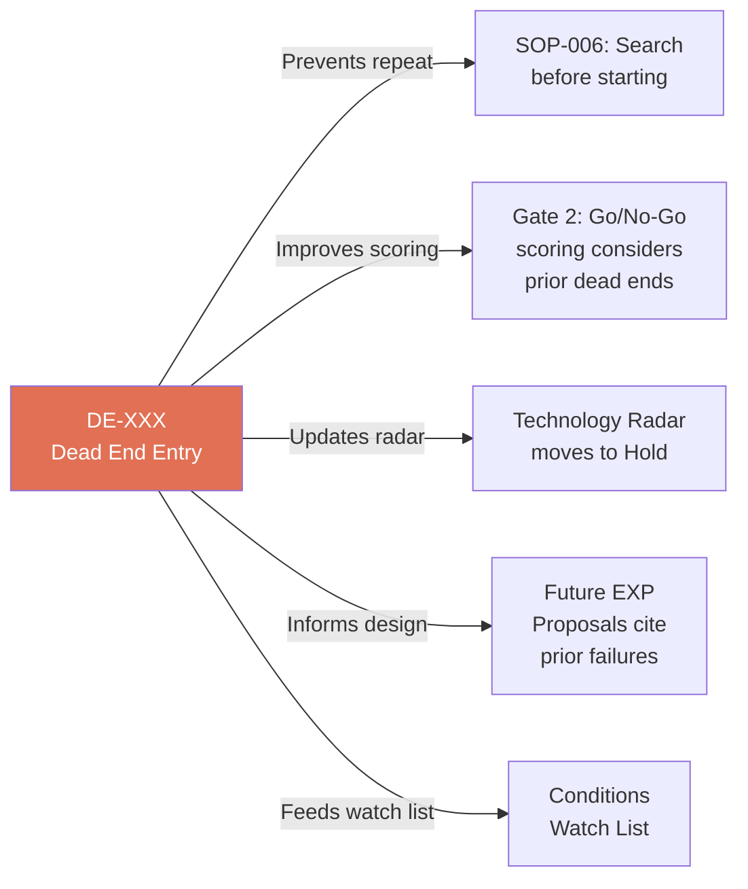

**Mandatory Citation Rule:** Every Experiment Proposal must search the Dead-End Registry (SOP-006) and cite any relevant prior failures:

```markdown
## Prior Dead Ends Reviewed
- [x] Searched `knowledge-commons/dead-end-registry/`
- DE-003: [Title] — Relevant because [reason]. Conditions have changed because [explanation].
- No relevant dead ends found: [confirm search terms used]
```

**Conditions Watch List:** Some dead ends become viable when conditions change. The Watch List tracks these and is reviewed quarterly during Radar Review (SOP-003).

| DE Entry | Condition That Would Revive | Current Status | Last Checked |
|----------|---------------------------|----------------|-------------|
| DE-003 | Dataset size exceeds 10,000 labelled samples | Current: 500 samples | 2026-Q2 |
| DE-005 | GPU compute available for training | Currently CPU-only | 2026-Q2 |
| DE-007 | New sensor type provides better SNR | No change | 2026-Q2 |

**Watch List Review Cadence:**
- **Quarterly:** During Radar Review (SOP-003), scan the Watch List
- **On trigger:** When a condition changes (new data collected, new tool acquired), check the Watch List
- **On revival:** If a dead end becomes viable, create a new EXP Proposal citing the original DE entry

#### 6.6 Blameless Post-Mortems

**Ground Rules:**

1. **Focus on the system, not the person** — "The process allowed X to happen" not "Person Y made a mistake"
2. **Assume good intent** — Everyone was trying to do the right thing with the information they had
3. **Celebrate the documentation** — The person who writes the best DE entry gets more recognition than the person who succeeds by luck
4. **No punishment for reporting failures** — If failures are punished, they will be hidden
5. **Facts first, opinions second** — Start with data and timeline before interpretation

Edmondson [13] demonstrates that psychological safety — the shared belief that the team is safe for interpersonal risk-taking — is the critical enabler for learning behaviour. Teams that feel safe to report failures learn faster.

**Retrospective Formats:**

| Format | Duration | When | Output |
|--------|----------|------|--------|
| **Quick Retrospective** | 5 minutes | Every experiment (success or failure) | Added to Experiment Report |
| **Deep Retrospective** | 30 minutes | Significant failures or milestones | Meeting notes in `reports/monthly/` |

**Quick Retrospective Template** (added to every Experiment Report):

```markdown
## Retrospective

### What went well?
- [List positives — even from failed experiments]

### What didn't go well?
- [List problems — be specific and factual]

### What would we do differently?
- [List concrete changes for next time]

### What did we learn that we didn't expect?
- [Unexpected insights — often the most valuable output]
```

**Deep Retrospective Agenda:**

| Time | Activity |
|------|----------|
| 0–5 min | Facilitator sets the frame: "We are here to learn, not to blame" |
| 5–10 min | Timeline: What happened, in chronological order? |
| 10–20 min | Root Cause Analysis: Why did it happen? (use methods from §6.3) |
| 20–25 min | Lessons: What did we learn? What would we do differently? |
| 25–30 min | Actions: What specific changes will we make? Who owns each? |

**Post-Mortem Template:**

```markdown
# Post-Mortem: [EXP-XXX] [Title]

**Date:** [YYYY-MM-DD]
**Facilitator:** [Name]
**Attendees:** [Names]

## Timeline
| Date | Event |
|------|-------|
| [date] | [what happened] |

## Root Cause Analysis
[Method used: 5 Whys / Fishbone / other]
[Analysis results]

## Root Cause (Final)
[One-sentence root cause statement]

## Contributing Factors
- [Factor 1]
- [Factor 2]

## Lessons Learned
1. [Lesson — actionable]
2. [Lesson — actionable]

## Action Items
- [ ] [Owner]: [Action] — due [date]
- [ ] [Owner]: [Action] — due [date]

## Artefacts Created
- [ ] DE-XXX: [Dead-End Entry]
- [ ] TN-XXX: [Technique Note, if applicable]
- [ ] ADR-XXX: [Decision Record, if applicable]
```

#### 6.7 Team Health Indicators

| Healthy Signal | Unhealthy Signal |
|---------------|-----------------|
| DE entries are written promptly and thoroughly | Failures are mentioned verbally but never documented |
| Team freely discusses what went wrong | Team avoids discussing failures |
| DE entries include "Conditions That Might Change" | DE entries are final verdicts with no forward-looking section |
| New team members search DEs before proposing experiments | New team members propose experiments that repeat known dead ends |
| Dead-end rate is 15–30% | Dead-end rate is 0% (avoiding risk) or > 50% (not scoping well) |

**Preventing Dead-End Fatigue:**

When too many experiments fail consecutively, morale can drop. Mitigation strategies:

1. **Alternate experiment types** — Schedule one "safe" exploitation experiment between exploratory ones
2. **Celebrate the learning** — Each DE entry should answer: "What do we now know that we didn't before?"
3. **Track the compound effect** — Show how many future weeks of wasted effort each DE prevents
4. **Quick wins** — Keep some small, achievable experiments in the backlog as morale boosters

**Recognition for Valuable Dead Ends:**

| Recognition | Trigger | Format |
|-------------|---------|--------|
| **"Best DE of the Month"** | Monthly Review (SOP-005) | Shout-out in meeting notes |
| **DE citation count** | When a DE is cited by 3+ future proposals | Note in the DE entry |
| **Pre-mortem accuracy** | Pre-mortem correctly predicted a failure mode | Note in the post-mortem |

---

**Section 6 Citations:**

> [12] Cannon, M.D. & Edmondson, A.C. (2005). "Failing to Learn and Learning to Fail (Intelligently): How Great Organizations Put Failure to Work to Innovate and Improve." *Long Range Planning*, 38(3), pp. 299–319. DOI: [10.1016/j.lrp.2005.04.005](https://doi.org/10.1016/j.lrp.2005.04.005). — *Identifies three barriers to learning from failure (identifying, analysing, experimenting) and six recommendations for action; the theoretical basis for FORGE's structured retrospective format.*
>
> [13] Edmondson, A.C. (1999). "Psychological Safety and Learning Behavior in Work Teams." *Administrative Science Quarterly*, 44(2), pp. 350–383. DOI: [10.2307/2666999](https://doi.org/10.2307/2666999). — *Demonstrates that psychological safety is the critical enabler for team learning behaviour; underpins FORGE's blameless post-mortem protocol and failure celebration practices.*

---

## Part IV — Governance

### 7. Collaboration Protocol

FORGE manages a **distributed university-industry R&D collaboration** where the industry partner provides funding, problem definition, equipment access, and industry context, while the university provides research talent, academic supervision, and publication pathways.

#### 7.1 Design Principles

1. **Project-agnostic** — This protocol can be instantiated for any university partnership
2. **Remote-first** — All processes are designed for distributed teams across timezones
3. **Async by default** — Synchronous meetings are reserved for decisions and reviews; status updates happen asynchronously
4. **Transparent by design** — All decisions, progress, and blockers are visible to all stakeholders via the FORGE repository
5. **Academic freedom preserved** — Students choose their research methodology within FORGE's framework; the industry partner provides direction, not micro-management

**Collaboration Structure:**

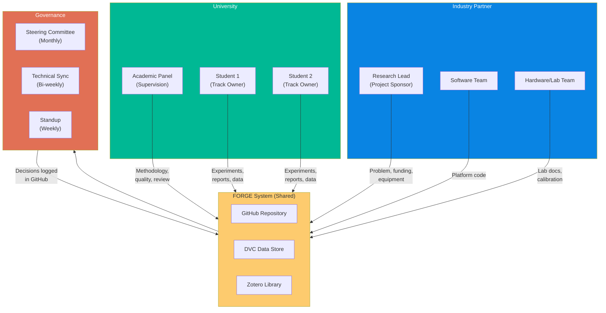

#### 7.2 Stakeholder Roles (RACI Matrix)

**Role Definitions:**

| Role | Organisation | Responsibilities |
|------|-------------|------------------|
| **Research Lead** | Industry Partner | Project sponsor, problem definition, funding, industry context, FORGE system owner, progress monitoring |
| **Academic Panel** | University | Methodology guidance, thesis oversight, academic quality assurance, publication review |
| **Student Researcher** | University | Experiment execution, data collection, analysis, report writing, FORGE documentation |
| **Software Team** | Industry Partner | Platform development (Layer 5), data pipeline tools, CI/CD |
| **Hardware/Lab Team** | Industry Partner | Equipment setup, sensor calibration, lab access coordination |

**RACI Matrix:**

| Activity | Research Lead | Academic Panel | Student | Software Team |
|----------|:------------:|:--------------:|:-------:|:------------:|
| Problem definition | **A** | C | I | I |
| Research methodology | C | **A** | **R** | I |
| Experiment proposal | C | **A** | **R** | I |
| Experiment execution | I | C | **R/A** | I |
| Data collection | C | I | **R/A** | C |
| Data analysis & ML | I | C | **R/A** | C |
| Experiment report | I | **A** | **R** | I |
| Thesis writing | I | **A** | **R** | — |
| Publication submission | **A** | **R** | **R** | I |
| IP classification | **A** | C | I | I |
| Platform development | **A** | — | I | **R** |
| FORGE system updates | **R/A** | I | C | C |

> **R** = Responsible, **A** = Accountable, **C** = Consulted, **I** = Informed

#### 7.3 Contribution Interface

All university contributions follow the same process as internal contributions:

1. **Same templates** — Students use the same EXP Proposal, EXP Report, TN, ADR, and DE templates as internal staff
2. **Same review process** — All contributions submitted via GitHub Pull Request and reviewed before merge
3. **Same documentation standards** — "Document first, present second" applies to all contributors
4. **Mandatory onboarding** — Every new student completes the SOP-001 onboarding process (adapted for remote)

**Contribution Types by Role:**

| Contributor | Expected Outputs | Frequency |
|-------------|------------------|-----------|
| **Student (Track Owner)** | EXP Proposals, EXP Reports, TN/DE/ADR, data + code commits | Weekly commits, monthly EXP Report minimum |
| **Academic Panel** | PR reviews, methodology feedback, thesis chapter reviews | Bi-weekly review cycle |
| **Research Lead** | Portfolio decisions, Gate reviews, Radar updates, monthly reports | Weekly oversight, monthly formal review |
| **Software Team** | Platform code, CI/CD pipelines, tool integrations | Sprint-based delivery |

#### 7.4 Meeting Cadence

| Meeting | Frequency | Duration | Attendees | Purpose | Notes Location |
|---------|-----------|----------|-----------|---------|----------------|
| **Standup** | Weekly (Mon) | 30 min | Students + Research Lead | Progress, blockers, week plan | Async in GitHub Discussion (if timezone conflict) |
| **Technical Sync** | Bi-weekly (Tue) | 60 min | All researchers + supervisors | Deep technical review, methodology | `reports/monthly/` meeting notes |
| **Steering Committee** | Monthly (Last Fri) | 90–120 min | All stakeholders | Portfolio review, gate decisions, KPIs | `reports/monthly/YYYY-MM.md` |
| **Radar Review** | Quarterly | 60 min | Research Lead + track owners | Technology Radar update | `technology-radar/radar.md` |

**Async Communication Protocol:**

| Channel | Use For | Response SLA | Tool |
|---------|---------|-------------|------|
| **GitHub Pull Requests** | All document and code reviews | 48 hours | GitHub |
| **GitHub Discussions** | Decisions, open questions, async standups | 24 hours | GitHub |
| **GitHub Issues** | Bug reports, feature requests, experiment backlog | 72 hours | GitHub |
| **Slack/Teams Channel** | Quick questions, informal discussion | Same day | Slack or Teams |
| **Email** | Formal communications, university admin | 48 hours | Email |

**Decision Logging:**

1. **Where:** GitHub Discussions (tagged `decision`)
2. **Format:** One-line decision + rationale + who decided + date
3. **Archive:** Significant decisions also captured in monthly report and/or ADR
4. **Rule:** If it's not in writing, it didn't happen

**Timezone Management:**
- All meeting times shared in UTC with local time conversions
- Async communication is the default; synchronous meetings are the exception
- Meeting recordings available for anyone who cannot attend live

#### 7.5 Alignment Without Micromanagement

The industry partner sets the **what** (research questions, problem domain, success criteria) and **constraints** (timeline, equipment, IP boundaries). Students and supervisors choose the **how** (methodology, algorithms, experimental approach).

| Industry Partner Controls | University Controls |
|--------------------------|---------------------|
| Research questions and priorities | Research methodology |
| Equipment and lab access | Experiment design details |
| IP classification decisions | Algorithm and tool selection |
| Publication review timing | Thesis structure and content |
| Portfolio-level resource allocation | Day-to-day work scheduling |
| FORGE system design and SOPs | Academic writing style |

**Autonomy Indicators:**

| Healthy Signal | Unhealthy Signal |
|---------------|-----------------|
| Students propose experiments independently | Students only execute assigned tasks |
| Dead-end entries are written without prompting | Failures are hidden or under-reported |
| Students challenge methodology suggestions | Students accept all suggestions without question |
| Experiment reports contain unexpected findings | Reports only confirm expected outcomes |
| Students contribute to FORGE system improvements | Students view FORGE as overhead |

**Intervention Triggers** (Research Lead should intervene only when):

1. **Silence** — No commits, no reports, no standup updates for > 2 weeks
2. **Drift** — Work has diverged significantly from research questions without an ADR explaining why
3. **Risk** — IP is at risk, equipment is being misused, or safety concerns arise
4. **Stagnation** — Same experiment running > 6 weeks with no intermediate results reported

**Escalation Paths:**

| Situation | First Action | Escalate To | Timeline |
|-----------|-------------|-------------|----------|
| Student stuck for > 1 week | Discuss with track peer or Research Lead | Academic supervisor | Within 5 days |
| Methodology disagreement | Document both positions in GitHub Discussion | Steering Committee | Next scheduled meeting |
| Equipment/lab access blocked | Email Research Lead + Hardware Team | Industry partner management | Within 48 hours |
| IP concern identified | Flag in GitHub Discussion (private) | Research Lead immediately | Same day |
| Data quality issue | Document in EXP Report, flag in standup | Track owner + supervisor | Within 1 week |
| Scope creep / timeline risk | Update EXP Proposal with new scope | Steering Committee | Next scheduled meeting |

> **Escalation is not failure.** It is a signal that the system is working — problems are being surfaced, not hidden.

#### 7.6 IP Framework & Publication Protocol

**Work Product Ownership Matrix:**

| Work Product | Owner | Publication Rights | Access Control |
|-------------|-------|-------------------|----------------|
| **Raw experimental data** | Industry Partner | Thesis use (with approval); product use | Private repo, DVC access controlled |
| **Processed/feature data** | Industry Partner | Same as raw | Same as raw |
| **Source code (analysis)** | Industry Partner | Methodology publishable; implementation proprietary | Private repo |
| **Trained ML models** | Industry Partner | Architecture publishable; weights proprietary | Industry partner internal only |
| **Technique Notes** | Industry Partner | Freely publishable (after review) | Public (after review) |
| **Dead-End entries** | Industry Partner | Freely publishable (after review) | Public (after review) |
| **Thesis document** | University/Student | Student decides (subject to review per project agreement) | Public after submission |
| **Journal papers** | Joint authorship | Joint authorship required | Public after acceptance |
| **FORGE system design** | Industry Partner | Open-source (timing at industry partner's discretion) | Currently private |

**IP Protection Rules:**

1. **ELN-first rule:** Every new idea must be recorded in the FORGE repository with a timestamp **before** it is discussed with any external party
2. **Review-before-release:** No data, code, or documentation may be shared outside the FORGE team without Research Lead approval
3. **30-day review window:** The industry partner has 30 days to review any material before university submission for publication
4. **NDA requirement:** All collaborators must sign an NDA before receiving repository access

**Publication Workflow:**

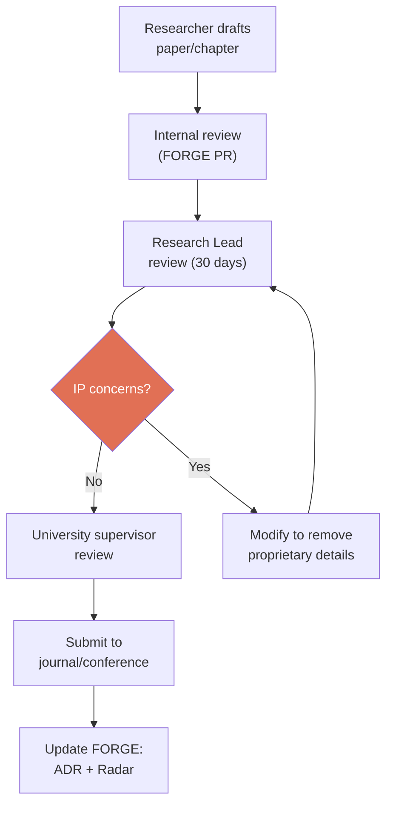

**Authorship Rules:**

1. **All contributors who meet ICMJE criteria** are listed as authors
2. **First author:** The researcher who did the primary work
3. **Last author:** The academic supervisor (academic convention)
4. **Corresponding author:** Agreed case-by-case (typically student for thesis-derived papers)
5. **Acknowledgements:** Industry partner funding and support acknowledged in all publications
6. **Author order disputes:** Resolved by Steering Committee

**Embargo & Pre-publication:**

> Embargo periods and publication review timelines are defined in the project agreement between the industry partner and the university. The terms below are defaults; the signed agreement takes precedence.

- **Zenodo dataset publication:** Only when required for peer-reviewed publication, and only after IP review and clearance
- **Conference presentations:** Slides reviewed by Research Lead 1 week before presentation
- **Preprints (arXiv):** Permitted after industry partner review, before peer review

#### 7.7 Student Lifecycle (Pre-arrival → Handover)

**Phase 1 — Pre-arrival (2 weeks before start):**

- [ ] Sign NDA and collaboration agreement
- [ ] Receive GitHub repository invitation
- [ ] Receive DVC remote access credentials
- [ ] Receive Zotero group library invitation
- [ ] Read: README.md, CONTRIBUTING.md, domain-glossary.md
- [ ] Read: Collaboration Protocol (this section)

**Phase 2 — Onboarding (Weeks 1–2):**

Per SOP-001-onboarding, plus:
- [ ] 1-hour IP awareness briefing with Research Lead
- [ ] Walk through publication review process
- [ ] Understand escalation paths
- [ ] Meet all team members (virtual introductions)
- [ ] Attend first Steering Committee meeting as observer

**Phase 3 — Active Research (Months 1–10):**

- Regular contributions per the Monthly Review cycle
- Minimum one EXP Report per month
- Active participation in all scheduled meetings
- Regular pushes to Git and DVC

**Phase 4 — Thesis Writing (Months 8–12, overlapping with Phase 3):**

- [ ] Thesis outline reviewed by supervisor and Research Lead
- [ ] Each chapter submitted for review as completed
- [ ] Industry partner 30-day review triggered before university submission
- [ ] Final IP clearance obtained

**Phase 5 — Handover (Final month):**

- [ ] All data committed to DVC and pushed
- [ ] All code committed to Git with documentation
- [ ] All experiment reports written and reviewed
- [ ] Knowledge transfer session (60 min) with Research Lead
- [ ] Technique Notes written for any undocumented methods
- [ ] Dead-End entries written for any undocumented failures
- [ ] Final handover report documenting: what was done, what remains, what was learned
- [ ] Repository access downgraded to read-only

> **Critical:** The handover checklist is mandatory, not optional. A student who graduates without completing handover leaves a knowledge gap that may take months to fill.

---

**Section 7 Citations:**

> [14] Fernandes, G. & O'Sullivan, D. (2022). "Project management practices in major university-industry R&D collaboration programs — a case study." *The Journal of Technology Transfer*, 48(1), pp. 313–345. DOI: [10.1007/s10961-021-09915-9](https://doi.org/10.1007/s10961-021-09915-9). — *The PM.UIC framework providing 29 transversal and 30 contingent PM practices for UICs; the direct basis for FORGE's hybrid agile + stage-gate collaboration model. (Cross-ref with §2.6.)*

---

### 8. Data Governance

> **Core Principle:** All research data generated under FORGE is the intellectual property of the industry partner. Data is stored on industry partner-controlled infrastructure and is not shared externally without explicit approval from the Research Lead.

This principle exists because: (1) the industry partner funds the research, equipment, and infrastructure; (2) data contains proprietary information about precision systems; (3) competitors could gain commercial advantage from raw experimental data; (4) IP protection is essential for future commercialisation.

#### 8.1 Data Classification (Confidential / Internal / Public)

| Classification | Description | Examples | Access Level |
|---------------|-------------|----------|-------------|
| **Confidential** | Proprietary data that provides competitive advantage | Raw sensor data, trained model weights, customer machine configurations | Industry partner team only |
| **Internal** | Data shared within the FORGE project team (including university partners under NDA) | Processed feature matrices, experiment results, analysis code | FORGE team (NDA required) |
| **Public — Approved** | Data cleared for external publication | Minimal datasets for paper reproducibility, methodology descriptions | Public (after IP clearance) |

**Classification Rules:**

1. **Default classification is Internal** — all data starts here
2. **Upgrade to Confidential** when data contains: customer-specific configurations, proprietary fault thresholds, model weights with commercial value
3. **Downgrade to Public** only after: Research Lead review + IP clearance + stripping of proprietary details

#### 8.2 Storage Architecture

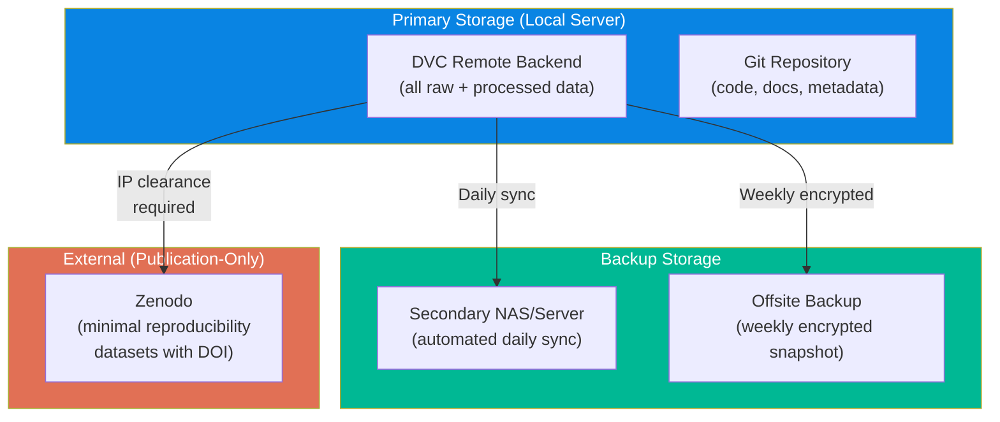

**Infrastructure Requirements:**

| Component | Specification | Purpose |
|-----------|--------------|---------|
| **Primary Server** | Linux server with RAID storage, accessible via SSH/SFTP | DVC remote backend, primary data store |
| **Secondary NAS** | Network-attached storage on separate physical hardware | Automated daily backup |
| **Offsite Backup** | Encrypted external drive or cloud storage (organisation-controlled) | Disaster recovery |
| **GitHub** | Private repository (organisation) | Code, documentation, DVC pointer files |

**DVC Remote Configuration:**

```bash
# Primary remote (local server)
dvc remote add -d primary ssh://[server-ip]/data/forge-dvc
dvc remote modify primary user [username]

# Backup remote (secondary NAS)
dvc remote add backup ssh://[nas-ip]/backup/forge-dvc

# Push to both remotes
dvc push
dvc push -r backup
```

#### 8.3 Access Control

| Role | Git Repo | DVC Primary | DVC Backup | Zenodo |
|------|----------|-------------|------------|--------|
| **Research Lead** | Admin | Full access | Full access | Admin |
| **Software Team** | Write | Full access | Read | — |
| **University Student** | Write (PR-based) | Read + Write (assigned datasets) | No access | No access |
| **Academic Supervisor** | Read | Read (via student) | No access | No access |
| **External Reviewer** | No access | No access | No access | Public only |

**Access Management Rules:**

1. **Student access is time-bounded** — credentials expire at project end date
2. **Students cannot delete data** — DVC remote permissions are write-append only
3. **Post-graduation:** Student access downgraded to read-only, then revoked after 30 days
4. **NDA required** before any repository access is granted
5. **Access audit** — Review all active credentials quarterly

**Credential Management:**

| Credential | Storage | Rotation |
|-----------|---------|----------|
| GitHub SSH keys | User's machine | On role change or annual |
| DVC remote SSH keys | User's machine | On role change or annual |
| Server admin credentials | IT (password manager) | Quarterly |
| Zenodo API token | Research Lead only | Annual |

#### 8.4 Backup & Disaster Recovery (3-2-1 Rule)

> **3 copies** of all data, on **2 different media types**, with **1 copy offsite.**

| Copy | Location | Medium | Frequency | Verification |
|------|----------|--------|-----------|-------------|
| **Copy 1 (Primary)** | Local server | RAID array | Real-time | DVC integrity checks |
| **Copy 2 (On-site backup)** | Secondary NAS | Separate hardware | Daily (automated) | Weekly spot-check |
| **Copy 3 (Off-site)** | Encrypted external or cloud | Different physical location | Weekly | Monthly restore test |

**Backup Automation:**

```bash
# Daily sync script (cron job on primary server)
#!/bin/bash
rsync -avz --delete /data/forge-dvc/ [nas-ip]:/backup/forge-dvc/
echo "$(date): Backup completed" >> /var/log/forge-backup.log

# Weekly offsite snapshot
tar -czf forge-$(date +%Y%m%d).tar.gz /data/forge-dvc/
gpg --encrypt --recipient [admin] forge-$(date +%Y%m%d).tar.gz
# Transfer encrypted archive to offsite location
```

**Disaster Recovery Plan:**

| Scenario | Recovery From | RTO (Recovery Time) | RPO (Recovery Point) |
|----------|--------------|---------------------|---------------------|
| Primary server failure | Secondary NAS | 4 hours | < 24 hours (daily sync) |
| Both on-site failures | Offsite backup | 24 hours | < 7 days (weekly snapshot) |
| Accidental deletion | DVC version history / NAS | 1 hour | < 24 hours |
| Repository corruption | Git remote + DVC cache | 2 hours | Last push |

#### 8.5 Data Sharing Rules

**What Can Be Shared (Under NDA):**

| Data Type | Shareable With University? | Conditions |
|-----------|---------------------------|------------|
| Raw sensor data | ✅ Yes (via DVC access) | Under NDA, time-bounded access |
| Processed features | ✅ Yes | Under NDA |
| Analysis code | ✅ Yes (via Git) | Under NDA, industry partner retains ownership |
| Trained model weights | ❌ No | Confidential — architecture only |
| Model architecture descriptions | ✅ Yes | For thesis and publications |
| Technique Notes | ✅ Yes | After internal review |
| Dead-End entries | ✅ Yes | After internal review |

**What Cannot Be Shared:**

- Customer machine configurations or serial numbers
- Production deployment parameters or thresholds
- Model weights trained on production data
- Internal business strategy or roadmaps
- Raw data from customer sites (if applicable in future)

#### 8.6 External Publication Policy

Zenodo is used **only** when a peer-reviewed publication requires a publicly accessible dataset for reproducibility.

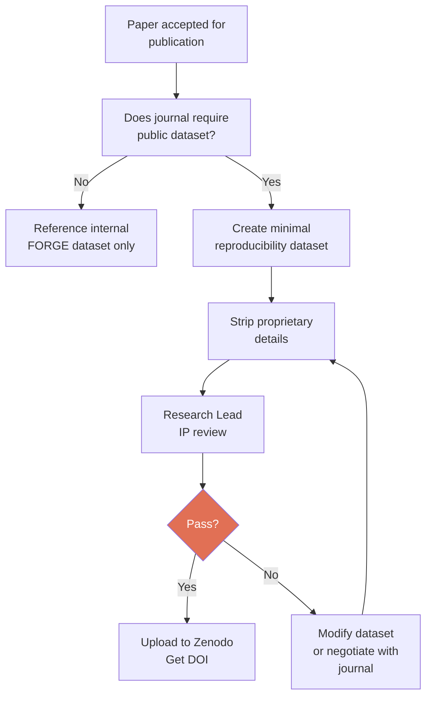

**Minimum Viable Dataset Principle:**

When Zenodo publication is required:
- Upload the **smallest dataset** that enables reproducibility
- Remove all unnecessary channels, metadata, and context
- Aggregate or downsample where possible without losing scientific validity
- Never upload full raw datasets — only processed subsets

#### 8.7 Data Lifecycle & Retention

```mermaid
stateDiagram-v2
    [*] --> Collected: Sensor data acquired
    Collected --> Versioned: DVC add + push
    Versioned --> Backed_Up: Daily sync to NAS
    Backed_Up --> Analysed: Feature extraction + ML
    Analysed --> Reported: Experiment Report written
    Reported --> Archived: Project phase complete

    Archived --> Published: Journal requires DOI
    Published --> Zenodo: IP-cleared subset only

    Archived --> Retained: No publication needed
    Retained --> [*]: Retention period expires

    note right of Collected: metadata.json created
    note right of Versioned: FAIR checklist started
    note right of Published: Research Lead approval
```

**Retention Policy:**

| Data Type | Retention Period | After Retention |
|-----------|-----------------|-----------------|
| Raw sensor data | Project lifetime + 5 years | Archive to cold storage |
| Processed/feature data | Project lifetime + 3 years | Archive or delete |
| Trained models | Project lifetime + 2 years | Archive weights; keep architecture docs |
| Experiment Reports | Permanent | Part of knowledge commons |
| Dead-End entries | Permanent | Part of knowledge commons |

#### 8.8 Compliance Checklist

**For Every New Dataset:**

- [ ] Classification assigned (Confidential / Internal / Public-Approved)
- [ ] `metadata.json` created (per METADATA_TEMPLATE)
- [ ] DVC add + push to primary remote
- [ ] Backup sync confirmed (check NAS)
- [ ] Access permissions verified (who can access this dataset?)
- [ ] FAIR checklist completed in Experiment Report

**Quarterly Audit:**

- [ ] Review all active access credentials
- [ ] Verify backup integrity (restore test on random dataset)
- [ ] Check that no data has been shared externally without approval
- [ ] Review Zenodo publications (are they minimal and IP-safe?)
- [ ] Update access for any personnel changes (new/departing team members)

**On Student Departure:**

- [ ] All student data commits verified and pushed
- [ ] Student DVC credentials revoked
- [ ] Student GitHub access downgraded to read-only (then revoked after 30 days)
- [ ] Knowledge transfer session completed
- [ ] No copies of Confidential data remain on student machines

---

## Part V — Standards & Engineering

### 9. Standards Alignment

FORGE deliberately aligns its processes with international standards. This section catalogues the applicable standards and maps FORGE's implementation to each.

#### 9.1 Project Management Standards (PMBOK, PRINCE2, PM.UIC)

| Standard | Scope | Key Relevance to FORGE |
|----------|-------|----------------------|
| **PMI PMBOK® 7th Edition** (2021) | Global gold standard for PM. 12 performance principles covering stewardship, team, stakeholders, value, systems thinking, leadership, tailoring, quality, complexity, risk, adaptability, and change. | Framework to cite when justifying PM methodology. Supports both predictive (Waterfall) and Agile approaches. |
| **PRINCE2® 7th Edition** (2023) | Process-driven PM framework. 7 Principles, 7 Themes, 7 Processes. Structured around stage gates and business justification. | Aligning milestone gates to PRINCE2 stages resonates with industry partner governance. |
| **ISO 21500:2021** | International PM guidance, neutral and non-commercial. | Cite in thesis Methods section when describing PM approach. |
| **PM.UIC Framework** (Fernandes et al., 2022) [14] | Peer-reviewed framework specifically for University–Industry Collaboration R&D. Lifecycle + transversal governance practices. Validated in Bosch–University of Minho (60M€, 2013–2024). | **Most directly applicable framework to FORGE.** (Cross-ref §2.6.) |
| **Agile / Scrum** | 2-week sprints, planning, standups, review, retrospective. Now part of PMBOK 7. | Each sprint = one experiment cycle, one analysis step, or one documentation milestone. |

**Recommended Hybrid Approach:**

```
STAGE GATE 0      STAGE GATE 1        STAGE GATE 2         STAGE GATE 3
   |                    |                   |                    |
[Setup]---[Sprint 1-3]--[Design]--[Sprint 4-8]--[Validate]--[Sprint 9-12]--[Report]
Literature,           Experimental        Data analysis,       Thesis,
planning              design, testing     findings             publication
```

**Stage Gates** = formal milestones reviewed by both university supervisor and industry partner.
**Sprints** = 2-week iterative cycles of research work between gates.

#### 9.2 Research & Documentation Standards (FAIR, ISO 9001, OSF)

**FAIR Data Principles** (Wilkinson et al., 2016 [3]):

| Principle | Meaning | How FORGE Implements |
|-----------|---------|---------------------|
| **F — Findable** | Data has unique persistent identifier, rich metadata, indexed in searchable resource | Publish on Zenodo → get DOI → add to OSF project page |
| **A — Accessible** | Data retrievable by identifier via open standard protocol | Zenodo/figshare public access OR controlled access with documented conditions |
| **I — Interoperable** | Uses standard formats, vocabularies, ontologies | HDF5 for signals, CSV/Parquet for features, Dublin Core metadata schema |
| **R — Reusable** | Clear usage license, detailed provenance, community standards | CC-BY-4.0 license, README with context, link code version to data version |

**ISO 9001:2015 — Quality Management Systems:**
Industry partners almost certainly operate under ISO 9001. FORGE's documentation structure (version numbers via Git, review and approval via PR, non-conformance logging via DE entries) aligns with their quality culture.

**Open Science Framework (OSF) Pre-registration:**
Pre-registering research questions, hypotheses, and methodology *before* running experiments creates a timestamped public record that: (1) protects intellectual property, (2) prevents HARKing, and (3) is increasingly required by journals.

#### 9.3 Condition Monitoring Standards (ISO 13374, 17359, 13379)

> **These are the standards you MUST cite in your thesis literature review and Methods section.**

| Standard | Full Title | Key Relevance |
|----------|-----------|---------------|
| **ISO 13374-1:2003** | Condition monitoring — Data processing, communication and presentation — Part 1 | Governs how CM data is processed and structured. Directly applicable to signal pipeline. |
| **ISO 13374-2:2007** | Condition monitoring — Part 2: Data processing | Defines 6 processing layers: DA → DM → SD → HA → PA → AG |
| **ISO 17359:2018** | Condition monitoring — General guidelines | Guides selection of monitoring parameters, measurement types, and intervals. |
| **ISO 13379-1:2012** | Condition monitoring — Data interpretation and diagnostics — Part 1 | Frameworks for interpreting signal features to identify fault modes. |
| **ISO 10816-1 / ISO 20816** | Mechanical vibration — Evaluation | Vibration threshold standards for contextualising signal levels. |
| **ISO 55000:2014** | Asset management — Overview, principles and terminology | Frames PdM within broader asset management lifecycle. |
| **IEC 61800-series** | Adjustable speed electrical power drive systems | Standards for the motion control drive system. |

#### 9.4 ISO 13374 ↔ FORGE Layer Mapping

**ISO 13374 Data Processing Chain:**

```mermaid
graph TD
    L1["Layer 1: Data Acquisition\nRaw signal capture from sensors\nand controllers"]
    L2["Layer 2: Data Manipulation\nPreprocessing: filtering, resampling,\nsegmentation, normalisation"]
    L3["Layer 3: State Detection\nFeature extraction: FFT, RMS,\nkurtosis, wavelet coefficients"]
    L4["Layer 4: Health Assessment\nClassification of machine condition\n(wear levels, fault types)"]
    L5["Layer 5: Prognostics Assessment\nRemaining Useful Life estimation,\ntrend analysis"]
    L6["Layer 6: Advisory Generation\nMaintenance recommendations,\naction triggers"]

    L1 --> L2 --> L3 --> L4 --> L5 --> L6

    style L1 fill:#0984e3,color:#fff
    style L2 fill:#00b894,color:#fff
    style L3 fill:#fdcb6e,color:#2d3436
    style L4 fill:#e17055,color:#fff
    style L5 fill:#6c5ce7,color:#fff
    style L6 fill:#2d3436,color:#fff
```

**FORGE Layer ↔ ISO 13374 Mapping:**

| FORGE Layer | FORGE Content | ISO 13374 Layer(s) | Coverage |
|-------------|---------------|---------------------|----------|
| **Layer 1: Knowledge Commons** | Technique Notes for signal processing methods | ISO Layer 2 (Data Manipulation) | ✅ Covered |
| **Layer 2: Experiment Engine** | Feature extraction experiments, ML classification | ISO Layer 3 (State Detection) + Layer 4 (Health Assessment) | ✅ Covered |
| **Layer 3: Data Foundation** | Raw sensor data, HDF5 files, DVC-tracked datasets | ISO Layer 1 (Data Acquisition) | ✅ Covered |
| **Layer 4: Portfolio Intelligence** | Technology Radar assessing RUL techniques | ISO Layer 5 (Prognostics Assessment) | ⚠️ Partial (backlog) |
| **Layer 5: Product & Delivery** | Customer-facing maintenance advisory tools | ISO Layer 6 (Advisory Generation) | ⚠️ Future |

**Research Lifecycle ↔ ISO 13374 Mapping:**

| Research Lifecycle Stage | ISO 13374 Layer | What Happens |
|--------------------------|-----------------|--------------|
| 7–8: Setup & Data Collection | ISO Layer 1 | Raw signals captured from gantry sensors |
| 9–10: Documentation & Storage | ISO Layer 1→2 | Metadata written, data preprocessed and versioned |
| 11: Analysis (preprocessing) | ISO Layer 2 | Filtering, resampling, segmentation applied |
| 11: Analysis (features) | ISO Layer 3 | FFT, RMS, kurtosis, wavelets extracted |
| 12: Interpretation | ISO Layer 4 | Wear state classification, fault type identification |
| 13–14: Verification & Evaluation | ISO Layer 5 | RUL prediction validated, production readiness assessed |
| 14: Evaluation (advisory) | ISO Layer 6 | Maintenance recommendations generated |

**Gap Analysis:**

| ISO Layer | Gap | Action Required |
|-----------|-----|-----------------|
| Layer 5: Prognostics | No RUL experiments executed yet | EXP-005+ (proposed in backlog as "Effects-based RUL") |
| Layer 6: Advisory | No maintenance recommendation system | Future module after validated RUL model exists |

#### 9.5 Condition Monitoring Feature Reference (time/freq/TF domain)

> Note: This is a condensed reference. The full feature tables with Python tools appear in §5.13.

**Experiment Proposal ISO 13374 Template (optional section for every proposal):**

```markdown
## ISO 13374 Compliance (Optional)

**Target Layer(s):** [1-6, select all that apply]

| ISO Layer | Input | Output | Tool/Method |
|-----------|-------|--------|-------------|
| Layer [N] | [describe input data] | [describe output] | [tool used] |

**Standards Referenced:**
- [ ] ISO 13374-1:2003 (Data processing chain)
- [ ] ISO 17359:2018 (Parameter selection)
- [ ] ISO 13379-1:2012 (Data interpretation)
- [ ] ISO 10816/20816 (Vibration evaluation)
```

---

**Section 9 Citations:**

> [15] ISO 13374-1:2003. *Condition monitoring and diagnostics of machines — Data processing, communication and presentation — Part 1: General guidelines.* International Organization for Standardization. — *Defines the 6-layer data processing chain. (Cross-ref with §5.13, [9].)*
>
> [16] ISO 17359:2018. *Condition monitoring and diagnostics of machines — General guidelines.* International Organization for Standardization. — *Guides selection of monitoring parameters. (Cross-ref with §5.13, [10].)*

---

### 10. Software Engineering Standards

> **Standards are not bureaucracy — they are insurance.** They protect the research, the researchers, and the organisation's investment.

#### 10.1 Why Standards Matter in R&D Software

Software in research is often treated as disposable — "just scripts" that produce results for a paper and are then abandoned. This approach fails when:

- A student graduates and nobody can reproduce their results
- A model moves from research to production and the code is unmaintainable
- An IP dispute arises and there is no audit trail of decisions
- A reviewer questions the validity of results and the data pipeline is undocumented

**Following vs. Citing a Standard:**

| | Following a Standard | Citing a Standard |
|---|---|---|
| **What it means** | Your process demonstrably implements the standard's requirements | You reference the standard in your documentation |
| **Value** | Provides actual protection and quality assurance | Provides academic credibility and traceability |
| **Example** | Your CI/CD pipeline enforces code review before merge (following IEEE 730) | Your SOP document states "aligned with IEEE 730" |
| **FORGE approach** | Do both — implement the practice AND cite the standard it derives from |

**How Standards Protect IP, Ensure Reproducibility, and Add Academic Credibility:**

```mermaid
graph LR
    STD["International\nStandards"]

    STD --> IP["IP Protection\n• Timestamped decisions (ADRs)\n• Version-controlled everything\n• Audit trail via Git + DVC"]
    STD --> REP["Reproducibility\n• Deterministic builds\n• Versioned data (DVC)\n• Logged experiments (MLflow)"]
    STD --> CRED["Academic Credibility\n• Citable process references\n• Peer-reviewable methodology\n• FAIR data compliance"]

    style STD fill:#0984e3,color:#fff
    style IP fill:#00b894,color:#fff
    style REP fill:#fdcb6e,color:#2d3436
    style CRED fill:#e17055,color:#fff
```

#### 10.2 Standards Landscape

##### ISO/IEC/IEEE 12207:2017 — Software Lifecycle Processes
- **What it is:** The international standard defining all processes involved in software development, from concept through retirement.
- **Why it matters:** Provides a comprehensive framework for managing the full lifecycle of research software — not just coding, but requirements, design, testing, and maintenance.
- **How FORGE implements it:** The FORGE research lifecycle (§5) maps its 15 stages to ISO 12207 process categories. SOPs 001–009 implement specific lifecycle processes.

##### ISO/IEC/IEEE 15288:2023 — System Lifecycle Processes
- **What it is:** The system-level equivalent of ISO 12207, covering hardware, data, people, and processes.
- **Why it matters:** FORGE's predictive maintenance system includes sensors, data pipelines, ML models, and deployment — it is a *system*, not just software.
- **How FORGE implements it:** The five-layer architecture (§3) maps FORGE's system components across layers.

##### ISO/IEC 25010:2023 — Software Quality Model (SQuaRE)
- **What it is:** Defines eight quality characteristics: functional suitability, performance efficiency, compatibility, usability, reliability, security, maintainability, and portability.
- **Why it matters:** Provides a shared vocabulary for quality. When a code review says "this is not maintainable," ISO 25010 defines exactly what maintainability means: modularity, reusability, analysability, modifiability, and testability.
- **How FORGE implements it:** Code review checklists map review criteria to ISO 25010 quality characteristics.

##### IEEE 730-2014 — Software Quality Assurance
- **What it is:** Defines processes for planning and performing software quality assurance activities, including reviews, audits, testing, and process monitoring.
- **Why it matters:** Establishes the principle that quality must be *planned and built in*, not tested in after the fact.
- **How FORGE implements it:** CI/CD pipelines implement automated quality gates — no code merges without passing linting, tests, and review.

##### IEEE 1012:2016 — Software Verification & Validation
- **What it is:** Defines processes for determining whether software conforms to requirements (verification) and satisfies intended use (validation).
- **Why it matters:** Both are critical in ML systems where a model can be technically correct but practically useless.
- **How FORGE implements it:** Experiment Reports serve as validation documents. CI/CD pipelines perform verification. Go/No-Go scoring (§4.3) provides validation criteria.

##### IEEE 1016:2009 — Software Design Descriptions
- **What it is:** Defines the content and organisation of software design descriptions.
- **Why it matters:** Ensures design decisions are captured in a structured, reviewable format.
- **How FORGE implements it:** Architecture Decision Records (ADRs) in `knowledge-commons/decision-records/`.

##### ISO/IEC 27001:2022 — Information Security (Annex A 8.25)
- **What it is:** The international standard for information security management systems. Annex A, control 8.25 addresses secure software development.
- **Why it matters:** FORGE handles proprietary sensor data, trained ML models, and IP-sensitive research.
- **How FORGE implements it:** Data classification (§8.1), access control matrices (§8.3), NDA requirements (§7.6).

##### ISO 10007:2017 — Configuration Management
- **What it is:** Guidance on configuration management: identification, control, status accounting, and audit.
- **Why it matters:** Prevents the "works on my machine" problem and ensures every result is traceable to a specific configuration.
- **How FORGE implements it:** Git for code, DVC for data, MLflow for experiment configuration logging.

##### FAIR4RS Principles — FAIR for Research Software
- **What it is:** Extension of FAIR data principles specifically to research software. Endorsed by the Research Data Alliance.
- **How FORGE implements it:** Git repositories for findability. CONTRIBUTING.md for accessibility. Standard languages for interoperability. Licensing for reusability.

##### JOSS Guidelines — Journal of Open Source Software
- **What it is:** Publication guidelines for research software papers, emphasising documentation, testing, community guidelines.
- **How FORGE implements it:** Repository structure includes README, CONTRIBUTING.md, tests, and documentation.

##### CFF — Citation File Format
- **What it is:** Standardised `CITATION.cff` file for providing citation metadata for software.
- **How FORGE implements it:** `CITATION.cff` included in any repository intended for external release.

#### 10.3 Standards Traceability Matrix (SOP → Standard mapping)

| FORGE Process | Primary Standard | Clause/Section | Implementation Mechanism |
|---|---|---|---|
| **SOP-001: Onboarding** | ISO 12207:2017 | §6.3.6 Human resource management | Structured onboarding checklist with reading list, tool access, and mentoring |
| **SOP-002: Running Experiments** | ISO 12207:2017 | §6.4.8 Measurement | Experiment proposals with hypothesis, metrics, success criteria |
| **SOP-003: Technology Radar** | ISO 12207:2017 | §6.4.9 Quality assurance | Quarterly technology assessment with evidence-based ring transitions |
| **SOP-004: Dead-End Documentation** | IEEE 730-2014 | §5.2 Process assurance | Mandatory failure documentation with root cause analysis |
| **SOP-005: Monthly Review** | ISO 12207:2017 | §6.4.10 Decision management | Structured review with KPIs, portfolio assessment, documented decisions |
| **SOP-006: Knowledge Retrieval** | ISO 10007:2017 | §5.4 Configuration status accounting | Mandatory search of prior work before new experiments |
| **SOP-007: FAIR Data** | FAIR4RS, ISO 10007 | FAIR Principles, §5.2 | Metadata templates, DOI assignment, data versioning |
| **SOP-008: Communication** | ISO 12207:2017 | §6.1.2 Stakeholder requirements | Defined channels, SLAs, decision logging |
| **SOP-009: Research Lifecycle** | ISO 13374-1:2003 | All layers | 15-stage lifecycle mapped to ISO 13374 chain |
| **SOP-010: Software Development** | ISO 12207:2017 | §6.4.5 Implementation | Development workflow, branching, Definition of Done |
| **SOP-011: Code Review** | ISO 25010:2023 | All quality characteristics | Review checklists mapped to quality model |
| **SOP-012: Git Workflow** | ISO 10007:2017 | §5 Configuration management | Branch strategy, Conventional Commits, SemVer |
| **SOP-013: ML Model Development** | ISO 12207:2017 | §6.4.5 + §6.4.7 | MLOps lifecycle: data → experiment → production |
| **SOP-014: Coding Standards** | ISO 25010:2023 | §4.2 Maintainability | Language-specific conventions, secrets management |
| **SOP-015: Architecture Design** | IEEE 1016:2009 | All viewpoints | C4 model, design review process, ADR workflow |

**ISO 25010 Quality Characteristic Mapping:**

| ISO 25010 Characteristic | Sub-characteristic | FORGE Implementation |
|---|---|---|
| **Functional Suitability** | Functional correctness | Unit tests, acceptance criteria in experiment proposals |
| **Performance Efficiency** | Time behaviour | Inference latency requirements (≤200ms per prediction) |
| **Compatibility** | Interoperability | Standard data formats (HDF5, Parquet, CSV), Dublin Core metadata |
| **Usability** | Operability | Onboarding SOP, domain glossary, CONTRIBUTING.md |
| **Reliability** | Fault tolerance | Dead-end registry, pre-mortem analysis, 3-2-1 backup rule |
| **Security** | Confidentiality | Data classification, access control matrices, NDA requirements |
| **Maintainability** | Modularity | Function limits (50 lines), file limits (500 lines), single responsibility |
| **Maintainability** | Testability | Test coverage requirements (80%), test-driven experiment design |
| **Portability** | Adaptability | Docker containerisation, environment-variable configuration |

#### 10.4 Git Workflow Standards

##### Conventional Commits 1.0.0

All commits in FORGE repositories must follow the [Conventional Commits](https://www.conventionalcommits.org/) specification.

**Format:**
```
<type>(<scope>): <description>

[optional body]

[optional footer(s)]
```

**Commit Types:**

| Type | When to Use | Version Bump |
|------|-------------|-------------|
| `feat` | A new feature or capability | Minor (1.x.0) |
| `fix` | A bug fix | Patch (1.0.x) |
| `docs` | Documentation changes only | None |
| `test` | Adding or updating tests | None |
| `refactor` | Code restructuring without behaviour change | None |
| `perf` | Performance improvement | Patch |
| `ci` | CI/CD pipeline changes | None |
| `chore` | Build process, dependency updates, tooling | None |
| `research` | Experimental work on `research/*` branches only | None |

**Standards Basis:** ISO 10007:2017 (Configuration Management) requires configuration identification and change tracking. Conventional Commits implements this at the atomic commit level.

##### Semantic Versioning 2.0.0

All production releases follow [SemVer](https://semver.org/):

```
MAJOR.MINOR.PATCH

MAJOR: Breaking changes (API changes, incompatible data format changes)
MINOR: New features (backward-compatible additions)
PATCH: Bug fixes (backward-compatible corrections)
```

##### Branch Strategy

```
main          ← Production-ready code only. Protected branch.
│
develop       ← Integration branch. Features merge here first.
│
├── feature/[ticket-id]-[description]
├── fix/[ticket-id]-[description]
├── research/[researcher]-[topic]
└── hotfix/[ticket-id]-[description]
```

**Standards Basis:** ISO 10007:2017 §5.3 (Configuration control) requires that changes are evaluated, approved, and tracked before implementation. Branch protection rules implement configuration control.

#### 10.5 Code Review & Quality Model (ISO 25010 checklists)

Every code review evaluates code against ISO 25010 quality characteristics:

| Quality Characteristic | Review Question | Priority |
|---|---|---|
| **Functional Correctness** | Does the code do what the requirements describe? | 🔴 Tier 1 — Blocks merge |
| **Security** | Are there hardcoded credentials, unsanitised inputs, or data leaks? | 🔴 Tier 1 — Blocks merge |
| **Testability** | Are there tests for the new behaviour? Do they test logic, not just invocation? | 🔴 Tier 1 — Blocks merge |
| **Analysability** | Can a new developer understand this code without asking the author? | 🟡 Tier 2 — Blocks for PRs >50 lines |
| **Modifiability** | Are functions small (≤50 lines), parameters few (≤4), responsibilities single? | 🟡 Tier 2 — Blocks for PRs >50 lines |
| **Reusability** | Is duplicated logic extracted? Are modules independent? | 🟢 Tier 3 — Check for architecture PRs |

**Clean Code Principles as Maintainability Implementation:**

| Clean Code Principle | ISO 25010 Sub-characteristic | FORGE Rule |
|---|---|---|
| Meaningful names | Analysability | Variable names express intent; no abbreviations requiring domain knowledge |
| Small functions | Modularity | Functions ≤50 lines; ≤4 parameters |
| Single responsibility | Modularity | One function does one thing; one class has one reason to change |
| DRY (Don't Repeat Yourself) | Reusability | Duplicated logic extracted into shared functions |
| YAGNI (You Aren't Gonna Need It) | Modifiability | Build what is required, nothing more |
| Comments explain "why" | Analysability | Code explains "what"; comments explain "why" |

**Conventional Comments for Async Reviews:**

| Label | Meaning | Blocks Merge? |
|-------|---------|--------------|
| `praise:` | Something done well | No |
| `nit:` | Tiny style preference | No |
| `suggestion:` | Improvement, optional | No |
| `issue:` | Correctness or design problem | **Yes** |
| `question:` | Reviewer needs clarification | **Yes** |
| `thought:` | Future idea, no action now | No |
| `blocked:` | PR cannot proceed | **Yes** |

#### 10.6 CI/CD & Automation Standards

IEEE 730 requires that quality assurance activities be planned and executed systematically. FORGE implements this through automated CI/CD pipelines:

```mermaid
flowchart LR
    PUSH["Code Push"] --> LINT["Lint Check\n(ruff / eslint)"]
    LINT --> FORMAT["Format Check\n(black / prettier)"]
    FORMAT --> UNIT["Unit Tests\n(pytest / jest)"]
    UNIT --> COV["Coverage Check\n(≥80% threshold)"]
    COV --> PR{"PR to develop?"}
    PR -->|"Yes"| INT["Integration Tests"]
    INT --> SEC["Security Scan\n(bandit / npm audit)"]
    SEC --> BUILD["Build Artefact"]
    BUILD --> MERGE{"Merge to main?"}
    MERGE -->|"Yes"| DEPLOY["Deploy to Staging"]
    DEPLOY --> SMOKE["Smoke Tests"]

    style PUSH fill:#0984e3,color:#fff
    style MERGE fill:#e17055,color:#fff
```

**Testing Pyramid:**

| Test Type | Purpose | Standard Basis | Minimum Requirement |
|---|---|---|---|
| **Unit Tests** | Test individual functions/classes | IEEE 1012:2016 (V&V) | 80% line coverage |
| **Integration Tests** | Test module interactions | IEEE 1012:2016 (V&V) | Key integration paths |
| **System/E2E Tests** | Test full user workflows | IEEE 1012:2016 (V&V) | Happy path + 2 edge cases |
| **ML-Specific Tests** | Determinism, shape, regression | FAIR4RS (Reproducibility) | Mandatory for all ML code |

**Security Scanning (ISO 27001 Annex A 8.25):**

- **SAST:** `bandit` (Python), `eslint-plugin-security` (JavaScript)
- **Dependency Scanning:** `pip-audit` (Python), `npm audit` (Node.js)
- **Secrets Detection:** `gitleaks` or `detect-secrets` in pre-commit hooks
- **Container Scanning:** `trivy` for Docker image vulnerabilities

#### 10.7 IP Protection via Standards

```mermaid
graph TB
    subgraph VERSION["Version Control (ISO 10007)"]
        GIT["Git: Every code change\ntimestamped and attributed"]
        DVC["DVC: Every dataset version\ntracked and retrievable"]
        MLFLOW["MLflow: Every experiment\nlogged with parameters"]
    end

    subgraph DOCS["Document Control (ISO 9001)"]
        ADR["ADRs: Every design decision\nrecorded with rationale"]
        EXP["Experiment Reports:\nResults timestamped"]
        DE["Dead-End Registry:\nNegative results preserved"]
    end

    subgraph IP["IP Protection"]
        PRIOR["Prior Art Evidence\n(timestamped commits)"]
        AUDIT["Audit Trail\n(who, what, when, why)"]
        REPRO["Reproducibility\n(exact recreation possible)"]
    end

    VERSION --> IP
    DOCS --> IP

    style VERSION fill:#0984e3,color:#fff
    style DOCS fill:#00b894,color:#fff
    style IP fill:#e17055,color:#fff
```

**Version Control as Configuration Management (ISO 10007):**

| Artefact Type | Version Control Tool | ISO 10007 Requirement Met |
|---|---|---|
| Source code | Git | Configuration identification & control |
| Datasets | DVC (Data Version Control) | Configuration identification & status accounting |
| Experiments | MLflow | Configuration status accounting |
| Decisions | ADRs in Git | Configuration control (change management) |
| Documents | Git (Markdown) | Configuration identification & audit |

**Pre-registration as IP Timestamp Mechanism:**

1. **Experiment Proposal** committed to Git before execution → timestamped hypothesis
2. **Experiment Report** committed after execution → timestamped results
3. **Dead-End Entry** committed when approach fails → timestamped negative result

Each Git commit provides a cryptographic hash and timestamp that serves as evidence of prior art.

#### 10.8 Process Maturity Self-Assessment (CMMI)

**CMMI V3.0** defines five maturity levels: Initial → Managed → Defined → Quantitatively Managed → Optimising.

**Current Assessment:**

| CMMI Practice Area | Current Level | Evidence | Target |
|---|---|---|---|
| **Requirements Management** | Level 2 (Managed) | Experiment proposals define requirements per project | Level 3 |
| **Configuration Management** | Level 2 (Managed) | Git + DVC + MLflow in use | Level 3 |
| **Quality Assurance** | Level 2 (Managed) | Code review required; CI/CD being established | Level 3 |
| **Measurement & Analysis** | Level 1 (Initial) | Portfolio KPIs defined but not yet measured systematically | Level 2 |
| **Process Definition** | Level 2 (Managed) | SOPs documented and in use | Level 3 |
| **Training** | Level 1 (Initial) | Onboarding SOP exists; no formal training programme | Level 2 |

**Roadmap to Level 3 (Defined):**

| Milestone | Description | Target Date |
|---|---|---|
| **M1:** Complete SOP suite | All SOPs 001–015 documented and in active use | Current |
| **M2:** Automated enforcement | CI/CD enforces commit conventions, test coverage, and review requirements | Q3 2026 |
| **M3:** Metrics collection | Portfolio KPIs measured automatically from GitHub and MLflow data | Q4 2026 |
| **M4:** Process training | All new contributors complete a structured training programme | Q1 2027 |
| **M5:** Cross-project standardisation | Processes are identical across all FORGE projects | Q2 2027 |

**Quick Reference — "Which Standard Applies to What I'm Doing Right Now?"**

```mermaid
flowchart TD
    START["What are you doing?"]

    START --> WRITING["Writing code"]
    START --> DESIGNING["Designing a system"]
    START --> EXPERIMENT["Running an experiment"]
    START --> DATA["Handling data"]
    START --> REVIEWING["Reviewing code"]

    WRITING --> W1["Follow: ISO 25010\n(quality model)\n+ Coding Standards\n(SOP-014)"]
    DESIGNING --> D1["Follow: IEEE 1016\n(design descriptions)\n+ C4 Model\n(SOP-015)"]
    EXPERIMENT --> E1["Follow: IEEE 1012\n(V&V)\n+ Experiment SOP\n(SOP-002)"]
    DATA --> DA1["Follow: FAIR4RS\n+ ISO 10007\n(config management)\n+ SOP-007"]
    REVIEWING --> R1["Follow: ISO 25010\n(quality characteristics)\n+ Code Review SOP\n(SOP-011)"]

    style START fill:#0984e3,color:#fff
    style W1 fill:#00b894,color:#fff
    style D1 fill:#00b894,color:#fff
    style E1 fill:#00b894,color:#fff
    style DA1 fill:#00b894,color:#fff
    style R1 fill:#00b894,color:#fff
```

**One-Page Standard Summaries:**

| Standard | One-Line Summary | When You Need It |
|---|---|---|
| **ISO 12207** | How to manage the full software lifecycle | Project planning, SOP design |
| **ISO 25010** | Eight quality characteristics for software | Code review, quality assessment |
| **IEEE 730** | How to plan and execute quality assurance | CI/CD design, quality gates |
| **IEEE 1012** | How to verify and validate software | Testing strategy, experiment evaluation |
| **IEEE 1016** | How to document software design | Architecture documentation |
| **ISO 27001** | How to manage information security | Data governance, access control |
| **ISO 10007** | How to manage configuration | Version control, change management |
| **FAIR4RS** | How to make research software FAIR | Data and software publishing |
| **Conventional Commits** | How to write meaningful commit messages | Every Git commit |
| **SemVer** | How to version releases meaningfully | Every release |
| **CMMI** | How to assess and improve process maturity | Annual self-assessment |

---

**Section 10 Citations:**

> [17] ISO/IEC/IEEE 12207:2017. *Systems and software engineering — Software lifecycle processes.* International Organization for Standardization. — *Defines all processes involved in software development from concept through retirement; the comprehensive framework FORGE maps its SOPs to.*
>
> [18] ISO/IEC 25010:2023. *Systems and software engineering — Systems and software Quality Requirements and Evaluation (SQuaRE) — Product quality model.* International Organization for Standardization. — *Defines eight quality characteristics (functional suitability, performance efficiency, compatibility, usability, reliability, security, maintainability, portability) used as the basis for FORGE's code review checklists.*

---

## Part VI — Operations

### 11. Standard Operating Procedures

These SOPs define the repeatable processes that keep FORGE running. Each is triggered by a specific event and owned by a named role.

#### 11.1 SOP-001: Onboarding New Contributors

**Trigger:** A new student or internal team member joins FORGE.
**Owner:** Research Coordinator (or Research Lead until role is filled)

**Day 1 — Orientation:**
- [ ] Provide access to GitHub repository
- [ ] Provide access to Zotero group library
- [ ] Provide access to DVC data storage
- [ ] Walk through repository structure (30-minute session)
- [ ] Assign reading: `README.md`, `CONTRIBUTING.md`, `domain-glossary.md`
- [ ] Assign reading: 3 completed Experiment Reports most relevant to their track

**Week 1 — Shadowing:**
- [ ] Attend one active experiment review session
- [ ] Read 5 papers from Zotero library (assigned by supervisor)
- [ ] Review the Technology Radar current state
- [ ] Identify one existing Technique Note and verify they can reproduce it

**Week 2 — First Contribution:**
- [ ] Write first Experiment Proposal (even if small)
- [ ] Get proposal reviewed via GitHub Pull Request
- [ ] Execute experiment
- [ ] Write Experiment Report

**Ongoing:**
- [ ] All work documented in FORGE before presenting results in any meeting
- [ ] Monthly contribution of at least one document (TN, ADR, DE, or Experiment Report)

#### 11.2 SOP-002: Running an Experiment

**Trigger:** An experiment has been approved (Proposal reviewed and merged).
**Owner:** Assigned researcher

**Pre-work:**
- [ ] Proposal document exists in `experiments/active/` and is approved
- [ ] Required data is accessible (DVC pull confirmed)
- [ ] Required hardware/lab access is confirmed

**During execution:**
- [ ] Maintain a running Experiment Log (can be informal daily notes in the experiment folder)
- [ ] If method deviates from proposal, document the change and reason immediately
- [ ] If results suggest the experiment should stop early (failure confirmed or success exceeded), flag to supervisor before stopping

**On completion:**
- [ ] Write Experiment Report within 5 working days of completion
- [ ] Move proposal from `experiments/active/` to `experiments/complete/`
- [ ] Commit all data with DVC and push
- [ ] Commit all code and push
- [ ] Update Technology Radar if a technique was newly assessed
- [ ] Create DE entry if a dead end was reached
- [ ] Create TN if a reusable technique was established
- [ ] Post 3-sentence summary in `#forge-results` Slack channel

#### 11.3 SOP-003: Technology Radar Review

**Trigger:** Quarterly (every 3 months), or after any experiment that produces a clear verdict on a technique.
**Owner:** Research Coordinator + track leads

**Steps:**

1. Call a 60-minute Radar Review session
2. Review all Experiment Reports completed since the last Radar update
3. For each technique assessed:
   - Has it moved from Assess → Trial? (Promising early results)
   - Has it moved from Trial → Adopt? (Validated, use as default)
   - Should it move to Hold? (Failed or better alternative found)
4. Update `technology-radar/radar.md`
5. Archive the previous state in `technology-radar/history/`
6. Announce changes in `#forge-weekly`

#### 11.4 SOP-004: Documenting a Dead End

**Trigger:** An experiment report confirms a hypothesis is refuted, or a line of inquiry is abandoned.
**Owner:** Assigned researcher, reviewed by supervisor

> **Critical rule:** A dead end entry is **mandatory** before any approach is officially abandoned. No approach may be declared "we already tried that" without a DE entry to prove it.

**Steps:**

1. Write DE entry using the template (see §3.4)
2. Submit via Pull Request with the Experiment Report attached
3. Supervisor reviews and confirms the root cause analysis is reasonable
4. DE is merged and becomes searchable in the registry
5. If the dead end was significant, present a 5-minute summary at the next monthly review

#### 11.5 SOP-005: Monthly Review Meeting

**Frequency:** Monthly, 90 minutes
**Attendees:** Research lead, internal team leads, university supervisor contact
**Note:** University students present their own track updates (this replaces ad-hoc progress chasing)

**Agenda:**

| Time | Item |
|------|------|
| 0–10 min | New experiments proposed this month (quick review of Proposals) |
| 10–40 min | Experiment Reports from this month (one per active researcher, 5–10 min each) |
| 40–55 min | Dead ends and lessons learned |
| 55–70 min | Technology Radar status (any updates?) |
| 70–80 min | Research backlog prioritisation (what gets approved next?) |
| 80–90 min | System health (is FORGE working? What needs to improve?) |

**Output:** A brief meeting record committed to `reports/monthly/YYYY-MM-[month].md` within 48 hours.

#### 11.6 SOP-006: Knowledge Retrieval

**Trigger:** Before starting any new experiment.
**Owner:** Assigned researcher

**Steps (mandatory before any Experiment Proposal):**

1. Search the Experiment Reports for prior work on this topic
2. Search the Dead-End Registry — has this been tried?
3. Search Technique Notes — is there already a method for this?
4. Search Zotero — what does the academic literature say?
5. Check the Technology Radar — what is the current assessment of the approach you're considering?

> If you cannot find what you need after these steps: Create a brief entry in `experiments/backlog/` as an open question. This ensures it's tracked and visible.

---

### 12. Software Tools — Complete Reference

#### 12.1 Project Management & Task Tracking

| Tool | Type | Best For | Free Tier | Recommend |
|------|------|----------|-----------|-----------|
| **GitHub Projects** | Cloud | Code-linked Kanban, milestones, roadmap | Free (academic Pro) | ⭐ Primary |
| **Notion** | Cloud | All-in-one: tasks + docs + wiki + database + timeline | Free (generous) | ⭐ Primary |
| **Jira** | Cloud | Industry standard, sprints, advanced reporting | Free ≤10 users | Optional |
| **Linear** | Cloud | Fast, clean issue tracking, keyboard-first | Free ≤250 issues | Optional |
| **Trello** | Cloud | Simple Kanban, low learning curve | Free (limited) | Fallback |

#### 12.2 Electronic Lab Notebook (ELN)

| Tool | Type | Best For | Free Tier | Recommend |
|------|------|----------|-----------|-----------|
| **OSF** | Cloud | Full research lifecycle, pre-registration, FAIR compliance | Free (unlimited) | ⭐ Primary |
| **eLabFTW** | Self-hosted | Timestamped, tamper-evident ELN. IP protection. Open source. | Free (self-host) | ⭐ Primary |
| **Jupyter Notebooks** | Local/Cloud | Computational experiment records: code + results + narrative | Free (open source) | ⭐ Essential |
| **SciNote** | Cloud | ELN + project structure + templates | Free basic tier | Optional |
| **LabArchives** | Cloud | Cloud ELN, FDA 21 CFR Part 11 compliant | Paid (uni may license) | If required |

#### 12.3 Literature Management

| Tool | Type | Best For | Free Tier | Recommend |
|------|------|----------|-----------|-----------|
| **Zotero** | Desktop + Cloud | Browser import, group libraries, Overleaf integration | Free (open source) | ⭐ Primary |
| **Mendeley** | Desktop + Cloud | PDF annotation, Elsevier journal integration | Free (2GB) | Optional |
| **JabRef** | Desktop | BibTeX-native, perfect for LaTeX/Overleaf workflows | Free (open source) | Optional |
| **Connected Papers** | Web | Visual citation graph for discovering related literature | Free (5 papers/month) | Supplementary |

#### 12.4 Code Version Control

| Tool | Type | Best For | Free Tier | Recommend |
|------|------|----------|-----------|-----------|
| **Git** | Local | All source code, analysis scripts, config, notebooks | Free (open source) | ⭐ Essential |
| **GitHub** | Cloud | Hosting, collaboration, Projects, Actions CI/CD | Free (academic Pro) | ⭐ Primary |
| **GitLab** | Self-hosted | On-premise option for sensitive IP — full CI/CD built in | Free (self-host) | Alternative |
| **Bitbucket** | Cloud | Atlassian ecosystem (if using Jira + Confluence) | Free ≤5 users | Alternative |

#### 12.5 Data Version Control

| Tool | Type | Best For | Free Tier | Recommend |
|------|------|----------|-----------|-----------|
| **DVC** | Local + remote | Large dataset versioning alongside Git. Pipeline DAG. | Free (open source) | ⭐ Primary |
| **Git LFS** | Cloud | Simpler large file versioning, built into GitHub/GitLab | Free (1GB GitHub) | Fallback |
| **Zenodo** | Cloud | Archival-grade storage, persistent DOI, CERN infrastructure | Free (50GB/record) | ⭐ Archive |
| **lakeFS** | Self-hosted | Git-like branching for large data lakes | Free (open source) | Advanced only |

#### 12.6 Experiment Tracking

| Tool | Type | Best For | Free Tier | Recommend |
|------|------|----------|-----------|-----------|
| **MLflow** | Local/Cloud | Parameters, metrics, artefacts, model registry | Free (open source) | ⭐ Primary |
| **DVC Experiments** | Local | Experiment tracking built into DVC — no extra tool | Free (open source) | ⭐ With DVC |
| **Weights & Biases** | Cloud | Rich visualisations, strong academic community | Free (academic) | Optional |
| **Neptune.ai** | Cloud | Metadata store, good collaboration features | Free (academic) | Optional |

#### 12.7 Documentation & Wiki

| Tool | Type | Best For | Free Tier | Recommend |
|------|------|----------|-----------|-----------|
| **Confluence** | Cloud | Team wiki, industry-partner-facing docs | Free ≤10 users | ⭐ Primary |
| **Notion** | Cloud | Flexible all-in-one, databases + pages | Free (generous) | ⭐ Alternative |
| **Overleaf (LaTeX)** | Cloud | Formal reports, thesis, IEEE papers | Free basic tier | ⭐ Writing |
| **Jupyter Book** | Local | Convert notebooks to professional HTML/PDF reports | Free (open source) | Supplementary |
| **Read the Docs** | Cloud | Auto-generated API documentation from code docstrings | Free (open source) | For code docs |

#### 12.8 Signal Analysis & Computing

| Tool | Type | Best For | Recommend |
|------|------|----------|-----------|
| **Python (Jupyter)** | Local | Full analysis stack | ⭐ Primary |
| **MATLAB / Simulink** | Local | System modelling, signal processing toolbox, filter design | Strong if available |
| **SciPy / NumPy** | Library | FFT, filtering, signal processing | ⭐ Essential |
| **tsfresh** | Library | Automated time-series feature extraction (hundreds of features) | ⭐ Recommended |
| **librosa** | Library | Spectral features, MFCC — excellent for vibration | ⭐ Recommended |
| **scikit-learn** | Library | Classical ML: SVM, RF, evaluation, cross-validation | ⭐ Essential |
| **PyTorch** | Library | Deep learning for time-series (CNN, LSTM, Transformer) | If using DL |

#### 12.9 Recommended Integrated Stack

**Core Toolchain** (all free, all open-source or freemium academic):

```
┌──────────────────────────────────────────────────────────────────┐
│                        GITHUB (Central Hub)                      │
│  Code (Git) + Task tracking (Projects) + CI/CD (Actions)         │
└──────────────┬───────────────────────────────────┬───────────────┘
               │                                   │
       ┌───────▼───────┐                 ┌─────────▼─────────┐
       │     DVC       │                 │  GitHub Projects  │
       │ (data + model │                 │  (task + sprint   │
       │  versioning)  │                 │   management)     │
       └───────┬───────┘                 └───────────────────┘
               │
       ┌───────▼──────────┐
       │  Google Drive /  │
       │  AWS S3 / NAS    │
       │  (DVC remote)    │
       └──────────────────┘

┌──────────────┐  ┌──────────────┐  ┌──────────────┐  ┌────────────┐
│    Notion    │  │    Overleaf  │  │    Zotero    │  │   MLflow   │
│  (wiki +     │  │  (thesis +   │  │ (literature) │  │ (experiment│
│  ELN notes + │  │   papers +   │  │              │  │  tracking) │
│  meetings)   │  │   reports)   │  │              │  │            │
└──────────────┘  └──────────────┘  └──────────────┘  └────────────┘

┌──────────────────────────────────────────────────────────────────┐
│                   ZENODO (Archive & Publication)                 │
│         Data DOI + Code DOI + FAIR compliance + ORCID link       │
└──────────────────────────────────────────────────────────────────┘
```

**How the Tools Connect:**

| Connection | How It Works |
|-----------|-------------|
| Zotero → Overleaf | BetterBibTeX plugin auto-exports `.bib` file; Overleaf syncs from Zotero |
| GitHub → Zenodo | On each GitHub Release, Zenodo auto-archives and mints a DOI |
| DVC → GitHub | `.dvc` pointer files committed to Git; `dvc push` sends actual data to remote |
| MLflow → Jupyter | Log experiments inside notebooks with `mlflow.start_run()` |
| Notion → Overleaf | Export Notion drafts to Overleaf for formal report writing |
| OSF → Zenodo | Link OSF project to Zenodo for automatic archival and DOI minting |

---

### 13. Signal Data Management

#### 13.1 Data Architecture & Lineage

Every result must be fully traceable back to its origin:

```
[Gantry Hardware]
       ↓  (motion control: position, velocity, current)
       ↓  (external sensors: vibration, temp, acoustic)
[DAQ System + Acquisition Script]
       ↓
data/raw/          ← immutable HDF5 files, DVC-tracked
       ↓  preprocess.py  (filter, resample, segment)
data/processed/    ← cleaned data, DVC-tracked
       ↓  features.py   (FFT, RMS, kurtosis, wavelets, tsfresh)
data/features/     ← feature matrices, DVC-tracked
       ↓  train.py      (SVM / RF / CNN-1D / LSTM)
models/            ← trained models, DVC-tracked, logged in MLflow
       ↓  evaluate.py   (accuracy, F1, confusion matrix, RUL curve)
reports/results/   ← figures, metrics.json, Git-tracked
       ↓
[Overleaf — paper/thesis figures]
       ↓
[Zenodo — published dataset + code with DOI]
```

> **Key principle:** Raw data is **append-only and immutable**. Never overwrite or modify raw files. Every processing step outputs to a new directory.

#### 13.2 File Formats

| Data Type | Recommended Format | Reason |
|-----------|-------------------|--------|
| Raw time-series signals | `.h5` (HDF5) | Hierarchical, compressed, metadata-embedded, fast random access |
| Tabular features | `.parquet` (large) or `.csv` (small) | Parquet: columnar, compressed, 10× faster than CSV for pandas |
| Experiment configuration | `.yaml` or `.json` | Human-readable, git-tracked, standard for ML config |
| Trained models | `.pkl`/`.joblib` (sklearn) or `.pt` (PyTorch) | Or `.onnx` for cross-framework interoperability |
| Metadata | `metadata.json` + `README.md` | Human + machine readable. One per dataset folder |
| Analysis reports | `.ipynb` → rendered `.html` or `.pdf` | Notebook as living analysis document |
| System diagrams | `.svg` or `.drawio` | Vector, version-controllable in Git |

#### 13.3 HDF5 Structure

**Recommended structure for gantry predictive maintenance datasets:**

```
dataset.h5
│
├── /metadata                         (HDF5 group — attributes)
│   ├── gantry_id:         "G01"
│   ├── date:              "2025-06-01"
│   ├── wear_level:        3           # integer: 0=new, 1–5=progressive wear
│   ├── wear_description:  "500km cumulative travel on X-axis guide"
│   ├── operator:          "researcher_id"
│   ├── sampling_rate_hz:  10000
│   ├── duration_s:        120
│   ├── test_condition:    "speed_sweep_100_to_500mmps"
│   ├── protocol_version:  "v1.2"
│   └── equipment:         {"daq_model": "...", "sensor_ids": [...]}
│
├── /motion_control                   (HDF5 group)
│   ├── position_x         [N×1 float32] # μm, encoder feedback
│   ├── position_y         [N×1 float32] # μm
│   ├── velocity_x         [N×1 float32] # mm/s
│   ├── motor_current_x    [N×1 float32] # A, phase current
│   ├── motor_torque_cmd   [N×1 float32] # N·m, controller output
│   └── timestamp          [N×1 float64] # seconds since epoch
│
└── /external_sensors                 (HDF5 group)
    ├── vibration_x        [N×1 float32] # m/s², accelerometer
    ├── vibration_y        [N×1 float32] # m/s²
    ├── vibration_z        [N×1 float32] # m/s²
    ├── temperature_bearing [N×1 float32] # °C
    ├── acoustic_emission   [N×1 float32] # arbitrary units (normalised)
    └── timestamp           [N×1 float64] # seconds since epoch
```

**Python snippet to write HDF5:**

```python
import h5py
import numpy as np
from datetime import datetime

with h5py.File('20250601_G01_W3_SpeedSweep_R01.h5', 'w') as f:
    # Metadata as HDF5 attributes
    meta = f.create_group('metadata')
    meta.attrs['gantry_id'] = 'G01'
    meta.attrs['wear_level'] = 3
    meta.attrs['sampling_rate_hz'] = 10000
    meta.attrs['date'] = datetime.now().isoformat()

    # Motion control signals
    mc = f.create_group('motion_control')
    mc.create_dataset('position_x', data=pos_x, compression='gzip')
    mc.create_dataset('motor_current_x', data=current_x, compression='gzip')

    # External sensors
    ext = f.create_group('external_sensors')
    ext.create_dataset('vibration_x', data=vib_x, compression='gzip')
```

#### 13.4 Folder Structure

```
project-root/
│
├── .dvc/                    ← DVC configuration (git-tracked)
├── .github/
│   └── workflows/           ← GitHub Actions CI/CD pipelines
│
├── data/
│   ├── raw/                 ← IMMUTABLE. HDF5 files. DVC-tracked. Never edited.
│   ├── processed/           ← Cleaned/resampled signals. DVC-tracked.
│   ├── features/            ← Extracted feature matrices. DVC-tracked.
│   └── README.md            ← Dataset description, column definitions, collection log
│
├── notebooks/
│   ├── 01_data_exploration.ipynb
│   ├── 02_preprocessing.ipynb
│   ├── 03_feature_engineering.ipynb
│   ├── 04_baseline_models.ipynb
│   ├── 05_advanced_models.ipynb
│   └── 06_results_summary.ipynb
│
├── src/
│   ├── __init__.py
│   ├── preprocess.py        ← Signal cleaning, filtering, resampling
│   ├── features.py          ← Feature extraction functions
│   ├── train.py             ← Model training
│   ├── evaluate.py          ← Evaluation metrics and plots
│   └── utils.py             ← Shared helper functions
│
├── models/                  ← Saved model files. DVC-tracked.
│
├── reports/
│   ├── figures/             ← Generated plots (git or DVC tracked)
│   ├── metrics.json         ← Model evaluation metrics (git-tracked)
│   └── paper/               ← Overleaf-synced or LaTeX source
│
├── tests/
│   └── test_features.py     ← Unit tests for processing code (pytest)
│
├── dvc.yaml                 ← DVC pipeline definition
├── params.yaml              ← Experiment parameters (DVC-tracked)
├── requirements.txt         ← Python dependencies
├── environment.yml          ← Conda environment
├── README.md                ← Project overview, how to reproduce, citation
└── LICENSE                  ← Project license
```

#### 13.5 File Naming Convention

**Convention:** `YYYYMMDD_GantryID_WearLevel_TestCondition_RunNumber.extension`

**Examples:**
```
20250601_G01_W0_Baseline_R01.h5       ← healthy baseline, first run
20250601_G01_W0_Baseline_R02.h5       ← healthy baseline, second run (repeat)
20250615_G01_W1_SpeedSweep_R01.h5     ← light wear, speed variation test
20250630_G01_W3_LoadSweep_R01.h5      ← moderate wear, load variation test
20250715_G01_W5_RapidDegradation_R01.h5
```

**Wear Level Key:**

| Level | Code | Description |
|-------|------|-------------|
| 0 | W0 | New / as-received baseline |
| 1 | W1 | Light wear — first observable change |
| 2 | W2 | Moderate-light wear |
| 3 | W3 | Moderate wear |
| 4 | W4 | Severe wear |
| 5 | W5 | Near-failure / end of life |

> **Document this convention in `data/README.md` on day one and do not change it.**

#### 13.6 FAIR Metadata Schema (Dublin Core)

Every dataset directory must contain a `metadata.json` following Dublin Core + domain extensions:

```json
{
  "dc:title": "Gantry G01 Wear Level 3 — Speed Sweep Test, Run 01",
  "dc:creator": "Researcher Name",
  "dc:date": "2025-06-01",
  "dc:description": "Time-series motion control and vibration signals collected from gantry G01 at wear level 3 (moderate wear). Speed sweep from 100 to 500 mm/s under zero load. 120 seconds duration.",
  "dc:subject": ["predictive maintenance", "gantry", "wear detection", "condition monitoring", "vibration"],
  "dc:format": "HDF5 5.1.0",
  "dc:rights": "CC-BY-4.0",
  "dc:identifier": "https://doi.org/10.5281/zenodo.XXXXXXX",

  "equipment": {
    "gantry_model": "[model name]",
    "daq_model": "[model]",
    "accelerometer_model": "[model]",
    "calibration_date": "2025-05-30"
  },
  "acquisition": {
    "sampling_rate_hz": 10000,
    "duration_s": 120,
    "channels": ["position_x", "velocity_x", "motor_current_x", "vibration_x", "vibration_y", "vibration_z", "temperature_bearing"],
    "hardware_trigger": true
  },
  "wear_state": {
    "level": 3,
    "description": "Moderate wear on X-axis linear guide",
    "cumulative_travel_km": 500,
    "visual_inspection": "Visible scoring on rail surface"
  },
  "test_condition": {
    "speed_profile": "sweep_100_to_500_mmps",
    "load_n": 0,
    "ambient_temp_c": 22.5,
    "protocol_version": "v1.2"
  },
  "provenance": {
    "related_code_repo": "https://github.com/your-org/your-repo",
    "related_code_commit": "abc1234",
    "dvc_version": "3.x",
    "python_version": "3.11.x",
    "processing_pipeline": "dvc repro"
  },
  "version": "1.0.0"
}
```

---

### 14. Building FORGE from Zero

#### 14.1 Phase 0: Minimum Viable Foundation (Weeks 1–4)

> This phase must be complete before any university students begin work. If FORGE infrastructure does not exist, the students' knowledge will evaporate the moment they graduate.

- [ ] Create GitHub repository with the folder structure defined in §13.4
- [ ] Write `README.md` (what FORGE is, how it's organised)
- [ ] Write `CONTRIBUTING.md` (SOP-001 and SOP-002 in condensed form)
- [ ] Write `domain-glossary.md` (define all domain-specific terms)
- [ ] Set up Zotero group library and populate with 20–30 key papers
- [ ] Set up DVC with an accessible backend (shared drive or NAS)
- [ ] Document the existing POC results as the first Experiment Report
- [ ] Write the first Technology Radar entry reflecting current knowledge
- [ ] Create the initial Research Backlog from the project brief

**Time investment:** ~3–5 days of focused work by the research lead. This is not overhead — this is the foundation that makes everything else compound.

#### 14.2 Phase 1: First Research Cycle (Months 1–6)

Student 1 and Student 2 begin. Both are onboarded per SOP-001.

- Each student has an assigned track and a set of approved Experiment Proposals
- Monthly Review meetings follow SOP-005
- Technology Radar reviewed at Month 3
- Research Coordinator ensures documentation is being produced — monitored at each Monthly Review

**End-of-phase checkpoint:** Are there at least 6 Experiment Reports, 3 Technique Notes, and 1 Dead-End Registry entry? If not, the system is not being used and needs attention.

#### 14.3 Phase 2: System Stabilisation (Months 6–12)

- Begin formalising reusable components (validated signal processing pipelines, labelled fault datasets with data cards)
- Internal software team begins parallel track using FORGE outputs as inputs
- First external sharing: present selected Technique Notes and Experiment Reports to the university panel
- Evaluate tool stack — is Markdown + Git working? Adjust if needed

#### 14.4 Phase 3: Scaling (Month 12+)

- Onboard next cohort of students using FORGE as their foundation (not from scratch)
- Contribution from internal team is the primary source of growth
- FORGE begins informing product decisions — ADRs link directly to product design choices
- Evaluate academic publication opportunities from completed work

**Scaling Success Indicators:**

| Indicator | Target |
|-----------|--------|
| New student productive within | 2 weeks (not 2 months) |
| Knowledge retrieval before new experiments | > 90% compliance |
| Dead-end repeat rate | 0% (no repeating known dead ends) |
| Monthly contribution rate | ≥ 1 document per active researcher |
| Technology Radar currency | Updated within 1 month of any experiment verdict |

---

## Appendices

### Appendix A: Compliance Checklists

#### A.1 Project Setup Checklist

> Complete **all** items before any university students begin work.

- [ ] **GitHub repository** created (private), README, `.gitignore`, `LICENSE` added
- [ ] **DVC initialised** (`dvc init`) with remote storage configured and tested
- [ ] **OSF project created** — research questions drafted and pre-registered before experiments
- [ ] **Data Management Plan (DMP)** written using DMPOnline, approved by supervisor
- [ ] **File naming convention** documented in `data/README.md`, agreed by all team members
- [ ] **IP agreement** with industry partner clarified in writing — data ownership, publication rights
- [ ] **ORCID ID** registered for all researchers (orcid.org — free, takes 5 minutes)
- [ ] **GitHub academic account** activated (education.github.com — free Pro + Copilot for students)
- [ ] **Zenodo account** created and linked to GitHub repository
- [ ] **Zotero group library** created and shared with team

#### A.2 Per-Experiment Checklist

> Complete for **every** experiment session.

- [ ] **ELN entry created before the session** — date, gantry state, equipment checklist, protocol version
- [ ] **ELN entry completed after the session** — anomalies, observations, data quality notes
- [ ] **Code committed** to Git before running analysis — result traceable to commit hash
- [ ] **DVC add + push** after each data collection — raw data immediately backed up
- [ ] **metadata.json** written for every new dataset directory
- [ ] **MLflow run started** before training any model — parameters, data version, git hash logged
- [ ] **Notebooks cleared and re-run** before committing — verify reproducibility

#### A.3 Weekly Checklist

- [ ] **GitHub Projects** board updated — tasks completed, new tasks added, blockers flagged
- [ ] **Notion/Confluence** progress update for industry partner visibility
- [ ] **DVC remote** confirmed current (`dvc status`)
- [ ] **Meeting notes** added to wiki within 24 hours of each meeting

#### A.4 Pre-Publication Checklist

- [ ] **Dataset published on Zenodo** with DOI before paper submission
- [ ] **Code published on GitHub** with tagged release and Zenodo DOI
- [ ] **FAIR compliance verified** — data has metadata, unique DOI, open format, license statement
- [ ] **Full reproducibility verified** — fresh `git clone && dvc pull && dvc repro` produces identical results
- [ ] **Industry partner review** completed — no proprietary information disclosed without approval
- [ ] **Standards cited in Methods section** — ISO 13374, ISO 17359, and relevant IEEE standards
- [ ] **All authors have ORCID** linked to the submission

---

### Appendix B: Team Roles & Responsibilities

> **Note:** Adjust based on actual team composition. This is a template for a 3–5 person team.

| Role | Responsibilities | Suggested Tools Owned |
|------|------------------|----------------------|
| **Principal Researcher** (student) | All experimental work, analysis, primary writing | GitHub, DVC, Jupyter, MLflow, Overleaf |
| **Academic Supervisor** | Methodology guidance, thesis review, publication approval | Overleaf (reviewer), Notion (read access) |
| **Industry Partner** | Equipment access, domain context, application validation, IP review | Confluence/Notion (view/comment), Overleaf (comment) |
| **Co-researcher** (if applicable) | Specific sub-experiments, literature support, data collection | GitHub (contributor), Zotero (shared library) |
| **Research Coordinator** | FORGE system health, documentation quality, monthly reviews, onboarding | All tools (admin) |

**Communication Protocol:**

| Meeting Type | Frequency | Attendees | Format | Notes Location |
|---|---|---|---|---|
| Team standup | Weekly | Research team | 15 min video/in-person | Notion — Meeting Notes |
| Supervisor meeting | Bi-weekly | Student + supervisor | 1 hour | Notion — Supervisor Log |
| Industry partner review | Monthly | All + industry | 1–2 hours | Confluence — Industry Reports |
| Sprint review | End of each sprint | Research team | 30 min | GitHub Projects |

---

### Appendix C: Open Questions & Items to Refine

> **This section is for the team to work through together.** Add your comments and decisions below each item.

#### Research Design

- [ ] **What wear levels will we study?** How many distinct states (W0–W5)? How do we create/obtain them reliably?
  - *Comment:*

- [ ] **What is the minimum dataset size per class?** How many runs per wear level to ensure statistical significance?
  - *Comment:*

- [ ] **What operating conditions will we vary?** Speed profiles, load levels, direction changes?
  - *Comment:*

- [ ] **Will we include run-to-failure experiments?** These generate the most information-rich data but consume equipment.
  - *Comment:*

- [ ] **What is the target metric for a "useful" model?** Accuracy ≥ 90%? F1-score? False-negative rate < 5%?
  - *Comment:*

#### Technical Decisions

- [ ] **HDF5 or NI TDMS for raw data format?** HDF5 is more portable; TDMS if using NI LabVIEW.
  - *Decision:*

- [ ] **DVC remote storage: Google Drive, AWS S3, or university NAS?** Depends on budget, data volume, and security.
  - *Decision:*

- [ ] **Will MATLAB or Python be the primary analysis environment?** MATLAB for signal processing if licenses available; Python preferred for ML/open science.
  - *Decision:*

- [ ] **Self-host eLabFTW or use OSF as ELN?** eLabFTW gives more control; OSF is simpler to set up.
  - *Decision:*

- [ ] **GitHub or GitLab?** GitHub preferred unless data must stay on-premise (security requirement from industry partner).
  - *Decision:*

#### Project Management

- [ ] **Notion or Confluence for team wiki?** Notion is free and flexible; Confluence integrates with Jira.
  - *Decision:*

- [ ] **Sprint length: 1 week or 2 weeks?** 2-week sprints are standard; 1-week may suit fast-moving experimental phases.
  - *Decision:*

- [ ] **How do we handle industry partner access to data?** Full raw data access, processed only, or reports only?
  - *Decision:*

#### Standards & Compliance

- [ ] **Which ISO standards are most relevant to cite in our thesis?** Confirm with supervisor.
  - *Agreed list:*

- [ ] **Does our university require a formal DMP?** If yes, use DMPOnline.
  - *Status:*

- [ ] **What is the IP agreement with the industry partner?** Who owns the dataset? Who can publish what?
  - *Status: To be confirmed with university legal/tech-transfer office*

---

### Appendix D: Domain Glossary

#### Why "FORGE"?

**FORGE** — *Foundation for Organized Research Groups and Enterprise*

The name captures the core philosophy:
- **Foundation** — this is infrastructure, not a project
- **Organised** — structure is what makes knowledge compound rather than scatter
- **Research Groups** — the system enables collaborative groups to contribute and compound knowledge
- **Enterprise** — built for real business outcomes, not just academic exercises

**Alternative names considered:**

| Name | Meaning | Why Not Chosen |
|------|---------|----------------|
| **PRISM** | Perpetual Research & Innovation System for Manufacturing | Excellent, but positions as manufacturing-specific |
| **ATLAS** | Adaptive Technology & Learning Architecture System | Suggests a single reference document rather than a living system |
| **KODA** | Knowledge-Oriented Development Architecture | Too abstract |
| **COMPASS** | Compound Architecture for Precision Maintenance Systems | Too domain-specific |

> **Recommendation:** Use FORGE internally. If the system is ever shared publicly or with customers as a methodology, PRISM is a strong alternative.

#### Core Glossary

| Term | Definition |
|------|-----------|
| **Experiment Proposal** | A structured document written before any experiment begins, defining the hypothesis, method, and success criteria |
| **Experiment Report** | A structured document written after an experiment, recording results and interpretation |
| **Technique Note (TN)** | A reusable reference document describing how to perform a specific method or procedure |
| **Architecture Decision Record (ADR)** | A document recording why a significant design or technical choice was made |
| **Dead-End Registry (DE)** | A catalogue of approaches that were tried and confirmed not to work, with root cause analysis |
| **Technology Radar** | A living map of techniques and tools organised by adoption status (Adopt / Trial / Assess / Hold) |
| **Research Track** | An independent line of investigation (e.g., "Data Collection", "ML Diagnosis", "RUL Estimation") |
| **Knowledge Commons** | The shared body of written knowledge: TNs, ADRs, DEs, and the domain glossary |
| **Research Coordinator** | The role responsible for maintaining FORGE system health (documentation quality, monthly reviews, onboarding) |
| **Compounding knowledge** | The property of a knowledge system where each new piece of work builds on and amplifies prior work, rather than starting from scratch |
| **DVC** | Data Version Control — tool for versioning large datasets and model files alongside Git |
| **PE** | Position Error — the primary performance metric for the gantry system (target: < 0.5 microns) |
| **KS Test** | Key Signature Test — structured experiment to identify fault signatures under normal and fault conditions |
| **T Test** | Transferability Test — validation that fault signatures generalise across different physical setups |

---

### Appendix E: Full Reference List (with DOIs)

> All citations used throughout this document, consolidated with DOIs, page numbers, and brief annotations. The user should manually verify all DOIs before publication.

#### E.1 In-Text Citations [1]–[18]

| # | Citation | DOI / URL | Annotation |
|---|----------|-----------|------------|
| [1] | Cooper, R.G. (2008). "Perspective: The Stage-Gate® Idea-to-Launch Process — Update, What's New, and NexGen Systems." *J. Product Innovation Management*, 25(3), pp. 213–232. | [10.1111/j.1540-5885.2008.00296.x](https://doi.org/10.1111/j.1540-5885.2008.00296.x) | Stage-gate decision model; basis for FORGE's stage-gate system (§4). |
| [2] | Edmondson, A.C. (1999). "Psychological Safety and Learning Behavior in Work Teams." *Administrative Science Quarterly*, 44(2), pp. 350–383. | [10.2307/2666999](https://doi.org/10.2307/2666999) | Teams with high psychological safety report errors more freely; basis for blameless failure culture (§6). |
| [3] | Nonaka, I. & Takeuchi, H. (1995). *The Knowledge-Creating Company.* Oxford University Press. ISBN: 978-0-19-509269-1, pp. 56–94 (Ch. 3). | — (book) | SECI model underpinning FORGE's knowledge commons design (§2.1). |
| [4] | Wilkinson, M.D. *et al.* (2016). "The FAIR Guiding Principles for scientific data management and stewardship." *Scientific Data*, 3, 160018. | [10.1038/sdata.2016.18](https://doi.org/10.1038/sdata.2016.18) | FAIR principles governing Data Foundation (§3, §8, §9.2). |
| [5] | Nygard, M. (2011). "Documenting Architecture Decisions." *Cognitect Blog.* | [cognitect.com/blog](https://cognitect.com/blog/2011/11/15/documenting-architecture-decisions) | Original ADR format adopted for decision records (§2.2, §3). |
| [6] | Sobek, D.K. & Smalley, A. (2008). *Understanding A3 Thinking.* CRC Press. ISBN: 978-1-56327-394-4, pp. 17–45 (Ch. 2). | — (book) | A3 problem-solving format inspiring Experiment Proposal template (§2.3). |
| [7] | Nosek, B.A. *et al.* (2018). "The preregistration revolution." *PNAS*, 115(11), pp. 2600–2606. | [10.1073/pnas.1708274114](https://doi.org/10.1073/pnas.1708274114) | Pre-registration reducing bias; underpins write-before-execute principle (§3). |
| [8] | March, J.G. (1991). "Exploration and Exploitation in Organizational Learning." *Organization Science*, 2(1), pp. 71–87. | [10.1287/orsc.2.1.71](https://doi.org/10.1287/orsc.2.1.71) | Explore/exploit trade-off; basis for 60–70/30–40 portfolio allocation (§4). |
| [9] | ISO 13374-1:2003. *Condition monitoring — Data processing Part 1.* ISO. | — (standard) | 6-layer data processing chain mapped to FORGE lifecycle (§5, §9.4). |
| [10] | ISO 17359:2018. *Condition monitoring — General guidelines.* ISO. | — (standard) | Parameter selection for monitoring; signal justification (§5, §9.3). |
| [11] | ISO 13379-1:2012. *Condition monitoring — Data interpretation Part 1.* ISO. | — (standard) | Feature engineering methodology and fault classification (§5). |
| [12] | Cannon, M.D. & Edmondson, A.C. (2005). "Failing to Learn and Learning to Fail." *Long Range Planning*, 38(3), pp. 299–319. | [10.1016/j.lrp.2005.04.005](https://doi.org/10.1016/j.lrp.2005.04.005) | Three barriers to learning from failure; basis for retrospective format (§6). |
| [13] | Edmondson, A.C. (1999). "Psychological Safety and Learning Behavior in Work Teams." *ASQ*, 44(2), pp. 350–383. | [10.2307/2666999](https://doi.org/10.2307/2666999) | Psychological safety enabling team learning; blameless post-mortem basis (§6). |
| [14] | Fernandes, G. & O'Sullivan, D. (2022). "PM practices in major UIC R&D programs." *J. Technology Transfer*, 48(1), pp. 313–345. | [10.1007/s10961-021-09915-9](https://doi.org/10.1007/s10961-021-09915-9) | PM.UIC framework; basis for hybrid agile + stage-gate collaboration (§7, §9.1). |
| [15] | ISO 13374-1:2003. *Condition monitoring — Data processing Part 1.* ISO. | — (standard) | Cross-ref with [9]; used in ISO layer mapping (§9.4). |
| [16] | ISO 17359:2018. *Condition monitoring — General guidelines.* ISO. | — (standard) | Cross-ref with [10]; parameter selection (§9.3). |
| [17] | ISO/IEC/IEEE 12207:2017. *Software lifecycle processes.* ISO. | — (standard) | Comprehensive framework FORGE maps its SOPs to (§10). |
| [18] | ISO/IEC 25010:2023. *SQuaRE — Product quality model.* ISO. | — (standard) | 8 quality characteristics; basis for code review checklists (§10.5). |

#### E.2 Additional Standards Referenced

| Standard | Full Title | FORGE Section |
|----------|-----------|---------------|
| ISO 55000:2014 | Asset management — Overview, principles and terminology | §9.3 |
| IEC 61800-series | Adjustable speed electrical power drive systems | §9.3 |
| ISO 10816-1 / ISO 20816 | Mechanical vibration — Evaluation | §9.3, §9.5 |
| ISO/IEC/IEEE 15288:2023 | System lifecycle processes | §10.2 |
| IEEE 730-2014 | Software quality assurance | §10.2, §10.6 |
| IEEE 1012:2016 | Software verification & validation | §10.2, §10.6 |
| IEEE 1016:2009 | Software design descriptions | §10.2 |
| ISO/IEC 27001:2022 | Information security (Annex A 8.25) | §8.3, §10.2 |
| ISO 10007:2017 | Configuration management | §10.2, §10.4, §10.7 |
| ISO 9001:2015 | Quality management systems | §9.2 |
| ISO 21500:2021 | Project management — Guidance | §9.1 |
| ISO/IEC/IEEE 29148:2018 | Requirements engineering | §10.2 |
| CMMI V3.0 | Capability Maturity Model Integration | §10.8 |
| Conventional Commits 1.0.0 | Structured commit messages | §10.4 |
| Semantic Versioning 2.0.0 | Release versioning | §10.4 |
| FAIR4RS Principles | FAIR for Research Software | §10.2 |
| CFF (Citation File Format) | Software citation standard | §10.2 |
| JOSS Guidelines | Journal of Open Source Software | §10.2 |
| PMI PMBOK® 7th Edition (2021) | Project management body of knowledge | §9.1 |
| PRINCE2® 7th Edition (2023) | Process-driven PM framework | §9.1 |

#### E.3 Foundational Books & Key Papers

| Source | Type | Annotation |
|--------|------|------------|
| Nonaka, I. & Takeuchi, H. (1995). *The Knowledge-Creating Company.* Oxford UP. | Book | SECI model — core theoretical foundation for FORGE (§2.1) |
| Sobek, D.K. & Smalley, A. (2008). *Understanding A3 Thinking.* CRC Press. | Book | A3 problem-solving — Experiment Proposal template (§2.3) |
| Fowler, M. "Architecture Decision Record." *martinfowler.com/bliki* | Blog | Secondary ADR reference expanding on Nygard (§2.2) |
| Ford, N. (2015). "Build Your Own Technology Radar." *Medium.* | Article | Practical guide for internal technology radar sessions (§2.4) |
| Henz, P. (2024). "Knowledge management implementation: A systematic literature review." *Knowledge and Process Management.* | Paper | 174-article meta-review of KM implementation (§2) |
| Sillito, J. & Pope, J. (2024). "Learning From Lessons Learned." *arXiv preprint.* BYU. | Preprint | Empirical study of what makes postmortem practices stick (§2.5) |
| NASA OIG (2012). "NASA's Lessons Learned Process." *Report No. IG-12-012.* | Audit | 8/10 NASA centres non-compliant — why FORGE makes DE mandatory (§2.5) |

#### E.4 Key Journals to Follow

| Journal | Publisher | Focus |
|---------|-----------|-------|
| **Journal of Knowledge Management** | Emerald | Leading KM academic journal |
| **Knowledge Management Research & Practice** | Taylor & Francis | Practice-oriented KM |
| **Research Policy** | Elsevier | Innovation management, university-industry collaboration |
| **IEEE Trans. on Industrial Electronics** | IEEE | PdM, motion control, sensors (IF ~7.5) |
| **IEEE Trans. on Industrial Informatics** | IEEE | Industrial AI, data-driven maintenance (IF ~11.7) |
| **Mechanical Systems & Signal Processing** | Elsevier | Vibration, condition monitoring (IF ~8.4) |
| **Reliability Engineering & System Safety** | Elsevier | System reliability, maintenance (IF ~9.4) |

#### E.5 Tool Documentation

| Tool | URL |
|------|-----|
| DVC | https://dvc.org/doc/ |
| GitHub Projects | https://docs.github.com/en/issues/planning-and-tracking-with-projects |
| OSF | https://help.osf.io/ |
| eLabFTW | https://doc.elabftw.net/ |
| MLflow | https://mlflow.org/docs/latest/ |
| Overleaf Learn | https://www.overleaf.com/learn |
| Zenodo | https://help.zenodo.org/ |
| Zotero | https://www.zotero.org/support/ |
| h5py | https://docs.h5py.org/ |
| tsfresh | https://tsfresh.readthedocs.io/ |
| scipy.signal | https://docs.scipy.org/doc/scipy/reference/signal.html |
| scikit-learn | https://scikit-learn.org/stable/user_guide.html |

#### E.6 Video Resources

| Resource | Platform | FORGE Relevance |
|----------|----------|----------------|
| "Architecture Decision Records in Action" — Keeling & Runde (IBM) | YouTube | ADR template design |
| "ADRs and Architecture Stories" — Mark Richards | YouTube | ADR process understanding |
| ThoughtWorks Technology Radar Podcast | thoughtworks.com | Technology Radar SOP |
| "Build Your Own Radar" tutorial | ThoughtWorks YouTube | SOP-003 preparation |
| MIT OpenCourseWare: Managing Innovative Teams | ocw.mit.edu | Portfolio Architecture |
| Lean Enterprise Institute: A3 Thinking Webinars | lean.org | Experiment Proposal template |

---

*FORGE is a living system. This document itself is subject to revision. Every significant change should be made via Pull Request with a brief rationale, so the history of the system's own design is preserved.*

---

**Document version:** 2.0 — Consolidated Master Design
**Consolidation date:** 2026-05-31
**Source files:** `00_system_design/` (11 files merged)
**Maintained by:** Research Lead
**Next review:** After Phase 0 infrastructure is established
