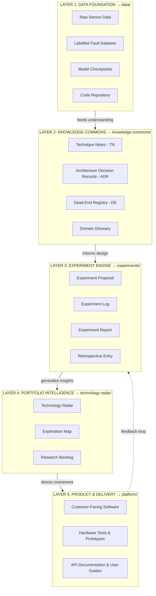

# FORGE — Foundation for Organized Research Groups and Enterprise

> A knowledge architecture and compound learning system for managing R&D projects that outlive any single person, idea, or technology choice.

---

## What Is FORGE?

FORGE is a **reusable blueprint** for organizing R&D knowledge so that it compounds over time. Instead of treating research as a linear project with a fixed endpoint, FORGE treats **knowledge as the primary output** — products, prototypes, and tools are valuable byproducts of accumulated understanding.

FORGE was created at [PBA Systems](https://www.pbasystems.com/) to support predictive maintenance research on precision gantry systems, but the architecture is **project-agnostic** — it can be instantiated for any R&D initiative.

### Core Principles

- **Knowledge compounds** — each experiment builds on prior ones
- **Failure is documented** — dead ends are first-class knowledge, not hidden shame
- **No single point of failure** — the system does not depend on one person, path, or technology
- **Multiple contributors** — universities, internal teams, and future hires all feed the same system
- **LLM-native** — Markdown + Git is natively queryable by AI tools

---

## Repository Structure

```
FORGE/
├── 00_system_design/              → FORGE's own design documents
│   ├── 01_vision_and_motivation.md
│   ├── 02_knowledge_architecture.md
│   ├── 03_portfolio_architecture.md    [Planned]
│   ├── 04_collaboration_protocol.md    [Planned]
│   └── 05_failure_integration.md       [Planned]
├── knowledge-commons/             → Documented understanding (Layer 2)
│   ├── technique-notes/           → TN-XXX: How to do specific tasks
│   ├── decision-records/          → ADR-XXX: Why design choices were made
│   ├── dead-end-registry/         → DE-XXX: What was tried and didn't work
│   └── domain-glossary.md         → Shared vocabulary
├── experiments/                   → Operational heartbeat (Layer 3)
│   ├── active/                    → In-progress experiments
│   ├── complete/                  → Completed experiment reports
│   └── backlog/                   → Proposed but not yet started
├── data/                          → Data foundation (Layer 1)
│   ├── datasets/                  → Metadata & data cards (actual data via DVC)
│   └── models/                    → Model cards & checkpoint references
├── technology-radar/              → Portfolio intelligence (Layer 4)
│   ├── radar.md                   → Current assessment of techniques & tools
│   └── history/                   → Past snapshots
├── platform/                      → Internal software team code (Layer 5)
│   ├── data-ingestion/            → Sensor data collection services
│   ├── feature-extraction/        → Signal processing pipelines
│   └── dashboard/                 → Health monitoring & alerting
├── sops/                          → Standard Operating Procedures
│   ├── SOP-001-onboarding.md
│   ├── SOP-002-running-experiment.md
│   ├── SOP-003-technology-radar.md
│   ├── SOP-004-dead-end-documentation.md
│   ├── SOP-005-monthly-review.md
│   └── SOP-006-knowledge-retrieval.md
├── reports/                       → Formal summaries for management
│   └── monthly/
└── .github/                       → GitHub templates
    └── ISSUE_TEMPLATE/
        ├── experiment_proposal.md
        └── open_question.md
```

---

## The Five-Layer Architecture



> Each layer depends on the one below it and feeds the one above. Products (Layer 5) are *byproducts* of accumulated knowledge — they emerge naturally from a well-functioning system.

---

## How Knowledge Flows Through FORGE

```mermaid
flowchart LR
    subgraph INPUT["Knowledge Sources"]
        UNI["University Students"]
        INT["Internal PBA Team"]
        LIT["Literature & Papers"]
        CUST["Customer Feedback"]
    end

    subgraph CAPTURE["Capture"]
        EP["Experiment Proposal"]
        EL["Experiment Log"]
    end

    subgraph PROCESS["Process"]
        ER["Experiment Report"]
        RE["Retrospective"]
    end

    subgraph STORE["Store"]
        TN["Technique Notes"]
        ADR["Architecture Decisions"]
        DE["Dead-End Registry"]
        DS["Labelled Datasets"]
    end

    subgraph SYNTHESIZE["Synthesize"]
        TR["Technology Radar"]
        EM["Exploration Map"]
        RB["Research Backlog"]
    end

    subgraph OUTPUT["Outputs"]
        PROD["Products & Prototypes"]
        PUB["Publications"]
        IP["Intellectual Property"]
    end

    INPUT --> CAPTURE
    CAPTURE --> PROCESS
    PROCESS --> STORE
    STORE --> SYNTHESIZE
    SYNTHESIZE --> OUTPUT
    OUTPUT -.->|"New questions & feedback"| CAPTURE
```



---

## How to Use This Blueprint

### For a New Project

1. Clone or fork this repository
2. Update `knowledge-commons/domain-glossary.md` with your project-specific terms
3. Write your first Experiment Proposal using the template in `experiments/`
4. Populate the Technology Radar with your current landscape
5. Follow `CONTRIBUTING.md` for onboarding new team members

### For Contributors

See [CONTRIBUTING.md](./CONTRIBUTING.md) for onboarding steps and standard operating procedures.

### For Quick Reference

| I want to... | Go to... |
|--------------|----------|
| Understand the vision | [01_vision_and_motivation.md](./00_system_design/01_vision_and_motivation.md) |
| Read the full architecture | [02_knowledge_architecture.md](./00_system_design/02_knowledge_architecture.md) |
| Look up a term | [domain-glossary.md](./knowledge-commons/domain-glossary.md) |
| Check what techniques to use | [Technology Radar](./technology-radar/radar.md) |
| Propose an experiment | Use template in `experiments/` or [GitHub Issue Template](./.github/ISSUE_TEMPLATE/experiment_proposal.md) |
| Check if something was tried | Search `knowledge-commons/dead-end-registry/` |
| Find a how-to method | Search `knowledge-commons/technique-notes/` |
| Understand a design decision | Search `knowledge-commons/decision-records/` |
| Follow a process | See `sops/` folder |

---

## Key Documents

| Document | Description |
|----------|-------------|
| [Vision & Motivation](./00_system_design/01_vision_and_motivation.md) | Why FORGE exists — the founding thinking |
| [Knowledge Architecture](./00_system_design/02_knowledge_architecture.md) | Full system design — layers, templates, SOPs, tooling, rollout plan |
| [Portfolio Architecture](./00_system_design/03_portfolio_architecture.md) | Multi-track research portfolio management [Planned] |
| [Collaboration Protocol](./00_system_design/04_collaboration_protocol.md) | University–industry working interface [Planned] |
| [Failure Integration Loop](./00_system_design/05_failure_integration.md) | Structured failure analysis and learning [Planned] |
| [Reference Reading](./00_system_design/06_reference_reading.md) | Literature map — Nonaka SECI, Nygard ADRs, NASA LLIS, Toyota A3, ThoughtWorks Radar |
| [Domain Glossary](./knowledge-commons/domain-glossary.md) | Shared vocabulary across all contributors |
| [Technology Radar](./technology-radar/radar.md) | Current state of technique and tool assessment |
| [Contributing Guide](./CONTRIBUTING.md) | How to contribute to this FORGE instance |

---

## Module Status

| Module | Status | Description |
|--------|--------|-------------|
| Module 1: Knowledge Architecture | ✅ Complete | System design, templates, SOPs, tooling |
| Module 2: Portfolio Architecture | 📋 Placeholder | Multi-track parallel research management |
| Module 3: Collaboration Protocol | 📋 Placeholder | University–industry working interface |
| Module 4: Failure Integration Loop | 📋 Placeholder | Structured retrospectives and dead-end analysis |

---

## Current Research Backlog

| Experiment | Track | Status | Description |
|------------|-------|--------|-------------|
| [EXP-001](./experiments/complete/EXP-001-REPORT-POC-Friction-Obstruction.md) | Data Collection | 📝 Scaffold | POC results (pre-FORGE, needs filling) |
| [EXP-002](./experiments/backlog/EXP-002-PROPOSAL-KS-Test-Design.md) | Data Collection | Proposed | Key Signature Test design |
| [EXP-003](./experiments/backlog/EXP-003-PROPOSAL-Data-Collection-Protocol.md) | Data Collection | Proposed | Vibration data collection protocol |
| [EXP-004](./experiments/backlog/EXP-004-PROPOSAL-FFT-Feature-Extraction.md) | ML Diagnosis | Proposed | FFT feature extraction |
| [EXP-005](./experiments/backlog/EXP-005-PROPOSAL-1DCNN-Fault-Classification.md) | ML Diagnosis | Proposed | 1D-CNN fault classification |

---

*FORGE is a living system. This repository is subject to continuous improvement. Every significant change should be made via Pull Request with a brief rationale, so the history of the system's own evolution is preserved.*
