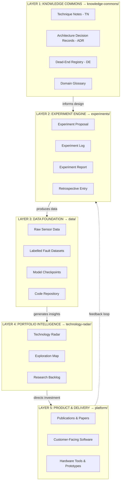

# FORGE — Foundation for Organized Research Groups and Enterprise

### The Philosophy of Continuity

> *"If I have seen further, it is by standing on the shoulders of Giants."*
>
> — **Isaac Newton** (1642–1727)

---
neve
## What Is FORGE?

FORGE is a **reusable blueprint** for organizing R&D knowledge so that it compounds over time. Instead of treating research as a linear project with a fixed endpoint, FORGE treats **knowledge as the primary output** — products, prototypes, and tools are valuable byproducts of accumulated understanding.

FORGE was created to support university collaborations with industry, but the architecture is **project-agnostic** — it can be instantiated for any R&D initiative. The theoretical framework is grounded in the principles of [The Knowledge Creating Company](https://lumsa.it/sites/default/files/UTENTI/u95/LM51_ITA_The%20Knowledge-Creating%20Company.pdf).

### Core Principles

- **Knowledge compounds** — each experiment builds on prior ones
- **Failure is documented** — dead ends are first-class knowledge, not hidden shame
- **No single point of failure** — the system does not depend on one person, path, or technology
- **Multiple contributors** — universities, internal teams, and future hires all feed the same system
- **Standards-aligned** — ISO 13374, FAIR data principles, and PM.UIC collaboration framework
- **LLM-native** — Markdown + Git is natively queryable by AI tools

---

## Master Design Document

All system design is consolidated into a single, comprehensive reference:

> **📖 [FORGE_Master_Design.md](./FORGE_Master_Design.md)** — the complete system design (~190KB, 14 sections + 5 appendices)

| Part | Sections | What It Covers |
|------|----------|----------------|
| **Part I — Philosophy & Foundation** | §1 Vision & Motivation, §2 Theoretical Foundations | Why FORGE exists; SECI model, ADRs, A3 Thinking, NASA LLIS |
| **Part II — Architecture** | §3 Knowledge Architecture, §4 Portfolio Architecture | 5-layer system; stage-gates, scoring rubrics, KPIs |
| **Part III — Process** | §5 Research Lifecycle (15 stages), §6 Failure Integration | How knowledge is produced; Persist/Pivot/Abandon framework |
| **Part IV — Governance** | §7 Collaboration Protocol, §8 Data Governance | RACI, IP framework, publication protocol; data classification, backup |
| **Part V — Standards & Engineering** | §9 Standards Alignment, §10 Software Engineering Standards | ISO 13374 mapping, PMBOK, FAIR; Git workflow, CI/CD, CMMI |
| **Part VI — Operations** | §11 SOPs, §12 Tools, §13 Signal Data, §14 Building from Zero | Day-to-day operations; 15 SOPs, integrated toolchain |
| **Appendices** | A–E | Checklists, team roles, open questions, glossary, full reference list |

---

## Standards Alignment

FORGE aligns with international standards without adding tool complexity:

| Standard | Coverage | Master Design Section |
|----------|----------|----------------------|
| **ISO 13374** (Condition Monitoring) | Data processing chain mapped to FORGE layers | [§9.4 — ISO 13374 ↔ FORGE Layer Mapping](./FORGE_Master_Design.md) |
| **FAIR Data Principles** | Findable, Accessible, Interoperable, Reusable datasets | [§8 — Data Governance](./FORGE_Master_Design.md), [SOP-007](./sops/SOP-007-FAIR-data-compliance.md) |
| **PM.UIC** (University-Industry Collaboration) | Remote team governance and collaboration | [§7 — Collaboration Protocol](./FORGE_Master_Design.md) |
| **ISO 9001** (Quality Management) | Document control via Git, review via PR | Built into all SOPs |
| **ISO/IEC 25010** (Software Quality) | Code quality model for review and standards | [§10.5 — Code Review & Quality Model](./FORGE_Master_Design.md) |
| **IEEE 730** (Software QA) | Quality assurance via CI/CD and review | [§10.6 — CI/CD & Automation](./FORGE_Master_Design.md) |
| **Conventional Commits** | Structured commit messages | [§10.4 — Git Workflow Standards](./FORGE_Master_Design.md) |

---

## Repository Structure

```
FORGE/
├── FORGE_Master_Design.md         → Complete system design (consolidated)
├── CONTRIBUTING.md                → How to contribute to this FORGE instance
├── README.md                      → This file — orientation and quick reference
├── knowledge-commons/             → Documented understanding (Layer 1)
│   ├── technique-notes/           → TN-XXX: How to do specific tasks
│   ├── decision-records/          → ADR-XXX: Why design choices were made
│   ├── dead-end-registry/         → DE-XXX: What was tried and didn't work
│   └── domain-glossary.md         → Shared vocabulary
├── experiments/                   → Operational heartbeat (Layer 2)
│   ├── active/                    → In-progress experiments
│   ├── complete/                  → Completed experiment reports
│   └── backlog/                   → Proposed but not yet started
├── data/                          → Data foundation (Layer 3)
│   ├── datasets/                  → Metadata & data cards (actual data via DVC)
│   ├── models/                    → Model cards & checkpoint references
│   └── METADATA_TEMPLATE.md       → FAIR-compliant metadata template
├── technology-radar/              → Portfolio intelligence (Layer 4)
│   ├── radar.md                   → Current assessment of techniques & tools
│   └── history/                   → Past snapshots
├── platform/                      → Internal software team code (Layer 5)
│   ├── data-ingestion/            → Sensor data collection services
│   ├── feature-extraction/        → Signal processing pipelines
│   └── dashboard/                 → Health monitoring & alerting
├── sops/                          → Standard Operating Procedures
│   ├── SOP-001-onboarding.md
│   ├── SOP-002-running-experiment.md
│   ├── SOP-003-technology-radar.md
│   ├── SOP-004-dead-end-documentation.md
│   ├── SOP-005-monthly-review.md
│   ├── SOP-006-knowledge-retrieval.md
│   ├── SOP-007-FAIR-data-compliance.md
│   ├── SOP-008-collaboration-communication.md
│   ├── SOP-009-research-lifecycle.md
│   ├── SOP-010-software-development.md
│   ├── SOP-011-code-review.md
│   ├── SOP-012-git-workflow.md
│   ├── SOP-013-ml-model-development.md
│   ├── SOP-014-coding-standards.md
│   └── SOP-015-architecture-design.md
├── reports/                       → Formal summaries for management
│   └── monthly/
└── .github/                       → GitHub templates
    └── ISSUE_TEMPLATE/
        ├── experiment_proposal.md
        └── open_question.md
```

---

## The Five-Layer Architecture



> Each layer follows the **academic research process flow**: research begins with existing knowledge (Layer 1), progresses through experimentation (Layer 2) and data collection (Layer 3), is synthesised into strategic insights (Layer 4), and ultimately produces deliverables (Layer 5). Products are *byproducts* of accumulated knowledge.

---

## How Knowledge Flows Through FORGE

```mermaid
flowchart LR
    subgraph INPUT["Knowledge Sources"]
        UNI["University Students"]
        INT["Internal Development Team"]
        LIT["Literature & Papers"]
        CUST["Customer Feedback"]
    end

    subgraph CAPTURE["Capture"]
        EP["Experiment Proposal"]
        EL["Experiment Log"]
    end

    subgraph PROCESS["Process"]
        ER["Experiment Report"]
        RE["Retrospective"]
    end

    subgraph STORE["Store"]
        TN["Technique Notes"]
        ADR["Architecture Decisions"]
        DE["Dead-End Registry"]
        DS["Labelled Datasets"]
    end

    subgraph SYNTHESIZE["Synthesize"]
        TR["Technology Radar"]
        EM["Exploration Map"]
        RB["Research Backlog"]
    end

    subgraph OUTPUT["Outputs"]
        PROD["Products & Prototypes"]
        PUB["Publications"]
        IP["Intellectual Property"]
    end

    INPUT --> CAPTURE
    CAPTURE --> PROCESS
    PROCESS --> STORE
    STORE --> SYNTHESIZE
    SYNTHESIZE --> OUTPUT
    OUTPUT -.->|"New questions & feedback"| CAPTURE
```



---

## How to Use This Blueprint

### For a New Project

1. Clone or fork this repository
2. Read the [FORGE_Master_Design.md](./FORGE_Master_Design.md) — at minimum, §1 (Vision) and §3 (Architecture)
3. Update `knowledge-commons/domain-glossary.md` with your project-specific terms
4. Write your first Experiment Proposal using the template in `experiments/`
5. Populate the Technology Radar with your current landscape
6. Follow [CONTRIBUTING.md](./CONTRIBUTING.md) for onboarding new team members

### For Contributors

See [CONTRIBUTING.md](./CONTRIBUTING.md) for onboarding steps and standard operating procedures.

### Quick Reference

| I want to... | Go to... |
|--------------|----------|
| Understand the vision | [FORGE_Master_Design.md §1](./FORGE_Master_Design.md) — Vision & Motivation |
| Read the full architecture | [FORGE_Master_Design.md §3](./FORGE_Master_Design.md) — Knowledge Architecture |
| Understand the research lifecycle | [FORGE_Master_Design.md §5](./FORGE_Master_Design.md) — 15-Stage Research Lifecycle |
| Check ISO 13374 alignment | [FORGE_Master_Design.md §9.4](./FORGE_Master_Design.md) — ISO 13374 ↔ FORGE Mapping |
| Understand collaboration rules | [FORGE_Master_Design.md §7](./FORGE_Master_Design.md) — Collaboration Protocol |
| Check data governance | [FORGE_Master_Design.md §8](./FORGE_Master_Design.md) — Data Governance |
| Look up a term | [Domain Glossary](./knowledge-commons/domain-glossary.md) or Appendix D |
| Check what techniques to use | [Technology Radar](./technology-radar/radar.md) |
| Propose an experiment | Use template in `experiments/` or [GitHub Issue Template](./.github/ISSUE_TEMPLATE/experiment_proposal.md) |
| Check if something was tried | Search `knowledge-commons/dead-end-registry/` |
| Find a how-to method | Search `knowledge-commons/technique-notes/` |
| Understand a design decision | Search `knowledge-commons/decision-records/` |
| Follow a process | See `sops/` folder or [FORGE_Master_Design.md §11](./FORGE_Master_Design.md) |
| Check FAIR data compliance | [SOP-007](./sops/SOP-007-FAIR-data-compliance.md) |
| See compliance checklists | [FORGE_Master_Design.md Appendix A](./FORGE_Master_Design.md) |

---

## Module Status

| Module | Status | Description |
|--------|--------|-------------|
| Part I: Philosophy & Foundation | ✅ Complete | Vision, theoretical foundations, SECI model |
| Part II: Architecture | ✅ Complete | 5-layer knowledge architecture, portfolio management |
| Part III: Process | ✅ Complete | 15-stage lifecycle, failure integration |
| Part IV: Governance | ✅ Complete | Collaboration protocol, data governance, IP |
| Part V: Standards & Engineering | ✅ Complete | ISO alignment, software engineering standards, CMMI |
| Part VI: Operations | ✅ Complete | SOPs, tools, signal data management, build guide |
| Appendices | ✅ Complete | Checklists, roles, open questions, glossary, references |

---

## Current Research Backlog

| Experiment | Track | Status | Description |
|------------|-------|--------|-------------|
| [EXP-001](./experiments/complete/EXP-001-REPORT-POC-Friction-Obstruction.md) | Data Collection | 📝 Scaffold | POC results (pre-FORGE, needs filling) |
| [EXP-002](./experiments/backlog/EXP-002-PROPOSAL-KS-Test-Design.md) | Data Collection | Proposed | Key Signature Test design |
| [EXP-003](./experiments/backlog/EXP-003-PROPOSAL-Data-Collection-Protocol.md) | Data Collection | Proposed | Vibration data collection protocol |
| [EXP-004](./experiments/backlog/EXP-004-PROPOSAL-FFT-Feature-Extraction.md) | ML Diagnosis | Proposed | FFT feature extraction |
| [EXP-005](./experiments/backlog/EXP-005-PROPOSAL-1DCNN-Fault-Classification.md) | ML Diagnosis | Proposed | 1D-CNN fault classification |

---

## Citing FORGE

If you use or adapt the FORGE framework in your research, please cite:

```
Jayawardhana, M. (2026). FORGE: Foundation for Organized Research Groups and Enterprise —
A Knowledge Architecture for University-Industry R&D Collaboration. GitHub.
https://github.com/[your-username]/FORGE
```

---

## License

This repository is currently for **internal use only**. See the IP framework in [FORGE_Master_Design.md §7.6](./FORGE_Master_Design.md) for publication and sharing policies.

---

*FORGE is a living system. This repository is subject to continuous improvement. Every significant change should be made via Pull Request with a brief rationale, so the history of the system's own evolution is preserved.*
