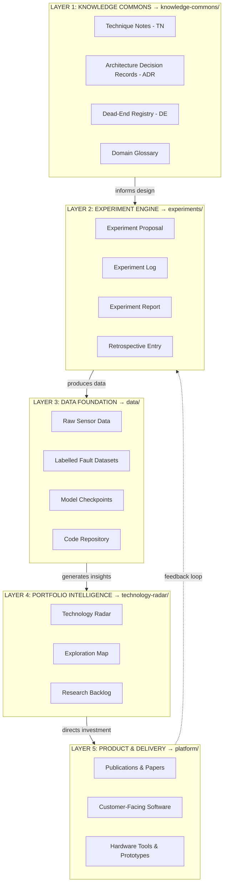

# FORGE — Foundation for Organized Research Groups and Enterprise

### The Philosophy of Continuity

> *“If I have seen further, it is by standing on the shoulders of Giants.”*
>
> — **Isaac Newton** (1642–1727)

---

## What Is FORGE?

FORGE is a **reusable blueprint** for organizing R&D knowledge so that it compounds over time. Instead of treating research as a linear project with a fixed endpoint, FORGE treats **knowledge as the primary output** — products, prototypes, and tools are valuable byproducts of accumulated understanding.

FORGE was created to support university coloborations with industry, but the architecture is **project-agnostic** — it can be instantiated for any R&D initiative. The theoretical framework of FORGE is grounded in the principles of [The Knowledge Creating Company](https://lumsa.it/sites/default/files/UTENTI/u95/LM51_ITA_The%20Knowledge-Creating%20Company.pdf).

### Core Principles

- **Knowledge compounds** — each experiment builds on prior ones
- **Failure is documented** — dead ends are first-class knowledge, not hidden shame
- **No single point of failure** — the system does not depend on one person, path, or technology
- **Multiple contributors** — universities, internal teams, and future hires all feed the same system
- **Standards-aligned** — ISO 13374, FAIR data principles, and PM.UIC collaboration framework
- **LLM-native** — Markdown + Git is natively queryable by AI tools

---

## Standards Alignment

FORGE aligns with international standards without adding tool complexity:

| Standard | Coverage | FORGE Document |
|----------|----------|----------------|
| **ISO 13374** (Condition Monitoring) | Data processing chain mapped to FORGE layers | [09_ISO13374_mapping.md](./00_system_design/09_ISO13374_mapping.md) |
| **FAIR Data Principles** | Findable, Accessible, Interoperable, Reusable datasets | [SOP-007](./sops/SOP-007-FAIR-data-compliance.md) |
| **PM.UIC** (University-Industry Collaboration) | Remote team governance and collaboration | [04_collaboration_protocol.md](./00_system_design/04_collaboration_protocol.md) |
| **ISO 9001** (Quality Management) | Document control via Git, review via PR | Built into all SOPs |
| **ISO/IEC 25010** (Software Quality) | Code quality model for review and standards | [11_software_engineering_standards.md](./00_system_design/11_software_engineering_standards.md) |
| **IEEE 730** (Software QA) | Quality assurance via CI/CD and review | [SOP-010](./sops/SOP-010-software-development.md) |
| **Conventional Commits** | Structured commit messages | [SOP-012](./sops/SOP-012-git-workflow.md) |

---

## Repository Structure

```
FORGE/
├── 00_system_design/              → FORGE's own design documents
│   ├── 01_vision_and_motivation.md
│   ├── 02_knowledge_architecture.md
│   ├── 03_portfolio_architecture.md
│   ├── 04_collaboration_protocol.md
│   ├── 05_failure_integration.md
│   ├── 06_reference_reading.md
│   ├── 07_indusy_standard.md
│   ├── 08_research_lifecycle.md
│   ├── 09_ISO13374_mapping.md
│   ├── 10_data_governance.md
│   └── 11_software_engineering_standards.md
├── knowledge-commons/             → Documented understanding (Layer 1)
│   ├── technique-notes/           → TN-XXX: How to do specific tasks
│   ├── decision-records/          → ADR-XXX: Why design choices were made
│   ├── dead-end-registry/         → DE-XXX: What was tried and didn't work
│   └── domain-glossary.md         → Shared vocabulary
├── experiments/                   → Operational heartbeat (Layer 2)
│   ├── active/                    → In-progress experiments
│   ├── complete/                  → Completed experiment reports
│   └── backlog/                   → Proposed but not yet started
├── data/                          → Data foundation (Layer 3)
│   ├── datasets/                  → Metadata & data cards (actual data via DVC)
│   ├── models/                    → Model cards & checkpoint references
│   └── METADATA_TEMPLATE.md       → FAIR-compliant metadata template
├── technology-radar/              → Portfolio intelligence (Layer 4)
│   ├── radar.md                   → Current assessment of techniques & tools
│   └── history/                   → Past snapshots
├── platform/                      → Internal software team code (Layer 5)
│   ├── data-ingestion/            → Sensor data collection services
│   ├── feature-extraction/        → Signal processing pipelines
│   └── dashboard/                 → Health monitoring & alerting
├── sops/                          → Standard Operating Procedures
│   ├── SOP-001-onboarding.md
│   ├── SOP-002-running-experiment.md
│   ├── SOP-003-technology-radar.md
│   ├── SOP-004-dead-end-documentation.md
│   ├── SOP-005-monthly-review.md
│   ├── SOP-006-knowledge-retrieval.md
│   ├── SOP-007-FAIR-data-compliance.md
│   ├── SOP-008-collaboration-communication.md
│   ├── SOP-009-research-lifecycle.md
│   ├── SOP-010-software-development.md
│   ├── SOP-011-code-review.md
│   ├── SOP-012-git-workflow.md
│   ├── SOP-013-ml-model-development.md
│   ├── SOP-014-coding-standards.md
│   └── SOP-015-architecture-design.md
├── reports/                       → Formal summaries for management
│   └── monthly/
└── .github/                       → GitHub templates
    └── ISSUE_TEMPLATE/
        ├── experiment_proposal.md
        └── open_question.md
```

---

## The Five-Layer Architecture



> Each layer follows the **academic research process flow**: research begins with existing knowledge (Layer 1), progresses through experimentation (Layer 2) and data collection (Layer 3), is synthesised into strategic insights (Layer 4), and ultimately produces deliverables (Layer 5). Products are *byproducts* of accumulated knowledge.

---

## How Knowledge Flows Through FORGE

```mermaid
flowchart LR
    subgraph INPUT["Knowledge Sources"]
        UNI["University Students"]
        INT["Internal Development Team"]
        LIT["Literature & Papers"]
        CUST["Customer Feedback"]
    end

    subgraph CAPTURE["Capture"]
        EP["Experiment Proposal"]
        EL["Experiment Log"]
    end

    subgraph PROCESS["Process"]
        ER["Experiment Report"]
        RE["Retrospective"]
    end

    subgraph STORE["Store"]
        TN["Technique Notes"]
        ADR["Architecture Decisions"]
        DE["Dead-End Registry"]
        DS["Labelled Datasets"]
    end

    subgraph SYNTHESIZE["Synthesize"]
        TR["Technology Radar"]
        EM["Exploration Map"]
        RB["Research Backlog"]
    end

    subgraph OUTPUT["Outputs"]
        PROD["Products & Prototypes"]
        PUB["Publications"]
        IP["Intellectual Property"]
    end

    INPUT --> CAPTURE
    CAPTURE --> PROCESS
    PROCESS --> STORE
    STORE --> SYNTHESIZE
    SYNTHESIZE --> OUTPUT
    OUTPUT -.->|"New questions & feedback"| CAPTURE
```



---

## How to Use This Blueprint

### For a New Project

1. Clone or fork this repository
2. Update `knowledge-commons/domain-glossary.md` with your project-specific terms
3. Write your first Experiment Proposal using the template in `experiments/`
4. Populate the Technology Radar with your current landscape
5. Follow `CONTRIBUTING.md` for onboarding new team members

### For Contributors

See [CONTRIBUTING.md](./CONTRIBUTING.md) for onboarding steps and standard operating procedures.

### For Quick Reference

| I want to... | Go to... |
|--------------|----------|
| Understand the vision | [01_vision_and_motivation.md](./00_system_design/01_vision_and_motivation.md) |
| Read the full architecture | [02_knowledge_architecture.md](./00_system_design/02_knowledge_architecture.md) |
| Understand the research lifecycle | [08_research_lifecycle.md](./00_system_design/08_research_lifecycle.md) |
| Check ISO 13374 alignment | [09_ISO13374_mapping.md](./00_system_design/09_ISO13374_mapping.md) |
| Look up a term | [domain-glossary.md](./knowledge-commons/domain-glossary.md) |
| Check what techniques to use | [Technology Radar](./technology-radar/radar.md) |
| Propose an experiment | Use template in `experiments/` or [GitHub Issue Template](./.github/ISSUE_TEMPLATE/experiment_proposal.md) |
| Check if something was tried | Search `knowledge-commons/dead-end-registry/` |
| Find a how-to method | Search `knowledge-commons/technique-notes/` |
| Understand a design decision | Search `knowledge-commons/decision-records/` |
| Follow a process | See `sops/` folder |
| Understand collaboration rules | [04_collaboration_protocol.md](./00_system_design/04_collaboration_protocol.md) |
| Check FAIR data compliance | [SOP-007](./sops/SOP-007-FAIR-data-compliance.md) |

---

## Key Documents

| Document | Description |
|----------|-------------|
| [Vision & Motivation](./00_system_design/01_vision_and_motivation.md) | Why FORGE exists — the founding thinking |
| [Knowledge Architecture](./00_system_design/02_knowledge_architecture.md) | Full system design — layers, templates, SOPs, tooling, rollout plan |
| [Portfolio Architecture](./00_system_design/03_portfolio_architecture.md) | Multi-track research portfolio management — stage-gates, scoring, KPIs |
| [Collaboration Protocol](./00_system_design/04_collaboration_protocol.md) | University–industry working interface — remote team management, IP, publication |
| [Failure Integration Loop](./00_system_design/05_failure_integration.md) | Structured failure analysis — retrospectives, persist/pivot/abandon, post-mortems |
| [Reference Reading](./00_system_design/06_reference_reading.md) | Literature map — Nonaka SECI, Nygard ADRs, NASA LLIS, Toyota A3, ThoughtWorks Radar |
| [Industry Standards](./00_system_design/07_indusy_standard.md) | ISO standards, tools, compliance checklists, data management reference |
| [Research Lifecycle](./00_system_design/08_research_lifecycle.md) | 15-stage research lifecycle with DevOps/MLOps integration |
| [ISO 13374 Mapping](./00_system_design/09_ISO13374_mapping.md) | FORGE ↔ ISO 13374 condition monitoring alignment |
| [Data Governance & IP](./00_system_design/10_data_governance.md) | Data storage, backup, access control, IP protection |
| [Software Engineering Standards](./00_system_design/11_software_engineering_standards.md) | ISO standards mapping, quality model, process maturity |
| [Domain Glossary](./knowledge-commons/domain-glossary.md) | Shared vocabulary across all contributors |
| [Technology Radar](./technology-radar/radar.md) | Current state of technique and tool assessment |
| [Contributing Guide](./CONTRIBUTING.md) | How to contribute to this FORGE instance |

---

## Module Status

| Module | Status | Description |
|--------|--------|-------------|
| Module 1: Knowledge Architecture | ✅ Complete | System design, templates, SOPs, tooling |
| Module 2: Portfolio Architecture | ✅ Complete | Stage-gates, scoring, KPIs, track lifecycle |
| Module 3: Collaboration Protocol | ✅ Complete | Remote team management, IP, publication protocol |
| Module 4: Failure Integration Loop | ✅ Complete | Retrospectives, post-mortems, persist/pivot/abandon |
| Module 5: Research Lifecycle | ✅ Complete | 15-stage lifecycle, dual-cycle integration |
| Standards Integration | ✅ Complete | ISO 13374, FAIR, PM.UIC alignment |
| Data Governance & IP | ✅ Complete | Local storage, backup, access control, IP protection |
| Software Engineering Standards | ✅ Complete | ISO standards, quality model, CI/CD, process maturity |
| Software Development SOPs | ✅ Complete | SOPs 010–015: development, review, Git, ML, coding, architecture |

---

## Current Research Backlog

| Experiment | Track | Status | Description |
|------------|-------|--------|-------------|
| [EXP-001](./experiments/complete/EXP-001-REPORT-POC-Friction-Obstruction.md) | Data Collection | 📝 Scaffold | POC results (pre-FORGE, needs filling) |
| [EXP-002](./experiments/backlog/EXP-002-PROPOSAL-KS-Test-Design.md) | Data Collection | Proposed | Key Signature Test design |
| [EXP-003](./experiments/backlog/EXP-003-PROPOSAL-Data-Collection-Protocol.md) | Data Collection | Proposed | Vibration data collection protocol |
| [EXP-004](./experiments/backlog/EXP-004-PROPOSAL-FFT-Feature-Extraction.md) | ML Diagnosis | Proposed | FFT feature extraction |
| [EXP-005](./experiments/backlog/EXP-005-PROPOSAL-1DCNN-Fault-Classification.md) | ML Diagnosis | Proposed | 1D-CNN fault classification |

---

*FORGE is a living system. This repository is subject to continuous improvement. Every significant change should be made via Pull Request with a brief rationale, so the history of the system's own evolution is preserved.*
