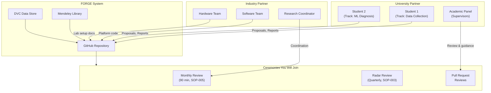

# SOP-001: Onboarding a New Contributor (Student or Staff)

> **Source:** Extracted from [Knowledge Architecture](../00_system_design/02_knowledge_architecture.md), Section 9  
> **Trigger:** A new student or internal team member joins FORGE  
> **Owner:** Research Coordinator (or project lead until role is filled)

---

## Where You Fit In

> **You are here.** The checklist below gets you connected to every part of this system.

---

## Day 1 — Orientation

- [ ] Provide access to GitHub repository
- [ ] Provide access to Mendeley group library
- [ ] Provide access to DVC data storage
- [ ] Walk through repository structure (30-minute session)
- [ ] Assign reading: `README.md`, `CONTRIBUTING.md`, `knowledge-commons/domain-glossary.md`
- [ ] Assign reading: 3 completed Experiment Reports most relevant to their track
- [ ] Assign reading: [Collaboration Protocol](../00_system_design/04_collaboration_protocol.md) — IP ownership & publication rules
- [ ] 1-hour IP awareness briefing with Research Lead (publication review process, data ownership, NDA)
- [ ] Register ORCID at [orcid.org](https://orcid.org) ([SOP-007](./SOP-007-FAIR-data-compliance.md))
- [ ] Understand escalation paths ([SOP-008](./SOP-008-collaboration-communication.md))

## Week 1 — Shadowing

- [ ] Attend one active experiment review session
- [ ] Read 5 papers from Mendeley library (assigned by supervisor)
- [ ] Review the Technology Radar current state (`technology-radar/radar.md`)
- [ ] Identify one existing Technique Note and verify they can reproduce it
- [ ] Review [Research Lifecycle](../00_system_design/08_research_lifecycle.md) — understand the 15-stage model

## Week 2 — First Contribution

- [ ] Write first Experiment Proposal (even if small) using the template in `experiments/`
- [ ] Get proposal reviewed via GitHub Pull Request
- [ ] Execute experiment
- [ ] Write Experiment Report

## Ongoing Expectations

- [ ] All work documented in FORGE **before** presenting results in any meeting
- [ ] Monthly contribution of at least one document (TN, ADR, DE, or Experiment Report)
- [ ] Any decision made in a meeting or chat must be captured in a document within 48 hours
- [ ] FAIR compliance on all data produced ([SOP-007](./SOP-007-FAIR-data-compliance.md))
