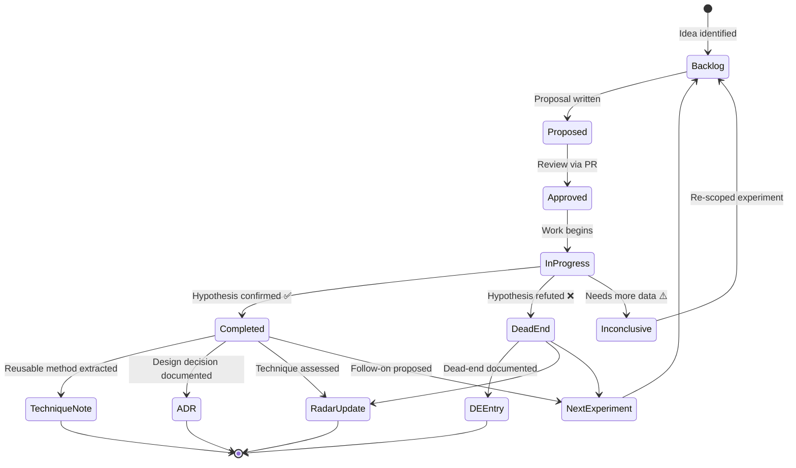

# SOP-002: Running an Experiment

> **Source:** Extracted from [Knowledge Architecture](../00_system_design/02_knowledge_architecture.md), Section 9  
> **Trigger:** An experiment has been approved (Proposal reviewed and merged)  
> **Owner:** Assigned researcher

---

## Experiment Lifecycle Overview



> **Where are you in this lifecycle?** The checklist below follows the `Approved → InProgress → Completed/DeadEnd` path.

---

## Pre-work

- [ ] Proposal document exists in `experiments/active/` and is approved
- [ ] Required data is accessible (DVC pull confirmed)
- [ ] Required hardware/lab access is confirmed

## During Execution

- [ ] Maintain a running Experiment Log (can be informal daily notes in the experiment folder)
- [ ] If method deviates from proposal, document the change and reason immediately
- [ ] If results suggest the experiment should stop early (failure confirmed or success exceeded), flag to supervisor before stopping

## On Completion

- [ ] Write Experiment Report within **5 working days** of completion
- [ ] Move proposal from `experiments/active/` to `experiments/complete/`
- [ ] Commit all data with DVC and push
- [ ] Commit all code and push
- [ ] Update Technology Radar if a technique was newly assessed
- [ ] Create DE entry if a dead end was reached
- [ ] Create TN if a reusable technique was established
- [ ] Post 3-sentence summary in `#forge-results` channel

## Checklist Summary

```
Before:  Proposal ✓ → Data ✓ → Lab ✓
During:  Log ✓ → Deviations ✓ → Early-stop flag ✓
After:   Report ✓ → Move file ✓ → DVC push ✓ → Code push ✓ → Radar ✓ → DE/TN ✓ → Summary ✓
```
