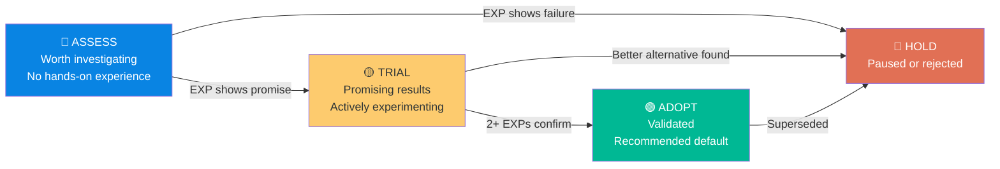

# SOP-003: Updating the Technology Radar

> **Source:** Extracted from [Knowledge Architecture](../00_system_design/02_knowledge_architecture.md), Section 9  
> **Trigger:** Quarterly (every 3 months), or after any experiment that produces a clear verdict on a technique  
> **Owner:** Research Coordinator + track leads

---

## Radar Rings

| Ring | Meaning |
|------|---------|
| **Adopt** | Validated and recommended for use. The default choice. |
| **Trial** | Promising early results. Actively experimenting. |
| **Assess** | Worth investigating. No hands-on experience yet. |
| **Hold** | Tried and paused, or superseded by a better approach. |

## Radar Ring Movement

> **Key principle:** Every movement between rings must be backed by at least one Experiment Report. No technique moves based on opinion alone.

---

## Steps

1. Call a **60-minute Radar Review** session
2. Review all Experiment Reports completed since the last Radar update
3. For each technique assessed:
   - Has it moved from **Assess → Trial**? (Promising early results)
   - Has it moved from **Trial → Adopt**? (Validated, use as default)
   - Should it move to **Hold**? (Failed or better alternative found)
4. Update `technology-radar/radar.md`
5. Archive the previous state in `technology-radar/history/YYYY-QX-radar.md`
6. Announce changes in `#forge-weekly`

## Movement Criteria

| Movement | Evidence Required |
|----------|-------------------|
| Assess → Trial | At least one EXP report showing promising initial results |
| Trial → Adopt | At least two EXP reports with consistent positive results across setups |
| Any → Hold | At least one EXP report confirming the approach does not meet success criteria, OR a superior alternative has been adopted |
