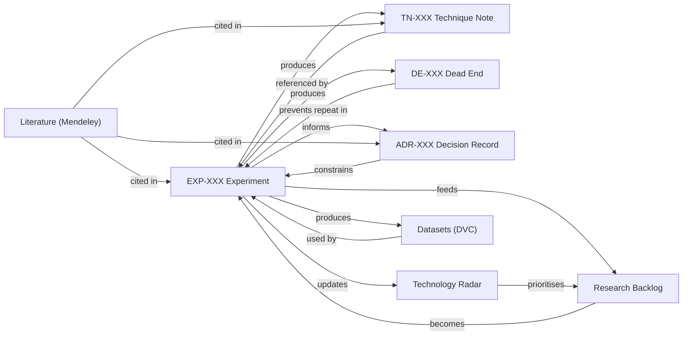

# SOP-006: Knowledge Retrieval (Finding What You Need)

> **Source:** Extracted from [Knowledge Architecture](../00_system_design/02_knowledge_architecture.md), Section 9  
> **Trigger:** Before starting any new experiment or investigation  
> **Owner:** Every contributor

---

## How Documents Connect

Every document type in FORGE references and feeds into others. This is why you must search **all** sources before starting new work — the answer may live in any of them.



---

## Before Starting Any Experiment — Search First

Follow this sequence **in order**:

### Step 1: Search Experiment Reports
Look in `experiments/complete/` for prior work on this topic.

**Ask:** Has someone already investigated this? What did they find?

### Step 2: Search Dead-End Registry
Look in `knowledge-commons/dead-end-registry/` for failed attempts.

**Ask:** Has this been tried before? Why did it fail? Have conditions changed?

### Step 3: Search Technique Notes
Look in `knowledge-commons/technique-notes/` for existing methods.

**Ask:** Is there already a validated method for what I'm trying to do?

### Step 4: Search Architecture Decision Records
Look in `knowledge-commons/decision-records/` for prior design choices.

**Ask:** Has a decision already been made about this approach?

### Step 5: Search Mendeley Library
Search the shared Mendeley group library for academic literature.

**Ask:** What does the published research say about this approach?

### Step 6: Check the Technology Radar
Review `technology-radar/radar.md` for the current assessment.

**Ask:** What is the current status of the technique I'm considering? Is it in Adopt, Trial, Assess, or Hold?

## If You Cannot Find What You Need

After completing all six steps, if you still cannot find relevant information:

1. Create a brief entry in `experiments/backlog/` as an **open question**
2. This ensures the gap is tracked and visible to the whole team
3. Discuss at the next Monthly Review (SOP-005)

## Quick Reference

```
1. experiments/complete/           → Has this been done?
2. knowledge-commons/dead-end-registry/ → Has this failed?
3. knowledge-commons/technique-notes/   → Is there a method?
4. knowledge-commons/decision-records/  → Was a decision made?
5. Mendeley library                       → What does literature say?
6. technology-radar/radar.md            → What's the current status?
7. → Still nothing? Create backlog entry.
```
