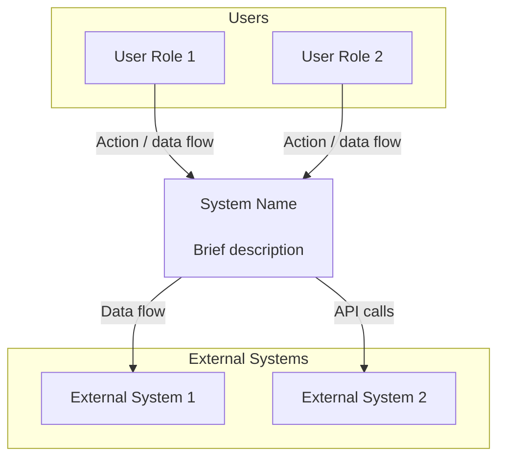
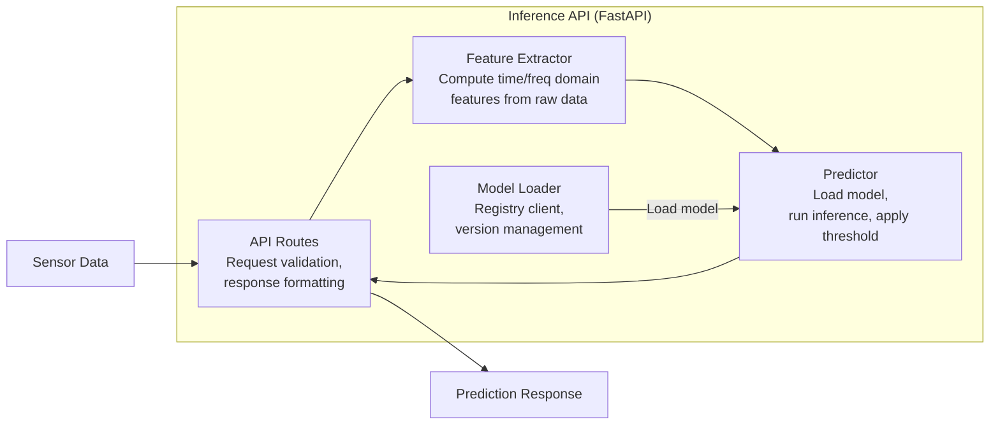
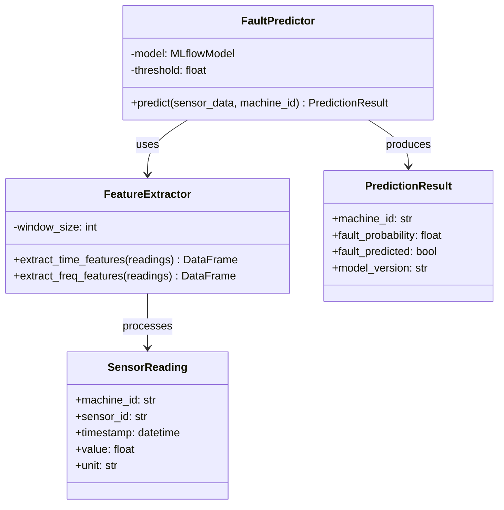
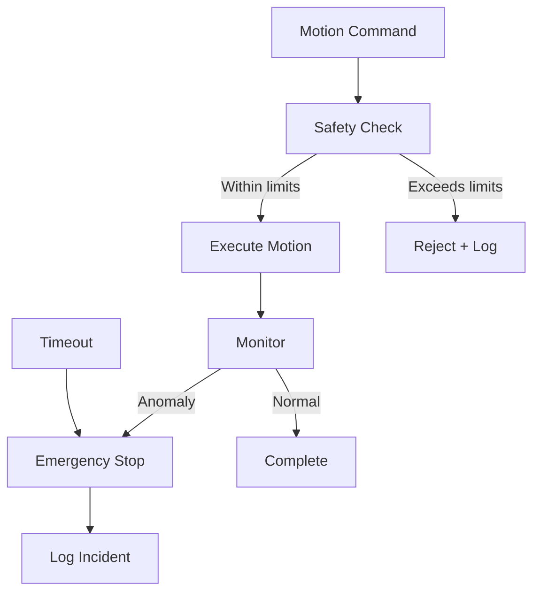

# SOP-015: Architecture & Design Documentation

> **Source:** Adapted from TS-005 (Architecture & Design Standards)  
> **Scope:** All FORGE software projects larger than 3 person-days  
> **Owner:** Technical Lead  
> **Standards Basis:** IEEE 1016:2009 (Software Design Descriptions), C4 Model

---

## 1. Purpose

This SOP defines how FORGE projects document software architecture, system design, module design, and class design. It answers: when to create documentation, what levels are needed, how to maintain it, where it lives, and who reviews design decisions.

Without this standard, architecture lives in people's heads. When those people leave, the knowledge is lost.

---

## 2. The C4 Model — Four Levels of Design

FORGE uses the **C4 Model** (Context, Container, Component, Code) as its architecture documentation framework.

```
Level 1: System Context Diagram
  "What does this system do and who uses it?"
  → Always required for every project

Level 2: Container Diagram
  "What are the major deployable units?"
  → Always required for projects ≥ 6 person-days

Level 3: Component Diagram
  "What are the internal modules of each container?"
  → Required for complex containers (ML pipeline, agent orchestrator)

Level 4: Code / Class Diagram
  "What are the key classes and their relationships?"
  → Required only for safety-critical code and shared libraries
```

### When Each Level Is Required

| Level | Required When | Owner | Reviewer |
|-------|--------------|-------|----------|
| **L1: System Context** | Every project | Team Lead | Technical Lead |
| **L2: Container** | Projects ≥ 6 person-days | Team Lead | Technical Lead |
| **L3: Component** | Complex modules, ML pipelines, agents | Team Lead / Developer | Technical Lead |
| **L4: Code / Class** | Safety-critical, shared libraries | Developer | Team Lead |

---

## 3. Level 1 — System Context Diagram

Shows the system as a single box, all users, all external systems, and data flow directions.



---

## 4. Level 2 — Container Diagram

Shows the system boundary, each deployable unit, technology choices, and communication protocols.

Each container label must include:
1. **Name** — what it is
2. **Technology** — in parentheses
3. **Responsibility** — one sentence

```
"Inference API
(FastAPI / Python)

Serves fault predictions via REST API.
Loads model from registry."
```

---

## 5. Level 3 — Component Diagram

Shows internal modules within a single container.

### Example — ML Inference Container



---

## 6. Level 4 — Code / Class Diagrams

Required for safety-critical and shared library code.



---

## 7. Additional Design Document Types

### 7.1 Data Flow Diagrams (ML Projects)

```
Raw Data → Preprocessing → Feature Engineering → Train/Val/Test Split
                                                      ↓
Training Server ← Model Training ← Experiment Tracking
       ↓
Model Registry → Docker Image → Deployment
       ↓
Live Data → Feature Extraction → Inference → Prediction → Alert
```

### 7.2 Agent Architecture Diagrams (LLM Projects)

Must document:
- Available tools and capabilities
- Prompt templates and versions
- Guardrails and safety rules
- Fallback behaviour

### 7.3 Safety Architecture (Machine Control)

Must document:
- Emergency stop paths
- Safety limits (max speeds, forces, thresholds)
- Communication timeout handling
- Failure mode analysis



---

## 8. Diagramming Standards

| Tool | When | Format |
|------|------|--------|
| **Mermaid** (primary) | All diagrams in Markdown | Inline in `.md` |
| **draw.io** | Complex diagrams exceeding Mermaid | Export as `.svg` |

### Quality Rules

- Every box has a name AND description
- Every arrow has a label
- Consistent layout direction (top-to-bottom or left-to-right)
- One level of detail per diagram
- Updated when system changes

---

## 9. Architecture Decision Records (ADRs)

Major decisions tracked in `knowledge-commons/decision-records/`.

### When to Create an ADR

| Create when... | Example |
|---------------|---------|
| Choosing a dependency | "Use ChromaDB as vector database" |
| Changing communication patterns | "Switch from REST to gRPC" |
| Making hard-to-reverse tradeoffs | "Store embeddings in PostgreSQL" |
| Rejecting expected approaches | "Do not use Kubernetes" |

### Do NOT Create an ADR for

- Library version upgrades
- Minor refactoring
- Trivially reversible decisions
- Personal tool preferences

---

## 10. Design Review Process

| Trigger | Required Reviewers |
|---------|-------------------|
| New project | Technical Lead + Team Lead |
| New container | Technical Lead + Team Lead |
| Architecture decision | Technical Lead |
| Safety-critical component | Technical Lead (mandatory) |
| ML architecture change | Technical Lead + Team Lead |

### Design Review Checklist

- [ ] Does the design solve the stated problem?
- [ ] Are responsibilities clear and non-overlapping?
- [ ] Are interfaces well-defined?
- [ ] Are failure modes considered?
- [ ] Is the design testable?
- [ ] Is there unnecessary complexity (YAGNI)?
- [ ] Are security and data privacy considered?
- [ ] For machine control: safety limits documented?
- [ ] For ML: training/inference separation clean?

---

## 11. Document Lifecycle

```
Draft → Design Review → Approved → Active → Updated → Archived
```

**Keeping documents current:** Update in the same PR that changes architecture. The PR reviewer checks: "Does this change require a design doc update?"

---

## Cross-References

| Document | Relationship |
|----------|-------------|
| [SOP-010](./SOP-010-software-development.md) | Repository and project structure |
| [SOP-012](./SOP-012-git-workflow.md) | Git workflow for architecture changes |
| [11_software_engineering_standards.md](../00_system_design/11_software_engineering_standards.md) | IEEE 1016, C4 model standards basis |

---

*Adapted for FORGE from industry architecture documentation practices. Review every 6 months.*
